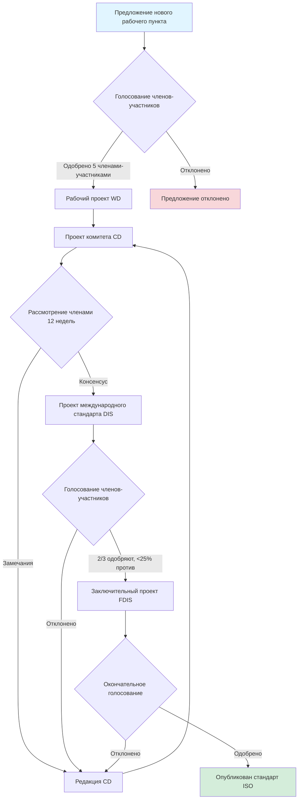
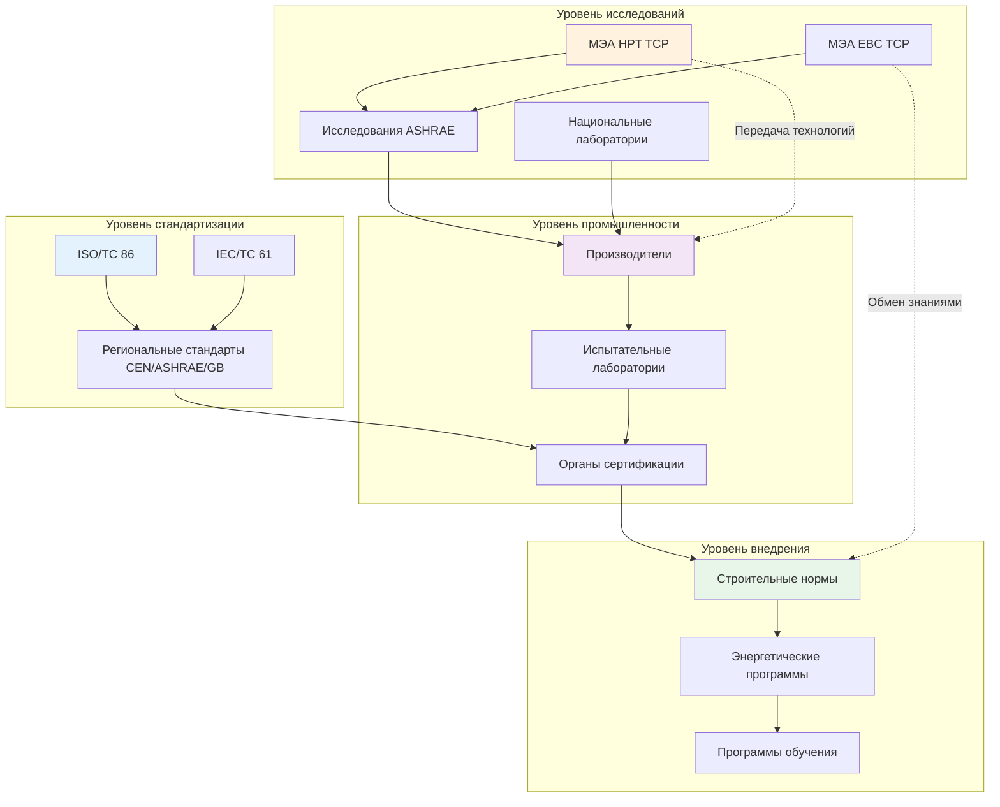

## Рамки международного сотрудничества в области HVAC

Международное сотрудничество в системах HVAC решает проблемы смягчения изменения климата, энергетической безопасности и декарбонизации зданий посредством скоординированных исследований, стандартизированных протоколов испытаний и механизмов передачи технологий. Глобальное сотрудничество осуществляется тремя основными каналами: организации по разработке стандартов (SDOs), которые гармонизируют технические требования, многосторонние инициативы исследований, которые повышают уровни готовности технологий, и платформы обмена знаниями, которые распространяют лучшие практики по регионам с различной технической подготовкой.

Физика теплопередачи и термодинамика остаются универсальными, но реализация варьируется в зависимости от климатических зон, уровней экономического развития и энергетической инфраструктуры. Международное сотрудничество стремится установить единые рамки измерений при обеспечении возможности региональной адаптации.

## Процесс разработки стандартов ISO

Технический комитет ISO 86 (ISO/TC 86) регулирует международную стандартизацию холодильных установок, кондиционирования воздуха и тепловых насосов. Структура комитета включает:

- **SC 1**: Требования безопасности и охраны окружающей среды
- **SC 2**: Требования безопасности и охраны окружающей среды для стационарных холодильных систем
- **SC 3**: Методы испытаний и стандарты энергетической оценки
- **SC 6**: Изготовленные на заводе кондиционеры и тепловые насосы
- **SC 8**: Жидкостные насосы и монтаж

### Рабочий процесс разработки стандартов

Процесс требует 3-5 лет от первоначального предложения до публикации с консенсусом между участвующими органами национальной стандартизации. Ключевые стандарты ISO, влияющие на системы HVAC, включают:

| Стандарт | Область применения | Применение |
|----------|-------|-------------|
| ISO 5151 | Некоординированные кондиционеры и тепловые насосы - испытания и оценка производительности | Проверка мощности оборудования |
| ISO 13253 | Канальные кондиционеры и воздушные тепловые насосы - испытания и оценка производительности | Оценка центральных систем |
| ISO 15042 | Многоплатные системы - испытания и оценка производительности | Системы с несколькими зонами |
| ISO 13256 | Тепловые насосы, использующие воду в качестве источника - испытания и оценка производительности | Геотермальные и циркуляционные системы |
| ISO 817 | Хладагенты - обозначение и классификация безопасности | Группы безопасности хладагентов |

### Гармонизация с региональными стандартами

Стандарты ISO служат справочными документами, которые региональные органы адаптируют. Эта связь создает техническую эквивалентность при соблюдении местных требований:

**ASHRAE/AHRI (Северная Америка)** принимает классификацию безопасности ISO, но сохраняет отдельные условия оценки производительности, отражающие распределение климата США и структуры электроэнергии.

**CEN (Европа)** разрабатывает стандарты EN, которые часто ссылаются на методологии испытаний ISO, одновременно включая специфичные для ЕС показатели, такие как расчеты сезонного энергетического показателя и коэффициенты первичной энергии, предписанные нормами Ecodesign.

**Стандарты GB (Китай)** все чаще соответствуют принципам ISO, особенно для оборудования, экспортируемого на международные рынки, хотя отечественные стандарты для электробытовых приборов сохраняют уникальные уровни эффективности.

Эта многоуровневая структура позволяет сертифицировать оборудование на нескольких рынках без полного переосвидетельствования, снижая барьеры для распространения технологий.

## Международные инициативы в области исследований

### Программа МЭА по тепловым насосам

Центр тепловых насосов Международного энергетического агентства координирует исследования среди 16 участвующих стран посредством целенаправленных приложений, решающих конкретные технические проблемы. Недавние приложения включают:

**Приложение 58: Высокотемпературные тепловые насосы** изучает хладагенты, конфигурации циклов и приложения для промышленного нагрева процессов, требующие температур подачи 90-160°C. Совместное тестирование в лабораториях Швейцарии, Германии, Дании и Японии подтверждает модели производительности для трансчитических циклов CO₂ и высокотемпературных рабочих жидкостей.

**Приложение 59: Глубокая реновация с тепловыми насосами** документирует стратегии интеграции при модернизации, сочетающие улучшенную теплоизоляцию ограждающих конструкций с тепловым насосом отопления в существующем фонде зданий. Тематические исследования из Нидерландов, Австрии и Франции количественно определяют достигнутое сокращение энергопотребления на 60-80% благодаря оптимизированному размеру системы.

**Приложение 60: Компактные теплообменники** совершенствует технологию микроканалов и печатных теплообменников для снижения заряда хладагента при повышении производительности теплопередачи. Совместное CFD-моделирование и экспериментальная верификация сокращают сроки разработки.

### Программа МЭА по энергии в зданиях и сообществах

Программа «Энергия в зданиях и сообществах» (EBC) решает задачи интеграции HVAC с системами зданий:

**Приложение 80: Устойчивое охлаждение** изучает пассивные и гибридные стратегии, снижающие зависимость от механического охлаждения в сценариях изменения климата с повышенными градусо-днями охлаждения. Научные группы из Средиземноморского региона и Юго-Восточной Азии обмениваются протоколами адаптивного комфорта и данными об эффективности естественной вентиляции.

**Приложение 82: Энергетически гибкие здания** изучает системы HVAC, обеспечивающие услуги сетевого управления посредством реагирования на спрос и теплового аккумулирования. Синхронизированные полевые испытания в Калифорнии, Дании и Австралии измеряют способность смещения нагрузки по различным рынкам электроэнергии.

### Глобальная рамка сотрудничества

## Механизмы передачи технологий

### Программы многосторонних банков развития

Всемирный банк и Азиатский банк развития финансируют внедрение технологий HVAC в развивающихся экономиках посредством:

**Программы инвестиций в энергоэффективность**, обеспечивающие льготное финансирование для замены высокоэффективных чиллеров в коммерческих зданиях, при этом измеренная экономия энергии подтверждает экономические модели.

**Проекты вывода хладагентов** в соответствии с Многосторонним фондом Монреальского протокола поддерживают переход с хладагентов ГХФУ на альтернативы с низким потенциалом глобального потепления. Передача технологий включает партнерства по производству оборудования и программы обучения техников.

### Двустороннее техническое сотрудничество

Партнерства между правительствами облегчают развертывание технологий:

**Партнерство США-Индия** поддерживает развертывание супер-эффективных кондиционеров посредством совместного тестирования производительности и развития производственных возможностей. Демонстрационные проекты в Ахмедабаде и Дели измеряют достигнутые коэффициенты сезонной энергоэффективности, превышающие 5,0 Вт/Вт при работе в тропическом климате.

**Сотрудничество Германия-Китай** способствует развитию промышленной технологии тепловых насосов для декарбонизации производственного нагрева в химической и пищевой промышленности. Совместные исследовательские центры разрабатывают системы высокотемпературной компрессионной переработки пара, восстанавливающие отходящее тепло от сушильных операций.

## Платформы обмена знаниями

### Цифровые инструменты сотрудничества

**База данных районного теплоснабжения МЭА** агрегирует данные производительности от 500+ сетей теплоснабжения в 25 странах. Анонимизированные данные об операциях позволяют проводить сравнительный анализ коэффициентов потерь теплоты, энергии прокачки и коэффициентов пиковой нагрузки. Статистический анализ определяет возможности повышения эффективности:

$\text{Эффективность сети} = \frac{Q_{\text{доставленная}}}{Q_{\text{генерируемая}} + W_{\text{вспомогательная}}}$

Ведущие системы достигают годовой эффективности 85-90% благодаря низким температурам подачи (50-70°C), превосходной изоляции труб (теплопроводность <0,027 Вт/м·K) и переменноскоростным насосам.

**Глобальная база данных теплового комфорта ASHRAE II** содержит 81 000+ ответов на опросы комфорта из зданий в 60 странах. Анализ выявляет возможности адаптивного комфорта в смешанных зданиях, где жильцы проявляют более высокую терпимость к колебаниям температуры при наличии личного управления, что позволяет снизить энергопотребление HVAC на 20-30%.

### Сотрудничество профессиональных организаций

Совместные конференции и технические публикации ускоряют распространение знаний:

**Партнерство ASHRAE-REHVA** создает согласованные позиционные документы по вентиляции зданий для контроля инфекций, устанавливая консенсус по нормам подачи наружного воздуха, эффективности фильтрации и эффективности верхней комнатной UVGI. Совместные рекомендации повлияли на реакцию на пандемию COVID-19 в Европе и Северной Америке.

**Обмен технологиями ISHRAE-ASHRAE** привносит технологии тепловых насосов и рекуперации энергии США в условия рынка Индии с взаимным обменом инноваций испарительного охлаждения, разработанных для жарко-сухих климатов.

## Тематические исследования успешного сотрудничества

### Тематическое исследование 1: Передача технологий в соответствии с Монреальским протоколом

Поэтапное исключение хладагентов CFC и HCFC требовало скоординированной разработки технологий, реализации политики и наращивания потенциала в 198 странах. Ключевые механизмы:

**Технологическое сотрудничество**: Производители химикатов обменялись процессами синтеза гидрофторуглеводородов и гидрофторолефинов с производителями в развивающихся экономиках посредством лицензионных соглашений, финансируемых Многосторонним фондом.

**Протоколы модернизации**: Совместные исследования установили процедуры прямой замены и модернизации существующего оборудования, с программами испытаний, подтверждающими производительность и безопасность в различных климатических условиях.

**Программы обучения**: Региональные сети учебных центров, оснащенные практическими объектами, обучили надлежащему обращению с хладагентами, обнаружению утечек и процедурам восстановления более 500 000 техников по всему миру.

**Результаты**: Глобальное потребление CFC снизилось на 99,7% к 2010 году по сравнению с базовым уровнем 1986 года без значительного нарушения доступа к охлаждению. Прогнозируется восстановление озонового слоя к 2060-2070 годам.

### Тематическое исследование 2: Единые стандарты энергоэффективности Совета сотрудничества стран Персидского залива

Страны ССП (Саудовская Аравия, ОАЭ, Катар, Кувейт, Бахрейн, Оман) приняли единые минимальные стандарты энергетической производительности (MEPS) для кондиционеров, несмотря на различные национальные технические возможности:

**Совместная разработка**: Технические комитеты с представителями каждого государства-члена разработали единую процедуру испытаний на основе ISO 5151, адаптированную для экстремальных климатических условий (46-52°C условия проектирования).

**Поэтапная реализация**: Стандарты вводились в три этапа с интервалом в год, давая производителям время на переконструирование продуктов и правительствам на создание испытательной инфраструктуры.

**Региональное тестирование**: Аккредитованные лаборатории в каждой стране проводят испытания верификации с программами интерлабораторного сравнения, обеспечивающими последовательность измерений в пределах ±3% для показателей мощности и эффективности.

**Трансформация рынка**: Минимальные требования к коэффициенту энергоэффективности EER увеличились с 2,4 Вт/Вт (2012) до 2,9 Вт/Вт (2020) с документированным сдвигом рынка в сторону систем с инвертором переменной мощности, достигающих значений SEER 4,0-5,2 Вт/Вт.

**Влияние на энергию**: Прогнозируемое сокращение потребления электроэнергии на охлаждение на 15-20% к 2025 году по сравнению с траекторией инерции, отсрочка добавления генерирующих мощностей на 8-12 ГВт в регионе ССП.

### Тематическое исследование 3: Европейско-японское сотрудничество в области тепловых насосов

Совместные исследования между Институтом Фраунгофера (Германия) и Национальным институтом передовых промышленных наук и технологий (Япония) продвинули технологию тепловых насосов с водой на основе CO₂:

**Техническая проблема**: Трансчитические циклы CO₂ требуют оптимизации газоохладителя для достижения конкурентоспособной эффективности, несмотря на надкритический процесс отвода теплоты.

**Совместный подход**: Синхронизированные программы экспериментального и CFD-моделирования оптимизировали конфигурации внутреннего теплообменника и стратегии управления клапаном расширения. Обмен наборами данных позволил валидировать модель на независимых объектах.

**Результаты технологии**: Разработаны алгоритмы управления, достигающие COP 3,5-4,5 для нагрева горячей воды (водопроводная вода 60°C) при температурах окружающей среды от -10°C до 35°C. Коммерческие продукты теперь доминируют на японском рынке тепловых насосов для нагрева воды (5+ миллионов установленных агрегатов) с растущим внедрением в Европе.

**Влияние стандартов**: Результаты исследований внесены в процедуры испытаний ISO 13256-2 для тепловых насосов по нагреву санитарной воды, устанавливая глобальный ориентир для оценки производительности.

## Барьеры и будущие направления

### Технические барьеры

**Различные условия испытаний**: Региональные стандарты указывают различные операционные точки (например, охлаждение ASHRAE 2°C/26,7°C против наружного воздуха ISO 35°C/27°C в помещении), усложняя сравнение производительности и требуя множественных испытаний сертификации для оборудования, продаваемого глобально.

**Оптимизация для конкретного климата**: Оборудование, оптимизированное для одного климата, может работать плохо в другом. Тепловые насосы, разработанные для умеренного европейского климата (зимний сезон -5°C до 10°C в помещении) показывают неадекватную производительность размораживания в холодном североамериканском климате (-20°C до -5°C).

### Экономические барьеры

**Затраты на доступ к технологиям**: Лицензионные сборы и ограничения интеллектуальной собственности ограничивают распространение технологий на чувствительные к стоимости рынки. Инициативы по открытому проектированию для малогабаритных кондиционеров показывают перспективу, но не имеют масштаба производства.

**Испытательная инфраструктура**: Аккредитованные испытательные лаборатории с психрометрическими камерами и каллориметрами хладагента требуют капитальных инвестиций в размере 2-5 млн. долл., ограничивая способность верификации в развивающихся экономиках.

### Будущие приоритеты сотрудничества

**Скоординированный переход на хладагенты**: Графики поэтапного исключения, установленные Кигалийской поправкой, требуют ускоренной разработки и испытания хладагентов нового поколения с потенциалом глобального потепления <10, что требует доступа к общим научным объектам и данным по безопасности.

**Интеграция с зданиями**: Цифровые платформы зданий, интегрирующие управление HVAC с возобновляемой генерацией и услугами сетевого управления, требуют стандартов взаимосовместимости, разработанных посредством многозаинтересованного сотрудничества.

**Устойчивое проектирование**: Стратегии адаптации к климату для экстремальных теплоэнергетических событий и нестабильности сетей требуют совместного исследования пассивной выживаемости, теплового накопления и автономной работы.

Международное сотрудничество в области HVAC снижает дублирование усилий, ускоряет внедрение технологий и обеспечивает справедливый доступ к технологиям теплового комфорта, необходимым для здоровья, производительности и экономического развития во всем разнообразном глобальном контексте.
