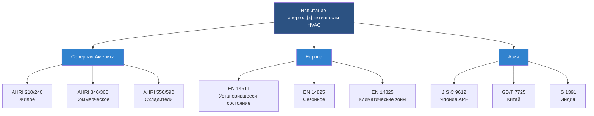

# Международные показатели энергоэффективности HVAC

Глобальные показатели энергоэффективности HVAC обеспечивают стандартизированные методы сравнения производительности систем между производителями, технологиями и географическими регионами. Эти показатели преобразуют сложную термодинамическую производительность в количественные значения, которые направляют выбор оборудования, обеспечение нормативного соответствия и разработку политики в области энергетики.

## Фундаментальные концепции энергоэффективности

Показатели энергоэффективности HVAC количественно определяют соотношение полезного выхода тепла или охлаждения к вводу энергии. Фундаментальное соотношение вытекает из первого закона термодинамики, применяемого к циклам паровой компрессии и процессам теплопередачи.

Для оборудования охлаждения базовое соотношение эффективности:

$$\text{Эффективность} = \frac{\text{Мощность охлаждения (кДж/ч или кВ)}}{\text{Входная мощность (Вт или кВ)}}$$

Для оборудования отопления с использованием паровой компрессии:

$$\text{Эффективность} = \frac{\text{Мощность отопления (кДж/ч или кВ)}}{\text{Входная мощность (Вт или кВ)}}$$

Эти коэффициенты превышают единицу для тепловых насосов, потому что они перемещают тепло, а не генерируют его путём прямого преобразования электрической энергии.

## Первичные глобальные показатели эффективности

### Коэффициент производительности (COP)

COP представляет мгновенную эффективность при определённых условиях эксплуатации. Применяется универсально в режимах охлаждения и отопления:

**COP охлаждения:**

$$\text{COP}_c = \frac{Q_c}{W_{comp}}$$

Где:
- $Q_c$ = мощность охлаждения при установленных условиях (кВ)
- $W_{comp}$ = входная мощность компрессора (кВ)

**COP отопления:**

$$\text{COP}_h = \frac{Q_h}{W_{comp}}$$

Где:
- $Q_h$ = мощность отопления при установленных условиях (кВ)
- $W_{comp}$ = входная мощность компрессора (кВ)

Значения COP критически зависят от рабочих температур. Теоретический максимальный COP для теплового насоса Карно:

$$\text{COP}_{Carnot,h} = \frac{T_h}{T_h - T_c}$$

Где температуры абсолютные (Кельвин). Реальное оборудование достигает 40-60% эффективности Карно из-за необратимости в процессах сжатия, расширения и теплообмена.

### Коэффициент энергоэффективности (EER)

EER измеряет установившуюся эффективность охлаждения при стандартных условиях испытания. Североамериканский стандарт использует условия испытания ARI/AHRI:

- Внутренние: 26.7°C по сухому термометру, 19.4°C по влажному термометру
- Наружные: 35°C по сухому термометру

$$\text{EER} = \frac{\text{Мощность охлаждения (кДж/ч)}}{\text{Входная мощность (Вт)}}$$

ASHRAE Standard 90.1 определяет минимальные значения EER для коммерческого оборудования на основе диапазонов мощности и типов оборудования.

### Сезонный коэффициент энергоэффективности охлаждения (SEER/SEER2)

SEER учитывает изменяющиеся нагрузки и производительность при неполной нагрузке в течение типичного сезона охлаждения. SEER2 (действителен с 2023 года) использует обновлённые процедуры испытания, отражающие более реалистичные условия установки:

$$\text{SEER2} = \frac{\text{Общее сезонное охлаждение (кДж)}}{\text{Общее сезонное потребление энергии (Вт·ч)}}$$

Расчёт интегрирует производительность во множество температурных диапазонов, взвешенных по частоте появления в репрезентативном климате. Испытание SEER2 включает требования статического давления, которые лучше отражают фактические воздуховодные системы.

### Сезонный коэффициент производительности отопления (HSPF/HSPF2)

HSPF измеряет сезонную эффективность отопления для тепловых насосов в режиме отопления:

$$\text{HSPF2} = \frac{\text{Общее сезонное тепло (кДж)}}{\text{Общее сезонное потребление энергии (Вт·ч)}}$$

HSPF2 (действителен с 2023 года) включает несколько температурных диапазонов от 16.7°C до -20.6°C наружной температуры, учитывая циклы разморозки и работу вспомогательного отопления.

## Сравнение региональных стандартов эффективности

| Регион | Показатель охлаждения | Показатель отопления | Стандарт испытания | Типичный диапазон |
|--------|---------------|---------------|---------------|---------------|
| Северная Америка | EER, SEER2 | COP, HSPF2 | AHRI 210/240, AHRI 340/360 | SEER2: 14-28 |
| Европа | EER, SEER | COP, SCOP | EN 14511, EN 14825 | SEER: 5-8.5 |
| Япония | APF (Annual Performance Factor) | APF | JIS C 9612 | APF: 4-7 |
| Китай | EER, APF | COP | GB/T 7725 | Grade 1: ≥3.6 |
| Австралия | EER, AEER | COP, ACOP | AS/NZS 3823 | 6-8 звёзд |
| Индия | ISEER (Indian SEER) | COP | IS 1391 | ISEER: 3.5-5.2 |

## Европейская сезонная эффективность (SCOP)

Сезонный коэффициент производительности (SCOP) обеспечивает оценку сезонной эффективности отопления в Европе:

$$\text{SCOP} = \frac{Q_h}{\sum(E_{design} + E_{backup})}$$

EN 14825 определяет три климатические зоны (средняя, более холодная, более тёплая) с отдельными температурными диапазонами для расчёта SCOP. Такой подход признаёт, что производительность теплового насоса значительно варьируется в зависимости от климата.

## Японский годовой коэффициент производительности (APF)

APF Японии интегрирует как охлаждение, так и отопление в течение полного года:

$$\text{APF} = \frac{Q_{cooling} + Q_{heating}}{E_{cooling} + E_{heating}}$$

Испытание APF использует стандарты JIS C 9612 с взвешиванием климата, специфичным для Японии, на основе условий Токио. Этот показатель лучше представляет оборудование, используемое круглый год в умеренном климате.

## Соотношения конверсии показателей эффективности

Прямое преобразование между региональными показателями затруднено из-за различных условий испытания, но существуют приблизительные соотношения:

**SEER в европейский SEER (приблизительно):**

$$\text{SEER}_{EU} \approx \frac{\text{SEER}_{US}}{3.41}$$

Коэффициент 3.41 преобразует кДж/Вт·ч в безразмерный коэффициент (Вт/Вт).

**EER в COP:**

$$\text{COP} \approx \frac{\text{EER}}{3.41}$$

Эти преобразования обеспечивают грубую эквивалентность, но не учитывают различные условия испытания.

## Стандарты тестирования производительности

## Интегрированное значение при неполной нагрузке (IPLV)

Энергоэффективность коммерческих охладителей использует IPLV для учёта работы при неполной нагрузке. AHRI Standard 550/590 определяет взвешивание IPLV:

$$\text{IPLV} = 0.01A + 0.42B + 0.45C + 0.12D$$

Где:
- A = EER при 100% нагрузке
- B = EER при 75% нагрузке
- C = EER при 50% нагрузке
- D = EER при 25% нагрузке

Весовые коэффициенты отражают типичные профили работы охладителя в коммерческих зданиях. Работа при неполной нагрузке часто превосходит эффективность полной нагрузки из-за снижения разности температур и улучшенной теплопередачи при более низких температурах конденсации.

## Зависящая от температуры производительность

Все показатели эффективности зависят от рабочих температур. Соотношение Карно демонстрирует теоретические пределы:

Для воздушных тепловых насосов при различных наружных температурах:

| Наружная температура (°C) | Теоретический COP | Типичный реальный COP | Эффективность % |
|-------------------|-----------------|------------------|--------------|
| 8.3 | 12.8 | 4.2 | 33% |
| 1.7 | 10.3 | 3.4 | 33% |
| -8.3 | 7.8 | 2.4 | 31% |
| -15 | 6.6 | 1.9 | 29% |

Эффективность реального оборудования снижается быстрее, чем предсказания Карно при низких температурах из-за повышенной необратимости, циклов разморозки и ограничений свойств хладагента.

## Минимальные стандарты эффективности по регионам

Нормативные требования минимальной энергоэффективности определяют проектирование оборудования и наличие на рынке:

**Северная Америка (стандарты 2023 года):**
- Жилой сплит-кондиционер: SEER2 ≥ 14.0 (Юг), 13.4 (Север)
- Жилой тепловой насос: HSPF2 ≥ 7.5
- Коммерческий упакованный кондиционер (≥18.5 кВ): EER ≥ 11.0

**Европейский союз (Ecodesign):**
- Жилой кондиционер: SEER ≥ 5.1, SCOP ≥ 3.4
- Коммерческий кондиционер: SEER ≥ 4.6, SCOP ≥ 3.2

**Япония (Top Runner Program):**
- Комнатный кондиционер: APF ≥ 5.8 (целевое значение варьируется по мощности)

## Коэффициент мощности и общая эффективность

Очевидные показатели эффективности с использованием электрической входной мощности могут не отражать потребление реактивной мощности. Истинная системная эффективность включает коэффициент мощности:

$$\text{Коэффициент мощности} = \frac{\text{Активная мощность (Вт)}}{\text{Полная мощность (В·А)}}$$

Оборудование с низким коэффициентом мощности (< 0,9) увеличивает потери распределения полезности даже при приемлемом COP. Регулируемые приводы с переменной частотой и системы инвертора обеспечивают лучшие коэффициенты мощности во всех диапазонах эксплуатации.

## Соображения при применении

Выбор оборудования на основе показателей эффективности требует соответствия показателя условиям применения:

1. **Показатели установившегося состояния (EER, COP)**: используйте для приложений с постоянной нагрузкой, таких как охлаждение процессов или центры обработки данных
2. **Сезонные показатели (SEER2, HSPF2, SCOP)**: используйте для кондиционирования воздуха с переменными нагрузками
3. **Показатели при неполной нагрузке (IPLV, NPLV)**: критичны для перегруженного оборудования или систем со значительным изменением нагрузки
4. **Показатели, специфичные для климата**: согласуйте испытательный климат с местом установки для точного прогноза производительности

ASHRAE Standard 90.1 и местные энергетические коды определяют требования минимальной эффективности на основе типа оборудования, мощности и климатической зоны. Высокопроизводительные здания часто превышают минимальные требования кодекса на 20-40%, чтобы снизить операционные затраты и воздействие на окружающую среду.

Понимание глобальных показателей эффективности позволяет принимать обоснованные решения при выборе оборудования, точно проводить моделирование энергопотребления и эффективно сравнивать конкурирующие технологии на международных рынках.
