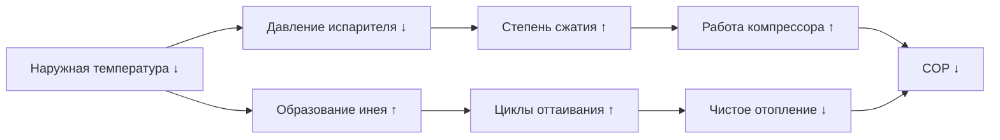
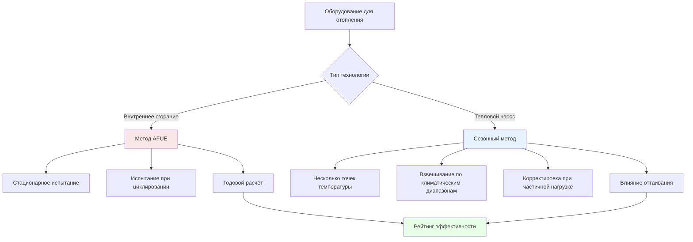

# Глобальные стандарты и метрики эффективности отопления

Международные стандарты эффективности отопления предоставляют框架для сравнения производительности оборудования в различных климатических зонах и нормативных средах. Понимание этих метрик требует изучения фундаментальных термодинамических принципов, управляющих передачей тепла и эффективностью преобразования.

## Фундаментальные определения эффективности

Эффективность отопления количественно определяет отношение полезной теплоотдачи к затратам энергии. Для оборудования внутреннего сгорания это соотношение выглядит следующим образом:

$$\eta_{heating} = \frac{Q_{useful}}{Q_{input}} = \frac{Q_{input} - Q_{losses}}{Q_{input}}$$

Где $Q_{useful}$ представляет тепло, доставленное в кондиционируемое помещение, $Q_{input}$ — энергосодержание топлива, а $Q_{losses}$ включает потери в дымоходе, потери через стенки корпуса и потери от неполного сгорания.

Для тепловых насосов, работающих по циклу с компрессией пара, эффективность выражается коэффициентом производительности:

$$COP_{heating} = \frac{Q_{heating}}{W_{compressor}} = \frac{h_{condenser,out} - h_{condenser,in}}{h_{compressor,out} - h_{compressor,in}}$$

Это отношение превышает единицу, поскольку тепловые насосы перемещают тепловую энергию, а не производят её за счёт сгорания топлива.

## Основные международные метрики эффективности

### AFUE (годовая эффективность использования топлива)

Используется в основном в Северной Америке, AFUE измеряет эффективность оборудования внутреннего сгорания для отопления в течение полного сезона отопления. Метрика учитывает:

- Эффективность установившегося сгорания
- Потери при циклическом включении-выключении
- Потребление энергии запальником (если применимо)
- Потери корпуса и распределения

AFUE рассчитывается как:

$$AFUE = \frac{\text{Годовая теплоотдача (кДж)}}{\text{Годовой расход топлива (кДж)}} \times 100\%$$

**Текущие минимальные стандарты:**
- Соединённые Штаты: 80% AFUE для печей без конденсации, 90% для конденсирующих
- Канада: 95% AFUE для жилых газовых печей (с 2023 г.)

**Пример расчёта:**
Газовая печь потребляет 105,5 кВт входящей мощности с 92% AFUE обеспечивает:

$$Q_{output} = 105,5 \times 0,92 = 97,06 \text{ кВт полезного тепла}$$

В течение сезона отопления на 2000 часов при среднем коэффициенте подачи 50%:
- Общий расход топлива: $105,5 \times 2000 \times 0,5 = 105,5$ МВтч
- Доставленное полезное тепло: $105,5 \times 0,92 = 97,06$ МВтч
- Стоимость топлива при 0,15 доллара/кВтч: $105,5 \times 0,15 = 15,83$ доллара

### SCOP (сезонный коэффициент производительности)

Европейский стандарт SCOP оценивает производительность теплового насоса в четырёх климатических зонах (от более тёплых к более холодным) в нескольких рабочих точках. Эта метрика учитывает:

- Характеристики производительности при частичной нагрузке
- Вариацию эффективности в зависимости от температуры
- Потребление энергии циклом оттаивания
- Потребление электроэнергии в режиме ожидания и отключении

$$SCOP = \frac{\sum Q_{heating,bin}}{\sum W_{electrical,bin}}$$

Где суммирование происходит по температурным диапазонам, репрезентативным для сезонных условий.

### HSPF (фактор сезонной производительности отопления)

Североамериканская метрика теплового насоса HSPF, выраженная в кДж/кВтч, оценивает производительность при определённых наружных температурах (-8,3°C, 1,7°C, -8,3°C), взвешенных по климатическому региону:

$$HSPF = \frac{\text{Общая теплоотдача (кДж)}}{\text{Общее потребление электроэнергии (кВтч)}}$$

**Преобразование между метриками:**

$$SCOP \approx \frac{HSPF}{3,412}$$

**Текущие минимальные стандарты:**
- Соединённые Штаты: HSPF 8,8 (с 2023 г.)
- Европа: SCOP 3,8–4,2 в зависимости от климатической зоны

## Таблица международного сравнения

| Метрика | Регион | Тип оборудования | Условия испытания | Минимальный стандарт |
|---------|--------|------------------|-------------------|----------------------|
| AFUE | Северная Америка | Газовые/масляные печи | Процедура испытаний DOE | 80–95% |
| SCOP | Европа | Тепловые насосы | EN 14825, 4 климата | 3,8–4,2 |
| HSPF | Северная Америка | Тепловые насосы | AHRI 210/240 | 8,8 кДж/кВтч |
| APF | Япония | Тепловые насосы | JIS C 9612 | 6,0+ |
| COP | Китай | Тепловые насосы | GB/T 7725 | 2,3–3,6 |
| EER | Австралия | Тепловые насосы | AS/NZS 3823 | Варьируется в зависимости от производительности |

## Производительность, зависящая от температуры

Эффективность теплового насоса значительно снижается при понижении наружной температуры из-за уменьшения разности давлений хладагента и увеличения требований к оттаиванию:

**Типовое изменение COP для воздушного теплового насоса:**

| Наружная температура (°C) | COP | Производительность отопления (%) |
|--------------------------|-----|-----------------------------------|
| 8,3 | 4,2 | 100 |
| 1,7 | 3,5 | 90 |
| -8,3 | 2,4 | 70 |
| -15 | 1,8 | 50 |

Эта кривая производительности демонстрирует, почему сезонные метрики (SCOP, HSPF) обеспечивают более реалистичную оценку эффективности, чем односточечные рейтинги COP.

## Эффективность Карно и практические пределы

Теоретическая максимальная производительность отопления COP ограничена эффективностью цикла Карно:

$$COP_{Carnot,heating} = \frac{T_{condenser}}{T_{condenser} - T_{evaporator}}$$

Где температуры указаны в абсолютной шкале (Кельвин или Ранкин).

**Пример:** Тепловой насос с температурой подачи 48,9°C (322 K) и наружной температурой 1,7°C (275 K):

$$COP_{Carnot} = \frac{322}{322 - 275} = 6,85$$

Реальное оборудование достигает 50–60% эффективности Карно из-за:
- Неэффективности компрессора (механические и термодинамические потери)
- Разностей температур теплообменников
- Падений давления хладагента
- Циклов оттаивания и вспомогательного отопления

**Практический COP:** $6,85 \times 0,55 = 3,77$

## Различия в методологии расчёта

## Анализ экономического воздействия

Улучшения эффективности напрямую переводятся в снижение эксплуатационных расходов. Для нагрузки отопления 17,6 кВт, работающей 2000 часов в год:

**Сравнение газовых печей:**
- 80% AFUE: $\frac{17,6 \times 2000}{0,80} = 44$ МВтч при 0,15 доллара/кВтч = 6,60 доллара
- 95% AFUE: $\frac{17,6 \times 2000}{0,95} = 37$ МВтч = 5,55 доллара
- **Годовая экономия:** 1,05 доллара

**Сравнение тепловых насосов (при 0,12 доллара/кВтч):**
- HSPF 8,8: $\frac{17,6 \times 2000}{8,8} = 4000$ кВтч = 480 долларов
- HSPF 10: $\frac{17,6 \times 2000}{10} = 3520$ кВтч = 422,40 доллара
- **Годовая экономия:** 57,60 доллара

## Региональные климатические соображения

Оптимальные метрики эффективности варьируются в зависимости от климатической зоны и дней отопления (HDD):

| Климатическая зона | HDD (база 18°C) | Рекомендуемая технология | Целевая эффективность |
|--------------------|-----------------|--------------------------|----------------------|
| Зона 1–2 (горячая) | < 1100 | Минимальное отопление | HSPF > 8,5 |
| Зона 3–4 (умеренная) | 1100–3055 | Тепловой насос или печь | SCOP 4,0, AFUE 92% |
| Зона 5–6 (холодная) | 3055–5000 | Высокоэффективная печь | AFUE 95%+ |
| Зона 7–8 (очень холодная) | > 5000 | Конденсирующий котёл | AFUE 95–98% |

## Согласование стандартов испытаний

Международные усилия по гармонизации процедур испытаний включают:

- ISO 13253 для канальных кондиционеров воздуха и тепловых насосов
- IEC 60335-2-40 для безопасности и производительности тепловых насосов
- Участие AHRI в европейских комитетах по стандартизации

Различия сохраняются из-за:
- Вариаций напряжения/частоты (50 Гц против 60 Гц)
- Климатического разнообразия, требующего региональных специфических точек испытания
- Национального нормативного суверенитета

## Заключение

Глобальные стандарты эффективности отопления отражают фундаментальные термодинамические ограничения при одновременном учёте региональных климатических вариаций и нормативной философии. AFUE обеспечивает простую оценку эффективности внутреннего сгорания, в то время как SCOP и HSPF охватывают сложную производительность, зависящую от температуры, тепловых насосов. Понимание этих метрик позволяет правильно выбирать оборудование, точно моделировать энергопотребление и осуществлять значимое международное сравнение производительности.

Инженеры должны производить преобразование между стандартами при указании импортного оборудования или проектировании систем для нескольких международных рынков. Базовая физика остаётся постоянной: эффективность представляет отношение полезной теплоотдачи к затратам энергии, ограниченное пределами Карно и деградированное действительными необратимостями.
