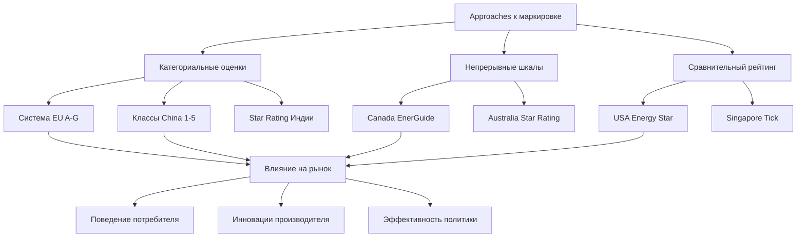

Программы маркировки энергоэффективности обеспечивают стандартизированную информацию потребителей о характеристиках оборудования HVAC, позволяя принимать обоснованные решения при покупке и стимулируя трансформацию рынка в направлении высокоэффективных продуктов. Эти обязательные и добровольные схемы значительно различаются между юрисдикциями по методологии, формату представления и механизмам нормативного принуждения.

## Основы программ маркировки

Энергетические этикетки преобразуют технические показатели производительности в форматы, доступные для потребителей. Эффективность любой программы маркировки зависит от нескольких физических и психологических факторов:

**Эффективность передачи информации:**

$$\eta_{label} = \frac{E_{decision}}{E_{total}}$$

где $E_{decision}$ представляет энергетическое воздействие от осознанного выбора потребителем и $E_{total}$ представляет общее энергопотребление в категории маркируемого оборудования.

Эффективные этикетки должны балансировать техническую точность с визуальной ясностью, обычно используя цветовые шкалы, сравнительные полосы или буквенные оценки для передачи относительной производительности.

## Основные международные схемы маркировки

### Энергетическая этикетка Европейского союза

Энергетическая этикетка ЕС (Регламент 2017/1369) использует шкалу A-G с цветовым градиентом от зелёного (эффективный) до красного (неэффективный). Основу пересмотрели в 2021 году, чтобы исключить категории A+, A++ и A+++, которые насытили рынок.

**Основные характеристики:**
- Переделка для сохранения дифференциации по мере улучшения технологии
- QR-коды со ссылками на базы данных продуктов (EPREL)
- Стандартизированные пиктограммы для мощности, шума и режимов работы
- Обязательна для кондиционеров, тепловых насосов, вентиляционных установок и локальных обогревателей помещений

На этикетке отображается годовое потребление энергии, рассчитанное с использованием стандартизированных условий испытания согласно EN 14825 для кондиционеров:

$$E_{annual} = E_{heating} + E_{cooling} + E_{standby}$$

где энергия отопления и охлаждения зависит от количества часов в климатической зоне и производительности оборудования при каждой температуре.

### Китайская энергетическая этикетка

Система маркировки энергоэффективности Китая (GB 21455 для комнатных кондиционеров, GB 19577 для многосплит-систем) использует пятиуровневую шкалу, где 1-й класс представляет наивысшую эффективность. Программой администрирует Центр сертификации стандартов Китая.

**Основа расчёта для охлаждения:**

$$SEER_{China} = \frac{\sum_{i} Q_{c,i} \times h_i}{\sum_{i} P_{c,i} \times h_i}$$

Метод бинирования применяет взвешенные часы ($h_i$) по температурным интервалам, специфичным для климатических зон Китая, отличаясь от методов расчёта в Европе и Северной Америке.

### Energy Star (Соединённые Штаты)

Energy Star работает как добровольная партнёрская программа, администрируемая EPA и DOE, определяющая продукты, превосходящие минимальные федеральные стандарты эффективности на значительную величину (обычно 10-20%).

Для центральных кондиционеров Energy Star версии 6.1 требуются:
- Сплит-системы: SEER ≥ 15,0, EER ≥ 12,5
- Блочные системы: SEER ≥ 15,0, EER ≥ 12,0

Этикетка отображает прогнозируемую годовую стоимость эксплуатации на основе национальных средних тарифов на электроэнергию и стандартизированных моделей потребления, полученных из обследований жилого энергопотребления.

### EnerGuide (Канада)

Канадская этикетка EnerGuide представляет непрерывную шкалу, показывающую потребление энергии продуктом относительно диапазона аналогичных моделей на рынке. В отличие от систем с буквенными оценками, этот подход обеспечивает более детальную дифференциацию производительности.

**Представление потребления энергии:**

$$C_{display} = \frac{E_{annual,product} - E_{annual,min}}{E_{annual,max} - E_{annual,min}} \times 100$$

Это нормализованное отображение позволяет потребителям оценить относительное положение в доступном диапазоне продуктов.

## Сравнительный анализ подходов к маркировке

| Программа | Регион | Тип шкалы | Частота обновления | Основа стандарта испытания |
|---------|--------|------------|------------------|---------------------|
| EU Energy Label | Европейский союз | Категориальная A-G | Каждые 5-10 лет | EN 14825, EN 14511 |
| Energy Star | Соединённые Штаты | Пороговый проход/отказ | Ежегодный пересмотр | AHRI 210/240, процедуры испытания DOE |
| EnerGuide | Канада | Непрерывная шкала | 3-5 лет | CSA C656, C746 |
| China Energy Label | Китай | Классы 1-5 | 3-5 лет | GB/T 7725, GB 21455 |
| India Star Rating | Индия | 1-5 звёзд | 2-3 года | IS 1391, стандарты BEE |
| MEPS (Australia) | Австралия | Star rating + MEPS | Регулярные обновления | AS/NZS 3823 series |

## Требования к испытаниям и проверке

Все программы маркировки требуют испытания третьей стороной в соответствии со стандартизированными протоколами. Условия испытания значительно влияют на заявленную производительность:

**Корректировка холодопроизводительности для нестандартных условий:**

$$Q_{actual} = Q_{rated} \times \left(\frac{T_{wb,indoor} - 19,4}{26,7 - 19,4}\right) \times \left(\frac{35 - T_{db,outdoor}}{35 - 27,8}\right)$$

где температуры в °C для европейских стандартов. Условия рейтинга охлаждения AHRI используют 35°C наружный, 27°C внутренний сухой термометр, 19°C влажный термометр.

Проверка испытаниями обычно отбирает 5-10% моделей ежегодно, с повышенным контролем для категорий, показывающих высокие темпы несоответствия.

## Проблемы и возможности гармонизации

Несмотря на международную торговлю оборудованием HVAC, программы маркировки остаются раздробленными по следующим причинам:

1. **Различия климатических зон**: Методы сезонного расчёта должны отражать местные погодные условия
2. **Структуры тарификации электроэнергии**: Оценки затрат требуют региональных коммунальных тарифов
3. **Исследования потребителей**: Культурные факторы влияют на понимание этикетки и влияние на покупку
4. **Нормативный суверенитет**: Юрисдикции сохраняют независимые полномочия по установлению стандартов

Стандарт ASHRAE 206-2013 предоставляет основу для сравнения производительности всего здания между различными системами рейтинга, хотя гармонизация на уровне оборудования остаётся ограниченной.

Международное партнёрство по повышению энергоэффективности (IPEEC) координирует добровольное согласование процедур испытания и требований минимальной эффективности, снижая нагрузку на соответствие для многонациональных производителей.

## Будущие разработки

Появляющиеся улучшения маркировки включают:

**Отслеживание подключённой производительности**: Интеллектуальное оборудование, сообщающее фактическую эффективность работы в сравнении с номинальными значениями, позволяя применять этикетки "при использовании"

**Показатели интенсивности углерода**: Прямые эквивалентные выбросы CO₂ на основе региональной структуры электрогенерации, а не только потребления энергии

**Представление полной стоимости владения**: Общая стоимость владения, включая цену покупки, установку, техническое обслуживание и утилизацию

**Динамические данные со ссылкой QR**: Обновления в реальном времени сравнительных рейтингов по мере поступления новых моделей на рынок

Эти инновации устраняют ограничения статических этикеток при сохранении фундаментальной цели трансформации рынков в направлении высокоэффективного оборудования HVAC.
