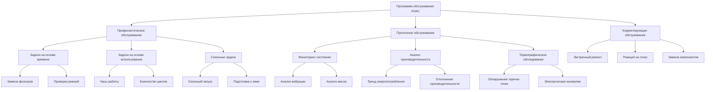

# Стратегии управления техническим обслуживанием HVAC

Эффективное управление техническим обслуживанием является основополагающим фактором для долговечности системы HVAC, энергоэффективности и надежности в работе. В этом руководстве рассматриваются три основных подхода к обслуживанию—профилактическое (PM), прогнозное (PdM) и корректирующее (CM)—с акцентом на оптимизацию затрат и стратегии реализации, согласованные со стандартами ASHRAE 180 и 100.

## Иерархия программы обслуживания



## Сравнение подходов к обслуживанию

| Критерий | Профилактическое обслуживание (PM) | Прогнозное обслуживание (PdM) | Корректирующее обслуживание (CM) |
|----------|----------------------------|------------------------------|----------------------------|
| **Время выполнения** | По расписанию на интервалы | На основе условия срабатывания | После отказа |
| **Структура затрат** | Фиксированная, предсказуемая | Переменная, зависит от технологии | Непредсказуемая, часто наибольшая |
| **Время работы оборудования** | 92-96% типично | 96-99% типично | 70-85% типично |
| **Требования к труду** | Умеренные, по расписанию | Низкие, целевые | Высокие, срочные |
| **Инвентаризация деталей** | Стандартный уровень запасов | Минимальный, точно в срок | Экстренные закупки |
| **Влияние на энергоэффективность** | Улучшение на 5-10% | Улучшение на 10-20% | Ухудшается со временем |
| **Сложность реализации** | Низкая-средняя | Высокая, требует приборов | Низкая |
| **Стандарт ASHRAE** | Соответствие 180 | Лучшая практика 180 | Несоответствие |
| **Типичное применение** | Все критические системы | Активы высокой стоимости | Некритичное оборудование |

## Стратегия профилактического обслуживания

Профилактическое обслуживание выполняет запланированные задачи в предопределенные интервалы для предотвращения отказов до их возникновения. Стандарт ASHRAE 180 устанавливает минимальные требования к программам PM.

**Ключевые компоненты:**

- **Замена фильтра:** Ежемесячно до ежеквартально в зависимости от мониторинга перепада давления
- **Очистка змеевика:** Ежегодно или когда температура подхода превышает проектное значение на 1,7 °C
- **Натяжение и выравнивание ремня:** Ежеквартальная проверка, регулировка по мере необходимости
- **Проверка хладагента:** Ежегодно в соответствии со стандартом ASHRAE 15
- **Калибровка управления:** Полугодовая проверка датчиков и исполнительных механизмов
- **Смазка:** В соответствии со спецификациями производителя, обычно ежеквартально до ежегодно

**Оптимизация частоты PM:**

Оптимальный интервал PM сбалансирован между затратами на обслуживание и риском отказа:

```
TC = (Cp × N/T) + (Cf × λ × T)
```

Где:
- TC = Общие годовые затраты на обслуживание
- Cp = Стоимость одной задачи PM
- N = Количество задач PM в год
- T = Время между задачами PM (часы)
- Cf = Стоимость события отказа
- λ = Частота отказа (отказов в час)

Оптимальный интервал: **T_opt = √(2Cp / (Cf × λ))**

## Стратегия прогнозного обслуживания

Прогнозное обслуживание использует мониторинг состояния для обнаружения ранних признаков отказа, позволяя проводить обслуживание только при необходимости. Этот подход максимизирует срок службы оборудования при минимизации частоты вмешательства.

**Основные технологии:**

1. **Анализ вибрации:** Обнаруживает износ подшипников, дисбаланс, неправильное выравнивание вращающегося оборудования
2. **Термография:** Выявляет деградацию электрических соединений, проблемы с потоком хладагента
3. **Анализ масла:** Контролирует износные металлы компрессора, загрязнение, образование кислоты
4. **Ультразвуковое тестирование:** Обнаруживает отказы паровых ловушек, утечки сжатого воздуха, электрические дуги
5. **Тренд производительности:** Отслеживает деградацию эффективности посредством непрерывного мониторинга

**Анализ затрат-выгод PdM:**

Экономическое обоснование реализации программы PdM:

```
NPV = Σ[(Savings_year - Cost_year) / (1 + r)^year]
```

Где:
- NPV = Чистая приведенная стоимость программы PdM
- Savings_year = Годовая экономия от сокращения отказов и энергии
- Cost_year = Годовые затраты на технологию и труд PdM
- r = Ставка дисконтирования

Типичные программы PdM достигают положительного NPV в течение 18-36 месяцев для критического оборудования мощностью более 35 кВт.

**Пороги на основе условия:**

Установить триггеры действия на основе измеренных параметров:

- **Скорость вибрации:** >0,076 м/с указывает на проблемы с подшипником
- **Температура подхода:** >1,7 °C выше проектного значения требует обслуживания змеевика
- **Отклонение перегрева компрессора:** ±2,8 °C от проектного значения указывает на проблемы с зарядом или расширительным клапаном
- **Дисбаланс тока двигателя:** >10% между фазами указывает на электрические проблемы

## Стратегия корректирующего обслуживания

Корректирующее обслуживание устраняет отказы после их возникновения. Хотя оно является целесообразным для некритичного оборудования низкой стоимости, оно приводит к наибольшим общим затратам на жизненный цикл для критических систем.

**Стратегическое применение:**

CM следует ограничить оборудованием, где последствия отказа минимальны:

- **Приемлемо для:** Отдельные зоны, резервное оборудование, низкая стоимость замены
- **Неприемлемо для:** Критическое охлаждение процесса, системы безопасности жизни, центральные установки

**Стоимость влияния отказа:**

```
FC = Cd + Cl + Ce + Cr
```

Где:
- FC = Общая стоимость отказа
- Cd = Прямые затраты на ремонт (труд, детали, экстренные сборы)
- Cl = Потеря производительности или продукции
- Ce = Избыточное потребление энергии при деградированной работе
- Cr = Влияние на репутацию/удовлетворенность клиентов

Для критических систем FC обычно превышает затраты на плановое обслуживание в 3-8 раз.

## Оптимизация программы обслуживания

Оптимальная стратегия обслуживания объединяет все три подхода в зависимости от критичности оборудования и экономики:

**Модель общей стоимости обслуживания:**

```
TMC = (PM_cost × N_pm) + (PdM_cost × N_pdm) + (CM_cost × N_cm) + E_excess
```

Где:
- TMC = Общие годовые затраты на обслуживание
- PM_cost, PdM_cost, CM_cost = Затраты на событие для каждой стратегии
- N_pm, N_pdm, N_cm = Количество событий в год
- E_excess = Избыточная стоимость энергии из-за деградированной производительности

**Матрица классификации оборудования:**

| Критичность | Годовая стоимость эксплуатации | Рекомендуемая стратегия |
|-------------|----------------------|---------------------|
| Высокая | >362 000 руб. | PdM основной, PM резервный |
| Высокая | 72 000-362 000 руб. | PM основной, выбранный PdM |
| Средняя | 36 000-72 000 руб. | PM согласно ASHRAE 180 |
| Низкая | <36 000 руб. | CM приемлемо |

## Соответствие стандартам ASHRAE

**Стандарт ASHRAE 180-2018** устанавливает минимальные требования к обслуживанию:

- Процедуры проверки и обслуживания документированы
- Квалифицированный персонал выполняет все задачи
- Записи ведутся на протяжении всего срока службы оборудования
- Сезонные запуски включают полную проверку системы
- Обслуживание фильтра на основе перепада давления, а не календаря
- Проверка утечек хладагента в соответствии со стандартом 15

**Стандарт ASHRAE 100-2018** рассматривает энергоцентрированное обслуживание:

- Проверка функциональности экономайзера ежеквартально
- Проверка точности системы управления ежегодно
- Тренд производительности теплообменника
- Оптимизация заряда хладагента
- Проверка балансировки гидравлической системы

## Рекомендации по реализации

1. **Инвентаризируйте и классифицируйте** все оборудование HVAC по критичности и стоимости эксплуатации
2. **Установите базовые метрики производительности** для трендирования и обнаружения аномалий
3. **Разработайте частоты задач** с использованием формул оптимизации и рекомендаций производителя
4. **Реализуйте CMMS** (Компьютеризированная система управления обслуживанием) для отслеживания и анализа
5. **Обучите персонал** диагностическим методам и процедурам безопасности в соответствии со стандартом ASHRAE 180
6. **Рассмотрите и скорректируйте** программу ежегодно на основе данных о отказах и анализа затрат

Оптимизированная программа обслуживания снижает общие затраты жизненного цикла на 20-35% по сравнению с реактивными подходами при одновременном повышении надежности системы и энергоэффективности.
