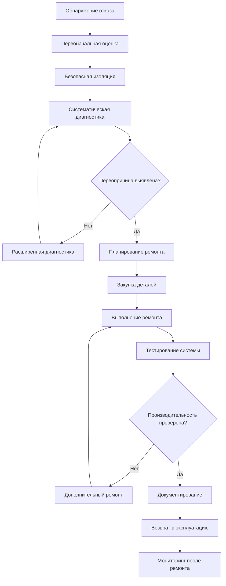

Корректирующее обслуживание устраняет отказы оборудования и деградацию производительности посредством систематической диагностики, ремонта и проверки. В отличие от профилактического обслуживания, которое предвосхищает проблемы, корректирующее обслуживание реагирует на фактические отказы, требуя структурированную методологию устранения неполадок и всеобъемлющего документирования для предотвращения повторения.

## Процесс корректирующего обслуживания

## Систематическая методология устранения неполадок

### Этап 1: Сбор информации

Соберите операционные данные перед нарушением целостности системы:

- **Документирование симптомов**: Запишите точные условия при возникновении отказа
- **Операционные параметры**: Измерьте температуры, давления, токи, напряжения
- **История системы**: Проверьте записи об обслуживании и предыдущих отказах
- **Факторы окружающей среды**: Отметьте условия окружающей среды и изменения нагрузки

### Этап 2: Диагностическая стратегия

Применяйте структурированный анализ для изоляции механизмов отказа:

1. **Проверка жалобы**: Подтвердите воспроизводимость заявленного симптома
2. **Проверка основ**: Проверьте электропитание, параметры управления и количество хладагента
3. **Применение принципов физики**: Используйте термодинамические связи для выявления аномалий
4. **Систематическое исключение**: Тестируйте компоненты от простейших к наиболее сложным
5. **Измеряйте, не предполагайте**: Получите количественные данные вместо полагания на наблюдения

### Этап 3: Анализ первопричин

Определите основной механизм отказа, а не просто отказавший компонент:

- **Непосредственная причина**: Какой компонент вышел из строя?
- **Способствующие факторы**: Какие условия ускорили отказ?
- **Системные проблемы**: Существует ли конструктивный дефект или операционный паттерн?

## Общие отказы HVAC и их первопричины

| Режим отказа | Наблюдаемые симптомы | Распространённые первопричины | Диагностические тесты |
|--------------|---------------------|-------------------------------|----------------------|
| Частое включение компрессора | Частые пуски, высокая температура нагнетания | Перенасыщение хладагентом, неисправность ТРВ, загрязненный конденсатор | Анализ перегрева/недохолода, анализ давления нагнетания |
| Низкий расход воздуха | Высокая температура подачи, обледенение катушки | Загрязненный фильтр, отказ вентилятора, ограничения воздуховода | Измерение статического давления, измерение тока двигателя |
| Утечка хладагента | Низкое давление всасывания, снижение производительности | Усталость от вибрации, коррозия, неправильная пайка | Электронное обнаружение утечки, тест спада давления |
| Отказ управления | Нестабильная работа, отсутствие ответа | Импульсы напряжения, проникновение влаги, деградация от времени | Проверка напряжения, проверка непрерывности, трассировка сигнала |
| Механический отказ компрессора | Шум, отсутствие сжатия, высокое потребление тока | Потеря смазки, гидравлический удар, износ подшипников | Анализ масла, коэффициент сжатия, анализ вибрации |
| Загрязнение теплообменника | Снижение производительности, высокий перепад давления | Образование накипи, биологический рост, взвешенные частицы | Температура приближения, анализ воды, визуальный осмотр |
| Отказ двигателя | Отсутствие работы, срабатывание автоматического выключателя | Тепловая перегрузка, потеря фазы, загрязнение | Сопротивление обмотки, испытание изоляции, баланс тока |

## Стандарты ремонта и процедуры

### Ремонт холодильного контура

Соблюдайте требования ASHRAE Standard 15 и EPA Section 608:

**Процедуры пайки:**
- Продуйте сухим азотом под давлением 14–21 кПа во время пайки
- Используйте надлежащий присадочный металл: BCuP-5 (15% серебра) для соединений медь-медь
- Достигните минимальной температуры соединения 621°C для сплавов с серебром
- Дайте естественное охлаждение; никогда не закаляйте водой

**Вакуумирование системы:**
- Тройное вакуумирование или глубокий вакуум до 500 микрон
- Удерживайте вакуум 30 минут; рост давления указывает на утечки
- Измеряйте электронным микронным манометром, не составным манометром

**Зарядка хладагентом:**
- Взвешивайте жидкий хладагент для точности в пределах ±2%
- Проверьте целевые значения перегрева (5,6–8,3°C) и недохолода (5,6–8,3°C)
- Дайте 15-минутную стабилизацию перед окончательными измерениями

### Электрические ремонты

Соблюдайте статьи NEC 440 (оборудование кондиционирования воздуха) и 430 (двигатели):

- Используйте размеры проводов согласно таблицам допустимых нагрузок с коэффициентами коррекции температуры
- Затяните клеммные соединения в соответствии со спецификациями производителя (обычно 2,3–3,4 Н·м)
- Проверьте надлежащее заземление сопротивлением <1 Ом относительно земли
- Протестируйте сопротивление изоляции обмотки двигателя: минимум 1 МОм при 500 В DC

### Механические ремонты

Применяйте соответствующие стандарты для подшипников, ремней и муфт:

**Системы с ремённым приводом:**
- Выровняйте шкивы в пределах 0,5° углового и 3,2 мм параллельного допуска
- Натяните ремни на прогиб 64-й части дюйма на дюйм пролёта (0,4 мм на 25 мм пролёта)
- Используйте согласованные комплекты ремней; замените все ремни одновременно

**Замена подшипников:**
- Нагрейте подшипники до 93–121°C для теплового расширения при установке
- Никогда не прикладывайте силу; прессуйте только по внутреннему кольцу
- Заполните подшипники на 1/3–1/2 объёма соответствующей смазкой NLGI Grade 2 на литиевой основе

## Тестирование и проверка

### Тестирование производительности после ремонта

Проверьте, что работа системы соответствует проектным спецификациям:

**Проверка производительности:**
- Рассчитайте фактическую производительность используя Q = 1,08 × CFM (м³/ч ÷ 1,699) × ΔT (чувствительность)
- Сравните с производительностью по табличке ±10% допуска
- Документируйте условия окружающей среды во время тестирования

**Проверка эффективности:**
- Измерьте входную мощность и сравните с табличкой
- Рассчитайте EER = производительность (кДж/ч) ÷ входная мощность (кВт)
- Ожидаемая производительность в пределах 90–95% от EER по табличке при стандартных условиях

**Проверки безопасности:**
- Отключение по высокому давлению: проверьте срабатывание при 3103–3793 кПа (системы R-410A)
- Отключение по низкому давлению: проверьте срабатывание при 345–483 кПа
- Последовательность управления: подтвердите надлежащее ступенчатое включение и перекрытия

### Мониторинг после ремонта

Установите период наблюдения для подтверждения эффективности ремонта:

- **Первые 24 часа**: Мониторьте немедленное повторное возникновение отказа
- **Первая неделя**: Отслеживайте параметры работы на стабильность
- **Первый месяц**: Проанализируйте тенденции потребления энергии
- **Три месяца**: Проведите инспекцию следующего уровня и тест производительности

## Требования к документированию

### Содержание записи о ремонте

Ведите исчерпывающие записи согласно ASHRAE Guideline 36:

**Обязательная информация:**
- Дата, время и персонал, участвующий в ремонте
- Симптомы отказа и измеренные условия работы
- Выполненные диагностические шаги и полученные результаты
- Определение первопричины и подтверждающие доказательства
- Заменённые детали с номерами моделей и серийными номерами
- Количество добавленного или восстановленного хладагента (требование EPA)
- Измерения тестирования, проверяющие успешный ремонт
- Требуемые последующие действия

**Анализ тенденций отказов:**
- Отслеживайте повторяющиеся отказы по типу оборудования и компоненту
- Рассчитайте среднее время между отказами (MTBF)
- Определите системные проблемы, требующие проектных изменений

### Документирование гарантии и соответствия требованиям

Защитите покрытие гарантии и продемонстрируйте соответствие нормативным требованиям:

- Сфотографируйте отказавшие компоненты перед утилизацией
- Сохраняйте отказавшие детали в течение периода гарантии
- Документируйте соответствие требованиям EPA по обращению с хладагентом
- Записывайте сертификаты техников (EPA 608, обучение производителя)

## Критические факторы успеха

**Точность диагностики**: Правильное выявление первопричины предотвращает повторные отказы и снижает общую стоимость ремонта на 40–60% по сравнению с заменой компонентов без анализа.

**Качество деталей**: Оригинальные детали производителя обеспечивают заданную производительность и сохраняют покрытие гарантии. Детали неоригинального производства могут снизить немедленные затраты, но часто приводят к преждевременному отказу.

**Проверка при возврате в эксплуатацию**: Системы, возвращённые в эксплуатацию без проверки производительности, имеют на 25–30% более высокий уровень обратных вызовов в течение первого месяца.

**Передача знаний**: Документируйте извлечённые уроки и обновляйте процедуры профилактического обслуживания для устранения выявленных режимов отказа, снижая будущие требования корректирующего обслуживания на 15–20%.

Эффективное корректирующее обслуживание преобразует отказы в улучшение надёжности посредством систематического анализа, надлежащего выполнения ремонта и организационного обучения на каждом происшествии.
