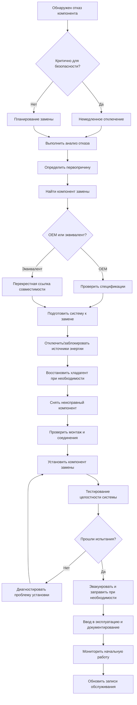

Замена компонентов является наиболее критическим аспектом корректирующего обслуживания, требующим систематических процедур для обеспечения надлежащего функционирования системы, безопасности и долговечности. Работы по замене варьируются от рутинных компонентов, таких как фильтры и ремни, до основного оборудования, такого как компрессоры и двигатели.

## Структура принятия решений о замене

Перед началом замены компонента оцените следующие критерии:

- **Результаты анализа отказов** — определите первопричину, чтобы предотвратить повторные отказы
- **Возраст компонента и проектный ресурс** — сравните часы работы со спецификациями производителя
- **Анализ затрат и выгод** — стоимость замены в сравнении с попытками продолжить ремонт
- **Совместимость системы** — проверьте соответствие компонентов замены требованиям системы
- **Наличие времени доставки** — учтите влияние простоя и наличие деталей
- **Последствия гарантии** — проверьте условия гарантии производителя и объем покрытия

## Процедуры замены основных компонентов

### Замена компрессора

Отказ компрессора представляет наиболее дорогостоящую замену компонента в холодильных системах. Процедура требует тщательного внимания к контролю загрязнения и чистоте системы.

**Предварительные шаги:**

1. Задокументируйте условия работы и признаки отказа
2. Выполните анализ масла для определения уровня загрязнения
3. Восстановите все хладагент в соответствии с нормативами EPA 608
4. Изолируйте компрессор с помощью сервисных вентилей
5. Проверьте сопротивление изоляции обмоток двигателя (требуется >1 МОм)

**Процедура замены:**

1. Отсоедините электрические соединения и отметьте всю проводку
2. Отсоедините линии всасывания и нагнетания, используя надлежащие методы пайки
3. Снимите монтажные болты и поднимите компрессор с помощью надлежащих строп
4. Установите новый компрессор с виброизоляцией
5. Выполните пайку соединений с продувкой азотом (минимальный расход 1 SCFH)
6. Установите новый фильтр-осушитель и фильтр линии всасывания
7. Эвакуируйте систему до 500 микрон или ниже
8. Заправьте хладагент в соответствии со спецификациями паспортной таблички производителя

**Критические соображения:**

- Замените фильтр-осушитель и фильтр всасывания при всех заменах компрессора
- Выполните тройную эвакуацию при обнаружении загрязнения при выгорании
- Используйте POE или соответствующее масло для типа хладагента системы
- Проверьте напряжение в пределах ±10% номинального напряжения перед запуском

### Замена двигателя

Замена двигателя применяется как к приложениям с прямым приводом, так и с ременным приводом, включая вентиляторы, насосы и нагнетатели.

**Этапы замены:**

1. Проверьте соответствие спецификаций двигателя замены оригиналу
2. Отсоедините и отключите электропитание с блокировкой
3. Снимите муфту или компоненты ременного привода
4. Открутите двигатель от монтажного основания
5. Установите двигатель замены, сохраняя выравнивание вала
6. Для ременных приводов отрегулируйте положение шкива для достижения надлежащего натяжения ремня
7. Проверьте направление вращения перед подключением к нагрузке
8. Проверьте потребляемый ток под нагрузкой

**Спецификации выравнивания:**

| Тип выравнивания | Допуск | Метод измерения |
|------------------|--------|-----------------|
| Угловое смещение | <0,5° | Индикатор часового типа |
| Параллельное смещение | <0,076 мм | Линейка |
| Люфт конца вала | По спецификации производителя | Щуп |

### Замена клапана

Замена клапана включает расширительные клапаны, соленоидные клапаны, шаровые клапаны и регулирующие клапаны по всему холодильному контуру.

**Замена термостатического расширительного клапана (TXV):**

1. Восстановите хладагент из соответствующего контура
2. Снимите датчик со строки всасывания
3. Отсоедините капиллярную трубку (избегайте перегибания)
4. Распаяйте корпус клапана, используя метод охлаждения влажной тканью
5. Установите новый клапан с надлежащей ориентацией
6. Закрепите датчик в положении 4 или 8 часов на линии всасывания
7. Изолируйте место датчика, чтобы предотвратить влияние окружающей среды
8. Проверьте давление и эвакуируйте перед зарядкой

**Замена электронного расширительного клапана (EEV):**

1. Отключите питание и сигналы управления
2. Восстановите хладагент и снимите корпус клапана
3. Установите новый клапан с правильным направлением стрелки потока
4. Подключите контроллер и проверьте проводку согласно схеме
5. Выполните процедуру калибровки контроллера
6. Установите целевое перегревание согласно требованиям системы (обычно 4-7 °C)

### Замена компонентов управления

Компоненты управления включают датчики, передатчики, исполнительные механизмы и контроллеры, которые регулируют работу системы.

**Замена датчика и калибровка:**

| Тип датчика | Метод калибровки | Допустимый допуск |
|-------------|------------------|-------------------|
| Температурный RTD | Эталонная ледяная баня | ±0,3°C при 0°C |
| Датчик давления | Тестер мертвого веса | ±1% полной шкалы |
| Датчик влажности | Раствор насыщенной соли | ±2% RH |
| Выключатель потока | Процедура производителя | По технической спецификации |

**Замена исполнительного механизма:**

1. Проверьте, соответствует ли ход исполнительного механизма требованию клапана
2. Снимите старый исполнительный механизм и монтажный кронштейн
3. Установите новый исполнительный механизм в де-энергизированное положение
4. Выполните тест хода для проверки полного перемещения (обычно 90° или 5-15 см)
5. Откалибруйте минимальное и максимальное положения
6. Отрегулируйте связь, чтобы исключить мертвую зону

## Справочник типичных заменяемых компонентов

| Компонент | Типичный ресурс | Триггер замены | Критические спецификации |
|-----------|-----------------|----------------|--------------------------|
| Компрессор | 10-15 лет | Отказ двигателя, повреждение клапана | Мощность охлаждения, хладагент, напряжение |
| Двигатель конденсаторного вентилятора | 8-12 лет | Отказ подшипника, короткое замыкание обмотки | л.с., об/мин, напряжение, направление вращения |
| Фильтр-осушитель | Ежегодно или при загрязнении | Перепад давления >13,8 кПа | Номинальная мощность охлаждения, размер соединения |
| Контакторы | 5-7 лет | Питтинг контактов, отказ катушки | Напряжение, номинальный ток, полюса |
| Конденсаторы | 3-5 лет | Смещение емкости >±10% | Рейтинг µF, рейтинг напряжения |
| Ремни | 1-3 года | Трещины, остекление, расслоение | Профиль ремня, длина |
| Подшипники | 5-10 лет | Шум, вибрация, температура | Номер подшипника, тип смазки |
| TXV | 10-15 лет | Колебания, наводнение, голодание | Мощность охлаждения, хладагент, заряд датчика |

## Рабочий процесс замены компонентов

## Лучшие практики замены компонентов

**Планирование перед заменой:**

- Получите инструкции по установке производителя и спецификации крутящего момента
- Проверьте номер модели компонента замены по спискам оборудования
- Соберите необходимые инструменты, оборудование для восстановления хладагента и средства защиты
- Проверьте электрические и холодильные схемы контуров
- Координируйте простой с эксплуатацией объекта

**Качество монтажа:**

- Используйте откалиброванные динамометрические ключи для критических соединений
- Применяйте герметик для резьбы или тефлоновую ленту согласно требованиям производителя (избегайте контакта с холодильным контуром)
- Поддерживайте продувку азотом во время всех операций пайки для предотвращения образования окислов
- Используйте новые прокладки, уплотнительные кольца и уплотнения на всех фланцевых соединениях
- Проверьте правильность фазирования электросети на трехфазных двигателях

**Проверка после замены:**

- Выполните испытание на герметичность с помощью электронного детектора или мыльного раствора
- Измерьте напряжение и силу тока в условиях эксплуатации
- Проверьте правильность функционирования последовательностей управления
- Мониторьте рабочие давления и температуры минимум 24 часа
- Задокументируйте базовые данные производительности для будущей справки

**Требования к документированию:**

- Запишите номера модели и серийные номера компонентов
- Сфотографируйте монтаж для справки
- Обновите базу данных управления активами оборудования
- Зарегистрируйте гарантию у производителя
- Добавьте замену в график планового обслуживания

## Рекомендации производителя по замене

Всегда обратитесь к техническим бюллетеням производителя для получения конкретных процедур замены. Основные ресурсы производителя включают:

- **Руководства по установке** — содержат значения крутящего момента, зазоры и требования к трубопроводам
- **Сервис-бюллетени** — решают известные проблемы и обновленные процедуры
- **Требования гарантии** — указывают одобренные детали замены и методы установки
- **Контрольные списки ввода в эксплуатацию** — обеспечивают выполнение всех этапов запуска
- **Руководства по устранению неполадок** — помогают при диагностике после замены

Выбор компонента замены должен соответствовать исходным спецификациям, если инженерная оценка не определит, что модернизация обеспечивает измеримую выгоду без несовместимости системы. Задокументируйте все замены с технической спецификацией.

## Соображения безопасности

Замена компонента связана с множественными опасностями, требующими надлежащих протоколов безопасности:

- **Электрические опасности** — проверьте соблюдение процедур блокировки/отключения
- **Воздействие хладагента** — используйте оборудование восстановления и вентиляцию
- **Опасности давления** — сбросьте давление перед отсоединением линий
- **Горячие поверхности** — дождитесь охлаждения перед контактом
- **Подъем тяжелых предметов** — используйте надлежащие стропы и персонал для грузов >22,7 кг
- **Замкнутые пространства** — следуйте процедурам входа для механических помещений

Надлежащая замена компонентов продлевает ресурс оборудования, поддерживает энергоэффективность и предотвращает каскадные отказы по всей системе HVAC.
