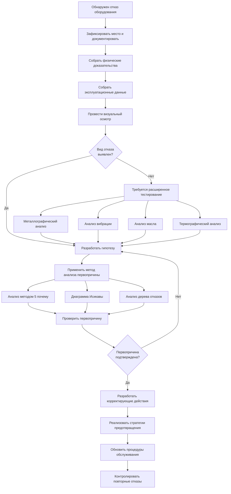

## Основы анализа отказов

Анализ отказов — это систематический процесс исследования отказов оборудования для определения первопричины, понимания механизмов отказа и внедрения корректирующих действий, которые предотвращают повторное возникновение. Эта дисциплина сочетает физическое обследование, анализ эксплуатационных данных и принципы инженерии надежности для максимизации времени безотказной работы и продления срока службы оборудования.

Основными целями являются определение видов отказов, установление цепочек причинно-следственных связей, количественная оценка воздействия отказов и разработка стратегий предотвращения. Надлежащий анализ отказов снижает повторные отказы на 60-80% и предоставляет критически важные данные для программ предиктивного обслуживания.

## Методологии анализа первопричины

### Метод 5 почему

Метод 5 почему определяет причинно-следственные связи путем многократного задания вопроса "почему" до достижения фундаментальной первопричины. Эта итеративная постановка вопросов выходит за рамки симптоматических проблем к базовым системным проблемам.

**Пример применения:**
1. Почему отказал компрессор? Двигатель перегрелся и заклинил
2. Почему двигатель перегрелся? Недостаточный поток охлаждающего воздуха
3. Почему поток воздуха был недостаточным? Катушка конденсатора забита мусором
4. Почему катушка забита? Не проводилось профилактическое обслуживание
5. Почему обслуживание не проводилось? Неадекватная система планирования обслуживания

### Диаграмма Исикавы (причина-следствие)

Этот анализ причины и следствия организует потенциальные причины отказа по категориям: методы, оборудование, материалы, измерения, окружающая среда и персонал. Каждое ответвление систематически исследует способствующие факторы.

**Основные категории:**
- **Оборудование**: конструктивные дефекты, дефекты материалов, механизмы износа
- **Операции**: неправильные процедуры, неправильные установки, неадекватное обучение
- **Окружающая среда**: экстремальные температуры, загрязнение, воздействие вибрации
- **Обслуживание**: отложенное обслуживание, неправильный ремонт, неадекватные проверки

### Анализ видов отказов и их последствий (FMEA)

FMEA — это структурированный подход, который оценивает потенциальные виды отказов, их последствия и критичность. Число приоритета риска (RPN) количественно определяет риск как:

**RPN = Серьезность × Вероятность возникновения × Способность обнаружения**

где каждый фактор оценивается от 1 до 10. Значения RPN выше 100 требуют немедленных корректирующих действий.

## Распространенные виды отказов HVAC

| Компонент | Вид отказа | Основные причины | Методы обнаружения | Стратегия предотвращения |
|-----------|-----------|------------------|-------------------|--------------------------|
| Компрессор | Механическое заклинивание | Отказ смазки, гидравлический удар жидкости, износ подшипников | Анализ вибрации, анализ масла, мониторинг силы тока | Тестирование качества масла, осушители жидкостной магистрали, аккумуляторы всасывания |
| Компрессор | Перегорание двигателя | Электрическая перегрузка, однофазный режим, высокая температура нагнетания | Тестирование сопротивления обмотки, тестирование изоляции | Мониторинг напряжения, тепловая защита, надлежащий выбор размера |
| Теплообменник | Утечка хладагента | Коррозия, эрозия, механическое напряжение, вибрация | Обнаружение утечек, испытание под давлением, ультразвуковой контроль | Обработка воды, изоляция от вибрации, снятие напряжения |
| Расширительный клапан | Колебания/нестабильность | Неправильный перегрев, загрязнение, неправильное расположение датчика | Измерение перегрева, анализ давления | Надлежащая установка, фильтрация, калибровка |
| Вентиляторный двигатель | Отказ подшипника | Неадекватная смазка, неправильное выравнивание, загрязнение | Анализ вибрации, мониторинг температуры, шумность | Плановая смазка, процедуры выравнивания, фильтрация |
| Цепь хладагента | Загрязнение системы | Влага, образование кислоты, загрязнение частицами | Тест на кислоту, измерение влажности, проверка осушителя | Надлежащая эвакуация, продувка азотом, контроль качества |
| Системы управления | Дрейф датчика | Потеря калибровки, воздействие окружающей среды, возраст | Проверка калибровки, сравнительные показания | Плановая калибровка, защита окружающей среды |
| Электрооборудование | Отказ контакта | Перегрев, дуговой разряд, загрязнение, механический износ | Сопротивление контакта, тепловизионное изображение, визуальный осмотр | Надлежащий выбор размера, спецификации крутящего момента, очистка |

## Принципы инженерии надежности

### Анализ кривой ванны

Показатели отказов оборудования следуют трем различным этапам:

1. **Младенческая смертность (0-6 месяцев)**: дефекты производства, ошибки установки, проблемы ввода в эксплуатацию
2. **Полезная жизнь (6 месяцев-15 лет)**: случайные отказы, стабильный коэффициент отказов, предсказуемые потребности в обслуживании
3. **Износ (>15 лет)**: возрастная деградация, усталость материала, устаревание компонентов

### Анализ Вейбулла

Распределение Вейбулла характеризует характеры отказов с помощью параметра формы β:
- **β < 1**: убывающий коэффициент отказов (младенческая смертность)
- **β = 1**: постоянный коэффициент отказов (случайные отказы)
- **β > 1**: возрастающий коэффициент отказов (износ)

Этот статистический подход прогнозирует оставшийся срок полезного использования и оптимизирует интервалы замены.

### Среднее время между отказами (MTBF)

MTBF = Общее время работы / Количество отказов

Для оборудования HVAC типичные значения MTBF:
- Компрессоры: 60 000-100 000 часов
- Вентиляторные двигатели: 40 000-80 000 часов
- Платы управления: 50 000-100 000 часов

## Сбор физических доказательств

**Критическая документация:**
- Условия эксплуатации в момент отказа (температуры, давления, электрические показания)
- История недавнего обслуживания и модификации
- Условия окружающей среды и воздействие загрязняющих веществ
- Показания свидетелей от операторов и техников

**Физическое обследование:**
- Разборка компонента с фотографической документацией
- Анализ характера износа и измерения размеров
- Отбор проб материалов для лабораторного анализа
- Обследование поверхности излома для определения механизма отказа

## Разработка корректирующих действий

Эффективные корректирующие действия устраняют первопричины через:

1. **Конструктивные модификации**: модернизация компонентов, изменение спецификаций, замена материалов
2. **Улучшение процедур**: улучшенные процедуры обслуживания, обучение операторов, протоколы проверки
3. **Оптимизация системы**: корректировка параметров эксплуатации, уточнение логики управления, балансировка нагрузки
4. **Повышение качества**: квалификация поставщиков, стандарты установки, проверка ввода в эксплуатацию

Эффективность корректирующих действий измеряется снижением коэффициента отказов и расширением интервалов обслуживания. Надлежащее выполненный анализ отказов с комплексными корректирующими действиями достигает улучшения на 5-10 лет в отношении ожидаемого срока службы компонента.

## Компоненты

- Анализ первопричины
- Анализ видов отказов и их последствий FMEA
- Металлографический анализ
- Анализ отказов компрессора
- Анализ отказов двигателя
- Анализ отказов подшипника
- Анализ коррозии
- Анализ эрозии
