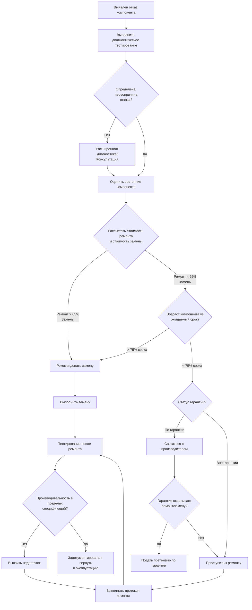

## Обзор

Ремонт систем представляет собой корректирующие действия по техническому обслуживанию, предпринимаемые для восстановления неисправных или деградированных компонентов HVAC в рабочее состояние. Эффективные протоколы ремонта требуют диагностической точности, соблюдения спецификаций производителя и систематической оценки целесообразности ремонта в сравнении с заменой компонента. В этом разделе рассматриваются процедуры ремонта критических элементов системы и устанавливаются критерии решения, основанные на экономической целесообразности, остаточном сроке службы и надежности системы.

## Рабочий процесс принятия решения о ремонте

Следующая схема принятия решений направляет технических специалистов через процесс оценки от выявления отказа до завершения ремонта или замены компонента.

## Ремонт утечек хладагента

Ремонт утечек хладагента требует соблюдения положений EPA Section 608 и спецификаций производителя. Все ремонты утечек должны быть проверены методами обнаружения утечек с чувствительностью минимум 0,5 унции в год.

### Методы определения местоположения утечек

- **Электронное обнаружение утечек**: датчики диодов с подогревом или инфракрасные датчики (чувствительность 0,1 унции в год)
- **Внедрение флуоресцентного красителя**: УФ-реактивный краситель с циркуляцией минимум 24 часа
- **Тестирование мыльным раствором**: для доступных фитингов и соединений
- **Тестирование давлением азотом**: испытание под давлением 1034 кПа для паяных соединений, 2068 кПа для высокопроизводительных систем

### Процедуры ремонта по местоположению

**Утечки паяных соединений:**
1. Извлечь хладагент до нулевого показания манометра
2. Продуть участок линии сухим азотом под давлением 14-34 кПа во время пайки
3. Очистить площадь соединения, удалить окисную пленку
4. Применить припой 15% серебра (BCuP-5) или припой, указанный производителем
5. Нагреть соединение равномерно до 649-760°C, нанести припой с противоположной стороны от источника тепла
6. Дать естественно остыть, проверить проплавку соединения
7. Испытание давлением азотом до 1,5× рабочего давления, выдержать 24 часа
8. Откачать до 500 микрон, зарядить и проверить на утечки

**Утечки механических фитингов:**
1. Изолировать компонент сервисными вентилями, если возможно
2. Извлечь хладагент из поврежденного участка
3. Разобрать фитинг, проверить поверхности развальцовки или компрессии
4. Заменить поврежденные компоненты (гайки развальцовки, ферулы, кольца уплотнения)
5. Собрать заново с соблюдением моментов затяжки производителя
6. Испытать давлением и откачать перед зарядкой

**Утечки в трубках катушек (незначительные):**
Для небольших отверстий в участках трубок, не находящихся под высоким давлением, эпоксидные компаунды для ремонта, рассчитанные на работу с хладагентом, могут обеспечить временный ремонт. Постоянный ремонт требует замены трубки или замены катушки в соответствии с рекомендациями производителя.

## Ремонт и герметизация системы воздуховодов

Утечка воздуховодов напрямую влияет на эффективность и производительность системы. Стандарт ASHRAE 90.1 требует тестирования герметичности воздуховодов для систем, превышающих 8475 CFM (14,4 м³/ч), с максимально допустимой утечкой 6% от расхода воздуха системы при рабочем давлении.

### Классификация проблем с воздуховодом

| Проблема воздуховода | Метод ремонта | Стандарт материала | Применение |
|-------------|---------------|-------------------|-------------|
| Разделение продольного шва | Мастика + армирующая сетка | UL 181A или 181B | Все типы швов |
| Утечка поперечного соединения | Мастика над соединением, резервная клейкая лента | ASTM C1071 мастика | Низкоскоростные системы < 762 м/с |
| Прокол/разрыв < 76 мм | Металлическая заплата + герметик мастикой | минимум 0,6 мм, материал как у воздуховода | Армированные области |
| Прокол/разрыв > 76 мм | Заменить участок воздуховода | В соответствии с исходной спецификацией | Требуется структурная целостность |
| Разделение соединительного патрубка | Стяжной ремень + мастика | Полоса из нержавеющей стали | Соединения патрубок-воротник |

### Протокол герметизации

1. **Подготовка поверхности**: Удалить пыль, масло и рыхлый материал проволочной щеткой или растворителем
2. **Нанесение мастики**: Нанести минимальную толщину влажного слоя 3,2 мм, расширить на 51 мм за область ремонта
3. **Армирование**: Вдавить стеклотканевую сетку в мастику для зазоров > 6,4 мм
4. **Отверждение**: Дать время отверждения согласно спецификации производителя перед давлением
5. **Проверка**: Тестирование воздуховодным вентилятором или визуальная проверка при рабочем давлении

**Критически важно**: Тканевая клейкая лента для воздуховодов не является приемлемым долгосрочным материалом для ремонта согласно исследованиям SMACNA и ASHRAE, показывающим 80% отказов в течение 5 лет.

## Ремонт системы управления и электропроводки

Отказы системы управления составляют приблизительно 35% вызовов сервиса HVAC. Систематическая диагностика и ремонт цепей управления требуют картирования напряжения и проверки последовательности.

### Ремонт низковольтного управления (системы 24V)

**Общие точки отказа:**
- Разрыв вторичной обмотки трансформатора (протестировать мультиметром, заменить если < 22V на выходе)
- Компенсатор терморегулятора вышел из калибровки (отрегулировать в соответствии с силой тока цепи управления)
- Выгорание катушки реле (измерить сопротивление катушки, типично 200-500Ω для катушек 24V)
- Окисление клемм проводки (очистить клеммы, применить диэлектрическую смазку)

**Последовательность ремонта:**
1. Отключить питание системы на отключателе
2. Измерить напряжение на выходе трансформатора (22-28VAC приемлемо)
3. Измерить напряжение в каждом устройстве управления с вызовом терморегулятора
4. Определить местоположение падения напряжения (> 1V падение указывает на проблему сопротивления)
5. Отремонтировать или заменить неисправный компонент
6. Проверить работу последовательности управления через полный цикл

### Ремонт сетевого напряжения (системы 120/240V)

Все ремонты сетевого напряжения должны соответствовать статье 440 NEC для цепей двигателей. Использовать проводники с надлежащим рейтингом согласно таблице 310.16 NEC и защиту от перегрузки по току согласно спецификациям паспорта оборудования.

**Ремонт контактора/реле:**
- Проверить поверхности контактов на ямы или отложения углерода
- Заменить контакты, если глубина ямы > 0,8 мм
- Проверить напряжение катушки соответствует напряжению системы ±10%
- Протестировать сопротивление контакта в замкнутом состоянии (должно быть < 0,1Ω)

## Критерии выбора между ремонтом и заменой

Следующая таблица содержит рекомендации по оценке целесообразности ремонта на основе типа компонента, возраста и режима отказа.

| Компонент | Пороговый возраст | Ремонт благоприятен если | Замена благоприятна если |
|-----------|---------------|---------------------|----------------------|
| Компрессор (жилой) | 10 лет | Возраст < 7 лет, единичный отказ, герметичная система | Возраст > 10 лет, выгорание, или множественные отказы |
| Компрессор (коммерческий) | 15 лет | Возраст < 12 лет, механический отказ, покрытие гарантией | Выгорание, нарушение герметичного уплотнения, эффективность < 80% номинальной |
| Вентилятор воздухообработчика | 15 лет | Только замена двигателя, корпус целый | Ржавчина/повреждение шкафа, множественные отказы подшипников |
| Теплообменник (печь) | 20 лет | Небольшая трещина, сегментированная конструкция позволяет замену секции | Сквозная трещина с риском CO, возраст > 15 лет |
| Испаритель (катушка) | 15 лет | Устранимое место утечки, возраст < 10 лет, без коррозии | Внутренняя утечка, повреждение коррозией, возраст > 12 лет |
| Конденсатор (катушка) | 15 лет | Внешнее повреждение трубки, доступное для ремонта | Внутренняя утечка галереи, деградация ребер > 30% |
| Расширительный клапан | 20 лет | Устранимый/очищаемый, калибровочный дрейф | Застревание, внутренние отложения, нарушение колбы датчика |
| Участок воздуховода | 30 лет | Изолированное повреждение, доступное местоположение | Асбестовая изоляция, > 40% повреждение поверхности, смятие |

**Формула экономического анализа:**

Коэффициент стоимости ремонта = (Стоимость ремонта + Текущая стоимость пониженной надежности) / Стоимость замены

- Коэффициент < 0,50: Ремонт явно благоприятен
- Коэффициент 0,50-0,65: Ремонт приемлем, рассмотрите возраст компонента
- Коэффициент > 0,65: Замена благоприятна

Текущая стоимость пониженной надежности оценивается как 15% от стоимости замены для компонентов, превышающих 75% срока службы.

## Отраслевые стандарты и справочные материалы

Процедуры ремонта должны соответствовать:

- **ASHRAE Standard 180**: Стандартная практика проверки и обслуживания коммерческих систем HVAC
- **RSES Technical Manual**: Service Application Manual (SAM) для систем с хладагентом
- **SMACNA HVAC Systems Duct Design**: Глава 7, Конструкция и ремонт воздуховодов
- **EPA Section 608**: Требования по обращению с хладагентом и ремонту утечек
- **NEC Article 440**: Электрические стандарты для оборудования кондиционирования воздуха и холодильного оборудования
- **Технические бюллетени производителя**: Процедуры ремонта для конкретных компонентов и требования гарантии

## Требования к документированию

Все ремонты требуют документирования, включая:

- Описание режима отказа и анализ первопричины
- Выполненная процедура ремонта со спецификациями материалов
- Измерения производительности до и после ремонта
- Информация о гарантии и отслеживаемость деталей
- Авторизация возврата в эксплуатацию с результатами тестирования

Комплексные записи о ремонте позволяют анализировать тенденции для улучшения надежности и поддержку претензий по гарантии, если применимо.
