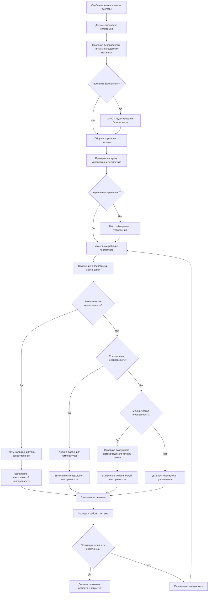

## Систематическая методология поиска неисправностей

Эффективный поиск неисправностей в системах HVAC следует структурированному подходу, который минимизирует время диагностики при максимизации точности. Методология развивается от идентификации симптомов через анализ коренных причин к проверенному ремонту.

### Пятиэтапный диагностический процесс

1. **Документирование симптомов**: Записывайте все наблюдаемые аномалии, включая отклонения температуры, показания давления, необычные звуки, запахи и реакции управления. Соберите историю эксплуатации у пользователей или из систем управления зданием.

2. **Проверка информации о системе**: Изучите паспортные данные, последовательность операций, электрические схемы и последние записи о техническом обслуживании. Проверьте условия проектирования и сравните их с фактическими рабочими параметрами.

3. **Формирование гипотез**: Разработайте потенциальные теории отказов на основе симптомов и знаний о системе. Расставьте приоритеты гипотез по вероятности, учитывая распространённые отказы и недавние изменения.

4. **Систематическое тестирование**: Выполняйте диагностические тесты в логической последовательности, начиная с простых наблюдений и переходя к инструментальным измерениям. Методично исключайте гипотезы.

5. **Проверка коренной причины**: Подтвердите, что идентифицированный отказ объясняет все симптомы. Убедитесь, что ремонт разрешает проблему без создания вторичных проблем.

## Диагностический рабочий процесс

## Поиск неисправностей в холодильной системе

Диагностика холодильного контура основывается на отношениях давление-температура и анализе перегрева/переохлаждения. Холодильный цикл обеспечивает определяющие индикаторы здоровья системы.

### Критические измерения

- **Давление/температура на всасывании**: Указывает на производительность испарителя и заряд хладагента
- **Давление/температура на нагнетании**: Отражает производительность конденсатора и эффективность сжатия
- **Перегрев**: Температура всасывания минус температура насыщения при давлении всасывания (целевой показатель: 4,4-6,7°C для неподвижного отверстия, 3,3-5,6°C для TXV)
- **Переохлаждение**: Температура насыщения при давлении нагнетания минус температура линии жидкого хладагента (целевой показатель: 5,6-8,3°C)

| Симптом | Вероятная причина | Диагностический тест | Решение |
|---------|---------------|-----------------|--------|
| Низкое давление всасывания, высокий перегрев | Недостаточный заряд хладагента | Проверка переохлаждения, осмотр на утечки | Ремонт утечки, перезарядка системы |
| Высокое давление всасывания, низкий перегрев | Избыточный заряд или TXV заклинена открытым | Измерение переохлаждения, проверка TXV | Восстановление избыточного заряда, замена TXV |
| Высокое давление нагнетания | Загрязнение конденсатора, ограничение воздушного потока, избыток заряда | Проверка воздушного потока конденсатора, измерение переохлаждения | Очистка катушки, проверка вентилятора, регулировка заряда |
| Низкое давление нагнетания | Неэффективность компрессора, недостаточный заряд | Степень сжатия, ток потребления | Замена компрессора, перезарядка |
| Нормальное давление, недостаточная производительность | Ограничение воздушного потока, загрязнение катушки | Измерение воздушного потока, разность температур | Очистка катушек, проверка вентилятора |

## Поиск неисправностей электрической системы

Электрическая диагностика следует систематическим измерениям напряжения, тока и сопротивления через цепь управления и силовую цепь. Всегда проверяйте напряжение питания перед тестированием компонентов.

### Последовательность электрической диагностики

1. Проверьте напряжение питания на разъединителе (208 В/230 В/460 В ±10%)
2. Проверьте выход трансформатора управления (24 В переменного тока ±10%)
3. Проследите напряжение цепи управления через устройства безопасности и термостат
4. Измерьте напряжение катушки контактора при вызове операции
5. Проверьте напряжение силовой цепи на выводах компонентов при включении
6. Измерьте рабочий ток и сравните с номинальными значениями в паспорте
7. Выполните тесты сопротивления на обесточенных компонентах

| Симптом | Вероятная причина | Диагностический тест | Решение |
|---------|---------------|-----------------|--------|
| Нет питания в системе | Разъединитель открыт, автомат сработал, предохранитель перегорел | Напряжение на разъединителе, проверка целостности | Сброс автомата, замена предохранителя, исследование причины перегрузки |
| Контактор не включается | Цепь управления разомкнута, неисправность термостата, отказ устройства безопасности | Проследить 24 В переменного тока через цепь | Замена неисправного компонента, сброс устройства безопасности |
| Компрессор не запускается | Неисправный контактор, тепловая перегрузка двигателя, заклиненный ротор | Напряжение на компрессоре, измерение сопротивления | Замена контактора, проверка обмоток двигателя, проверка вращения |
| Высокий ток потребления | Дисбаланс напряжения, отказывающий двигатель, механическое заклинивание | Падение напряжения между фазами, измерение всех фаз | Коррекция источника питания, замена двигателя, освобождение механизма |
| Прерывистая работа | Слабое соединение, отказывающий компонент, тепловая проблема | Тест падения напряжения, тепловизионная съёмка | Затяжка соединений, замена отказывающего компонента |

## Поиск неисправностей механической системы

Механические отказы влияют на воздушный и водяной потоки, прямо воздействуя на производительность теплопередачи. Механическая диагностика сосредоточена на движении жидкостей и целостности компонентов.

| Симптом | Вероятная причина | Диагностический тест | Решение |
|---------|---------------|-----------------|--------|
| Низкий воздушный поток | Загрязнённый фильтр, отказ вентилятора, ограничение воздуховода | Измерение статического давления, проверка оборотов | Замена фильтра, проверка ремня/двигателя, осмотр воздуховодов |
| Чрезмерный шум | Отказ подшипника, ослабленный компонент, резонанс | Выявление источника, анализ вибрации | Замена подшипников, закрепление компонентов, добавление демпфирования |
| Проблемы с водяным потоком | Отказ насоса, положение клапана, засорение сетки | Измерение дифференциального давления, расход | Ремонт насоса, позиционирование клапанов, очистка сетки |
| Пробуксовка ремня | Неправильное натяжение, неправильная центровка, изношенный ремень | Проверка натяжения, визуальная центровка | Регулировка натяжения, центровка шкивов, замена ремня |

## Диагностика системы управления

Современные системы HVAC управления интегрируют датчики, контроллеры и исполнительные механизмы в сложные последовательности. Диагностика управления проверяет точность датчика, логику контроллера и ответ исполнительного механизма.

### Протокол проверки датчиков

- Сравните показания датчика с измерением калибровочного инструмента (±1,1°C для температуры, ±3% для относительной влажности, ±2% для давления)
- Проверьте целостность проводки датчика и надлежащее подключение
- Проверьте напряжение питания датчика
- Замените датчики, превышающие допуск калибровки

### Тестирование исполнительных механизмов

- Проверьте сигнал управления на выводах исполнительного механизма (0-10 В постоянного тока, 2-10 В постоянного тока, 4-20 мА)
- Подтвердите, что механический ход совпадает с сигналом управления
- Проверьте на заклинивание или препятствия в заслонках и клапанах
- Измерьте потребление энергии исполнительным механизмом

## Отраслевые справочные стандарты

ASHRAE Guideline 3-2018 обеспечивает комплексные протоколы наладки и тестирования. Руководства производителя по поиску неисправностей содержат специфичные для модели диагностические процедуры, коды неисправностей и спецификации компонентов. Обращайтесь к этим документам для специфичной для оборудования диагностики, выходящей за рамки общих принципов поиска неисправностей.
