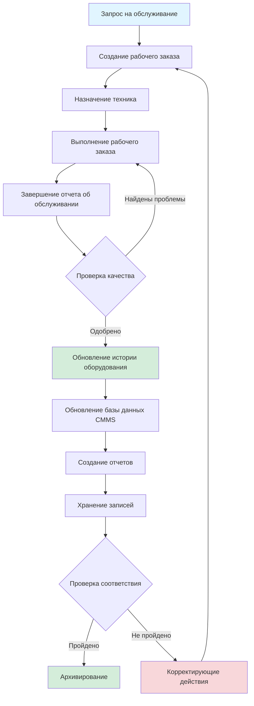

Эффективная документация технического обслуживания формирует операционную основу любой профессиональной программы управления системами HVAC. Надлежащее ведение записей обеспечивает соответствие нормативным требованиям, оптимизирует производительность оборудования, поддерживает претензии по гарантии и предоставляет критические данные для анализа стоимости жизненного цикла.

## Рабочий процесс документирования

## Требуемые типы документации

| Категория документации | Период сохранения | Нормативное требование | Частота обновления |
|------------------------|------------------|------------------------|------------------|
| Записи об установке оборудования | Весь срок службы оборудования | IMC, Местные нормативы | При установке |
| Отчеты о предупредительном обслуживании | 3-7 лет | ASHRAE 180, Строительные нормативы | По графику ТО |
| Записи хладагента (EPA 608) | Минимум 3 года | EPA Раздел 608 | При каждом обслуживании |
| Сертификаты калибровки | Минимум 1 год | ASHRAE 180 | Ежегодно |
| Рабочие заказы на обслуживание | 3-7 лет | Требования контракта | При каждом вызове |
| Данные фирменной таблички оборудования | Весь срок службы оборудования | Гарантия производителя | При установке |
| Чертежи в исходном виде | Весь срок службы здания | Строительные нормативы | При крупных изменениях |
| Отчеты о качестве воздуха в помещениях | Минимум 3 года | ASHRAE 62.1 | По графику тестирования |
| Записи об аварийном ремонте | Минимум 5 лет | Требования страховки | При каждом чрезвычайном событии |
| Данные о производительности по энергии | Текущие | ASHRAE 90.1, Нормативы энергопотребления | Ежемесячно/ежеквартально |

## Компьютеризованные системы управления техническим обслуживанием

Платформы CMMS централизуют все виды деятельности по техническому обслуживанию в единую базу данных, обеспечивая принятие решений на основе данных и автоматизированное отслеживание соответствия.

### Основные функции CMMS

**Управление активами**
- Инвентарь оборудования с уникальными идентификаторами
- Иерархическая структура местоположения (кампус → здание → этаж → комната → оборудование)
- Хранение данных фирменной таблички (модель, серийный номер, тип хладагента, производительность)
- Отслеживание даты установки и истечения гарантии
- Классификация критичности оборудования

**Управление рабочими заказами**
- Автоматическое создание рабочих заказов из графиков ТО
- Распределение по приоритетам (аварийные, срочные, плановые, отложенные)
- Отслеживание назначения техника и статуса в реальном времени
- Мобильный доступ для завершения работ в полевых условиях
- Отслеживание плановых и фактических часов труда

**Планирование предупредительного обслуживания**
- Календарные триггеры (еженедельно, ежемесячно, ежеквартально, ежегодно)
- Триггеры по счетчику (часы работы, количество циклов)
- Триггеры по условиям (пороги вибрации, перепады температуры)
- Автоматическое создание списков задач с пошаговыми процедурами
- Прогнозирование потребности в запасных частях

**Контроль запасов**
- Каталог запасных частей, связанный с записями об оборудовании
- Автоматические уведомления о точке переупорядочения
- Отслеживание использования по оборудованию и рабочему заказу
- Управление поставщиками и история цен
- Идентификация критических запасных частей

## Компоненты рабочего заказа

Каждый рабочий заказ должен содержать стандартизированную информацию для обеспечения отслеживаемости и полноты.

### Обязательные поля рабочего заказа

| Поле | Назначение | Тип данных |
|-------|---------|-----------|
| Номер рабочего заказа | Уникальный идентификатор | Автоматически создаваемый последовательный номер |
| ID оборудования | Ссылка на актив | Буквенно-цифровой код |
| Дата/время создания | Метка времени запроса | Отметка даты/времени |
| Уровень приоритета | Распределение ресурсов | Аварийный/Срочный/Плановый |
| Назначенный техник | Ответственность | ID сотрудника |
| Часы труда | Отслеживание затрат | Десятичные часы |
| Используемые детали | Контроль запасов | Номера деталей и количество |
| Описание проблемы | Документирование проблемы | Свободный текст (обязательно) |
| Выполненные работы | Запись об обслуживании | Свободный текст (обязательно) |
| Результаты тестирования | Проверка производительности | Измерения с единицами |
| Подпись клиента | Принятие | Цифровая/физическая подпись |

## Требования к отчетам об обслуживании

Отчеты об обслуживании преобразуют необработанные данные рабочих заказов в практически полезную документацию для заинтересованных сторон.

### Минимальные элементы отчета об обслуживании

1. **Идентификация оборудования**
   - Производитель, модель, серийный номер
   - Местоположение (здание, этаж, комната)
   - Тег оборудования или номер актива

2. **Условия работы системы**
   - Давления хладагента (всасывание, нагнетание)
   - Температуры (возвратный воздух, подаваемый воздух, наружный воздух)
   - Электрические измерения (напряжение, ток, небаланс фаз)
   - Измерения расхода воздуха (CFM или м³/ч)
   - Уставки управления и фактические значения

3. **Выполненные работы по техническому обслуживанию**
   - Замена фильтра (размер, рейтинг MERV, состояние)
   - Очистка катушки (метод, используемое химическое вещество)
   - Регулировка ремня (измеренное натяжение, оценка состояния)
   - Добавленный хладагент (тип, количество, причина потери)
   - Выполненные калибровки (тип датчика, проверка допуска)

4. **Выводы и рекомендации**
   - Отмеченные недостатки (оценка критичности)
   - Выявленные опасности безопасности
   - Возможности повышения эффективности
   - Смета затрат на ремонт и срочность
   - Пункты последующих действий

5. **Документирование соответствия**
   - Количество восстановленного хладагента (требование EPA 608)
   - Результаты обнаружения утечек для систем с зарядом >22,7 кг
   - Результаты тестирования обработки воды для градирен
   - Коэффициенты эффективности фильтра (ASHRAE 52.2 или ISO 16890)

## Записи об истории оборудования

История оборудования обеспечивает возможность анализа тенденций и поддерживает решения о замене на основе данных.

### Критические исторические точки данных

**Показатели производительности во времени**
- Потребление энергии (кВч или эквивалент природного газа)
- Коэффициент эффективности (EER, SEER, COP)
- Деградация производительности (% от номинальной)
- Часы работы и циклы пуск/остановка
- Точность управления температурой и влажностью

**Отслеживание затрат на техническое обслуживание**
- Трудозатраты по типам рабочих заказов
- Стоимость запасных частей по компонентам
- Соотношение аварийного и планового обслуживания
- Совокупная стоимость обслуживания в сравнении со стоимостью замены
- Среднее время между отказами (MTBF)

**Показатели надежности**
- Количество вызовов обслуживания в год
- Часы непредвиденного простоя
- Частота повторных отказов
- История претензий по гарантии
- Даты замены критических компонентов (компрессор, теплообменник)

## Записи соответствия нормативным требованиям

Определенные виды деятельности по техническому обслуживанию HVAC требуют документирования для соответствия федеральным, государственным и местным нормативам.

### Требования EPA Раздел 608

Записи об управлении хладагентом должны включать:
- Дату обслуживания
- Идентификацию оборудования
- Тип и количество добавленного хладагента
- Восстановленный хладагент и метод переработки
- Номер сертификации техника
- Расчет скорости утечки для систем с зарядом >22,7 кг
- Корректирующие действия при скорости утечки, превышающей пороги (10% коммерческие, 35% промышленные, 35% комфортное охлаждение)

Учреждения должны хранить эти записи в течение **минимум трех лет** и предоставлять их при проверке EPA.

### Стандарты документирования ASHRAE 180

Стандарт ASHRAE 180 (Стандартная практика проверки и технического обслуживания коммерческих систем HVAC зданий) предписывает конкретные методы документирования:
- Записи о завершении задач ТО с датой и подписью техника
- Отчеты о недостатках с графиками корректирующих действий
- Тенденции производительности системы (температура, давление, эффективность)
- Результаты мониторинга качества воздуха в помещениях
- Записи об калибровке устройств измерения и управления

## Лучшие практики цифровой документации

**Облачное хранилище**
- Автоматическое резервное копирование с географической избыточностью
- Контроль версий для редакций документов
- Контроль доступа по роли пользователя
- Совместимость с мобильными устройствами для полевого доступа

**Стандартизация данных**
- Контролируемый словарь для кодов проблем
- Стандартизированные единицы измерения
- Раскрывающиеся меню для снижения ошибок ввода свободного текста
- Обязательные поля, проверяемые при вводе данных

**Возможности интеграции**
- Импорт данных из системы управления зданием (BAS)
- Данные тенденций системы управления энергией (EMS)
- Экспорт стоимости рабочего заказа в систему учета
- Подачи данных алгоритмов предиктивного обслуживания

**Журнал аудита**
- Кто создал/изменил каждую запись
- Временная метка для всех записей данных
- История изменений для критических полей
- Соответствие электронной подписи (21 CFR Часть 11 для регулируемых отраслей)

## Стратегия внедрения

Переход к комплексной документации технического обслуживания требует систематического планирования:

1. **Провести инвентарное описание всего существующего оборудования** с уникальными тегами активов
2. **Оцифровать исторические записи** для получения базовых данных о производительности
3. **Разработать стандартизированные процедуры** для каждого типа оборудования
4. **Провести обучение техников** требованиям к документированию и мобильным инструментам
5. **Установить KPI** (процент завершения рабочего заказа, процент соответствия ТО)
6. **Проводить регулярные аудиты** для обеспечения качества и полноты данных
