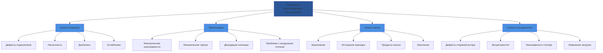

# Прогнозирующее обслуживание систем HVAC

Прогнозирующее обслуживание (PdM) использует технологии мониторинга состояния для выявления зарождающихся отказов до того, как они приведут к простою оборудования. В отличие от реактивных или профилактических стратегий, PdM использует измерения на основе физических законов для оценки фактического состояния оборудования и прогнозирования остаточного полезного срока службы.

## Анализ вибрации

Мониторинг вибрации обнаруживает механическую деградацию вращающегося оборудования, включая компрессоры, двигатели, насосы и вентиляторы. Измерения ускорения, скорости и перемещения выявляют износ подшипников, несоосность, дисбаланс и ослабление креплений.

### Стандарты интенсивности вибрации

ISO 10816 определяет зоны интенсивности вибрации для вращающегося оборудования:

| Зона | Скорость RMS (мм/с) | Состояние | Действие |
|------|---------------------|-----------|--------|
| A | 0-2.3 | Новое/отличное | Нормальная работа |
| B | 2.3-7.1 | Приемлемое | Мониторинг |
| C | 7.1-11.2 | Неудовлетворительное | Планирование ремонта |
| D | >11.2 | Неудовлетворительное | Немедленная остановка |

Скорость среднеквадратичного отклонения (RMS) служит общим индикатором интенсивности:

$$v_{RMS} = \sqrt{\frac{1}{T}\int_0^T v(t)^2 \, dt}$$

Где:
- $v_{RMS}$ = скорость RMS (мм/с)
- $v(t)$ = мгновенная скорость
- $T$ = период измерения

### Прогнозирование срока службы подшипников

Срок службы подшипников качения следует модели ISO 281:

$$L_{10} = \left(\frac{C}{P}\right)^p \times 10^6 \text{ оборотов}$$

Перевод в рабочие часы:

$$L_{10h} = \frac{10^6}{60n} \left(\frac{C}{P}\right)^p$$

Где:
- $L_{10h}$ = номинальный срок службы (часы при надежности 90%)
- $C$ = базовая динамическая грузоподъемность (Н)
- $P$ = эквивалентная динамическая нагрузка (Н)
- $n$ = скорость вращения (об/мин)
- $p$ = 3 для шариковых подшипников, 10/3 для роликовых

## Инфракрасная термография

Тепловизоры обнаруживают температурные аномалии, указывающие на электрические неисправности, механическое трение, деградацию изоляции и ограничения воздушного потока. Разности температур между фазами или аналогичными компонентами выявляют развивающиеся проблемы.

### Критические разности температур

| Компонент | Порог ΔT | Указываемая неисправность |
|-----------|--------------|-----------------|
| Электрические соединения | >10°C | Контакт с высоким сопротивлением |
| Обмотки двигателя (фаза-фаза) | >5°C | Дисбаланс, отказ изоляции |
| Выход компрессора | >15°C выше проектного | Утечка клапана, переполнение |
| Испарительная катушка | >8°C по поверхности | Ограничение воздушного потока, иней |

Анализ теплопередачи количественно оценивает тепловые аномалии:

$$Q = hA\Delta T$$

Где:
- $Q$ = скорость теплопередачи (Вт)
- $h$ = коэффициент конвективной теплопередачи (Вт/м²·К)
- $A$ = площадь поверхности (м²)
- $\Delta T$ = разность температур (К)

## Анализ масла

Мониторинг состояния смазочного материала обнаруживает загрязнение, истощение присадок и накопление продуктов износа. Ключевые параметры включают вязкость, кислотное число, количество частиц и элементный анализ.

### Предельные значения для анализа масла

| Параметр | Норма | Внимание | Критическое |
|-----------|--------|---------|----------|
| Изменение вязкости | ±10% | ±15% | ±25% |
| Общее кислотное число (мг КОН/г) | <2.0 | 2.0-4.0 | >4.0 |
| Содержание воды (ppm) | <200 | 200-500 | >500 |
| Железо (ppm) | <50 | 50-100 | >100 |
| Код ISO количества частиц | <16/14/11 | 16/14/11-18/16/13 | >18/16/13 |

## Анализ сигнатуры тока двигателя

Анализ сигнатуры тока двигателя (MCSA) обнаруживает электрические и механические неисправности путем анализа гармоник и боковых полос токовой волны. Обрывы стержней ротора, эксцентриситет и неисправности подшипников генерируют характерные частотные компоненты.

Частота скольжения для асинхронных двигателей:

$$f_{slip} = f_{line} \times \frac{n_{sync} - n_{actual}}{n_{sync}}$$

Где:
- $f_{slip}$ = частота скольжения (Гц)
- $f_{line}$ = частота сети (Гц)
- $n_{sync}$ = синхронная скорость (об/мин)
- $n_{actual}$ = фактическая скорость ротора (об/мин)

Обрывы стержней ротора создают боковые полосы на частотах:

$$f_{sideband} = f_{line}(1 \pm 2sf)$$

Где $s$ = относительное скольжение.

## Сравнение технологий мониторинга состояния

## Матрица выбора технологий

| Технология | Возможности обнаружения | Стоимость | Сложность | Частота | Применимость оборудования |
|------|-------------------|----|------|------|------|
| Вибрационный анализ | Механические неисправности | Высокая | Высокая | Ежемесячно | Вращающееся оборудование |
| Тепловидение | Тепловые/электрические неисправности | Средняя | Низкая | Ежеквартально | Все электрическое/механическое оборудование |
| Анализ масла | Состояние смазки и износ | Средняя | Средняя | Ежеквартально | Компрессоры, редукторы |
| Анализ тока двигателя | Неисправности двигателя/привода | Низкая | Высокая | Непрерывно | Двигатели, ЧРП |

## Стратегия внедрения

1. **Установление базовых показателей**: Измерение параметров в период ввода в эксплуатацию, когда оборудование находится в исправном состоянии
2. **Анализ трендов**: Отслеживание измерений во времени для выявления темпов деградации
3. **Настройка порогов сигнализации**: Установление предельных значений осторожности и критических на основе данных производителя и стандартов ISO
4. **Протоколы действий**: Определение процедур реагирования для каждого условия сигнализации
5. **Оценка остаточного полезного срока службы**: Использование моделей на основе физических принципов для прогнозирования времени отказа

## Экономическое обоснование

Соотношение затрат и выгод при прогнозирующем обслуживании:

$$ROI = \frac{(C_{reactive} - C_{predictive})}{C_{predictive}} \times 100\%$$

Где:
- $C_{reactive}$ = годовые затраты на реактивное обслуживание (простои + ремонт)
- $C_{predictive}$ = годовые затраты на программу прогнозирующего обслуживания (оборудование + трудозатраты)

Исследования показывают, что прогнозирующее обслуживание снижает затраты на обслуживание на 25–30% и устраняет 70–75% непредвиденных отказов оборудования по сравнению с реактивными стратегиями.

Эффективные программы прогнозирующего обслуживания переводят решения по обслуживанию от плановых по времени к плановым по состоянию, максимизируя доступность оборудования при минимизации общих затрат на жизненный цикл.
