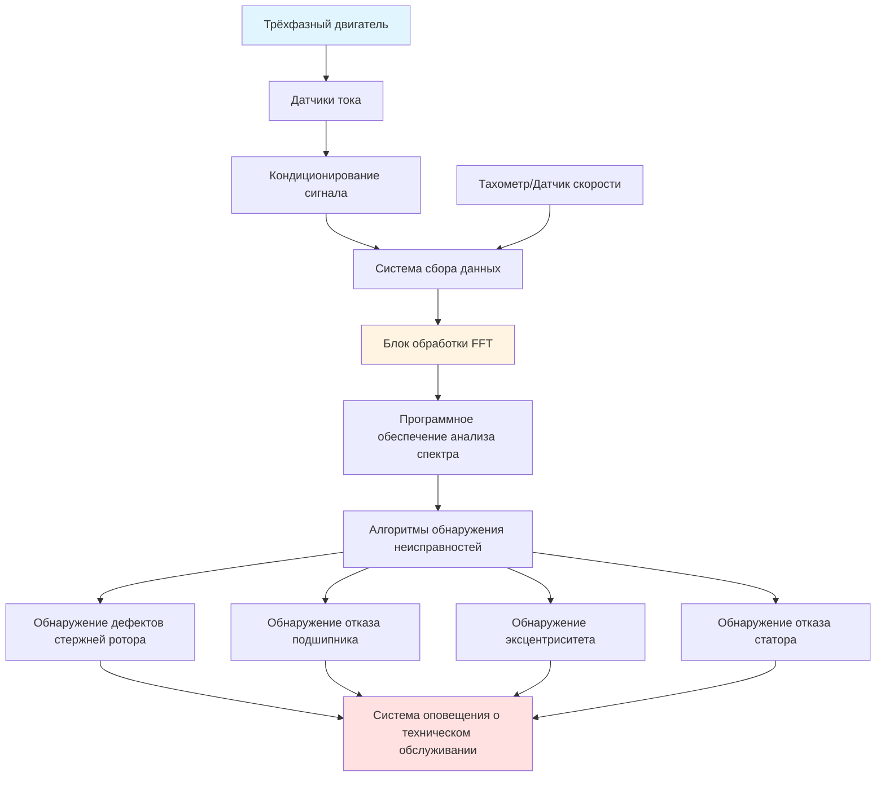

## Обзор анализа сигнатуры тока двигателя

Анализ сигнатуры тока двигателя (MCSA) — это неинвазивный метод предиктивного технического обслуживания, который обнаруживает механические и электрические неисправности в двигателях HVAC путем анализа спектрального содержимого тока статора. Этот метод контролирует двигатели в условиях нормальной работы без необходимости их остановки, что делает его идеальным для критического оборудования HVAC, включая компрессоры, вентиляторы и насосы.

MCSA работает на фундаментальном принципе, что механические и электрические неисправности модулируют ток статора, создавая характерные компоненты частоты в спектре тока. Быстрое преобразование Фурье (FFT) преобразует временной сигнал тока в частотный спектр, раскрывая специфичные для неисправности закономерности частот, которые невидимы при анализе во временной области.

## Физические принципы анализа сигнатуры тока

Неисправности двигателя создают асимметрии в распределении магнитного поля в воздушном зазоре. Эти асимметрии создают пульсации момента, которые модулируют ток статора на определенных частотах, связанных со скоростью ротора, числом полюсов и типом неисправности. Связь между механическими неисправностями и электрическими сигнатурами вытекает из взаимодействия между вращающимся магнитным полем и неправильностями ротора.

Когда стержни ротора трескаются или ломаются, они создают локальные изменения в сопротивлении и индуктивности ротора. Эти изменения вращаются вместе с ротором, наводя боковые полосы частот в спектре тока статора на частотах:

f_rb = f_e × (1 ± 2sk)

Где f_e — частота электросети, s — проскальзывание, k = 1, 2, 3... Основные боковые полосы (k=1) появляются на частотах немного выше и ниже линейной частоты, с амплитудой, пропорциональной степени тяжести неисправности.

## Конфигурация системы измерения MCSA

## Закономерности частот неисправностей

| Тип неисправности | Характерная частота | Формула | Типовой порог амплитуды |
|------------|-------------------------|---------|---------------------------|
| Сломанные стержни ротора | Боковые полосы линейной частоты | f_e(1 ± 2sk) | >-50 дБ ниже основной гармоники |
| Наружное кольцо подшипника | BPFO | n/2 × f_r × (1 + (d/D)cosθ) | >-40 дБ выше уровня шума |
| Внутреннее кольцо подшипника | BPFI | n/2 × f_r × (1 - (d/D)cosθ) | >-40 дБ выше уровня шума |
| Шарик/ролик подшипника | BSF | (D/2d) × f_r × [1 - (d/D)²cos²θ] | >-45 дБ выше уровня шума |
| Статический эксцентриситет | Гармоники линейной частоты | f_e × (nR ± 1) | >-55 дБ ниже основной гармоники |
| Динамический эксцентриситет | Боковые полосы частоты ротора | f_e ± k × f_r | >-55 дБ ниже основной гармоники |
| Смешанный эксцентриситет | Комбинированная закономерность | f_e ± k × f_r и гармоники | >-50 дБ ниже основной гармоники |

**Обозначения:** f_e = частота электросети (Гц), f_r = частота ротора (Гц), s = проскальзывание, n = количество тел качения, d = диаметр тела качения, D = делительный диаметр, θ = угол контакта, R = пазы ротора, k = порядок гармоники

## Обнаружение дефектов стержней ротора

Сломанные или треснувшие стержни ротора встречаются часто в двигателях компрессоров HVAC, подвергаемых частым пускам, термическим циклам и механическим нагрузкам. Методология обнаружения сосредоточена на амплитуде боковых полос относительно основного компонента.

**Критерии обнаружения:**
- Амплитуда боковой полосы >-50 дБ ниже основной гармоники указывает на развивающуюся неисправность
- Амплитуда боковой полосы >-40 дБ указывает на продвинутую неисправность, требующую немедленного внимания
- Разница амплитуд между верхней и нижней боковыми полосами предполагает влияние изменения нагрузки

Амплитуда боковой полосы увеличивается с нагрузкой, что делает критическими измерения при номинальных условиях нагрузки. Для приложений с переменной скоростью HVAC анализ должен учитывать изменение проскальзывания во всем диапазоне работы. IEEE 1415 рекомендует измерения при 50%, 75% и 100% номинальной нагрузки для комплексной оценки.

## Обнаружение отказа подшипника

Отказы подшипников в двигателях HVAC создают модуляцию тока на характерных частотах подшипника. Каждая геометрия подшипника создает уникальные частоты неисправностей для отказов наружного кольца, внутреннего кольца и элементов качения.

**Дефекты наружного кольца** создают стационарные частоты неисправностей, поскольку наружное кольцо закреплено на корпусе. Они отображаются как четкие пики в спектре тока и часто являются первым обнаруживаемым отказом подшипника.

**Дефекты внутреннего кольца** создают модулированные сигнатуры, поскольку внутреннее кольцо вращается с валом. Результирующий спектр показывает боковые полосы вокруг характерной частоты, разделенные на частоту ротора.

**Дефекты элементов качения** генерируют наивысшие частотные сигнатуры и обычно являются последним режимом отказа перед катастрофическим отказом подшипника.

Для приложений HVAC отказы подшипников часто возникают из-за загрязнения хладагентом, неадекватной смазки или неправильного выравнивания. Раннее обнаружение с помощью MCSA позволяет предпринять меры до отказа компрессора.

## Обнаружение эксцентриситета воздушного зазора

Эксцентриситет воздушного зазора возникает, когда ротор не сохраняет концентричное положение относительно скважины статора. Это состояние увеличивает силы магнитного притяжения и может привести к контакту статора и ротора.

**Статический эксцентриситет** результирует из смещения скважины статора или ошибки положения ротора. Ротор сохраняет фиксированное смещенное положение, создавая постоянное несбалансированное магнитное притяжение. Спектр тока показывает улучшение определенных гармоник линейной частоты.

**Динамический эксцентриситет** результирует из изогнутых валов, износа подшипников или неправильного выравнивания. Ротор вращается внутри скважины статора, создавая боковые полосы вокруг линейной частоты, разделенные на частоту ротора.

**Смешанный эксцентриситет** сочетает оба типа и создает наиболее сложный спектр. Оценка степени тяжести требует анализа как улучшения гармоник, так и амплитуды боковых полос.

Обнаружение эксцентриситета особенно ценно для больших чиллеров HVAC, где отклонение вала от гидравлических сил может создавать динамические модели эксцентриситета.

## Стандарты IEEE для испытаний двигателей

IEEE 1415-2006 предоставляет стандартный фреймворк для реализации анализа сигнатуры тока двигателя. Ключевые требования включают:

- Минимальная частота дискретизации: в 10 раз превышающая наивысшую интересующую частоту
- Разрешение по частоте: ≤0,01 Гц для обнаружения дефектов стержней ротора
- Длительность измерения: минимум 10 секунд для стационарных сигналов
- Точность датчика тока: ±1% во всей полосе пропускания измерения
- Одновременное измерение трёхфазного тока для комплексного обнаружения неисправностей

Стандарт предусматривает базовые измерения при вводе в эксплуатацию для установления нормальных сигнатур работы. Последующие измерения сравниваются с базовыми данными для выявления развивающихся неисправностей. Анализ тенденций отслеживает прогрессирование неисправности во времени, позволяя оптимально планировать техническое обслуживание.

## Реализация в системах HVAC

Реализация MCSA на оборудовании HVAC требует учета условий переменной нагрузки, работы частотного преобразователя и тепловых эффектов. Частотные преобразователи вводят гармоническое содержимое, которое может скрывать сигнатуры неисправностей, требуя специализированных алгоритмов анализа, которые различают гармоники, связанные с преобразователем, от частот неисправностей.

Для оптимальных результатов измерения должны проводиться во время установившейся работы при постоянных уровнях нагрузки. Тепловой дрейф влияет на проскальзывание двигателя, слегка смещая частоты неисправностей. Современные системы MCSA компенсируют эти вариации посредством адаптивных алгоритмов, которые отслеживают основную частоту и корректируют полосы частот неисправностей соответственно.

Интеграция с системами автоматизации зданий позволяет автоматический непрерывный мониторинг критических двигателей. Пороги оповещения устанавливаются на основе базовых данных и спецификаций производителя, запуская уведомления о техническом обслуживании, когда сигнатуры неисправностей превышают допустимые уровни.
