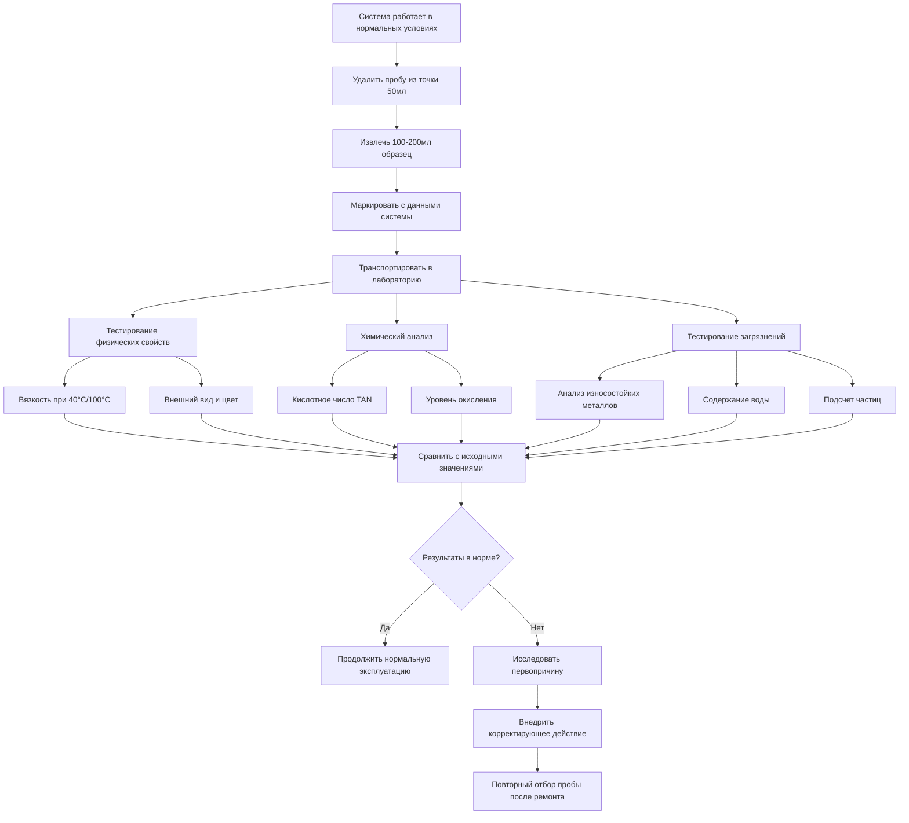

## Основы анализа масла

Анализ масла обеспечивает раннее обнаружение деградации компрессора путем мониторинга свойств смазочного материала и загрязнений. Регулярное тестирование выявляет износ подшипников, разбавление хладагентом, окисление и загрязнение до наступления катастрофического отказа. Современные программы анализа масла используют несколько параметров тестирования для установления исходных значений и отслеживания отклонений, указывающих на развивающиеся проблемы.

Физические и химические свойства масла компрессора закономерно изменяются по мере износа компонентов и деградации условий эксплуатации. Металлические частицы с поверхностей подшипников попадают в поток масла, кислые соединения образуются в результате термического разложения и загрязнения влагой, вязкость изменяется из-за смешивания с хладагентом или окисления. Систематический анализ количественно оценивает эти изменения в соответствии с установленными пределами.

## Процедуры отбора проб масла

Правильная методика отбора проб обеспечивает репрезентативные результаты. Извлекайте образцы из компрессора во время нормальной эксплуатации при рабочей температуре, чтобы отразить фактические условия циркуляции. Точки отбора проб должны располагаться после сепаратора масла и до масляного фильтра для представления состава основного смазочного материала.

**Протокол отбора проб:**

1. **Подготовка:** Используйте чистые, промаркированные флаконы, предоставленные испытательной лабораторией. ASTM D4057 определяет контейнеры отбора проб и методы консервации.
2. **Стабилизация системы:** Эксплуатируйте систему минимум 30 минут при нормальной нагрузке перед отбором пробы.
3. **Извлечение пробы:** Извлекайте 100-200 мл непосредственно из клапана отбора проб, удаляя первые 50 мл для очистки застойного масла.
4. **Заполнение контейнера:** Заполняйте флаконы полностью, чтобы минимизировать воздушное пространство и предотвратить окисление во время транспортировки.
5. **Документирование:** Записывайте модель компрессора, тип масла, часы работы, тип хладагента и дату отбора пробы.
6. **Транспортировка:** Отправляйте образцы в течение 24 часов, чтобы предотвратить загрязнение и изменение свойств.

Частота отбора проб зависит от критичности и размера компрессора. Крупные промышленные холодильные машины требуют квартального анализа, в то время как меньшие коммерческие установки могут требовать только ежегодного или полугодового тестирования.

## Анализ вязкости

Измерение вязкости в соответствии с ASTM D445 определяет сопротивление масла потоку при заданных температурах. Масла компрессоров должны поддерживать вязкость в узких диапазонах, чтобы обеспечить адекватную толщину пленки смазки на поверхностях подшипников и одновременно обеспечить эффективную прокачку.

Изменения вязкости указывают на:
- **Увеличение:** Окисление, термическая деградация или загрязнение высоковязким хладагентом
- **Снижение:** Разбавление хладагентом, загрязнение топливом или истощение присадок

Тестируйте вязкость при 40°C и 100°C для расчета индекса вязкости. Изменения, превышающие ±10% от исходных значений, требуют исследования. Полиэфирные (POE) масла, смешиваемые с хладагентом, показывают большую чувствительность вязкости к разбавлению хладагентом, чем минеральные масла.

## Анализ износостойких металлов

Спектрографический анализ в соответствии с ASTM D6595 обнаруживает металлические частицы в миллионных долях (ppm). Повышенные концентрации металлов указывают на специфические механизмы износа компонентов компрессора. Каждая металлическая сигнатура соответствует конкретным материалам, используемым в подшипниках, пластинах клапанов и цилиндрических стенках.

| Износостойкий металл | Источник компонента | Нормальный лимит (ppm) | Уровень предупреждения (ppm) | Критический уровень (ppm) |
|------------|------------------|--------------------|--------------------|----------------------|
| Железо (Fe) | Стенки цилиндров, коленчатый вал | <50 | 50-100 | >100 |
| Медь (Cu) | Подшипники, втулки | <30 | 30-75 | >75 |
| Алюминий (Al) | Поршни, упорные поверхности | <20 | 20-50 | >50 |
| Хром (Cr) | Поршневые кольца, пластины клапанов | <10 | 10-25 | >25 |
| Свинец (Pb) | Покрытие подшипника | <50 | 50-100 | >100 |
| Олово (Sn) | Материал подшипника | <30 | 30-75 | >75 |
| Кремний (Si) | Грязь, материал прокладки | <15 | 15-30 | >30 |

Резкие скачки указывают на ускоренный износ, требующий немедленного исследования. Анализ тренда выявляет постепенные модели деградации до достижения критических пороговых значений.

## Тестирование загрязнений

### Содержание воды
Загрязнение водой в соответствии с ASTM D6304 (метод Карла Фишера) вызывает образование кислоты, коррозию и разложение смазочного материала. Масла POE гигроскопичны и допускают только 200-300 ppm влаги. Минеральные масла принимают до 500 ppm. Повышенное содержание воды указывает на утечки хладагента, неадекватное удаление газов или проникновение влаги в систему.

### Подсчет частиц
Подсчет частиц по стандарту ISO 4406 количественно определяет частицы загрязнения в трех диапазонах размеров: 4 мкм, 6 мкм и 14 мкм. Результаты выражаются кодами чистоты, например 18/16/13. Целевая чистота для компрессоров составляет ISO 18/16/13 или выше. Ухудшающаяся чистота указывает на отказ фильтра или износ внутренних компонентов.

## Тестирование кислотного числа

Общее кислотное число (TAN) в соответствии с ASTM D664 измеряет кислые соединения в мг КОН/г масла. Кислоты образуются в результате окисления, термического разложения и реакции влаги с хладагентами. Масла POE естественным образом демонстрируют более высокое TAN (0,1-0,3 мг КОН/г), чем минеральные масла.

| Тип масла | TAN нового масла | Предел действия | Критический предел |
|----------|-------------|--------------|----------------|
| Минеральное масло | <0,05 | 0,30 | >0,50 |
| Полиэфир (POE) | 0,05-0,15 | 0,40 | >0,60 |
| Полиалкиленгликоль (PAG) | <0,10 | 0,35 | >0,55 |

Растущее TAN указывает на окисление или загрязнение, требующие замены масла или очистки системы. Кислые условия ускоряют разложение изоляции электродвигателя и медное напыление на поверхностях подшипников.

## Анализ окисления

FTIR (Фурье-преобразованная инфракрасная спектроскопия) в соответствии с ASTM E2412 обнаруживает продукты окисления, нитрирование и сульфирование. Окисление увеличивается с температурой, влажностью и воздействием воздуха. Число окисления увеличивается по мере деградации масла, обычно сообщается как единицы поглощения на сантиметр.

Пределы окисления:
- **Новое масло:** <5 Abs/см
- **Предел действия:** 20-25 Abs/см
- **Критический:** >30 Abs/см

Высокие уровни окисления коррелируют с увеличением вязкости, образованием кислоты и отложениями лака, которые ограничивают масляные проходы и закупоривают клапаны.

## Истощение присадок

Масла компрессоров содержат присадки против износа, против окисления и против пенообразования. Анализ FTIR отслеживает концентрации присадок. Истощение указывает на то, что масло исчерпало свою защитную химию и требует замены независимо от других параметров. Дитиофосфат цинка (ZDDP) и другие фосфорные соединения обеспечивают защиту от износа во многих составах.

## Интерпретация и действия

Установите исходные значения из нового масла и первоначальных образцов системы. Отслеживайте все параметры на контрольных диаграммах, чтобы выявить тренды. Отклонения одного параметра требуют исследования, в то время как множественные одновременные отклонения указывают на серьезные проблемы, требующие немедленного действия.

**Матрица действия:**
- **Все параметры в норме:** Продолжайте обычный интервал отбора проб
- **Один параметр на уровне предупреждения:** Увеличьте частоту отбора проб, контролируйте тренд
- **Несколько параметров на уровне предупреждения:** Спланируйте техническое вмешательство
- **Любой критический уровень:** Рекомендуется немедленная остановка и проверка

Эффективность анализа масла зависит от последовательного отбора проб, точного установления исходных значений и своевременного реагирования на развивающиеся проблемы. Интеграция с анализом вибрации и тепловизионной съемкой обеспечивает комплексное покрытие предиктивного обслуживания.
