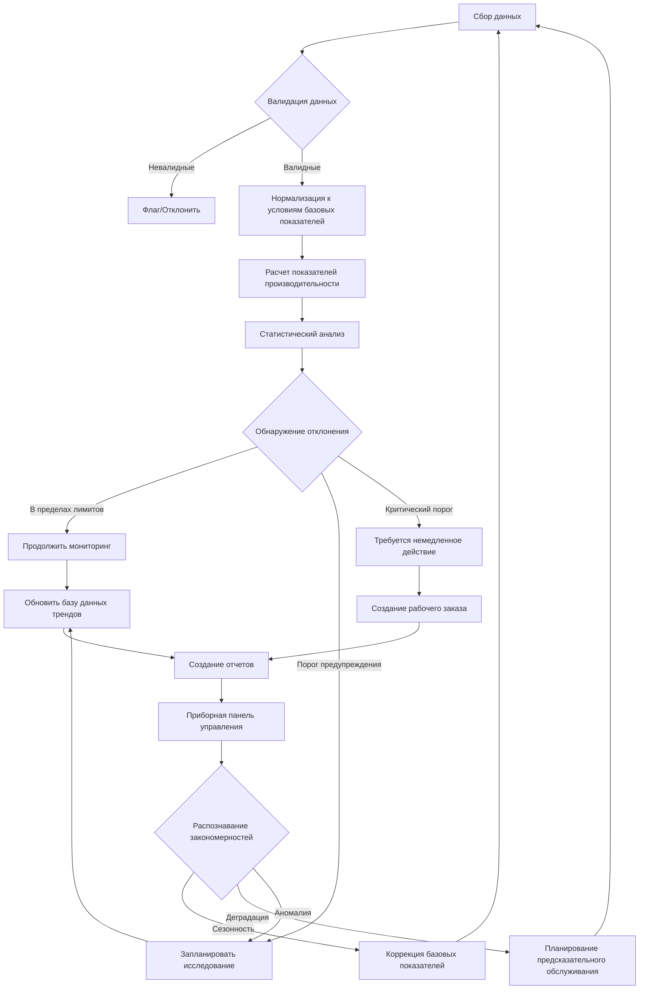

Тренд анализ производительности преобразует необработанные операционные данные в практически значимую информацию путем выявления закономерностей, отклонений и деградации до возникновения отказов системы. Такой систематический подход к мониторингу ключевых показателей производительности позволяет принимать решения по обслуживанию на основе данных и оптимизировать энергоэффективность на протяжении всего жизненного цикла оборудования.

## Критические показатели производительности

Руководство ASHRAE 14 устанавливает протоколы измерений для отслеживания производительности HVAC систем в сравнении с установленными базовыми показателями.

**Основные KPI для холодильных систем:**

- Energy Efficiency Ratio (EER): Выходная охлаждающая мощность (кДж/ч) ÷ электрический вход (Вт)
- Coefficient of Performance (COP): Полезная отпущенная тепловая/охлаждающая мощность ÷ потребленная энергия
- Киловатты на киловатт охлаждения (кВ/кВ охл.): Потребление мощности, нормализованное к холодопроизводительности
- Температура подхода: Разница между температурой охлаждающей воды на выходе и температурой испарения хладагента
- Перепад давления: Разница между давлением конденсации и испарения

**Метрики приточных установок:**

- Эффективность статического давления: Фактическая подача воздуха в сравнении с потреблением мощности вентилятором
- Отклонение температуры приточного воздуха: Отклонение от уставки в условиях нагрузки
- Тренд перепада давления фильтра: Скорость увеличения, указывающая на загрязнение
- Доля наружного воздуха: Проверка соответствия минимальным требованиям вентиляции

## Методы установления базовых показателей

Точный тренд анализ требует четко определенных базовых условий, установленных при надлежащей работе системы.

| Метод | Применение | Требования к данным | Точность |
|--------|-------------|-------------------|----------|
| Спецификации производителя | Ввод в эксплуатацию нового оборудования | Данные паспортных табличек, условия проектирования | ±5-10% |
| Усреднение исторических данных | Создание сезонного базового показателя | 12+ месяцев операционных данных | ±3-5% |
| Регрессионный анализ | Производительность, зависящая от нагрузки | Данные температуры, влажности, нагрузки | ±2-4% |
| Анализ методом бинов | Профилирование потребления энергии | Почасовые данные по погодным диапазонам | ±3-6% |
| Краткосрочный мониторинг | Быстрое создание базового показателя | 2-4 недели интенсивного мониторинга | ±5-8% |

**Критерии валидации базовых показателей:**

1. Данные собраны при стабильной работе (отсутствуют неисправности)
2. Представлен полный диапазон условий эксплуатации
3. Неопределенность измерений количественно определена и задокументирована
4. Сезонные вариации отражены в многосезонных наборах данных
5. Условия нагрузки нормализованы к параметрам проектирования

## Рабочий процесс тренд анализа

## Тренд анализ потребления энергии

Анализ потребления энергии выявляет деградацию эффективности и определяет возможности оптимизации посредством систематического анализа закономерностей потребления мощности.

**Ключевые компоненты анализа:**

- **Нормализация нагрузки**: Коррекция данных потребления при различных нагрузках с использованием градусо-дней охлаждения (CDD) или градусо-дней отопления (HDD)
- **Корреляция с погодой**: Регрессионный анализ, связывающий потребление энергии с наружной температурой и влажностью
- **Профилирование по времени суток**: Выявление операционной неэффективности в периоды присутствия и отсутствия людей
- **Сравнение год к году**: Учет нормализации по погоде с использованием данных TMY3

**Индикаторы деградации:**

Рост потребления энергии на 10-15% ежегодно указывает на загрязнение теплообменников, проблемы с зарядкой хладагента или механический износ. Рост потребления энергии на 20% и более сигнализирует о значительной деградации системы, требующей немедленного исследования.

## Протоколы тренда анализа эффективности

Метрики эффективности количественно определяют термодинамическую производительность холодильных циклов и процессов теплопередачи.

**Тренд анализ эффективности холодильной машины:**

Мониторинг кВ/кВ охл. при нескольких точках нагрузки (25%, 50%, 75%, 100%) для обнаружения износа компрессора, загрязнения или миграции хладагента. Центробежные холодильные машины обычно работают при 0,50-0,70 кВ/кВ охл. при условиях проектирования. Производительность, деградирующая сверх 0,80 кВ/кВ охл., указывает на необходимость обслуживания.

**Эффективность при частичной нагрузке:**

Интегрированное значение при частичной нагрузке (IPLV), взвешенное при 1% при 100% нагрузке, 42% при 75% нагрузке, 45% при 50% нагрузке и 12% при 25% нагрузке согласно AHRI 550/590, обеспечивает реалистичные ожидания годовой производительности.

## Анализ тренда производительности

Отслеживание деградации производительности выявляет снижение эффективности теплопередачи до полного отказа системы.

**Подход к измерению:**

Расчет отпущенной производительности с использованием: Q = ṁ × cp × ΔT

Где:
- Q = скорость теплопередачи (кДж/ч)
- ṁ = скорость массового потока (кг/ч)
- cp = удельная теплоемкость (кДж/кг·°C)
- ΔT = разница температур (°C)

**Причины потери производительности:**

- Загрязненные конденсатор/испаритель: сокращение производительности на 5-15%
- Недостаточный заряд хладагента: потеря производительности 10-30%
- Неконденсируемые газы: деградация производительности 5-10%
- Утечка клапанов компрессора: снижение производительности на 15-40%

Отслеживайте производительность при постоянных входных условиях, чтобы отделить деградацию оборудования от вариаций нагрузки.

## Продвинутые техники тренд анализа

**Многомерный анализ:**

Одновременный мониторинг температуры, давления, потока и потребления мощности выявляет сложные взаимодействия. Анализ главных компонент определяет, какие переменные оказывают наиболее существенное влияние на изменения производительности.

**Разработка пороговых значений сигнализации:**

- **Уровень предупреждения**: 2 стандартных отклонения от среднего значения базового показателя
- **Уровень действия**: 3 стандартных отклонения или превышение порога предупреждения
- **Критический уровень**: 4+ стандартных отклонения или быстрая деградация тренда

**Прогнозные алгоритмы:**

Прогнозирование временных рядов с использованием экспоненциального сглаживания или моделей ARIMA проецирует будущую производительность на основе исторических трендов, позволяя проводить проактивное планирование обслуживания до падения эффективности ниже допустимых пороговых значений.

## Лучшие практики реализации

**Частота сбора данных:**

- Критические параметры: интервалы 1-5 минут
- Стандартные метрики: интервалы 15 минут
- Данные энергии: минимум почасовые интервалы
- Ручные показания: еженедельно для валидации

**Обеспечение качества:**

Проводите проверку калибровки датчиков ежеквартально. Перекрестно проверяйте данные тренда в сравнении с квитанциями коммунальных услуг и ручными измерениями. Реализуйте автоматическое обнаружение выбросов для выявления дрейфа датчика или отказов в коммуникации.

**Требования к документированию:**

Ведите записи о всех операциях обслуживания, добавлениях хладагента, изменениях уставок и модификациях элементов управления, которые влияют на сравнение базовых показателей. Без этого контекста данные тренда становятся неоднозначными.

Тренд анализ производительности преобразует реактивное обслуживание в предсказательное обслуживание путем количественной оценки здоровья системы посредством непрерывного мониторинга. Инвестиция в инструментарий и инфраструктуру анализа окупается благодаря продлению срока службы оборудования, снижению затрат на энергию и предотвращению катастрофических отказов.
