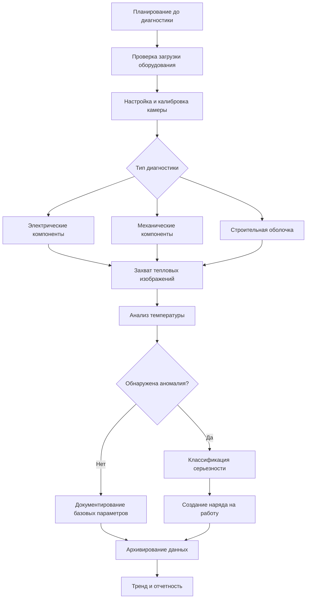

## Основы инфракрасной тепловизии

Инфракрасная тепловизия обнаруживает электромагнитное излучение в диапазоне длин волн 0,7–14 мкм, излучаемое объектами в зависимости от температуры их поверхности. Все объекты выше абсолютного нуля излучают инфракрасную энергию в соответствии с законом Стефана–Больцмана (W = εσT⁴), где излучаемая мощность зависит от излучательной способности (ε), постоянной Стефана–Больцмана (σ) и абсолютной температуры (T).

Современные программы предиктивного обслуживания HVAC полагаются на тепловизионную диагностику для выявления тепловых аномалий до их перерастания в отказы оборудования. Этот бесконтактный метод диагностики обнаруживает колебания температуры, вызванные электрическим сопротивлением, механическим трением, деградацией изоляции или ограничениями потока воздуха.

## Принципы измерения температуры

### Основы излучательной способности

Излучательная способность представляет собой отношение излучения, испускаемого реальной поверхностью, к излучению, испускаемому идеальным черным телом при той же температуре. Это безразмерное значение варьируется от 0 до 1 и критически влияет на точность измерения.

**Типичная излучательная способность поверхностей HVAC:**

| Материал | Диапазон излучательной способности | Примечания |
|----------|-----------------------------------|-----------|
| Окисленная медь | 0,60–0,78 | Выветренные холодильные линии |
| Оцинкованный стальной воздуховод | 0,23–0,28 | Блестящие новые поверхности |
| Окрашенный металл (неметаллический) | 0,90–0,95 | Большинство корпусов оборудования |
| Изоляция ПВХ | 0,91–0,94 | Оболочки изоляции трубопроводов |
| Бетон/кирпичная кладка | 0,92–0,94 | Строительная оболочка |
| Электрическая лента (черная) | 0,95 | Эталонный ориентир |

Неправильные настройки излучательной способности вносят значительные ошибки измерения. Поверхность при 80°C с ε=0,95 будет выглядеть как 65°C, если камера установлена на ε=0,60, создавая ошибку 15°C, которая может скрыть критические тепловые аномалии.

### Компенсация отраженной температуры

Поверхности с низкой излучательной способностью отражают инфракрасное излучение от окружающих объектов. Установите параметр отраженной температуры камеры на температуру окружающей среды от отражающих источников. Для внутренних HVAC-диагностик это обычно равно комнатной температуре (20–25°C). Для наружного оборудования измерьте температуру неба или используйте рекомендации производителя.

## Рабочий процесс ИК-диагностики

## Электрические диагностики HVAC

Электрические тепловые аномалии возникают в результате повышенного сопротивления в соединениях, создавая локализованное нагревание пропорционально потерям I²R. Инфракрасная диагностика обнаруживает ослабленные соединения, корродированные клеммы, неуравновешенные нагрузки и перегруженные цепи до отказа изоляции или событий дугового замыкания.

**Критические электрические точки:**
- Контакты пускателя двигателя и реле перегрузки
- Соединения частотного преобразователя (ЧП) и шины питания
- Клеммы компрессорного контактора
- Отключающие выключатели и держатели предохранителей
- Соединения управляющего трансформатора
- Панели распределения питания, питающие нагрузки HVAC

Проверяйте электрические компоненты в условиях репрезентативной нагрузки (минимум 40% от номинальной нагрузки). Превышение температурного прироста над окружающей средой выше спецификаций производителя указывает на развивающиеся проблемы. Различия температуры между фазами более 10°C в трехфазном оборудовании указывают на неуравновешенные нагрузки или проблемы соединения.

## Тепловизионная диагностика механических компонентов

Механические тепловые аномалии указывают на трение от неправильной центровки, недостаточной смазки, износа подшипников или проблем связи. Повышенные температуры подшипников относительно базовых измерений обеспечивают раннее предупреждение о грядущем механическом отказе.

**Типичные механические тепловые аномалии:**

| Компонент | Нормальный ΔT выше окружающей среды | ΔT предупреждения | Критический ΔT | Вероятная причина |
|-----------|-------------------------------------|-------------------|-----------------|------------------|
| Подшипники двигателя | 10–20°C | 30–40°C | >50°C | Износ, потеря смазки |
| Подшипники вентилятора | 15–25°C | 35–45°C | >55°C | Неправильная центровка, перегрузка |
| Ременные передачи | 5–15°C | 20–30°C | >40°C | Неправильная центровка, натяжение |
| Муфты насоса | 10–20°C | 30–40°C | >50°C | Неправильная центровка, износ |
| Подшипники компрессора | 20–30°C | 40–55°C | >65°C | Потеря хладагента, износ |

Установите базовые тепловые сигнатуры при пуске в эксплуатацию или после обслуживания. Сравните последующие диагностики с этими базовыми значениями, а не полагайтесь исключительно на абсолютные значения температуры. Тренд повышения температуры во времени обеспечивает действенное прогнозирование отказа.

## Диагностика строительной оболочки

Тепловое изображение выявляет дефекты изоляции, пути инфильтрации воздуха и проникновение влаги, влияющие на расчеты нагрузки HVAC и эффективность системы. Проверяйте строительные оболочки при максимальной разнице внутренней и наружной температуры (>10°C) для оптимального теплового контраста.

**Точки проверки оболочки:**
- Целостность кровельной изоляции и наличие влаги
- Зазоры и сжатие изоляции в полостях стен
- Утечка воздуха из окон и дверных проемов
- Проходы для трубопроводов, воздуховодов и кабелепроводов
- Тепловые мосты в конструктивных соединениях

Температурные закономерности, указывающие на отсутствующую изоляцию, выглядят как теплые области (зимний сезон) или прохладные области (сезон охлаждения) относительно должным образом изолированных участков. Влага в изоляции создает отчетливые тепловые сигнатуры из-за высокой удельной теплоемкости воды, влияющей на скорость теплопередачи.

## Стандарты ASNT по тепловизии

Американское общество неразрушающего контроля (ASNT) устанавливает стандарты сертификации для инфракрасных тепловизионистов посредством руководящих принципов ASNT SNT-TC-1A. Три уровня сертификации определяют компетентность:

**Уровень I:** Проводит диагностику под надзором в соответствии с письменными процедурами
**Уровень II:** Интерпретирует результаты, составляет процедуры, предоставляет надзор уровня I
**Уровень III:** Устанавливает процедуры, интерпретирует коды/стандарты, обеспечивает надзор уровня II

ASNT рекомендует формальное обучение, охватывающее основы теплопередачи, работу с ИК-камерой, соображения излучательной способности, ошибки измерения и методы диагностики, специфичные для приложений. Тепловизионная диагностика зданий/инфраструктуры требует иного опыта, чем электрические или механические диагностики, из-за различных проблем излучательной способности, расстояний измерения и критериев анализа.

Следуйте стандарту ASNT CP-189 для квалификации персонала по тепловизии, обеспечивая достаточные знания диагностов о системах HVAC, электробезопасности и тепловом анализе для получения надежных результатов диагностики.

## Лучшие практики диагностики

**Экологические соображения:**
- Избегайте диагностики во время осадков или высокой влажности, влияющей на температуру поверхности
- Защищайте камеры от прямого солнечного света, вызывающего насыщение датчика
- Позвольте 15–20 минут после дождя для испарения поверхностной влаги
- Учитывайте солнечное облучение наружного оборудования (диагностика перед рассветом или вечером)

**Требования к документированию:**
- Захватите видимые и тепловые изображения каждой точки диагностики
- Зафиксируйте настройки излучательной способности, расстояние и условия окружающей среды
- Аннотируйте изображения с идентификацией оборудования и измерениями температуры
- Сохраняйте согласованность интервалов диагностики для анализа тренда

**Протоколы безопасности:**
- Поддерживайте надлежащие расстояния подхода согласно границам дугового замыкания NFPA 70E
- Никогда не снимайте электрические корпуса или защиту во время энергизированной диагностики
- Используйте надлежащие СИЗ для условий диагностики
- Проверяйте заземление оборудования перед тепловизионной диагностикой

Планируйте диагностику тепловизии ежеквартально для критического оборудования, дважды в год для общих систем HVAC и ежегодно для оценки строительной оболочки. Более частые диагностики в течение гарантийных периодов устанавливают базовые тепловые закономерности для будущего сравнения.
