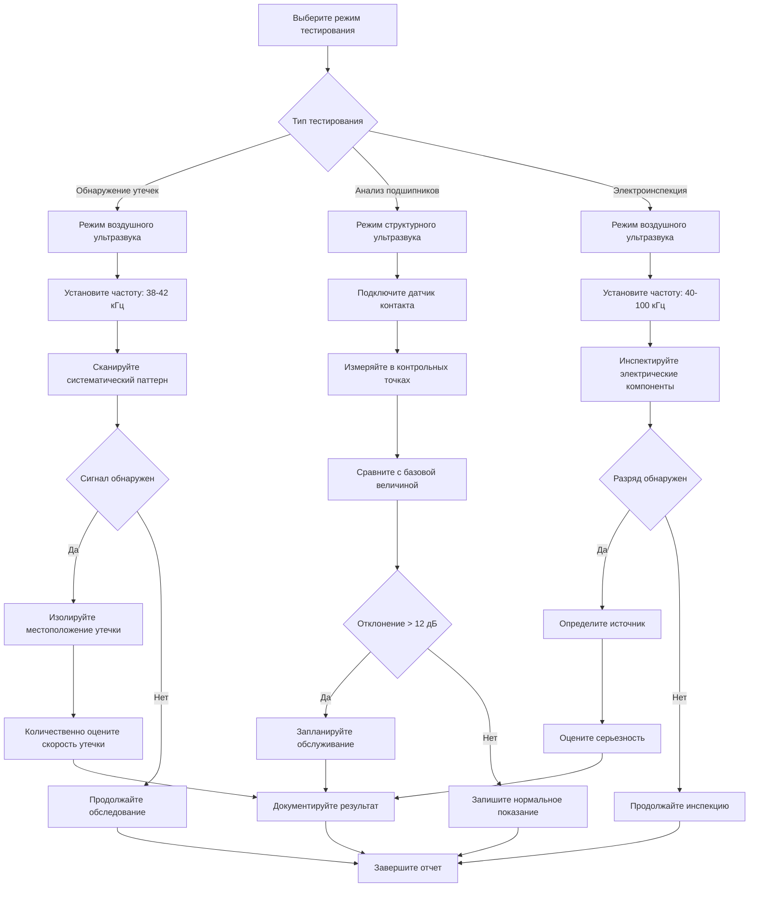

## Основы ультразвукового тестирования

Ультразвуковое тестирование использует высокочастотные звуковые волны (20 кГц - 100 кГц) вне диапазона слышимости человека для обнаружения механических дефектов, утечек газа и электрических аномалий в системах HVAC. Этот неинвазивный метод прогнозного обслуживания выявляет отказы до того, как произойдут катастрофические поломки.

**Физический принцип**: Когда сжатые газы выходят через утечки, вращающиеся компоненты деградируют или происходит электрический разряд, турбулентность генерирует ультразвуковые частоты. Ультразвуковые детекторы преобразуют эти сигналы в слышимые частоты или визуальные отображения для интерпретации техником.

### Категории ультразвукового тестирования

**Воздушный ультразвук**: Обнаруживает звуковые волны, передаваемые через воздух от утечек, электрических разрядов и механического трения. Эффективный диапазон: 3-15 метров в зависимости от окружающего шума.

**Структурный ультразвук**: Обнаруживает вибрации, передаваемые через твердые компоненты через датчики контакта. Используется для анализа подшипников, проверки целостности клапанов и верификации паровых ловушек.

## Диапазоны ультразвуковых частот и применение

| Применение | Диапазон частот | Метод обнаружения | Типовой диапазон |
|-------------|-----------------|-------------------|------------------|
| Утечки сжатого воздуха | 25-40 кГц | Воздушный | 3-10 м |
| Утечки хладагента | 38-42 кГц | Воздушный | 2-8 м |
| Утечки пара | 30-50 кГц | Воздушный | 5-15 м |
| Мониторинг подшипников | 30-40 кГц | Структурный | Датчик контакта |
| Электрический разряд | 40-100 кГц | Воздушный | 1-5 м |
| Обнаружение утечек клапанов | 35-45 кГц | Структурный | Датчик контакта |

## Ультразвуковое обнаружение утечек

### Утечки сжатого воздуха и газа

Выход сжатого газа через отверстия создает турбулентный поток с характеристическими ультразвуковыми сигнатурами. Чувствительность обнаружения увеличивается с перепадом давления и размером утечки.

**Порог обнаружения**: Утечки размером до 0,1 CFM (0,17 м³/ч) при давлении 690 кПа обнаруживаются. Фильтрация фонового шума является необходимым условием в механических помещениях.

**Метод количественной оценки**: Измерения в децибелах коррелируют со скоростью утечки, используя алгоритмы производителя. Типовая зависимость:
- 70 дБ = 1 CFM (1,699 м³/ч) утечка при 690 кПа
- 80 дБ = 3 CFM (5,097 м³/ч) утечка при 690 кПа
- 90 дБ = 10 CFM (16,99 м³/ч) утечка при 690 кПа

### Обнаружение утечек хладагента

Ультразвуковое обнаружение дополняет электронные детекторы хладагента путем определения местоположения утечек в шумных средах, где слышимый шипящий звук маскирует небольшие утечки.

**Преимущества над электронным обнаружением**:
- Не требуются датчики, чувствительные к типу хладагента
- Мгновенное время отклика
- Эффективно со всеми типами хладагентов
- Не подвержено влиянию воздушных потоков

**Процедура**: Сканируйте подозреваемые области в систематическом сеточном паттерне на расстоянии 1-2 метра. Изолируйте утечку, используя близость и направленное наведение датчика.

## Мониторинг состояния подшипников

### Ультразвуковые сигнатуры деградации подшипников

Роликовые подшипники генерируют ультразвуковые частоты от металло-металлического контакта. Прогрессирование деградации производит отчетливые изменения частоты, обнаруживаемые до того, как анализ вибраций выявляет проблемы.

**Временная шкала обнаружения**: Ультразвуковое тестирование обнаруживает дефекты подшипников за 8-12 недель до того, как традиционный анализ вибраций выявляет проблемы.

| Состояние подшипника | Ультразвуковой уровень | Характеристики |
|----------------------|------------------------|-----------------|
| Новый/Отличный | Базовая величина + 0-8 дБ | Гладкий, постоянный сигнал |
| Хороший | Базовая величина + 8-16 дБ | Незначительные колебания |
| Удовлетворительный | Базовая величина + 16-35 дБ | Прерывистые скачки |
| Плохой | Базовая величина + 35-50 дБ | Постоянно повышенный сигнал |
| Вышедший из строя | Базовая величина + >50 дБ | Нерегулярный, высокоамплитудный сигнал |

### Процедура мониторинга

1. **Установление базовой величины**: Измеряйте ультразвуковые уровни новых или известных исправных подшипников в постоянных точках контакта
2. **Регулярный мониторинг**: Ежемесячные измерения в идентичных местах с использованием датчика контакта
3. **Анализ тренда**: Нанесите показания в децибелах на график во времени; увеличение >12 дБ указывает на развивающуюся проблему
4. **Верификация смазки**: Контролируйте ультразвуковые уровни во время смазки; надлежащая смазка снижает уровни на 8-12 дБ

## Применение в электроинспекции

### Обнаружение коронного разряда и дугового пробоя

Электрический разряд производит ультразвуковые частоты от ионизированных молекул воздуха. Обнаруживаемые явления включают:

- **Коронный разряд**: 40-70 кГц, постоянный сигнал, указывающий на пробой изоляции
- **Дуговой пробой**: 60-100 кГц, прерывистый сигнал, указывающий на ослабленные соединения или отслаивание
- **Отслаивание**: 50-80 кГц, прогрессирующий отказ изоляции

**Критические точки инспекции**: Выводы двигателя, контакторы, коммутационные аппараты, соединения конденсаторов и высоковольтная проводка.

## Рабочий процесс ультразвукового тестирования

## Стандарты ASNT и надлежащие практики

Американское общество по неразрушающему контролю (ASNT) предоставляет рекомендации по квалификации персонала и процедурам ультразвукового тестирования:

**Рекомендуемая практика SNT-TC-1A**: Устанавливает три уровня сертификации на основе требований к обучению и опыту для техников ультразвукового тестирования.

**Надлежащие практики**:
- Калибруйте приборы, используя методы, указанные производителем, перед каждым использованием
- Документируйте условия окружающей среды, влияющие на показания (температура, влажность, фоновый шум)
- Устанавливайте специфичные для оборудования базовые величины для программ мониторинга подшипников
- Используйте постоянные точки измерения для анализа тренда
- Записывайте уровни в децибелах, установки частоты и условия окружающей среды
- Реализуйте систематические маршруты инспекции для обследования утечек

## Интеграция с программами обслуживания

Ультразвуковое тестирование дополняет другие прогнозные технологии:

- **Анализ вибраций**: Ультразвук обнаруживает раннюю деградацию подшипников; вибрация подтверждает продвинутый износ
- **Инфракрасная термография**: Комбинированная электроинспекция одновременно выявляет нагрев и разряд
- **Анализ масла**: Коррелируйте показания ультразвукового подшипника с тенденциями износа частиц

**Рекомендуемые частоты инспекции**:
- Критическое оборудование подшипников: еженедельно до ежемесячно
- Системы сжатого воздуха: квартальное обследование утечек
- Системы холодоснабжения: полугодовое обнаружение утечек
- Электрические системы: годовая инспекция коронного разряда и дугового пробоя

## Точность измерений и ограничения

**Факторы точности**:
- Помехи фонового шума в высокошумных средах
- Опыт оператора в интерпретации сигнала
- Расстояние от источника влияет на интенсивность измерений
- Экстремальные температуры окружающей среды влияют на производительность датчика

**Ограничения**:
- Не может обнаружить утечки в системах с вакуумом
- Требует прямой видимости для воздушного обнаружения
- Структурное тестирование требует доступных точек контакта
- Алгоритмы количественной оценки являются оценками, специфичными для производителя

Ультразвуковое тестирование обеспечивает экономичное раннее предупреждение о деградации систем HVAC при систематической реализации в составе комплексных программ прогнозного обслуживания.
