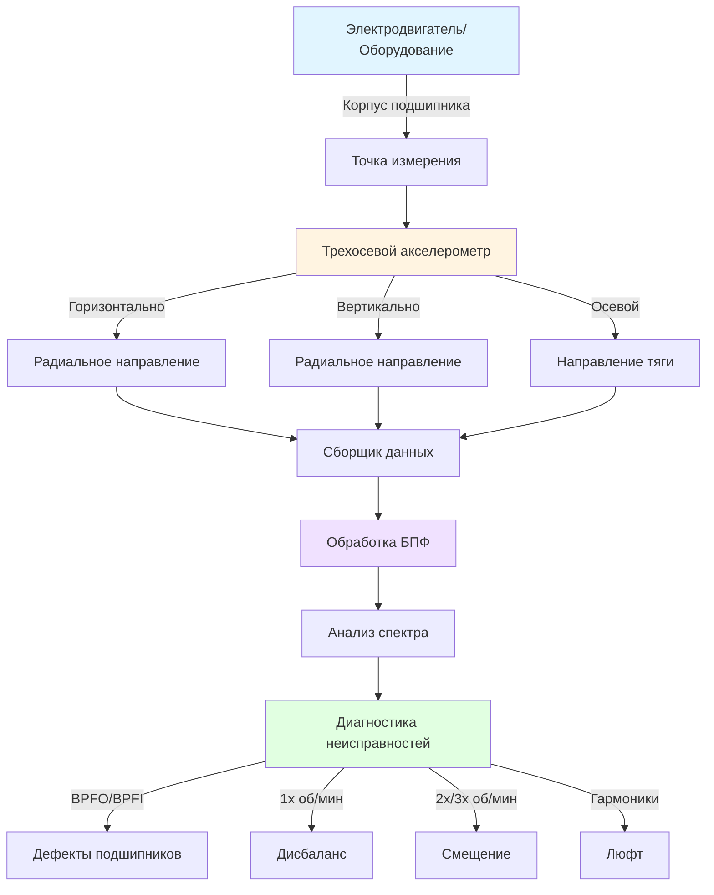

## Основы анализа вибрации

Анализ вибрации обеспечивает раннее обнаружение механических неисправностей во вращающемся оборудовании HVAC до катастрофического отказа. Метод измеряет колебательное движение компонентов машины и анализирует частотное содержание для определения конкретных условий неисправности.

### Параметры измерения

Вибрация проявляется в трех взаимосвязанных параметрах, каждый из которых подходит для различных диапазонов частот:

**Смещение (мкм)** определяет фактическое физическое движение компонентов. Это измерение наиболее эффективно для низкочастотных колебаний (ниже 360 м⁻¹), типичных для сильного дисбаланса или люфта в крупном оборудовании низкой скорости вращения. Соотношение между смещением и другими параметрами следует:

**Скорость (мм/с)** представляет скорость изменения смещения и обеспечивает наиболее прямую корреляцию с тяжестью вибрации в самом широком диапазоне частот (360-36000 м⁻¹). Эффективное значение (RMS) скорости служит основным параметром в стандартах ISO, поскольку хорошо коррелирует с деструктивной энергией, передаваемой через машину.

**Ускорение (м/с²)** измеряет скорость изменения скорости, становясь наиболее чувствительным на высоких частотах (выше 36000 м⁻¹). Измерения ускорения превосходны при обнаружении дефектов подшипников, проблем зацепления зубьев и кавитации, поскольку эти неисправности генерируют высокочастотные импульсы.

Математические соотношения между этими параметрами для синусоидального движения:

- Скорость (V) = 2πfD, где f = частота (Гц), D = смещение
- Ускорение (A) = 2πfV = (2πf)²D

## Методология анализа БПФ

Анализ быстрого преобразования Фурье (БПФ) преобразует временные сигналы вибрации в частотные спектры, раскрывая конкретные частоты в сложных сигнатурах вибрации.

### Параметры БПФ

Критические настройки БПФ влияют на качество измерения:

- **Диапазон частот (Fmax)**: Установите значение в 2,5–3 раза превышающее наивысшую ожидаемую частоту неисправности
- **Строки разрешения**: Более высокие значения (1600–3200 строк) обеспечивают более тонкое различие частот
- **Разрешение спектра (Δf)**: Равно Fmax, разделенное на количество линий; определяет способность разделять соседние пики
- **Усреднение**: Несколько усреднений БПФ снижают случайный шум; используйте 4–8 усреднений для установившегося режима работы машины

### Паттерны спектрального анализа

Отчетливые спектральные паттерны указывают на конкретные механические неисправности:

**Дисбаланс** создает доминирующий пик на частоте 1× скорости вращения (об/мин/60 Гц) с преимущественно радиальной вибрацией. Тяжесть возрастает со второй степенью скорости.

**Смещение** генерирует сильные гармоники 2× и 3× скорости вращения, часто со значительной осевой вибрацией. Угловое смещение подчеркивает осевое направление; параллельное смещение показывает радиальную вибрацию.

**Люфт** создает широкий спектр с несколькими гармониками, достигающими 10× или более скорости вращения, сопровождаемыми вариациями в направлении.

## Расчеты характеристических частот дефектов подшипников

Шариковые подшипники генерируют дискретные частоты, когда дефекты поверхности воздействуют на шарики. Рассчитайте эти характеристические частоты:

**Частота встреч шариков с наружной дорожкой (BPFO)**:
BPFO = (N × об/мин / 60) × (1 - (Bd/Pd) × cos φ) / 2

**Частота встреч шариков с внутренней дорожкой (BPFI)**:
BPFI = (N × об/мин / 60) × (1 + (Bd/Pd) × cos φ) / 2

**Частота вращения шарика (BSF)**:
BSF = (Pd × об/мин / 60) × (1 - (Bd/Pd)² × cos² φ) / (2 × Bd)

**Основная частота механизма (FTF)**:
FTF = (об/мин / 60) × (1 - (Bd/Pd) × cos φ) / 2

Где:
- N = количество катящихся элементов
- Bd = диаметр шарика
- Pd = диаметр шага
- φ = контактный угол
- об/мин = скорость вращения вала

Ранние дефекты подшипников проявляются как низкоамплитудные пики на этих частотах с высокочастотными боковыми полосами, расположенными с интервалами FTF.

## Стандарты тяжести вибрации

ISO 10816 устанавливает зоны тяжести вибрации для различных типов машин и оснований:

### Классификация ISO 10816 (RMS скорость)

| Зона | Тяжесть | Диапазон (мм/с) | Условие | Требуемое действие |
|------|---------|-----------------|---------|-------------------|
| A | Хорошее | 0–2,8 | Недавно введенное в эксплуатацию оборудование | Продолжить мониторинг |
| B | Приемлемое | 2,8–7,1 | Неограниченная долгосрочная эксплуатация | Плановый мониторинг |
| C | Неудовлетворительное | 7,1–18 | Ограниченный период эксплуатации | Запланировать ремонт |
| D | Неприемлемое | >18 | Риск повреждения машины | Немедленная остановка |

Примечание: Значения показаны для машин на жестком основании, группа 2 (средние машины, 11–55 кВт, 300–15000 об/мин). Корректируйте для конкретной классификации оборудования.

### Специальные рекомендации для оборудования HVAC

| Тип оборудования | Уровень внимания (мм/с RMS) | Уровень неисправности (мм/с RMS) |
|------------------|-----------------------------|------------------------------------|
| Центробежные холодильные машины | 4,5 | 11,0 |
| Винтовые компрессоры | 7,0 | 15,0 |
| Вентиляторы градирни | 5,0 | 12,0 |
| Приточно-вытяжные установки | 3,5 | 8,0 |
| Циркуляционные насосы | 4,0 | 10,0 |

## Установка измерительного оборудования и методика

Надлежащее размещение датчиков и сбор данных обеспечивают надежный анализ вибрации:

### Лучшие практики измерения

1. **Монтаж датчика**: Используйте монтаж на шпильку для частот выше 5 кГц; магнитное основание приемлемо ниже 2 кГц
2. **Подготовка поверхности**: Чистые, плоские, гладкие поверхности монтажа обеспечивают надлежащую связь
3. **Согласованность местоположения**: Измеряйте в идентичных точках на каждой сессии для обеспечения тренда
4. **Трехосевые данные**: Собирайте горизонтальные, вертикальные и осевые данные на каждом подшипнике
5. **Условия эксплуатации**: Выполняйте измерения при нормальной рабочей температуре и нагрузке
6. **Документация**: Записывайте об/мин, нагрузку, температуру и операционные примечания

## Мониторинг тренда и управление аварийными сигналами

Эффективные программы вибрации устанавливают исходные измерения и отслеживают изменения параметров во времени. Установите уровни аварийных сигналов на уровне 50% границ зон ISO для предоставления раннего предупреждения. Рассчитывайте скорость изменения в дополнение к абсолютным уровням; быстрые увеличения указывают на развивающиеся неисправности, требующие немедленного внимания.

Мониторинг тренда выявляет паттерны деградации:
- Постепенное линейное увеличение предполагает прогрессирование износа
- Экспоненциальное увеличение указывает на неминуемый отказ
- Скачкообразные изменения указывают на события внезапного повреждения
- Сдвиги частоты раскрывают изменяющиеся характеристики неисправностей

## Стандарты и справочные материалы

- **ISO 10816-1**: Механическая вибрация – оценка по измерениям на неподвижных частях
- **ISO 10816-3**: Промышленные машины с номинальной мощностью свыше 15 кВт и номинальными скоростями 120–15000 об/мин
- **ISO 20816**: Обновленный стандарт, заменяющий серию ISO 10816
- **ASHRAE Guideline 33**: Документирование условий воздушного потока в помещении и температуры/влажности (включает пределы вибрации)
