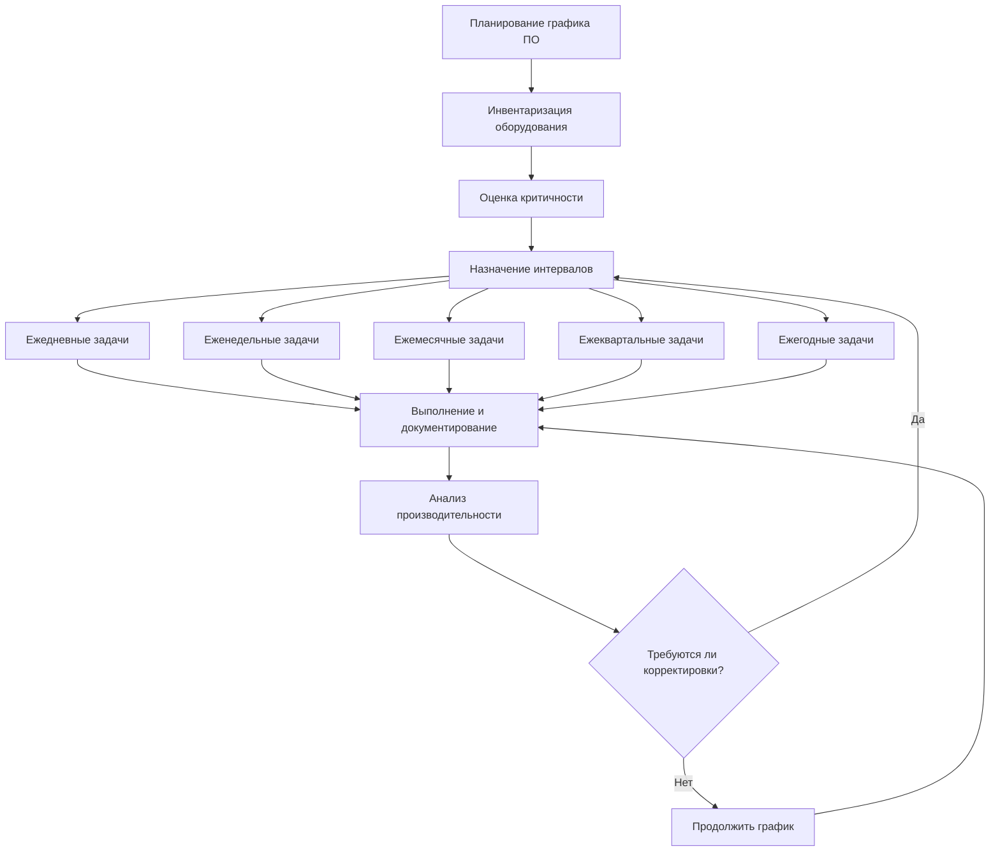

# Графики и контрольные списки профилактического обслуживания HVAC

Графики профилактического обслуживания (ПО) являются основой надежной работы систем HVAC. Систематическая проверка, очистка и регулировка оборудования предотвращают катастрофические отказы, поддерживают энергоэффективность и продлевают срок службы оборудования. Данное руководство предоставляет комплексные графики ПО на основе рекомендаций ASHRAE и производителей.

## Структура графика профилактического обслуживания

Эффективное профилактическое обслуживание работает по нескольким временным интервалам: от ежедневных наблюдений операторов до ежегодных комплексных проверок. Частота каждой задачи зависит от критичности оборудования, времени работы, условий окружающей среды и спецификаций производителя.

## Универсальные интервалы задач профилактического обслуживания

Следующая таблица устанавливает стандартные интервалы для типовых задач обслуживания во всех типах оборудования HVAC.

| Категория задачи | Ежедневно | Еженедельно | Ежемесячно | Ежеквартально | Ежегодно |
|------------------|-----------|------------|-----------|---------------|----------|
| Визуальная проверка | ✓ | ✓ | ✓ | ✓ | ✓ |
| Операционные параметры | ✓ | ✓ | ✓ | ✓ | ✓ |
| Обслуживание фильтров | — | ✓ | ✓ | — | — |
| Проверка ремней | — | ✓ | ✓ | — | — |
| Смазка | — | — | ✓ | ✓ | — |
| Электрические соединения | — | — | — | ✓ | ✓ |
| Калибровка | — | — | — | ✓ | ✓ |
| Комплексное тестирование | — | — | — | — | ✓ |

## График обслуживания блока подготовки воздуха (AHU)

### Ежедневные задачи
- Записать температуру и давление приточного воздуха
- Проверить работу вентилятора и отсутствие посторонних шумов
- Проверить манометры перепада давления фильтра
- Осмотреть на предмет утечек воды и конденсата
- Проверить работу дроссельных заслонок через BMS

### Ежемесячные задачи
- Осмотреть и очистить/заменить воздушные фильтры
- Проверить натяжение и выравнивание ремня вентилятора
- Смазать подшипники двигателя и вентилятора согласно графику производителя
- Очистить поддоны конденсата и проверить дренаж
- Осмотреть ребра теплообменника на предмет загрязнения и повреждений
- Проверить работу рычажного механизма экономайзера
- Протестировать датчики температуры смешанного воздуха

### Ежеквартальные задачи
- Измерить ток двигателя и сравнить с паспортными данными
- Осмотреть и затянуть электрические соединения
- Откалибровать датчики температуры и влажности
- Проверить работу частотного преобразователя (VFD) и журналы ошибок
- Осмотреть теплообменники на загрязнение
- Проверить последовательность управления
- Протестировать блокировки безопасности и сигналы тревоги

### Ежегодные задачи
- Провести полное измерение расхода воздуха и балансировку системы
- Разобрать и осмотреть узлы вентилятора
- Заменить или смазать подшипники согласно рекомендациям производителя
- Тщательно очистить теплообменники отопления и охлаждения
- Провести мегаомное тестирование обмоток двигателя
- Откалибровать все датчики и передатчики
- Заменить ремни независимо от состояния
- Проверить работу противопожарных/дымовых заслонок
- Протестировать последовательности аварийного отключения

## График обслуживания холодильной машины

### Ежедневные задачи
- Записать температуры воды на входе/выходе
- Записать давления хладагента (всасывание и нагнетание)
- Контролировать ток компрессора
- Проверить уровень и состояние масла
- Убедиться в отсутствии аномальных вибраций и шумов
- Записать температуры подхода конденсатора и испарителя

### Ежемесячные задачи
- Осмотреть и очистить сетки-отстойники конденсаторной воды
- Проверить смотровое окно хладагента на наличие пузырьков или обесцвечивания
- Проверить расходы воды и перепады давления
- Осмотреть состояние изоляции
- Протестировать отключения безопасности (низкая температура, высокое давление)
- Анализировать пробу масла на влажность и кислотность

### Ежеквартальные задачи
- Провести обнаружение утечек в контурах хладагента
- Осмотреть контакты пускателя и соединения
- Откалибровать датчики температуры и давления
- Проверить работу панели управления и обновить программное обеспечение при необходимости
- Измерить уровни вибрации компрессора
- Осмотреть и протестировать работу блока очистки (для абсорбционных холодильных машин)
- Проверить работу автоматического управления мощностью

### Ежегодные задачи
- Провести тест вихревых токов или гидравлическое испытание трубок (водяного охлаждения)
- Провести анализ хладагента
- Провести мегаомное тестирование двигателя компрессора
- Химическая очистка испарителя и конденсатора (при обнаружении загрязнения)
- Заменить сердцевины осушителя
- Осмотреть и обслужить расширительные устройства
- Провести полную проверку момента затяжки электрических соединений
- Проверить работу масляного нагревателя
- Протестировать все устройства безопасности и блокировки
- Документировать показатели эффективности (кВ/кВт охлаждения)

## График обслуживания котла

### Ежедневные задачи
- Записать рабочее давление и температуру
- Контролировать расход топлива и характеристики пламени
- Проверить скорость подачи подпиточной воды
- Убедиться в отсутствии утечек из трубок, прокладок или фитингов
- Осмотреть температуру в дымоходе
- Протестировать работу отсечки по низкому уровню воды (продувка)

### Еженедельные задачи
- Протестировать срабатывание предохранительного клапана (ручной подъем клапана)
- Продуть дно котла для удаления осадка
- Проверить уровни химических реагентов водоподготовки
- Осмотреть рисунок пламени горелки
- Проверить работу регулятора тяги

### Ежемесячные задачи
- Очистить и осмотреть узлы горелки
- Проверить состояние форсунки топлива и рисунок распыления
- Протестировать управление защиты пламени
- Осмотреть состояние огнеупорного материала
- Проверить работу дроссельной заслонки подачи воздуха горения
- Провести анализ водоподготовки
- Осмотреть каналы дымовых газов на предмет закупорки

### Ежеквартальные задачи
- Провести анализ горения (O₂, CO, CO₂, эффективность)
- Осмотреть и очистить рабочее колесо нагнетателя
- Откалибровать управляющие и предельные органы управления
- Проверить компоненты системы зажигания
- Осмотреть компоненты газовой магистрали и прокладки
- Протестировать систему автоматической продувки
- Проверить давление заряда расширительного бака

### Ежегодные задачи
- Провести полную очистку со стороны огня (трубки, ходы, дымоход)
- Осмотреть поверхности со стороны воды и очистить при необходимости
- Гидравлическое испытание или ультразвуковое измерение толщины
- Заменить прокладки и уплотнения
- Осмотреть и обслужить двигатель горелки и механизм управления
- Откалибровать все органы управления безопасностью
- Протестировать системы аварийного отключения
- Проверить правильность вентиляции и подачи воздуха для горения
- Документировать сезонную эффективность

## График обслуживания градирни

### Ежедневные задачи (во время работы)
- Проверить работу вентилятора и направление вращения
- Осмотреть на предмет аномальных шумов или вибраций
- Осмотреть равномерность распределения воды
- Контролировать расход подпиточной воды
- Проверить уровень воды в поддоне

### Еженедельные задачи
- Протестировать параметры водоподготовки (pH, электропроводность, ингибитор коррозии)
- Осмотреть ремни и отрегулировать натяжение
- Проверить избыточный унос влаги и образование тумана
- Очистить сетки-отстойники и экраны
- Проверить работу клапана продувки

### Ежемесячные задачи
- Осмотреть заполняющий материал на загрязнение, отложения или рост водорослей
- Проверить уровень и состояние масла в редукторе
- Смазать подшипники вентилятора
- Осмотреть каплеуловители на предмет закупорки
- Протестировать работу поплавкового клапана
- Очистить поддон и удалить мусор
- Осмотреть форсунки распылителя на предмет засорения

### Ежеквартальные задачи
- Провести анализ вибрации узлов привода вентилятора
- Осмотреть угол установки и состояние лопастей вентилятора
- Проверить конструктивные элементы на коррозию
- Откалибровать контроллер электропроводности
- Осмотреть корпус градирни на предмет утечек
- Проверить работу клапана подпиточной воды
- Протестировать работу аварийного отключения

### Ежегодные задачи (предсезонное обслуживание)
- Разобрать и осмотреть компоненты привода вентилятора
- Заменить масло в редукторе
- Тщательно очистить заполняющий материал
- Осмотреть и отремонтировать повреждения корпуса градирни
- Балансировать узлы вентилятора
- Заменить ремни
- Протестировать все предельные переключатели и блокировки
- Проверить достаточность зазоров для воздухопотока
- Химическая очистка при обнаружении биологического роста
- Документировать показатели рабочей эффективности

## Методология разработки графика профилактического обслуживания

### Классификация критичности оборудования

Отнесите оборудование к одной из трех категорий:

**Критичное (класс A):** Оборудование, отказ которого приводит к немедленной остановке или опасности для безопасности. Увеличьте частоту проверок на 50% сверх стандартных интервалов.

**Важное (класс B):** Оборудование, отказ которого снижает производительность системы, но позволяет продолжить работу. Следуйте стандартным интервалам.

**Некритичное (класс C):** Резервное или не требуемое оборудование. Интервалы могут быть продлены на 25%, если производитель не устанавливает иные требования.

### Корректировка интервалов на основе условий эксплуатации

Рекомендации производителей предполагают стандартные условия эксплуатации (8-12 часов/день, чистая среда, правильная установка). Корректируйте интервалы на основе:

- **Высокая наработка** (>16 ч/день): Сократить интервалы на 25-50%
- **Жесткие условия окружающей среды** (коррозионные, пыльные, высокая влажность): Сократить интервалы на 30-50%
- **Установки в прибрежных районах:** Увеличить частоту электрических проверок из-за соляной коррозии
- **Критические приложения:** Следовать наиболее консервативным требованиям производителя или норматива

### Требования к документированию

Каждая задача профилактического обслуживания должна включать:

1. **Описание задачи:** Конкретные действия для выполнения
2. **Критерии приемлемости:** Измеримые стандарты успеха/неудачи
3. **Требуемые инструменты и материалы:** Обеспечить подготовленность техника
4. **Расчетная длительность:** Для планирования точности
5. **Меры безопасности:** Отключение с блокировкой, СИЗ, протоколы работ в замкнутых пространствах
6. **Подпись специалиста и дата:** Ответственность и прослеживаемость

Внедрите компьютеризированную систему управления обслуживанием (CMMS) для отслеживания выполнения, анализа тенденций состояния оборудования и оптимизации графика на основе данных фактической производительности оборудования.

## Интеграция с техническим обслуживанием по состоянию

Хотя профилактическое обслуживание следует установленным интервалам, дополняйте графики ПО мониторингом по состоянию:

- **Анализ вибрации:** Отслеживание состояния подшипников и вращающегося оборудования
- **Анализ масла:** Контроль деградации смазочного материала и загрязнения
- **Инфракрасная термография:** Обнаружение электрических горячих точек и отказов изоляции
- **Ультразвуковое тестирование:** Раннее обнаружение отказов подшипников

Используйте данные мониторинга по состоянию для корректировки интервалов ПО и прогнозирования сроков замены компонентов, переходя от обслуживания по времени к прогнозному обслуживанию критичного оборудования.

---

**Ключевой вывод:** Соблюдение структурированных графиков профилактического обслуживания сокращает аварийный ремонт на 60-75%, продлевает срок службы оборудования на 30-50% и поддерживает эффективность системы в пределах 5-10% от расчетных значений в течение всего жизненного цикла оборудования.
