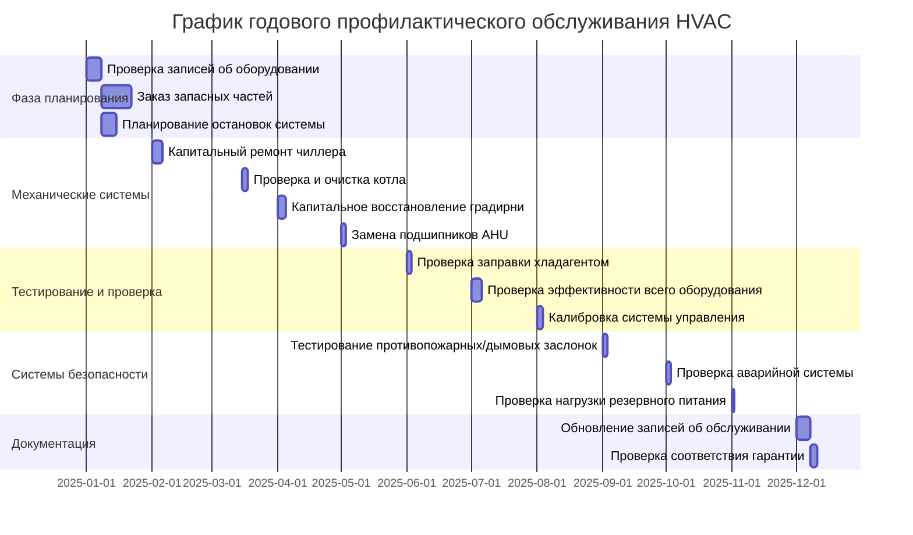

## Обзор

Годовые задачи обслуживания представляют наиболее полный уровень профилактического обслуживания, сосредоточенный на капитальном ремонте системы, глубокой очистке, замене компонентов и проверке производительности. Эти процедуры обеспечивают долговечность оборудования, соблюдение гарантий производителя и выявление потенциальных отказов до их возникновения. Годовые задачи обычно требуют специализированных инструментов, длительного простоя оборудования и подготовленных техников.

## Планирование годового обслуживания



## Задачи капитального ремонта основного оборудования

| Тип оборудования | Процедура капитального ремонта | Критически важные компоненты | Частота | Влияние на гарантию |
|----------------|-------------------|---------------------|-----------|-----------------|
| **Чиллеры** | Очистка пучка труб, проверка контура хладагента, анализ масла | Подшипники компрессора, обмотки двигателя, расширительный клапан | Ежегодно | Требуется для расширенной гарантии |
| **Котлы** | Очистка топочной/водяной части, анализ горения, проверка сосуда под давлением | Узел горелки, защита пламени, элементы управления уровнем воды | Ежегодно | Обязательно по требованиям производителя |
| **Градирни** | Очистка резервуара, замена заполнения, обслуживание редуктора | Подшипники вентилятора, приводные ремни, фильтры резервуара | Ежегодно | Требуется для гарантии градирни |
| **Воздухообрабатывающие установки** | Глубокая очистка змеевика, смазка/замена подшипников, капитальный ремонт системы ремней | Подшипники двигателя, вал вентилятора, ребра змеевика | Ежегодно | Продлевает гарантию двигателя |
| **VAV-боксы** | Калибровка привода, проверка лопаток заслонки, тестирование контроллера | Уплотнения заслонки, тяга привода, датчики | Ежегодно | Поддерживает гарантию управления |
| **Насосы** | Замена уплотнения, обслуживание подшипников, проверка рабочего колеса | Механические уплотнения, подшипники вала, муфта | Ежегодно | Требуется для гарантии уплотнения |

## Процедуры очистки теплообменников

### Трубки испарителя и конденсатора чиллера

**Этапы процедуры:**

1. **Изоляция системы**
   - Закройте запорные клапаны со стороны воды
   - Извлеките хладагент в баллоны для хранения
   - Заблокируйте/отметьте электрическое питание
   - Безопасно сбросьте давление в системе

2. **Доступ к пучку труб**
   - Снимите торцевые крышки и прокладки
   - Сфотографируйте состояние трубной решетки для записей
   - Отметьте все трубки с признаками коррозии или повреждения
   - Задокументируйте текущий уровень загрязнения

3. **Механическая очистка**
   - Используйте вращающуюся щеточную систему (диаметр трубки минус 2,4 см)
   - Проведите щетку через каждую трубку минимум три раза
   - Промойте водой высокого давления (3,5-7,0 МПа)
   - Проверьте трубки бороскопом на наличие остаточных отложений

4. **Химическая очистка (при необходимости)**
   - Циркулируйте раствор лимонной кислоты (5-10% концентрация)
   - Поддерживайте температуру раствора 49-60°C
   - Контролируйте pH и концентрацию ионов металла ежечасно
   - Тщательно нейтрализуйте и промойте после очистки

5. **Сборка и тестирование**
   - Установите новые прокладки (никогда не переиспользуйте)
   - Затяните болты торцевой крышки в соответствии с последовательностью производителя
   - Проведите гидростатический тест при давлении 150% от рабочего
   - Откачайте систему до 500 микрон перед заправкой

**Ожидаемые результаты:** Улучшение теплопередачи на 15-30%, снижение температуры приближения, снижение давления нагнетания компрессора.

### Очистка теплообменника котла

**Очистка топочной части:**
- Удалите отложения сажи щетками и пылесосом
- Очистите узел горелки и датчик пламени
- Проверьте огнеупор на наличие трещин или разрушения
- Измерьте размеры камеры сгорания на предмет эрозии

**Очистка водяной части:**
- Полностью слейте котел и проверьте на наличие осадка
- Удалите накипь механическими скребками или химическим удалением накипи
- Промойте нейтрализующим раствором
- Проверьте трубки на наличие питтинга, коррозии или истончения

## Процедуры замены подшипников

### Обслуживание подшипников двигателя

| Мощность двигателя | Тип подшипника | Критерии замены | Метод установки | Смазка |
|-----------|--------------|---------------------|---------------------|-------------|
| 0,75-3,7 кВ | Герметичные шариковые подшипники | Часов > 20000 или вибрация > 7,6 мм/с | Запрессовка, макс 121°C | Заводская герметичная |
| 5,5-18,5 кВ | Смазываемые шариковые подшипники | Часов > 30000 или вибрация > 10,2 мм/с | Нагрев до 82°C | NLGI Grade 2 EP |
| 22-75 кВ | Роликовые подшипники | Часов > 40000 или вибрация > 12,7 мм/с | Индукционный нагрев | Синтетическая NLGI Grade 2 |
| >75 кВ | Подшипники скольжения | Зазор > 0,203 мм или вибрация > 15,2 мм/с | Холодная установка со специальными инструментами | ISO VG 68 масло |

**Критические этапы установки:**

1. Измерьте размеры вала и зазоры отверстия подшипника
2. Проверьте вал на наличие задиров, ржавчины или износа
3. Нагрейте подшипник до 82-93°C (никогда не превышайте 121°C)
4. Быстро установите, используя правильные инструменты
5. Убедитесь, что подшипник полностью сидит относительно упора
6. Измерьте радиальное биение вала (макс. 0,051 мм)
7. Переустановите защиту и нанесите правильное количество смазки

### Замена подшипников вентилятора

- Снимите рабочее колесо вентилятора с помощью правильного съемника (никогда не наносите удары молотком по валу)
- Проверьте вал вентилятора на прямолинейность (< 0,127 мм TIR)
- Замените подшипники парами
- Переустановите сцепление двигателя (< 0,076 мм смещения, < 0,5° углового)
- Динамически отбалансируйте узел вентилятора, если вес изменился
- Проверьте температуру подшипника после 24 часов работы (< 82°C)

## Проверка эффективности и верификация производительности

### Тест производительности системы охлаждения

**Измеряемые параметры:**
- Температура приближения испарителя (< 1,1°C при расчетных условиях)
- Температура приближения конденсатора (< 2,8°C при расчетных условиях)
- Перегрев на всасывании компрессора (8-12°C типично)
- Переохлаждение на выходе конденсатора (10-15°C типично)
- Потребление мощности компрессором (сравнить с паспортными данными)
- Скорость потока воды через теплообменники

**Расчет эффективности:**
```
EER = Производительность охлаждения (кДж/ч) ÷ Потребление мощности (Вт)
кВт/кВ охлаждения = 12,660 ÷ EER

Целевой EER: воздухоохлаждаемый чиллер ≥ 10,0
             водоохлаждаемый чиллер ≥ 12,0
```

**Критерии приемки:**
- Эффективность в пределах 10% от номинальной производительности
- Отсутствие аномальных температур или давлений при работе
- Стабильная работа при различных условиях нагрузки
- Адекватный возврат масла в компрессор

### Тестирование эффективности горения

**Показатели производительности котла:**
- Температура дымовых газов (< 56°C выше температуры подаваемой воды)
- Избыточный O₂ в дымовых газах (3-6% для природного газа)
- Концентрация CO (< 100 ppm без воздуха)
- Эффективность горения (> 80% для стандартных котлов)
- Тяга дымохода (-0,05 до -0,12 кПа)

**Расчет эффективности:**
```
Эффективность горения (%) = 100 - [Потери дымовых газов + Потери неполного горения]

Потери дымовых газов ≈ (Температура дымов - Температура помещения) × Коэффициент K
Коэффициент K: Природный газ = 0,32, Топочный мазут = 0,36
```

## Тестирование сопротивления изоляции двигателя

### Процедура мегаомного теста

1. **Подготовка**
   - Отключите двигатель от источника питания
   - Отключите выводы двигателя от стартера
   - Заземлите корпус двигателя надежно
   - Дайте двигателю охладиться до температуры окружающей среды

2. **Тестирование**
   - Используйте мегаомметр 500В для двигателей ≤ 460В
   - Протестируйте каждую фазу на землю отдельно
   - Протестируйте сопротивление между фазами
   - Проведите тест поляризационного индекса (соотношение 10 мин/1 мин)

3. **Критерии приемки**

| Напряжение двигателя | Минимальное сопротивление | Необходимое действие |
|--------------|-------------------|-----------------|
| 460В | > 1,0 МОм | Пройдено - вернуть в эксплуатацию |
| 460В | 0,5-1,0 МОм | Внимание - исследовать и переоценить |
| 460В | < 0,5 МОм | Отказано - не включайте |
| Поляризационный индекс | > 2,0 | Хорошее состояние изоляции |
| Поляризационный индекс | 1,0-2,0 | Приемлемо, но контролировать |
| Поляризационный индекс | < 1,0 | Ухудшающаяся изоляция |

## Проверка заправки хладагентом

### Методы проверки точности заправки

**Метод перегрева (системы с фиксированным отверстием):**
- Измерьте температуру линии всасывания у компрессора
- Измерьте давление линии всасывания и переведите в температуру насыщения
- Рассчитайте перегрев = Фактическая температура - Температура насыщения
- Сравните с диаграммой производителя на основе наружных и внутренних условий
- Отрегулируйте заправку для достижения целевого перегрева (обычно 8-12°C)

**Метод переохлаждения (системы с TXV):**
- Измерьте температуру жидкостной линии на выходе конденсатора
- Измерьте давление жидкостной линии и переведите в температуру насыщения
- Рассчитайте переохлаждение = Температура насыщения - Фактическая температура
- Целевое переохлаждение обычно 10-15°C
- Добавьте хладагент, если переохлаждение слишком низкое, извлеките, если слишком высокое

**Метод взвешивания (наиболее точный):**
- Извлеките всю заправку хладагента в сертифицированный баллон для восстановления
- Взвесьте извлеченный хладагент и сравните с паспортом
- Откачайте систему до 500 микрон
- Заправьте точное количество согласно паспорту, используя калиброванные весы
- Задокументируйте вес заправки и производительность системы

## Калибровка системы управления

### Проверка и калибровка датчиков

| Тип датчика | Стандарт калибровки | Допустимый допуск | Частота переквалификации |
|-------------|---------------------|---------------------|------------------------|
| Температура (RTD) | NIST-отслеживаемый термометр | ±0,3°C | Ежегодно |
| Температура (термопара) | Эталонный узел | ±1,1°C | Ежегодно |
| Давление (0-2,07 МПа) | Тестер мертвых грузов | ±1% полной шкалы | Ежегодно |
| Дифференциальное давление | Манометр | ±5% от показания | Ежегодно |
| Влажность | Гигрометр зеркала охлаждения | ±3% OВ | Ежегодно |
| CO₂ | Сертифицированный калибровочный газ | ±50 ppm | Ежегодно |
| Расход (ультразвуковой) | Проверка методом ведра | ±5% от показания | Раз в два года |

### Тестирование хода привода

- Убедитесь в полном ходе (команда 0-100%)
- Измерьте время хода (должно соответствовать спецификации)
- Проверьте механические упоры и плотность тяги
- Протестируйте безопасное положение при потере питания
- Убедитесь, что сила пружинного возврата адекватна

## Соответствие гарантии производителя

**Требования документации:**
- Ведите подробные журналы обслуживания для всех годовых задач
- Сфотографируйте состояние оборудования до и после обслуживания
- Задокументируйте все измерения и результаты испытаний
- Задокументируйте замененные детали с номерами серий и датами
- Получите подписи сертификации поставщика услуг

**Критические положения гарантии:**
- Большинство производителей требует ежегодных проверок квалифицированными техниками
- Очистка теплообменников обязательна для сохранения гарантий теплопередачи
- Обслуживание подшипников требуется для сохранения гарантий двигателя
- Тестирование чистоты хладагента может потребоваться для гарантий компрессора
- Тестирование качества воды обязательно для гарантий котла и чиллера
- Тестирование эффективности горения требуется для гарантий горелки

**Последствия нарушения гарантии:**
- Производитель может отказать в претензиях за преждевременные отказы
- Покрытие расширенной гарантии автоматически аннулируется
- Запасные части больше недоступны по гарантийным ценам
- Сервисные контракты могут быть аннулированы

## Тестирование систем безопасности

### Проверка противопожарной и дымовой заслонки

- Визуальная проверка лопаток заслонки и рамы
- Тест ручного управления для проверки свободного движения
- Замена плавкой ссылки (номинал 74°C или 100°C)
- Тест функции привода с системой управления
- Измерьте время закрытия (< 5 секунд типично)
- Задокументируйте места расположения заслонок и результаты тестирования согласно NFPA 80

### Проверка аварийной системы

- Протестируйте работу автоматического переключателя передачи
- Проверьте, что аварийный генератор запускается в течение 10 секунд
- Нагрузочное тестирование генератора при 80-100% мощности на 2 часа
- Протестируйте все аварийные системы HVAC под питанием генератора
- Убедитесь в производительности системы эвакуации дыма
- Протестируйте ручные органы управления и аварийные остановы

## Документация и ведение записей

Ведите комплексные записи, включающие:
- Данные с паспортной таблички оборудования и даты установки
- Полную историю обслуживания с датами и именами техников
- Все результаты тестирования с критериями прохождения/отказа
- Замененные детали с производителем и номерами деталей
- Фотографии состояний, требующих внимания
- Рекомендации для будущих корректирующих действий
- Статус и даты истечения гарантии

Обновляйте систему автоматизации зданий с датами калибровки и датами планового следующего обслуживания.
