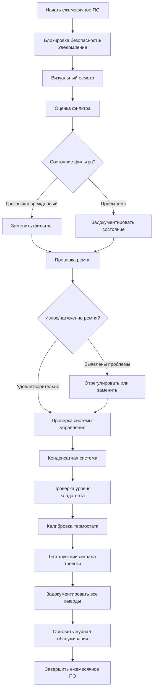

## Обзор

Ежемесячное профилактическое обслуживание является основой эффективного управления системой HVAC. Эти повторяющиеся задачи предотвращают превращение незначительных проблем в дорогостоящие отказы, при этом поддерживая энергоэффективность и качество воздуха в помещении. По рекомендациям ASHRAE структурированный ежемесячный график снижает количество неожиданных сбоев на 40-60%.

## Рабочий процесс ежемесячного обслуживания

## Периодичность задач для конкретного оборудования

| Тип оборудования | Замена фильтра | Проверка ремня | Проверка управления | Конденсатный слив | Проверка хладагента |
|---|---|---|---|---|---|
| **Блочный кровельный агрегат** | Ежемесячно | Ежемесячно | Ежемесячно | Ежемесячно | Ежемесячно |
| **Сплит-система** | Ежемесячно | Ежемесячно | Ежемесячно | Ежемесячно | Ежеквартально* |
| **Воздухообработчик** | Ежемесячно | Ежемесячно | Ежемесячно | Ежемесячно | Н/П |
| **Чиллер (воздушного охлаждения)** | Ежемесячно | Н/П | Ежемесячно | Ежемесячно | Ежемесячно |
| **Система VRF** | Ежемесячно | Н/П | Ежемесячно | Ежемесячно | Ежеквартально* |
| **Кондиционер серверной** | Два раза в неделю | Ежемесячно | Ежемесячно | Еженедельно | Ежемесячно |

*Перейти на ежемесячный график в период пиковного охлаждения (май-сентябрь)

## Подробный ежемесячный чек-лист по компонентам

### Воздушные фильтры

**Критерии проверки:**
- Измерение перепада давления через блок фильтра (замена при >0,25 кПа для стандартных фильтров, >0,5 кПа для HEPA)
- Визуальная оценка загрязнения, повреждений или байпаса
- Проверка уплотнений рамы фильтра и прокладок
- Проверка правильной ориентации фильтра (стрелки направления воздушного потока)

**Действия:**
- Замена одноразовых фильтров при загрязнении или повреждении
- Очистка постоянных/промывных фильтров согласно спецификации производителя
- Запись типа фильтра, рейтинга MERV и размера
- Документирование показаний перепада давления до и после замены

**Справочник по выбору фильтра:**
- MERV 8-11: Стандартные коммерческие применения
- MERV 13-14: Здравоохранение, лаборатории
- MERV 15-16 или HEPA: Критические среды, операционные

### Оборудование с ременным приводом

**Визуальный осмотр:**
- Осмотр поверхностей ремня на предмет трещин, расслоения, глазурования или отсутствия кусков
- Проверка правильного выравнивания между шкивами (максимальное угловое смещение 0,5°)
- Осмотр шкивов на предмет износа, повреждений или накопления мусора
- Проверка того, что защиты ремня закреплены и установлены правильно

**Проверка натяжения:**
- Приложить перпендикулярную силу в средней точке ремня между шкивами
- Надлежащий прогиб: 0,4 мм на сантиметр длины пролета
- Пример: пролет 100 см = прогиб 16 мм при твердом нажатии большого пальца
- Использовать датчик натяжения ремня для критических применений (минимальная частота 10 Гц)

**Документирование:**
- Запись типа ремня (A, B, 3V, 5V и т.д.)
- Отметить дату установки на ремне или в журнале
- Сфотографировать необычные паттерны износа

### Системы управления

**Проверка термостата и датчиков:**
- Проверка отображаемой температуры в сравнении с калиброванным термометром (допуск ±0,5°C)
- Тест изменения заданного значения и инициирования отклика оборудования
- Проверка состояния батареи в беспроводных или программируемых термостатах
- Проверка расположения датчика на предмет источников тепла, сквозняков или препятствий

**Проверка последовательности управления:**
- Ручное переключение через все режимы работы (отопление, охлаждение, вентилятор, автоматический)
- Подтверждение правильной последовательности ступенчатого управления для оборудования с несколькими ступенями
- Тест работы заслонки экономайзера (если применимо)
- Проверка правильной работы блокировок (детекторы дыма, фростстаты, переключатели потока)

**Тестирование элементов безопасности:**
- Работа переключателей высокого/низкого давления
- Фростстат или отключение при низкой температуре
- Элементы управления ограничения высокой температуры
- Переключатели потока и дифференциального давления

### Система конденсатного слива

**Точки проверки:**
- Состояние поддона первичного слива (коррозия, застойная вода, биологический рост)
- Наличие воды во вторичном/вспомогательном поддоне (указывает на забивку первичного)
- Конденсатный трубопровод чистый и имеет хороший поток
- Уплотнение P-образного сифона целое (предотвращает засасывание воздуха)
- Работа конденсатного насоса и уровень в резервуаре (если установлен)

**Процедура очистки:**
1. Удалить видимый мусор из поддона слива
2. Промыть трубопровод слива водой для проверки потока
3. Применить биоцидные таблетки или жидкость согласно рекомендации производителя
4. Тест поплавкового переключателя в конденсатном насосе (если присутствует)
5. Проверить надлежащий уклон на трубопроводах слива (минимум 3 мм на 30 см)

### Оценка уровня хладагента

**Визуальные индикаторы:**
- Состояние смотрового стекла (прозрачная жидкость указывает на надлежащий заряд для соответствующих систем)
- Мороз на всасывающем трубопроводе или чрезмерная конденсация (возможная недозаправка)
- Температура трубопровода жидкости относительно температуры окружающей среды (индикатор перезаправки)

**Точки измерения:**
- Давление всасывания в сравнении со спецификациями производителя
- Давление линии жидкости при температуре наружного воздуха
- Расчет перегрева: фактическая температура всасывания - температура насыщения при давлении всасывания
- Расчет переохлаждения: температура насыщения при давлении жидкости - фактическая температура жидкости

**Целевые значения (R-410A типичный жилой сплит):**
- Перегрев: 5-8°C (фиксированное отверстие), 4-7°C (TXV)
- Переохлаждение: 4-7°C
- Обратитесь к технической табличке оборудования и таблицам заправки производителя для конкретных целевых значений

### Проверка уровня масла (применимое оборудование)

**Проверка масла компрессора:**
- Найти смотровое стекло масла на картере компрессора
- Уровень масла должен находиться на центральной линии индикатора при работающей системе
- Проверка прозрачности масла (чистое масло прозрачное или светло-янтарное; темное масло требует анализа)
- Для систем без смотрового стекла следовать процедуре проверки производителя

**Индикаторы качества масла:**
- Результаты анализа кислотности в приемлемом диапазоне (<0,05 мг KOH/г)
- Содержание влаги <50 ppm для масел POE
- Ежегодное планирование анализа масла для критических систем

### Тестирование устройств сигнализации и безопасности

**Требования к ежемесячному тестированию:**
- Ручное срабатывание каждой точки сигнализации для проверки локального и удаленного указания
- Тест визуальных и звуковых функций сигнализации
- Проверка правильной активации автоматических последовательностей отключения
- Проверка функциональности сброса сигнализации
- Подтверждение связи сигнализации BMS/BAS (если интегрирована)

**Критические сигналы для тестирования:**
- Высокая/низкая температура
- Отказ оборудования
- Дифференциальное давление фильтра (если контролируется)
- Интерфейс детектора дыма
- Отказ электроснабжения/потеря фазы

## Требования к документированию

Каждый визит по ежемесячному обслуживанию требует тщательного документирования:

**Минимальные записи в журнале:**
- Дата, время и идентификация техника
- Данные технической таблички оборудования и серийный номер
- Все показания параметров (давления, температуры, напряжения, токи)
- Состояние фильтров и действия по замене
- Состояние ремня и регулировки натяжения
- Любые необычные наблюдения или предпринятые корректирующие действия
- Замененные детали с номерами деталей
- Рекомендации по дальнейшему обслуживанию

**Отслеживание критических параметров:**
Отслеживать эти значения ежемесячно для выявления тенденций деградации:
- Температуры подачи и возврата воздуха
- Температуры входа и выхода воды (гидравлические системы)
- Потребление электрического тока по фазам
- Давления хладагента
- Перепад давления фильтра
- Время работы (от счетчика часов или BMS)

## Выравнивание с графиком производителя

Всегда обращайтесь к расписанию обслуживания конкретного производителя оборудования как к основному авторитету. Универсальные графики предоставляют базовое руководство, но требования производителя могут включать:

- Собственные процедуры обслуживания
- Конкретные спецификации крутящего момента
- Уникальные требования к смазке
- Интервалы обслуживания, установленные гарантией
- Графики обновления программного обеспечения/прошивки

**Основные ресурсы производителей:**
- Carrier, Trane, Lennox, York, Daikin, Mitsubishi: предоставляют подробные руководства по обслуживанию со специфическими ежемесячными списками задач
- Ссылка на руководство IOM (установка, эксплуатация, обслуживание), поставляемое с оборудованием
- Доступ к онлайн-порталам услуг для получения специфических бюллетеней по обслуживанию оборудования

## Интеграция в комплексную программу ПО

Ежемесячные задачи формируют один уровень многочастотной стратегии обслуживания:

- **Еженедельно/два раза в неделю:** Оборудование высокой критичности или экстремальные условия эксплуатации
- **Ежемесячно:** Стандартные повторяющиеся задачи, описанные выше (этот документ)
- **Ежеквартально:** Расширенные проверки, анализ хладагента, детальное электротестирование
- **Два раза в год:** Обслуживание основных компонентов, очистка теплообменников, тестирование производительности системы
- **Ежегодно:** Комплексная оценка системы, анализ эффективности, оценки прогнозного обслуживания

Надлежащее выполнение ежемесячных задач непосредственно влияет на долговечность системы, энергоэффективность и комфорт жильцов. Последовательность и тщательное документирование преобразуют обслуживание из реактивного в прогнозное, снижая затраты на жизненный цикл на 25-35% за время эксплуатации оборудования.
