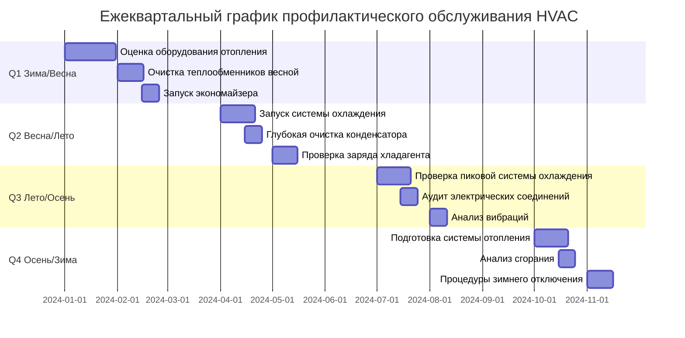

Ежеквартальное обслуживание представляет оптимальный интервал для критических задач систем HVAC, которые предотвращают сезонные отказы и поддерживают пиковую эффективность. Эти процедуры соответствуют требованиям стандарта ASHRAE 180-2018 и рекомендациям производителей для коммерческих и промышленных систем.

## Обзор графика ежеквартального обслуживания

Ежеквартальный цикл обслуживания разделяет год на стратегические периоды сезонной подготовки, каждый сосредоточен на готовности оборудования к предстоящим тепловым нагрузкам.

## Контрольные списки сезонной подготовки

### Q1: Переход с зимы на весну (январь-март)

- **Оценка оборудования отопления**: Проверьте эффективность котла перед окончанием сезона, задокументируйте показания сгорания
- **Проверка испарительного теплообменника**: Удалите накопившуюся пыль от зимней работы отопления
- **Весенний запуск экономайзера**: Проверьте работу заслонок, убедитесь в контроле температуры смешанного воздуха
- **Очистка бассейна градирни**: Удалите зимний мусор, проверьте наполнитель на повреждения
- **Испытание системы хладагента под давлением**: Убедитесь в статических давлениях перед сезоном охлаждения
- **Калибровка системы управления**: Пересчитайте датчики наружного воздуха и смешанного воздуха

### Q2: Переход с весны на лето (апрель-июнь)

- **Глубокая очистка конденсаторного теплообменника**: Удалите пух, пыльцу и накопившийся мусор
- **Проверка заряда хладагента**: Измерьте переохлаждение/перегрев при условиях проектирования
- **Процедуры запуска холодильника**: Выполните анализ масла, проверьте уровни хладагента
- **Водоподготовка градирни**: Установите скорость продувки, убедитесь в уровнях биоцидов
- **Очистка радиатора VFD**: Удалите пыль с охлаждающих ребер преобразователей частоты
- **Функциональное испытание экономайзера**: Убедитесь в работе режима 100% наружного воздуха

### Q3: Период пиковой летней нагрузки (июль-сентябрь)

- **Переосмотр конденсаторного теплообменника**: Вторая очистка в случае присутствия переносимого по воздуху мусора
- **Проверка крутящего момента электрического соединения**: Тепловой цикл вызывает ослабление соединения
- **Анализ вибраций вращающегося оборудования**: Износ подшипника ускоряется при пиковых нагрузках
- **Проверка утечек хладагента**: Проверьте все паяные соединения, конусные фитинги и стержни клапанов
- **Проверка водоподготовки**: Циклы концентрирования воды в градирне, уровни pH
- **Анализ масла холодильника**: Кислотное число, содержание влаги, загрязнение хладагентом

### Q4: Переход с осени на зиму (октябрь-декабрь)

- **Запуск системы отопления**: Анализ сгорания всего оборудования, работающего на топливе
- **Проверка теплообменника**: Визуальное обследование на наличие трещин, коррозии, воздействия пламени
- **Проверка конденсатопровода**: Очистите все сифоны, убедитесь в надлежащем отводе перед сезоном отопления
- **Консервация оборудования охлаждения**: Осушите градирни, добавьте гликоль в открытые трубопроводы
- **Запуск системы увлажнения**: Очистите резервуары, замените засыпку, проверьте выход пара
- **Замена фильтра воздухообработчика**: Установите высокоэффективные фильтры перед сезоном отопления

## Ежеквартальные задачи, специфичные для оборудования

### Воздухоохлаждаемое оборудование

| Задача | Процедура | Критерии приемки |
|------|-----------|---------------------|
| Очистка конденсаторного теплообменника | Обратная промывка водой под давлением 2 070-3 450 кПа | ΔT через теплообменник в пределах 5,6°C от проектного |
| Проверка заряда хладагента | Измерьте переохлаждение на линии подачи жидкости | Переохлаждение 4,4-6,7°C при 35°C окружающей среды |
| Смазка подшипников электродвигателя | Нанесите консистентную смазку согласно спецификации производителя | Вибрация < 5,1 мм/с RMS |
| Проверка электрических контактов | Затяните в соответствии со спецификацией производителя | Отсутствие обесцвечивания, рост < 5,6°C выше окружающей среды |
| Проверка таймера разморозки | Пройдите полный цикл разморозки | Полная разморозка за < 20 минут |

### Водоохлаждаемое оборудование

| Задача | Процедура | Критерии приемки |
|------|-----------|---------------------|
| Проверка наполнителя градирни | Удалите мусор, проверьте на биологический рост | Равномерное распределение воды через наполнитель |
| Очистка конденсаторных трубок | Чистка щеткой или химическое удаление отложений | Температура приближения < 1,1°C от проектной |
| Проверка водоподготовки | Измерьте pH, проводимость, остаток биоцида | pH 7,5-8,5, циклы < 4,0 |
| Очистка сетки бассейна | Удалите осадок и мусор | Переключатели потока работают |
| Проверка клапана продувки | Подтвердите работу автоматической продувки | TDS в пределах целевого диапазона |

### Системы экономайзеров

| Задача | Процедура | Критерии приемки |
|------|-----------|---------------------|
| Испытание хода привода заслонки | Дайте команду 0-100% наружного воздуха | Полный ход за < 2 минут |
| Проверка положения минимума | Измерьте поток наружного воздуха при минимуме | Соответствует требованиям ASHRAE 62.1 |
| Калибровка датчика энтальпии | Сравните с откалиброванным эталоном | В пределах ±1,1°C сухого термометра, ±5% RH |
| Проверка герметичности ножей заслонки | Визуальная проверка щелей, разорванных уплотнений | Утечка < 10% в закрытом положении |
| Работа разгрузочной заслонки | Убедитесь в контроле давления в здании | Давление в пределах ±5,1 Па от уставки |

### Котлы и печи

| Задача | Процедура | Критерии приемки |
|------|-----------|---------------------|
| Анализ сгорания | Измерьте O₂, CO, CO₂, температуру дымохода | CO < 50 млн⁻¹, эффективность > 80% |
| Проверка теплообменника | Визуальная проверка с камерой при необходимости | Отсутствие трещин, коррозии, углеродных отложений |
| Очистка узла горелки | Удалите нагар со сгоревших горелок | Равномерный рисунок пламени, отсутствие желтых кончиков |
| Проверка давления газа | Измерьте давление в коллекторе и подаче | В пределах ±10% номинального значения |
| Проверка обнаружения выкидов пламени | Имитируйте условие заблокированного дымохода | Блокировка безопасности в течение 5 секунд |

## Протоколы очистки теплообменников

Чистота теплообменников напрямую влияет на производительность и эффективность системы. Загрязненные теплообменники увеличивают перепад давления, снижают поток воздуха и ухудшают характеристики теплопередачи.

### Очистка испарительного теплообменника

**Частота**: Ежеквартально в условиях высокого содержания частиц, два раза в год в нормальных условиях

**Процедура**:
1. Отключите питание оборудования, зафиксируйте источник питания
2. Удалите кассеты фильтров и панели доступа
3. Нанесите щелочный очиститель теплообменников (pH 11-13) с помощью распылителя низкого давления
4. Дайте 10-15 минут для эмульгирования загрязнений
5. Промойте чистой водой в направлении, противоположном потоку воздуха
6. Проверьте прямолинейность ребер, выпрямите ребра при необходимости (количество ребер на дюйм должно совпадать с оригиналом)
7. Проверьте поддон и конденсатопровод на предмет блокировок

**Проверка производительности**: Измерьте перепад статического давления через теплообменник. Приемлемый диапазон 37-87 Па при расчетном воздушном потоке для стандартных охлаждающих теплообменников.

### Очистка конденсаторного теплообменника

**Частота**: Ежеквартально до и во время сезона охлаждения в загрязненной среде

**Процедура**:
1. Отключите оборудование, убедитесь в отключении всего электрического питания
2. Сфотографируйте состояние теплообменника для записей техническое обслуживание
3. Удалите крупный мусор вручную с помощью пылесоса или сжатого воздуха
4. Нанесите кислотный очиститель теплообменников (pH 2-4) для минеральных отложений или щелочный очиститель (pH 11-13) для органических веществ
5. Промойте теплообменники изнутри наружу с помощью мойки высокого давления на 2 070-3 450 кПа максимум
6. Проверьте лопасти вентилятора на балансировку и повреждения
7. Убедитесь в надлежащих давлениях хладагента после перезапуска

**Проверка производительности**: Температура конденсации должна быть на 8,3-11,1°C выше окружающей среды при расчетной нагрузке. Более высокие значения указывают на оставшееся загрязнение или недостаточный поток воздуха.

## Ежеквартальные проверки системы хладагента

Утечка хладагента снижает производительность и эффективность, одновременно увеличивая температуру нагнетания компрессора. Ежеквартальная проверка предотвращает постепенное деградацию системы.

### Методы обнаружения утечек

1. **Электронное обнаружение утечек**: Используйте датчики с нагреваемым диодом или инфракрасные, чувствительность минимум 0,14 г/год
2. **Испытание пузырьковым раствором**: Нанесите на все соединения, стыки и стержни клапанов под давлением системы
3. **Проверка ультрафиолетовым красителем**: Добавьте флюоресцентный краситель, проверьте с ультрафиолетовым светом через 1-2 недели работы
4. **Ультразвуковое обнаружение**: Найдите утечки высокого давления, обнаружив ультразвуковой шум частоты

### Критические точки проверки

- Паяные соединения в выключателях обслуживания
- Конические соединения на фильтре-осушителе линии подачи жидкости
- Основные клапаны Шредера в портах обслуживания
- Прокладки картера компрессора
- Соединения трубок конденсатора/испарителя к коллектору
- Соединения чувствительной лампочки термостатического расширительного клапана

### Проверка заряда хладагента

**Системы с фиксированным отверстием** (капиллярная трубка/поршневое дозирование):
- Целевое значение: переохлаждение 4,4-6,7°C в конденсирующем блоке, перегрев 5,6-8,3°C на выходе испарителя
- Измерьте температуру и давление линии подачи жидкости в наружном блоке
- Переохлаждение = Температура насыщения при конденсации - Температура линии подачи жидкости

**Системы с термостатическим расширительным клапаном**:
- Целевое значение: перегрев 4,4-6,7°C на выходе испарителя
- Измерьте температуру и давление линии всасывания на испарителе
- Перегрев = Температура линии всасывания - Температура насыщения при испарении

## Испытание и запуск экономайзеров

Отказы экономайзеров приводят к значительным потерям энергии при смешивании наружного воздуха или отказе использования свободного охлаждения при доступности.

### Ежеквартальные функциональные испытания

1. **Испытание положения минимума**: Дайте команду экономайзеру на минимальное положение, убедитесь в соответствии поток наружного воздуха требованиям вентиляции ASHRAE 62.1 (обычно 10-20% наружного воздуха)

2. **Испытание максимального положения**: Дайте команду на 100% наружный воздух, убедитесь в закрытии заслонки возврата и полном открытии заслонки наружного воздуха (< 10% утечка)

3. **Испытание модуляции**: Медленно увеличивайте спрос на охлаждение, убедитесь в плавной модуляции заслонки без колебаний или осцилляций

4. **Испытание логики переключения**: Убедитесь в отключении экономайзера при надлежащих условиях наружного воздуха (обычно 13-21°C в зависимости от конструкции системы)

5. **Контроль температуры смешанного воздуха**: Убедитесь в поддержании смешанным воздухом уставки (обычно 13°C) при работе экономайзера

### Распространенные режимы отказов

- **Заклиненные связи заслонок**: Коррозия предотвращает движение заслонки
- **Неисправные приводы**: Потеря сигнала управления или механический отказ
- **Дрейф датчика**: Датчики наружного или возвратного воздуха показывают неправильно
- **Утечки заслонок**: Разорванные уплотнения ножей допускают неконтролируемое смешивание
- **Ошибки логики управления**: Неправильные уставки переключения или отключенные последовательности

## Справочник промышленных стандартов

**ASHRAE Standard 180-2018**: Стандартная практика проверки и обслуживания коммерческих систем HVAC зданий

- Определяет ежеквартальные частоты проверки критических компонентов
- Определяет критерии приемки производительности системы
- Устанавливает требования к документированию работ по техническому обслуживанию

**ASHRAE Guideline 0-2019**: Процесс наладки

- Описывает процедуры испытания функциональной производительности
- Устанавливает требования сезонной наладки
- Документирует методы проверки производительности

**NFPA 90A**: Стандарт по установке систем кондиционирования и вентиляции

- Требует ежеквартальной очистки теплообменников в загрязненной среде
- Определяет зазоры и требования доступа для обслуживания

Ежеквартальные интервалы обслуживания обеспечивают оптимальный баланс между надежностью системы и распределением ресурсов обслуживания. Следование этим процедурам предотвращает сезонные отказы, поддерживает энергоэффективность и продлевает срок службы оборудования.
