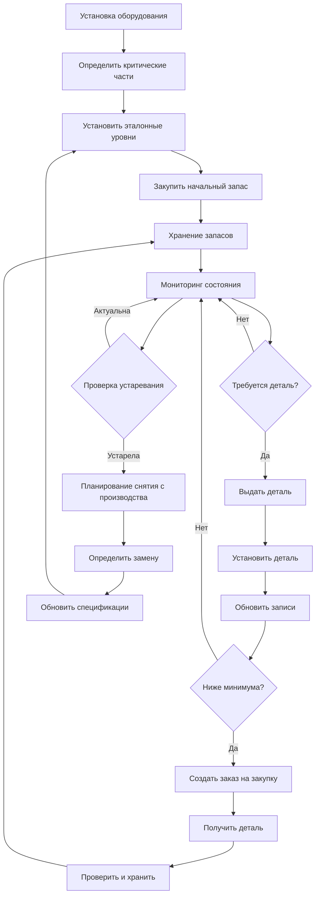

## Обзор

Эффективное управление запасными частями уравновешивает надежность оборудования в сравнении с затратами на хранение запасов. Стратегическое размещение запасов предотвращает продолжительные простои при минимизации капитала, связанного с запасами. Критические компоненты требуют немедленной доступности, в то время как некритические элементы могут использовать стратегии снабжения точно в срок.

## Анализ критичности

Критичность деталей определяет приоритеты размещения запасов на основе влияния отказа и времени закупки.

**Матрица критичности:**

| Уровень критичности | Влияние простоя | Время закупки | Вероятность отказа | Стратегия размещения |
|-------------------|-----------------|-----------|---------------------|-------------------|
| A - Критический | >24 часов | >7 дней | Высокая | Запастись 100% |
| B - Важный | 8-24 часов | 3-7 дней | Средняя | Запастись 50-75% |
| C - Стандартный | 2-8 часов | 1-3 дня | Средне-низкая | Запастись 25-50% |
| D - Некритический | <2 часов | <24 часов | Низкая | Точно в срок |

**Критические запасные части по типам оборудования:**

| Оборудование | Критические запасные части | Рекомендуемое количество | Среднее время закупки |
|-----------|----------------|----------------------|-------------------|
| Холодильные машины | Пускатель компрессора, масляный фильтр, датчик хладагента | 1-2 шт. | 14-30 дней |
| Котлы | Электрод ионизации, газовый клапан, уплотнение циркуляционного насоса | 2-3 шт. | 7-14 дней |
| Воздухообрабатывающие установки | Наборы ремней, подшипниковые узлы, приводы | 2-4 шт. | 5-10 дней |
| Градирни | Секции заполнителя, элиминаторы капель, поплавковый клапан | 1-2 шт. | 10-21 дней |
| VRF системы | Электронный расширительный клапан, узел печатной платы, датчик хладагента | 1-2 шт. | 21-45 дней |
| Системы управления | Датчики в помещении, приводы клапанов, модули управления | 3-5 шт. | 3-7 дней |

## Стратегии оптимизации запасов

### Экономичный размер заказа (EOQ)

Модель EOQ минимизирует общие затраты на запасы путем уравновешивания затрат на заказ и затрат на хранение:

EOQ = √(2DS/H)

Где:
- D = Годовой спрос (единицы)
- S = Стоимость заказа за один заказ
- H = Стоимость хранения за единицу в год

**Пример расчета:**
- Годовой спрос: 48 фильтров
- Стоимость заказа: 5000 руб. за заказ
- Стоимость хранения: 800 руб. за фильтр в год

EOQ = √(2 × 48 × 5000 / 800) = √600 = 24,5 ≈ 25 фильтров за заказ

### Система минимум-максимум запасов

Устанавливает точки переупорядочения и максимальные уровни запасов на основе темпов потребления и времени закупки.

**Расчет минимум-максимум:**
- Минимум = (Среднесуточное использование × Время закупки) + Страховой запас
- Максимум = Минимум + EOQ

Страховой запас обычно равен потреблению в течение 1-2 недель для критических деталей.

### ABC анализ

Классифицирует запасы по стоимости и потреблению:

- **Товары группы A (70-80% стоимости, 10-20% товаров):** Жесткий контроль, частый пересмотр, точные записи
- **Товары группы B (15-25% стоимости, 30-40% товаров):** Умеренный контроль, периодический пересмотр
- **Товары группы C (5-10% стоимости, 40-50% товаров):** Простые элементы управления, оптовые заказы

## Управление жизненным циклом запасных частей

## Определение уровней запасов

**Факторы, влияющие на уровни запасов:**

- Возраст оборудования и история надежности
- Время закупки у производителя и доступность деталей
- Стоимость простоя в сравнении с затратами на хранение
- Ограничения по пространству и условиям хранения
- Результаты анализа видов и последствий отказов (FMEA)
- Требования соглашений об уровне обслуживания (SLA)

**Рекомендуемые множители запасов:**

| Возраст оборудования | Коэффициент надежности | Множитель запаса |
|---------------|-------------------|------------------|
| 0-5 лет | Высокая | 0,5-1,0x |
| 5-10 лет | Средняя | 1,0-1,5x |
| 10-15 лет | Средне-низкая | 1,5-2,0x |
| >15 лет | Низкая | 2,0-3,0x |

## Управление устаревлением

Жизненный цикл оборудования обычно составляет 15-25 лет, в то время как доступность деталей часто заканчивается за 7-10 лет после производства.

**Стратегии снижения риска устаревания:**

1. **Закупки в конце жизни:** Закупите расширенный запас, когда производители объявляют о прекращении выпуска
2. **Альтернативные источники:** Определите поставщиков вторичного рынка и совместимые замены
3. **Программы переизготовления:** Установите отношения со специалистами по переделке
4. **Проектные решения:** Спланируйте модернизацию оборудования для исключения устаревших компонентов
5. **Мониторинг технологий:** Отслеживайте дорожные карты продуктов производителей и тенденции отрасли

**Временная шкала оценки риска устаревания:**

| Время с момента прекращения выпуска | Уровень риска | Требуемые действия |
|---------------------------|------------|-----------------|
| >5 лет | Низкий | Следить за доступностью |
| 3-5 лет | Средний | Обезопасить альтернативные источники |
| 1-3 года | Высокий | Выполнить закупку в конце жизни |
| <1 года | Критический | Экстренные закупки и планирование модернизации |

## Лучшие практики управления запасами

**Требования к хранению:**
- Климатизированная среда (15-27°C, <60% влажность) для электронных компонентов
- Сухое хранилище для прокладок, уплотнений и резиновых компонентов
- Отдельное хранилище для хладагентов и масел с вторичной защитой от разливов
- Ротация по принципу «первым пришел — первым ушел» (FIFO) для чувствительных по времени товаров
- Четкая маркировка с номерами деталей, тегами оборудования и датами установки

**Системы документации:**
- Интеграция с системой компьютеризованного управления техническим обслуживанием (CMMS)
- Отслеживание штрих-кодов или RFID для высокостоимостных товаров
- База данных перекрестных ссылок деталей, связывающая номера производителя и вторичного рынка
- Предупреждения по минимальным и максимальным количествам
- Анализ истории использования и тенденций отказов

**Метрики производительности:**
- Коэффициент оборачиваемости запасов (целевой показатель: 2-4 для запасных частей HVAC)
- Уровень дефицита запасов (целевой показатель: <2% для критических товаров)
- Затраты на хранение запасов как процент от общей стоимости (целевой показатель: 15-25%)
- Среднее время пополнения
- Процент неиспользуемых запасов (целевой показатель: <5%)

**Управление поставщиками:**
- Установите соглашения с предпочтительными поставщиками с обязательствами по ценам
- Поддерживайте минимум два источника для критических деталей
- Согласуйте консигнационные запасы для высокостоимостных товаров с низким оборотом
- Внедрите управление запасами, осуществляемое поставщиком (VMI), для стандартных деталей
- Регулярные проверки эффективности поставщиков (время доставки, качество, цены)

## Протоколы экстренных закупок

Когда критические детали выходят из строя без наличия запасов:

1. **Немедленные действия:** Свяжитесь с основным поставщиком для ускоренной доставки, проверьте внутренние запасы на других объектах
2. **Альтернативные источники:** Свяжитесь с вторичными поставщиками, поставщиками вторичного рынка, компаниями по сдаче оборудования в аренду
3. **Временные решения:** Внедрите стратегии обхода, разверните портативное оборудование, передайте детали из резервных систем
4. **Документация:** Запишите первопричину, обновите оценку критичности, отрегулируйте уровни запасов

Эффективное управление запасными частями требует постоянного совершенствования на основе данных о производительности оборудования, изменения операционных требований и развивающегося ландшафта доступности деталей.
