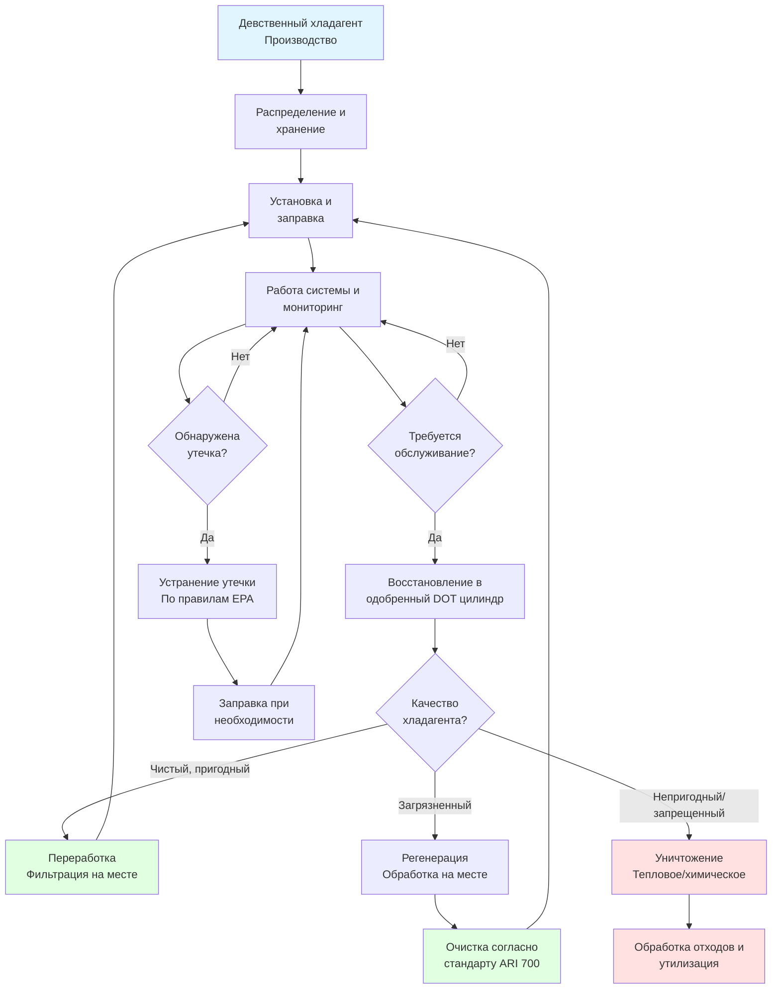

# Управление хладагентом: безопасность и соответствие нормам

Надлежащее управление хладагентом защищает техников, жителей здания и окружающую среду, обеспечивая соответствие нормативным требованиям. Это руководство рассматривает протоколы обращения, требования к хранению, процедуры восстановления и методы утилизации, установленные нормами EPA и стандартами ASHRAE.

## Требования сертификации EPA 608

EPA требует сертификации в соответствии с Разделом 608 Закона о чистом воздухе для всех техников, которые обслуживают, ремонтируют или утилизируют оборудование, содержащее регулируемые хладагенты. Сертификация подтверждает компетентность в обращении и восстановлении хладагентов.

### Типы сертификации

| Тип | Охватываемое оборудование | Предел заряда |
|------|------------------|--------------|
| Тип I | Малые холодильные приборы | < 2,3 кг хладагента |
| Тип II | Высокопрессионные системы | Кондиционирование, тепловые насосы, коммерческое охлаждение |
| Тип III | Низкопрессионные системы | Центробежные чиллеры |
| Universal | Все типы оборудования | Все размеры заряда |

**Требуемые основные компетенции:**
- Свойства хладагента и воздействие на окружающую среду
- Правильное использование оборудования для восстановления и переработки
- Процедуры обнаружения утечек и их устранения
- Безопасное обращение и хранение
- Требуемые уровни вакуумирования по типам оборудования
- Обязанности по ведению записей и отчетности

## Классификация хладагентов по безопасности

Стандарт ASHRAE 34 классифицирует хладагенты по характеристикам токсичности и воспламеняемости, определяя безопасные концентрационные пределы и требования к обращению.

### Система классификации ASHRAE 34

| Класс | Токсичность | Воспламеняемость | Примеры | Предел концентрации (ppm) |
|-------|----------|--------------|----------|---------------------------|
| A1 | Низкая | Без распространения пламени | R-134a, R-410A, R-744 (CO₂) | 1 000+ |
| A2L | Низкая | Низкая воспламеняемость | R-32, R-454B, R-1234yf | 210–590 |
| A2 | Низкая | Воспламеняемый | R-152a, R-290 (пропан) | 65–150 |
| A3 | Низкая | Высокая воспламеняемость | R-600a (изобутан), R-1270 | 40–60 |
| B1 | Высокая | Без распространения пламени | R-123 | 10–50 |
| B2L | Высокая | Низкая воспламеняемость | (Ограниченное использование) | 5–25 |

**Основные параметры:**
- **Класс токсичности A:** Предел концентрации хладагента (RCL) ≥ 400 ppm
- **Класс токсичности B:** RCL < 400 ppm
- **Воспламеняемость:** На основе скорости горения и теплоты сгорания

## Управление жизненным циклом хладагента

## Протоколы обращения и хранения

### Безопасные практики обращения

**Личное защитное снаряжение (СИЗ):**
- Защитные очки с боковой защитой (ANSI Z87.1)
- Перчатки из неопрена или нитрила, устойчивые к воздействию хладагента
- Средства защиты органов дыхания для закрытых помещений или высоких концентраций
- Защитная обувь и одежда для предотвращения обморожения от жидкого хладагента

**Процедуры обращения:**
- Никогда не подвергайте цилиндры воздействию температур выше 52°C
- Используйте регуляторы давления, подходящие для типа хладагента
- Подключайте и отключайте шланги медленно, чтобы предотвратить скачки давления
- Продувайте шланги парами хладагента перед подключением
- Никогда не смешивайте хладагенты в цилиндрах восстановления
- Четко маркируйте все цилиндры с указанием типа и состояния хладагента

### Требования к хранению (ASHRAE 15)

**Хранение цилиндров:**
- Храните в вертикальном положении в хорошо вентилируемых помещениях, вдали от источников тепла
- Закрепляйте цилиндры, чтобы предотвратить опрокидывание
- Отделяйте полные и пустые цилиндры четкой маркировкой
- Поддерживайте температуру в помещении хранения ниже 52°C
- Держите цилиндры подальше от несовместимых материалов (масла, окислители)
- Установите системы обнаружения хладагента в закрытых помещениях хранения

**Вентиляция машинного отделения:**
- Минимальная скорость вентиляции: 0,5 CFM (0,85 м³/ч) на м² площади машинного отделения
- Аварийная механическая вентиляция автоматически активируется детекторами
- Порог обнаружения хладагента: 25% от RCL в соответствии с ASHRAE 34
- Система сигнализации слышна внутри и снаружи машинного отделения

## Стандарты восстановления и вакуумирования

Нормы EPA устанавливают обязательные уровни эффективности восстановления в зависимости от типа оборудования и процедур обслуживания.

### Требуемые уровни восстановления

| Тип оборудования | Размер системы | Требуемое восстановление |
|----------------|-------------|-------------------|
| Малые холодильные приборы | < 2,3 кг | 90% заряда (80%, если компрессор неработающий) |
| Высокопрессионные системы | < 91 кг | 25 мм рт. ст. вакуума |
| Высокопрессионные системы | ≥ 91 кг | 38 мм рт. ст. вакуума |
| Низкопрессионные чиллеры | Все размеры | 0,64 мм рт. ст. абсолютного (73 мм рт. ст. вакуума) |

**Требования к оборудованию восстановления:**
- Сертифицировано в соответствии со стандартом ARI 740 для оборудования восстановления/переработки
- Оснащено низконапорными фитингами для минимизации выброса
- Надлежащее обслуживание с заменой фильтров и маслом
- Откалиброванные манометры и вакуумные приборы

### Переработка и регенерация

**Переработка (на месте):**
- Отделение масла и фильтрация через фильтр-осушитель 48 микрон
- Один или несколько проходов для снижения влажности и кислотности
- Может быть возвращена в ту же систему или другие системы того же владельца
- Не восстанавливает хладагент до стандарта чистоты ARI 700

**Регенерация (на месте):**
- Переработка до спецификаций девственного хладагента (ARI 700)
- Химический анализ с проверкой уровней чистоты
- Может быть продана или использована любым конечным пользователем
- Требуется для загрязненных или смешанных хладагентов

## Требования к устранению утечек

Нормы EPA требуют устранения утечек, когда системы превышают установленные годовые показатели утечек.

### Пороговые значения утечек по типам оборудования

| Категория оборудования | Пороговое значение (в год) |
|-------------------|----------------------|
| Комфортное охлаждение (< 23 кг) | 20% |
| Коммерческое охлаждение | 20% |
| Промышленное холодоснабжение | 20% |
| Комфортное охлаждение (≥ 23 кг) | 10% |
| Федеральные учреждения | 10% |

**График соответствия:**
- Первоначальная проверка утечки в течение 14 дней после обнаружения порогового значения
- Ремонт завершен в течение 30 дней (или представлен план замены/списания системы)
- Проверка подтверждения в течение 30 дней после завершения ремонта
- Ведение записей всех ремонтов и утечек в течение 3 лет

## Утилизация и уничтожение

Хладагенты ни при каких обстоятельствах не могут выбрасываться в атмосферу. Непригодные хладагенты требуют надлежащего уничтожения.

**Утвержденные методы уничтожения:**
- Термическое уничтожение при температурах выше 1 093°C
- Обработка методом плазменной дуги
- Методы химической реакции, производящие стабильные соединения
- Объекты уничтожения должны быть сертифицированы и сообщать количества уничтоженного хладагента

**Требуемая документация:**
- Цепь сохранения документации от восстановления до уничтожения
- Сертификаты уничтожения от одобренных объектов
- Отчеты EPA об уничтожении озоноразрушающих веществ
- Хранение записей в течение минимум 3 лет

## Процедуры экстренного реагирования

**Выброс хладагента:**
1. Немедленно эвакуируйте пострадавшую зону
2. Активируйте системы аварийной вентиляции
3. Изолируйте источник хладагента, если это безопасно
4. Контролируйте уровни кислорода (хладагенты вытесняют кислород)
5. Не входите в замкнутые пространства без надлежащей защиты дыхания
6. Свяжитесь со службой экстренной помощи при значительных выбросах

**Воздействие на человека:**
- Обморожение от жидкого хладагента: постепенно согревайте пораженный участок теплой водой
- Вдыхание: немедленно выведите на свежий воздух; при необходимости подайте кислород
- Риск сердечной сенсибилизации: избегайте физических нагрузок и стимулянтов после воздействия
- Обратитесь за медицинской помощью при значительном воздействии

## Нормативные ссылки

- **EPA 40 CFR Part 82, Subpart F:** Раздел 608 сертификация техников и управление хладагентом
- **ASHRAE Standard 15:** Стандарт безопасности для систем охлаждения
- **ASHRAE Standard 34:** Обозначение и классификация безопасности хладагентов
- **ARI Standard 700:** Спецификации чистоты восстановленного хладагента
- **ARI Standard 740:** Производительность оборудования восстановления/переработки хладагента
- **DOT 49 CFR:** Нормы транспортировки сжатых газов в цилиндрах

Соответствие этим стандартам защищает персонал, оборудование и окружающую среду, предотвращая значительные штрафы за ненадлежащее управление хладагентом.
