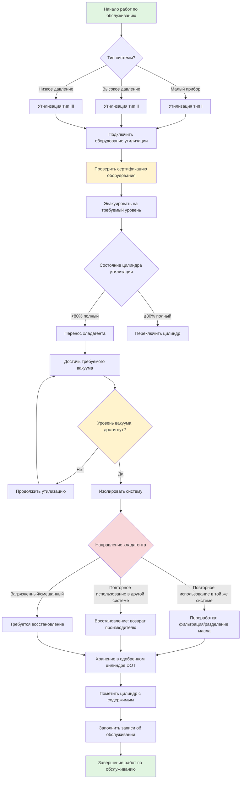

## Обзор

Надлежащее обращение с хладагентом является обязательным по федеральному закону в соответствии с Разделом 608 EPA и регулируется Стандартом ASHRAE 15. Все техники, которые обслуживают, ремонтируют или утилизируют оборудование, содержащее хладагенты, должны быть сертифицированы по EPA 608. Неправильное обращение приводит к выбросам в атмосферу, опасностям для безопасности, повреждению оборудования и значительным штрафам за нарушение нормативов до 44 539 долларов США в день за каждое нарушение.

## Требования сертификации EPA 608

EPA требует, чтобы техники продемонстрировали компетентность в обращении с хладагентом посредством сертификации в одной или нескольких категориях оборудования:

| Тип сертификации | Охватываемое оборудование | Предел заряда хладагента |
|-------------------|-------------------|-------------------------|
| Тип I | Малые приборы | < 2,27 кг хладагента |
| Тип II | Высокотемпературные системы | Кондиционеры воздуха, тепловые насосы |
| Тип III | Низкотемпературные системы | Центробежные охладители |
| Universal | Все типы оборудования | Полное покрытие |

**Основные проверяемые компетенции:**
- Истощение озонового слоя и нормативы Закона об охране чистого воздуха
- Требуемые практики для утилизации и переработки хладагента
- Одобренные заменители хладагентов и процедуры переоснащения
- Обнаружение утечек, требования к ремонту и ведение записей
- Процедуры безопасности и надлежащее использование оборудования

Сертификация является постоянной и не требует продления, хотя техники должны поддерживать актуальные знания об изменениях нормативов.

## Классификация безопасности хладагентов

Стандарт ASHRAE 34 классифицирует хладагенты по токсичности и воспламеняемости с использованием двухсимвольного обозначения:

| Классификация | Токсичность | Воспламеняемость | Примеры | Основные опасности |
|----------------|----------|--------------|----------|-----------------|
| A1 | Низкая | Без распространения пламени | R-134a, R-410A, R-407C | Удушье, высокое давление |
| A2L | Низкая | Низкая воспламеняемость | R-32, R-454B, R-1234yf | Слабая воспламеняемость, удушье |
| A2 | Низкая | Воспламеняемость | R-152a | Риск воспламенения, удушье |
| A3 | Низкая | Высокая воспламеняемость | R-290 (пропан), R-600a | Высокий риск воспламенения, взрыв |
| B1 | Высокая | Без распространения пламени | R-123 | Токсичное воздействие, сердечная сенсибилизация |
| B2L | Высокая | Низкая воспламеняемость | Не распространены | Комбинированная токсичность и воспламеняемость |
| B2 | Высокая | Воспламеняемость | Аммиак (R-717) | Высокая токсичность, воспламеняемость |
| B3 | Высокая | Высокая воспламеняемость | Не распространены | Экстремальные комбинированные опасности |

**Допустимые пределы воздействия:**
- Хладагенты класса A: Профессиональный предел воздействия (OEL) ≥ 400 ppm
- Хладагенты класса B: OEL < 400 ppm
- Всегда проверяйте Паспорта безопасности (SDS) производителя для получения конкретных рекомендаций по воздействию

## Утилизация, переработка и восстановление

### Процедуры утилизации

**Требуемые уровни эвакуации в соответствии с нормативами EPA:**

| Тип оборудования | Хладагент | До 15 ноября 1993 г. | После 15 ноября 1993 г. |
|----------------|-------------|-------------------------|------------------------|
| Приборы HCFC-22 | < 91 кг | 0 кПа изб. | 0 кПа изб. |
| Приборы HCFC-22 | ≥ 91 кг | 10 см рт.ст. вакуум | 25 см рт.ст. вакуум |
| Другие высокотемпературные | Любое количество | 10 см рт.ст. вакуум | 25 см рт.ст. вакуум |
| Низкотемпературные (центробежные) | Любое количество | 64 см рт.ст. вакуум | 64 см рт.ст. абсолютно |

**Критические практики утилизации:**
1. **Определить тип хладагента** с использованием показаний манометра, этикеток системы или идентификатора хладагента перед утилизацией
2. **Проверить цилиндры утилизации** на наличие сертификации DOT, даты переиспытания (каждые 5 лет) и загрязнения
3. **Проверить сертификацию оборудования утилизации** на соответствие стандартам EPA и надлежащее техническое обслуживание
4. **Использовать выделенные цилиндры** для каждого типа хладагента во избежание перекрестного загрязнения
5. **Постоянно контролировать давление в цилиндре**; никогда не превышайте 80% жидкостной емкости или пределы давления в цилиндре
6. **Достичь требуемых уровней вакуума** и дождитесь стабилизации давления для подтверждения полной утилизации
7. **Документировать количество хладагента** утилизированного, переработанного и заправленного для соответствия нормативам

### Переработка в сравнении с восстановлением

**Переработка** проводится на месте с использованием портативного оборудования для:
- Удаления масла, влаги и твердых частиц посредством фильтрации
- Восстановления хладагента в пригодное для повторного использования состояние в той же системе или оборудовании владельца
- Снижения неконденсируемых веществ путем вакуумного разделения
- Не восстанавливает хладагент к спецификациям девственного качества AHRI 700

**Восстановление** требует обработки на сертифицированном объекте для:
- Восстановления хладагента до спецификаций AHRI Standard 700 (качество девственного материала)
- Проведения химического анализа, подтверждающего чистоту
- Возможности перепродажи хладагента и использования в различных системах
- Надлежащей утилизации загрязняющих веществ и деградированного хладагента

## Обращение и хранение цилиндров

**Требования цилиндров DOT:**
- Использовать только одобренные DOT цилиндры (спецификация 4BA или 4BW для хладагентов)
- Проверить текущую дату гидростатического испытания (требуется каждые 5 лет)
- Никогда не заполнять сверх 80% жидкостной емкости для предотвращения теплового расширения
- Хранить цилиндры в вертикальном положении в прохладных, хорошо вентилируемых помещениях вдали от источников тепла
- Закреплять цилиндры, чтобы предотвратить опрокидывание или перекатывание
- Отделять полные и пустые цилиндры с четкой маркировкой

**Цветовая кодировка:**
Цилиндры с хладагентом следуют цветовому коду ARI Guideline K:
- Цилиндры утилизации: серый с желтым плечевым ремнем
- Девственный хладагент: цвета, специфичные для производителя согласно AHRI 700
- Никогда не полагайтесь только на цвет; всегда проверяйте содержимое посредством маркировки и испытания

## Процедуры безопасности

**Личное защитное снаряжение (СИЗ):**
- Защитные очки с боковыми щитками (минимум)
- Химически устойчивые перчатки при подключении/отключении шлангов
- Респиратор при работе в замкнутых пространствах или с хладагентами класса B
- Защита слуха при работе оборудования утилизации

**Реагирование на чрезвычайные ситуации:**
- Поддерживать кислородные мониторы в замкнутых пространствах (минимум 19,5% O₂)
- Обеспечить надлежащую вентиляцию; хладагенты тяжелее воздуха и вытесняют кислород
- При контакте жидкого хладагента с кожей: лечить как обморожение, постепенно согревать теплой водой
- При вдыхании: немедленно перейти на свежий воздух, обратиться за медицинской помощью, если симптомы сохраняются
- Держать оборудование для сдерживания разливов доступным при работе с большими количествами

## Нормативное соответствие и ведение записей

**Требования отчетности EPA:**
- Системы с ≥ 23 кг хладагента: вести записи об обслуживании в течение 3 лет
- Пороги скорости утечки, требующие ремонта:
  - Коммерческое комфортное охлаждение: 35% годовая скорость утечки
  - Промышленное холодоснабжение: 35% годовая скорость утечки
  - Ледяные катки: 20% годовая скорость утечки
- Документировать все пополнения хладагентом, утилизацию и направления
- Сообщить о катастрофических выбросах (полная потеря) в течение 30 дней

**Требования ASHRAE 15:**
- Классификация машинного помещения и расходы вентиляции
- Системы обнаружения хладагента и сигнализации для конкретных объектов
- Места разгрузки предохранительного клапана и требования
- Спецификации доступа к оборудованию и зазоры для обслуживания

Соответствие этим нормативам защищает окружающую среду, обеспечивает безопасность техников и избегает значительных финансовых штрафов, сохраняя при этом надежность и производительность системы.
