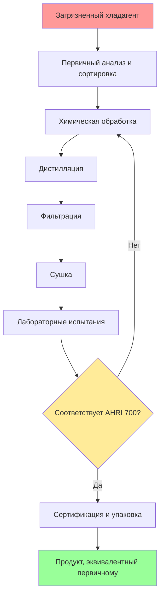

Восстановление хладагента (рекламация) возвращает использованный хладагент к чистоте, эквивалентной первичному продукту, посредством химической обработки, дистилляции и фильтрации. Этот процесс фундаментально отличается от восстановления (изъятия хладагента) и переработки (очистки в один проход). Рекламированный хладагент соответствует спецификациям чистоты AHRI 700, что делает его эквивалентным новому продукту и пригодным для любого применения.

## Обзор процесса рекламации

Процесс рекламации включает несколько стадий очистки, удаляющих загрязнители, влагу, кислоты и неконденсируемые газы для восстановления хладагента до требуемого уровня чистоты.

## Стандарты чистоты AHRI 700

Стандарт AHRI 700 (ранее ARI 700) устанавливает спецификации для рекламированных хладагентов. Эти стандарты гарантируют, что рекламированный продукт работает идентично первичному хладагенту во всех типах систем и при любых условиях эксплуатации.

### Критические параметры чистоты

| Параметр | Спецификация | Назначение |
|-----------|--------------|---------|
| Чистота (мин.) | 99,5% по массе | Обеспечение правильных термодинамических свойств |
| Влажность | ≤10 ppm по массе | Предотвращение образования льда и кислот |
| Хлориды | Проходит тест | Выявление загрязнения другими хладагентами |
| Кислотность | ≤1 ppm по массе | Предотвращение деградации масла и коррозии |
| Остаток с высокой температурой кипения | ≤0,01% по объему | Удаление масла и других загрязнителей |
| Частицы/твердые вещества | Визуально чистый | Предотвращение повреждения клапанов и органов управления |
| Неконденсируемые газы | ≤1,5% по объему | Поддержание эффективности теплообмена |

### Спецификации чистоты по типу хладагента

| Хладагент | Чистота (мин. %) | Влажность (макс. ppm) | Кислотность (макс. ppm) | Неконденсируемые газы (макс. %) |
|-------------|----------------|--------------------|--------------------|--------------------------|
| R-22 | 99,5 | 10 | 1 | 1,5 |
| R-134a | 99,5 | 10 | 1 | 1,5 |
| R-410A | 99,5 | 10 | 1 | 1,5 |
| R-404A | 99,5 | 10 | 1 | 1,5 |
| R-407C | 99,5 | 10 | 1 | 1,5 |
| R-123 | 99,5 | 15 | 1 | 1,5 |
| R-717 (NH3) | 99,95 | 33 | Н/Д | 1,5 |

## Требования EPA к рекламации

Регламенты EPA в соответствии с Разделом 608 Закона о чистом воздухе устанавливают стандарты рекламации для управления хладагентами. Только сертифицированные EPA рекламаторы могут обрабатывать хладагент для перепродажи или перераспределения.

### Требования к сертификации

**Сертификация объекта:**
- Соответствие AHRI 700, подтвержденное независимыми испытаниями
- Лабораторные возможности для всех требуемых анализов
- Документация системы менеджмента качества
- Ежегодное продление сертификации в EPA

**Протокол испытаний:**
- Газовая хроматография для анализа чистоты
- Метод Карла Фишера для определения содержания влаги
- Тестирование кислотного числа согласно Приложению C AHRI 700
- Тест на хлориды для выявления перекрестного загрязнения
- Анализ остатка с высокой температурой кипения

### Требования к документации
- Цепочка владения для всего поступающего хладагента
- Записи о тестировании партий, хранящиеся не менее 3 лет
- Сертификат анализа (CoA) для каждой партии рекламированного хладагента
- Отчетность о несоответствиях и записи о повторной переработке

## Выбор сертифицированного рекламатора

Выбор сертифицированного EPA рекламатора обеспечивает соблюдение законодательства и качество продукта. Сертифицированные объекты поддерживают актуальные списки в EPA и AHRI.

### Процесс проверки

1. **Подтверждение статуса сертификации EPA** — Проверка текущей сертификации через онлайн-базу данных EPA
2. **Проверка сертификации AHRI** — Просмотр Каталога сертифицированных рекламаторов хладагентов AHRI
3. **Оценка возможностей тестирования** — Убедитесь, что лаборатория может проводить все испытания по AHRI 700
4. **Оценка времени выполнения** — Учет логистики для возврата хладагента или получения кредита
5. **Сравнение финансовых условий** — Оценка стоимости рекламации по сравнению со стоимостью замены или кредитной стоимости

### Обязанности регенератора

| Обязанность | Требование |
|------|-------|
| Критерии приемки | Опубликованные спецификации для приемлемого поступающего хладагента |
| Частота испытаний | Испытание каждой партии в соответствии с протоколом AHRI 700 |
| Документация о сертификации | Сертификат анализа (CoA) с номерами партии и серии |
| Отслеживаемость | Полная документация от момента получения до распределения |
| Несоответствующая продукция | Повторная переработка или надлежащая утилизация бракованных партий |
| Соблюдение маркировки | Контейнеры маркируются как «регенерированные» в соответствии с требованиями DOT/EPA |

## Экономические и экологические преимущества

Регенерация обеспечивает как экономию средств, так и экологическую ответственность за счет повторного использования хладагента вместо производства новой химической продукции.

**Анализ затрат:**
- Регенерированный хладагент обычно на 30–50% дешевле virgin-продукта
- Избежание платы за утилизацию благодаря программам кредитов за регенерацию
- Хладагенты, выведенные из эксплуатации, остаются доступными через поставки регенерированного продукта

**Экологическое воздействие:**
- Снижение выбросов парниковых газов от производства нового хладагента
- Предотвращение выброса хладагента при неправильной утилизации
- Продление срока полезного использования существующих молекул хладагента
- Поддержка принципов циркулярной экономики в отрасли HVAC

## Проверка обеспечения качества

При получении регенерированного хладагента проверьте, что документация подтверждает соответствие AHRI 700 и надлежащую обработку.

**Обзор сертификата анализа:**
- Номер партии совпадает с маркировкой на контейнере
- Все параметры AHRI 700 соответствуют спецификациям
- Дата испытаний находится в допустимом временном интервале
- Сертификация регенератора действительна на момент переработки
- Правильное обозначение хладагента и состав

Регенерация представляет собой высший стандарт обработки хладагента, превращая загрязненный материал в продукт, эквивалентный virgin-продукту, благодаря строгой химической переработке и проверке качества. Только сертифицированные EPA объекты, работающие в соответствии с протоколами AHRI 700, имеют право на регенерацию хладагента для перепродажи, обеспечивая качество продукции и экологическую защиту.
