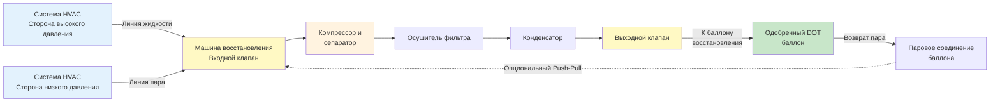

## Обзор

Восстановление хладагента — это обязательный процесс удаления хладагента из систем HVAC и его хранения в одобренных контейнерах для повторного использования, переработки или очистки. Нормативные требования EPA 608 требуют, чтобы сертифицированные техники восстанавливали хладагент до установленных уровней вакуума перед открытием или утилизацией оборудования, содержащего регулируемые хладагенты.

## Требования EPA 608 по восстановлению

**Требуемые уровни вакуума:**

| Тип оборудования | Метод восстановления | Требуемый вакуум (кПа) |
|----------------|-----------------|----------------------------|
| Малые приборы (<2,3 кг) | Любой | 0 кПа (вакуум не требуется) |
| Системы высокого давления | Системно-зависимое | 13,5 кПа |
| Системы высокого давления | Автономное | 26,7 кПа |
| Системы очень высокого давления | Системно-зависимое | 13,5 кПа |
| Системы очень высокого давления | Автономное | 40 кПа |
| Системы низкого давления | Системно-зависимое | 0,085 кПа абсолютное |
| Системы низкого давления | Автономное | 0,085 кПа абсолютное |

**Критические точки соответствия:**

- Восстановление должно проводиться перед открытием герметичных систем для обслуживания или утилизации
- Используйте только одобренное EPA оборудование для восстановления, соответствующее стандартам ARI 740
- Храните восстановленный хладагент в одобренных DOT баллонах
- Ведите документацию по сертификации оборудования для восстановления
- Никогда не выбрасывайте хладагенты в атмосферу намеренно

## Методы восстановления

### Системно-зависимое восстановление

Системно-зависимое восстановление использует собственный компрессор системы для подачи хладагента в баллон восстановления. Этот метод медленнее, но требует минимального дополнительного оборудования.

**Применение:**
- Полевое обслуживание, где требуется минимальная транспортировка оборудования
- Системы с работающими компрессорами
- Когда машина для восстановления недоступна

**Ограничения:**
- Достигает более низких уровней вакуума, чем автономное оборудование
- Не может использоваться, если компрессор системы неисправен
- Более длительное время восстановления

### Автономное восстановление

Автономные машины для восстановления используют собственный компрессор и работают независимо от обслуживаемой системы. Эти машины достигают более глубоких уровней вакуума и более быстрого восстановления.

**Ключевые особенности:**
- Безмасляные компрессоры для предотвращения загрязнения
- Встроенная фильтрация и разделение
- Высокоэффективное восстановление, достигающее требуемых уровней вакуума
- Портативная конструкция для полевого обслуживания

## Установка оборудования для восстановления

## Процедуры восстановления

### Восстановление паров

Восстановление паров удаляет хладагент в газообразном состоянии со стороны низкого давления системы.

**Процедура:**
1. Подключите машину для восстановления к порту обслуживания низкого давления системы
2. Подключите баллон восстановления к выходу машины
3. Убедитесь, что баллон имеет адекватную емкость (максимум 80% заполнения)
4. Откройте клапаны системы и баллона
5. Запустите машину для восстановления
6. Контролируйте манометры коллектора до достижения требуемого вакуума
7. Закройте все клапаны и дайте системе постоять 5 минут
8. Проверьте повышение давления, указывающее на попавший в ловушку хладагент

**Скорость восстановления:** 0,45–1,4 кг/мин в зависимости от оборудования и условий системы

### Восстановление жидкости

Восстановление жидкости значительно быстрее, чем восстановление паров, и должно выполняться в первую очередь, когда это возможно.

**Процедура:**
1. Подключите машину для восстановления к линии жидкости высокого давления системы
2. По возможности разместите баллон восстановления ниже уровня системы
3. Медленно откройте клапан обслуживания жидкости, чтобы предотвратить вспышку газа
4. Восстановите жидкую фазу до остановки потока или выравнивания давления
5. Переключитесь на восстановление паров для завершения процесса
6. Продолжайте до требуемого уровня вакуума

**Скорость восстановления:** 2,3–6,8 кг/мин для жидкой фазы

### Метод Push-Pull восстановления

Восстановление Push-Pull использует давление паров системы для подачи жидкости в баллон восстановления, в то время как машина для восстановления вытягивает пар из верхней части баллона, значительно увеличивая скорость восстановления.

**Установка:**
1. Подключите линию жидкости от системы к клапану жидкости баллона восстановления
2. Подключите входное отверстие машины для восстановления к паровому клапану баллона
3. Подключите выход машины для восстановления обратно к низкой стороне системы
4. Создайте непрерывный циркуляционный контур

**Преимущества:**
- Скорости восстановления до 9 кг/мин
- Сокращенное время восстановления в больших системах
- Более полное удаление хладагента

## Типы оборудования для восстановления

| Класс оборудования | Емкость | Применение | Рейтинг ARI 740 |
|----------------|----------|-------------|----------------|
| Малый прибор | <6,8 кг | Оконные блоки, осушители | 113 г/мин минимум |
| Легкий коммерческий | 6,8–22,7 кг | Сплит-системы, кровельные агрегаты | 0,45–1,4 кг/мин |
| Коммерческий | 22,7–90,7 кг | Большие кровельные агрегаты, чиллеры | 1,4–3,6 кг/мин |
| Промышленный | >90,7 кг | Центральные установки, большие чиллеры | 3,6–9 кг/мин |

## Требования к баллонам восстановления

**Сертификация DOT:**
- Используйте только одобренные DOT баллоны (спецификация DOT 4BA или 4BW)
- Проверьте текущую сертификацию гидростатического испытания (интервалы 5 лет)
- Никогда не используйте одноразовые баллоны для восстановления

**Пределы заполнения:**
- Максимум 80% заполнения жидкостью по весу
- Рассчитайте, используя вес тары баллона и плотность хладагента
- Учитывайте влияние температуры на расширение жидкости

**Идентификация баллона:**
- Серый корпус с желтой крышкой для восстановленного хладагента
- Этикетка с типом хладагента
- Запишите дату восстановления
- Никогда не смешивайте различные хладагенты

## Соображения безопасности

**Управление давлением:**
- Никогда не подвергайте баллоны температурам выше 51,7 °C
- Используйте предохранительные клапаны на всех соединениях
- Контролируйте давление в баллоне во время восстановления

**Предотвращение загрязнения:**
- Используйте отдельные баллоны для каждого типа хладагента
- Установите осушители фильтров в линии восстановления
- Проверяйте и регулярно меняйте масло машины для восстановления

**Личная защита:**
- Надевайте защитные очки и перчатки
- Работайте в проветриваемых помещениях
- Имейте процедуры экстренной помощи при воздействии хладагента

## Оптимизация скорости восстановления

| Фактор | Влияние на скорость восстановления | Стратегия оптимизации |
|--------|------------------------|----------------------|
| Температура хладагента | Более высокая температура = более быстрое восстановление | Кратковременно эксплуатируйте систему для нагрева хладагента |
| Диаметр линии | Больше = меньше сопротивления | Используйте шланги минимум 9,5 мм или 12,7 мм |
| Длина шланга | Короче = меньше потери давления | Минимизируйте длину шланга |
| Температура баллона | Холоднее = лучше конденсация | Охладите баллон, никогда ниже 0 °C |
| Состояние фильтра | Чистый = лучший поток | Регулярно заменяйте фильтры |
| Масло машины восстановления | Чистое масло = эффективность | Меняйте масло в соответствии со спецификациями производителя |

## Проверка и документирование

После завершения восстановления:

1. Дайте системе постоять минимум 5 минут
2. Проверьте, что вакуум держится без повышения давления
3. Если давление повышается выше требуемого уровня, повторите восстановление
4. Задокументируйте тип хладагента, восстановленное количество и окончательный уровень вакуума
5. Пометьте систему как свободную от хладагента, если применимо
6. Запишите идентификацию баллона восстановления и вес заполнения

**Индикаторы неполного восстановления:**
- Повышение давления в течение периода простоя
- Компоненты системы все еще холодные после восстановления
- Количество восстановления значительно меньше номинального заряда системы

Процедуры восстановления составляют основу ответственного управления хладагентом и соответствия нормативным требованиям. Правильная техника обеспечивает нормативное соответствие, максимизирует повторное использование хладагента и защищает как техников, так и окружающую среду от вредных выбросов.
