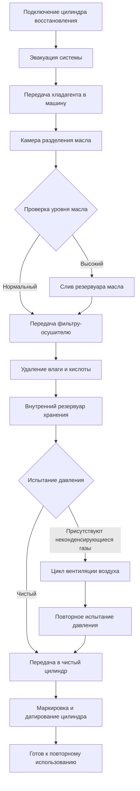

Переработка хладагента — это процесс извлечения загрязненного хладагента из систем HVAC и восстановления его до приемлемых уровней чистоты посредством фильтрации и процессов разделения. Переработка на месте снижает материальные затраты, минимизирует воздействие на окружающую среду и позволяет немедленную перезаправку системы очищенным хладагентом.

## Стандарты переработки ARI 740

Стандарт 740 Air-Conditioning, Heating, and Refrigeration Institute (ARI) определяет минимальные требования к производительности оборудования для переработки хладагента. Этот стандарт гарантирует, что переработанный хладагент соответствует конкретным критериям чистоты для безопасного повторного использования.

### Требования к чистоте

| Параметр | Максимально допустимый уровень | Метод испытания |
|-----------|------------------------|-------------|
| Содержание влаги | 50 ppm по массе | ARI 740-1998 |
| Содержание кислоты | 1 ppm по массе (как HCl) | ARI 740-1998 |
| Твердые частицы | Визуально чистый (без осадка) | ARI 740-1998 |
| Неконденсирующиеся газы | 2% по объему | ARI 740-1998 |
| Высококипящий остаток | Не определен для переработки | - |
| Ионы хлорида | Максимум 3 ppm | Ионная хроматография |

Оборудование ARI 740 должно продемонстрировать способность стабильно достигать этих уровней чистоты на протяжении нескольких циклов испытаний с использованием загрязненных образцов хладагента.

## Оборудование для переработки на месте

Современные машины переработки объединяют три первичные системы удаления загрязнений в портативные установки массой 18-36 кг для полевого обслуживания.

### Основные компоненты

**Сепаратор масла**
- Конструкция с центрифугальным или коалесцирующим фильтром
- Удаляет 80-95% увлеченного компрессорного масла
- Рабочое давление: 1035-2070 кПа
- Эффективность разделителя зависит от скорости хладагента и температуры

**Сборка фильтра-осушителя**
- Сменный сердечник, содержащий молекулярное сито десиканта
- Удаляет влагу, кислоты и твердые частицы
- Типичная емкость: 450-900 г десиканта на картридж
- Замена при прорыве влаги (изменение индикатора)

**Система вентиляции воздуха**
- Автоматическое или ручное выпускание неконденсирующихся газов
- Работает, когда машина достигает теплового равновесия
- Вентиляция со стороны высокого давления при фазе жидкого хладагента
- Перепад давления указывает на наличие воздуха (>69 кПа выше давления насыщения)

## Рабочий процесс переработки

## Процесс разделения масла

Смазочное масло циркулирует через системы HVAC и смешивается с хладагентом, создавая загрязнение, которое снижает эффективность теплопередачи и засоряет расширительные устройства.

### Методы разделения

**Гравитационное разделение**
- Основано на разнице плотности между маслом и хладагентом
- Требует времени пребывания 10-30 минут в сепарирующем сосуде
- Эффективно при концентрации масла выше 5% по массе
- Температура поддерживается при 21-32°C для оптимального разделения

**Центрифужное разделение**
- Использует вращающийся ротор для создания усилий 500-2000 G
- Разделяет масляные капли размером 1 мкм и меньше
- Скорость обработки: 0,45-1,36 кг хладагента в минуту
- Более эффективно для синтетических масел POE и PVE

Масло, слитое из сепараторов, содержит 10-30% растворенного хладагента. Оставьте слитое масло выделять газ в открытом контейнере в течение 24 часов перед утилизацией или переработкой.

## Процесс удаления влаги

Загрязнение водой вызывает образование кислоты, медное покрытие и ледяные пробки в расширительных устройствах. Машины переработки используют десиканты молекулярного сита для достижения уровня влаги ниже 50 ppm.

### Производительность десиканта

| Тип десиканта | Водоудержание | Удаление кислоты | Температура регенерации |
|----------------|---------------|--------------|-------------------|
| Молекулярное сито тип 3A | 20-22% по массе | Минимальное | 175-290°C |
| Молекулярное сито тип 4A | 22-24% по массе | Среднее | 175-290°C |
| Активированный оксид алюминия | 18-20% по массе | Хорошее | 175-232°C |
| Силикагель | 6-8% по массе | Плохое | 121-176°C |

Замените сердечники фильтра-осушителя при:
- Индикаторе влаги, показывающем насыщение (изменение цвета)
- Времени обработки, увеличившемся в два раза от исходного
- Уровне влаги на выходе, превышающем 50 ppm
- После переработки 91-181 кг хладагента (спецификация производителя)

## Процесс удаления кислоты

Кислоты образуются, когда влага вступает в реакцию с продуктами разложения хладагента или смазочными материалами POE. Соляная кислота (HCl) и плавиковая кислота (HF) корродируют медь и алюминиевые компоненты.

### Механизмы удаления

**Адсорбция активированным оксидом алюминия**
- Удельная поверхность: 200-300 м²/г
- Удаляет органические и неорганические кислоты
- Емкость: 0,5-2% по массе кислоты
- Указывается тест-полосками pH (целевой pH 6-8)

**Взаимодействие молекулярного сита**
- Вторичное удаление кислоты посредством ионного обмена
- Эффективно для низкоконцентрационной полировки (<10 ppm)
- Регенерация высвобождает захваченные кислоты

Проверьте содержание кислоты в переработанном хладагенте с помощью тест-полосок pH. Возьмите образец 10 мл, добавьте раствор индикатора pH, наблюдайте изменение цвета. Желто-зеленый цвет указывает на приемлемые уровни кислоты (pH 6-8), красный цвет указывает на избыточную кислотность, требующую дополнительной фильтрации.

## Стандарты эксплуатации оборудования

### Проверки перед эксплуатацией

1. Проверьте индикатор влаги фильтра-осушителя на наличие сухого состояния (синий или зеленый)
2. Проверьте уровень резервуара сепаратора масла (слейте, если превышает 50% емкости)
3. Проверьте шланги на наличие трещин, убедитесь в чистоте соединений
4. Убедитесь, что цилиндр хранения эвакуирован ниже 500 микрон
5. Убедитесь, что машина установлена ровно для точного разделения масла

### Параметры эксплуатации

| Параметр | Типичный диапазон | Критический предел |
|-----------|--------------|----------------|
| Рабочее давление | 689-1724 кПа | Макс 2758 кПа |
| Температура процесса | 16-38°C | Макс 54°C |
| Расход | 0,23-1,36 кг/мин | По производителю |
| Перепад давления фильтра | <34 кПа чистый | Замена >138 кПа |
| Интервал слива масла | Каждые 23 кг | По насыщению |

### Проверка качества

После переработки проверьте чистоту хладагента:
- Тест стоячего давления: сравните давление в цилиндре с давлением насыщения при температуре окружающей среды (в пределах ±69 кПа указывает <2% неконденсирующихся газов)
- Тест влаги: используйте электронный датчик влаги или индикатор (целевое значение <50 ppm)
- Визуальный осмотр: жидкий хладагент должен быть прозрачным, бесцветным, без частиц
- Тест кислоты: тест-полоски pH должны указывать на нейтральное или слегка щелочное значение

Обозначьте цилиндры переработанного хладагента типом хладагента, датой переработки, количеством и идентификацией техника. Предел времени хранения обычно составляет 6-12 месяцев перед повторным тестированием.
