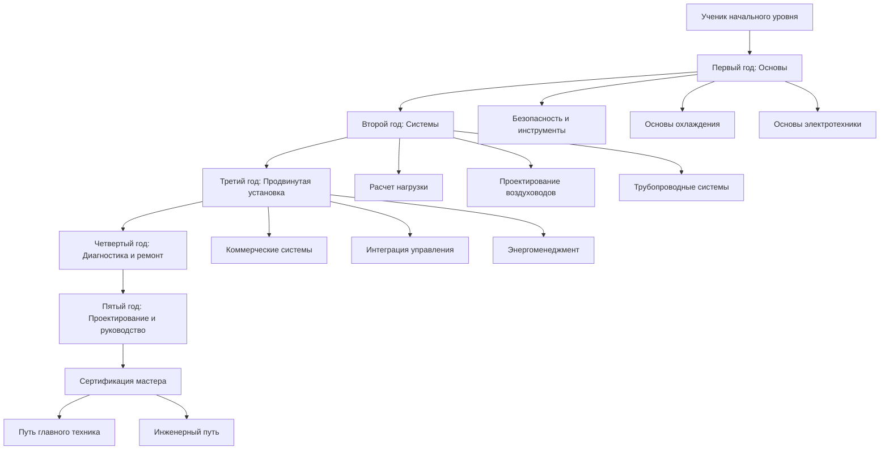

# Программы ученичества в HVAC

Программы ученичества в HVAC сочетают классное обучение с контролируемым практическим обучением для подготовки квалифицированных технических специалистов, способных проектировать, устанавливать, обслуживать и устранять неисправности систем климатического контроля. Эти структурированные программы обычно охватывают 3-5 лет и обеспечивают комплексное обучение термодинамике, циклам охлаждения, электрическим системам и методам механической установки.

## Структура и продолжительность программы

### Стандартные модели ученичества

Программы ученичества следуют установленным структурам, которые уравновешивают теоретические знания с развитием практических навыков:

| Тип программы | Продолжительность | Аудиторные часы | Практические часы | Результат сертификации |
|--------------|----------|-----------------|-----------|----------------------|
| Профсоюзная (UA/SMACNA) | 5 лет | 900-1000 | 10 000 | Мастер |
| Непрофсоюзная | 3-4 года | 576-800 | 6000-8000 | Мастер |
| Военная (ВМС/ВВС) | 18-24 месяца | 400-600 | 3000-4000 | Специалист по специальности |
| Муниципальный колледж | 2 года + 2 года практики | 720 | 4000 | Аасс + Мастер |

### Структура развития компетенций

## Компоненты технической программы

### Год 1: Фундаментальные принципы

**Термодинамика и теплопередача**

Ученики изучают основные энергетические соотношения, управляющие системами HVAC. Фундаментальное уравнение теплопередачи определяет кондукцию через ограждающие конструкции здания:

$$Q = \frac{k \cdot A \cdot \Delta T}{d}$$

Где:
- $Q$ = скорость теплопередачи (кДж/ч или Вт)
- $k$ = теплопроводность (Вт/м·K)
- $A$ = площадь поверхности (м²)
- $\Delta T$ = разность температур (°C или K)
- $d$ = толщина материала (м)

**Овладение циклом охлаждения**

Понимание цикла паровой компрессии требует анализа четырех ключевых процессов:

$$\text{COP}_{\text{охл}} = \frac{Q_{\text{испарение}}}{W_{\text{комп}}} = \frac{h_1 - h_4}{h_2 - h_1}$$

Где значения энтальпии ($h$) соответствуют состояниям хладагента на входе компрессора (1), выходе (2), выходе конденсатора (4) и входе испарителя (4).

**Основы электрических систем**

Расчеты мощности для трехфазного оборудования формируют основу электротехнического устранения неисправностей:

$$P = \sqrt{3} \cdot V_L \cdot I_L \cdot \text{PF}$$

Где $P$ – мощность (Вт), $V_L$ – линейное напряжение (В), $I_L$ – линейный ток (А), PF – коэффициент мощности (обычно 0,85-0,95).

### Год 2: Проектирование и подбор систем

**Методы расчета нагрузки**

Подготовка методологии ASHRAE Fundamentals для жилых и легких коммерческих приложений. Процедуры Manual J требуют расчета прироста тепла из множественных источников:

$$Q_{\text{итого}} = Q_{\text{передача}} + Q_{\text{инфильтрация}} + Q_{\text{внутр}} + Q_{\text{солнечн}}$$

**Определение размеров воздуховодов и воздушного потока**

Расчеты перепада давления с использованием уравнения Дарси-Вейсбаха, адаптированного для систем воздуховодов:

$$\Delta P = f \cdot \frac{L}{D_h} \cdot \frac{\rho V^2}{2}$$

Где $f$ – коэффициент трения (из диаграммы Муди), $L$ – длина воздуховода, $D_h$ – гидравлический диаметр, $\rho$ – плотность воздуха, $V$ – скорость.

### Годы 3-4: Продвинутые приложения

**Коммерческое охлаждение**

Многоконтурные системы, параллельные конфигурации стеллажей и стратегии рекупрации тепла. Ученики изучают алгоритмы каскадирования компрессоров и методы модуляции мощности.

**Системы автоматизации зданий**

Интеграция с контроллерами прямого цифрового управления, калибровка датчиков и настройка ПИД-регулятора. Понимание последовательностей управления в соответствии с ASHRAE Guideline 36 для высокопроизводительных зданий.

**Энергетический анализ**

Расчет сезонной энергетической эффективности методом анализа по интервалам:

$$\text{SEER} = \frac{\sum(\text{Нагрузка охлаждения}_i \times \text{Часы}_i)}{\sum(\text{Входная мощность}_i \times \text{Часы}_i)}$$

## Требования практического обучения

### Матрица проверки компетенций

| Категория навыков | Требуемые задачи | Уровень компетентности | Метод оценки |
|----------------|----------------|-------------------|-------------------|
| Пайка/Присадка | 50+ соединений | Проверка давления 3448 кПа | Визуальный + тест герметичности |
| Электромонтаж | 25+ установок | Соответствие коду | Одобрение инспектора |
| Обработка хладагента | Сертификация EPA | Минимум тип II | Письменный + практический |
| Установка воздуховода | 500+ линейных метров | В пределах 10% расчетного расхода | Проверка TAB |
| Запуск/Пуск | 20+ систем | Достижение расчетных параметров | Данные производительности |
| Устранение неисправностей | 100+ вызовов обслуживания | 85% правильное диагностирование | Проверка руководителя |

### Интеграция обучения безопасности

Все программы ученичества должны включать 30-часовой курс строительной безопасности OSHA, процедуры входа в замкнутые пространства, электробезопасность (NFPA 70E) и протоколы обработки хладагента в соответствии с нормативами EPA Section 608.

## Прогрессия заработной платы и экономические выгоды

Компенсация ученику обычно следует процентной шкале от заработной платы мастера:

| Год | Процент от заработной платы мастера | Средняя почасовая ставка (2025) |
|------|------------------------------|---------------------------|
| 1-й год | 40-50% | $18-22 |
| 2-й год | 50-60% | $22-26 |
| 3-й год | 60-75% | $26-33 |
| 4-й год | 75-85% | $33-37 |
| 5-й год | 85-95% | $37-42 |
| Мастер | 100% | $44-52 |

Общий доход программы превышает $150 000, избегая студенческих долгов, что представляет превосходную рентабельность инвестиций по сравнению со многими четырехлетними программами получения степени.

## Пути сертификации

### Требуемые учетные данные

- **Сертификация EPA Section 608**: Универсальная сертификация, требуемая для работы с хладагентом
- **Обучение безопасности OSHA**: Минимум 10 часов, предпочтительно 30 часов
- **Лицензирование на уровне штата/муниципальном уровне**: Варьируется по юрисдикциям (лицензия механического подрядчика, карточка мастера)
- **Сертификации производителей**: Обучение конкретным брендам для гарантии и технической поддержки

### Продвинутые специализации

Опции специализации после ученичества включают:
- Сертификаты специальности NATE (Североамериканское объединение техников передового опыта)
- Сертификация Building Analyst (BPI)
- LEED AP со специализацией в эксплуатации зданий
- Certified Energy Manager (CEM)
- Путь лицензирования Professional Engineer (PE)

## Критерии выбора программы

### Оценка качественных показателей

1. **Статус аккредитации**: Одобрение HVAC Excellence, PAHRA или советом ученичества штата
2. **Учетные данные преподавателей**: Минимум 10 лет опыта работы в области плюс сертификат преподавателя
3. **Доступ к оборудованию**: Современные учебные лаборатории с текущей технологией (системы переменной скорости, интеллектуальные системы управления)
4. **Сеть работодателей**: Установленные партнерства с подрядчиками для трудоустройства
5. **Показатели завершения**: Программы должны демонстрировать >70% уровень выпуска
6. **Трудоустройство после выпуска**: >90% трудоустройство в течение 6 месяцев

### Соображения профсоюзного и непрофсоюзного обучения

| Фактор | Профсоюзные программы (UA/SMACNA) | Непрофсоюзные программы |
|--------|---------------------------|-------------------|
| Структура | Высоко стандартизированная, 5-летняя продолжительность | Переменная, обычно 3-4 года |
| Стоимость для ученика | Бесплатно (финансируется профсоюзом) | $0-5000 обучение |
| Льготы во время обучения | Медицинское страхование, взносы в пенсионный фонд | Варьируется по работодателям |
| Трудоустройство | Через биржу труда профсоюза | Самостоятельный поиск работы |
| Географическая гибкость | Ограничена юрисдикцией профсоюза | Портативность на уровне страны |
| Стандарты заработной платы | Коллективно согласованная шкала | Ставки, определяемые рынком |

## Интеграция с академическими учетными данными

Многие программы сочетаются с программами Associate of Applied Science (AAS) муниципальных колледжей в области технологии HVAC. Этот двойной подход обеспечивает:

- Технические кредиты колледжа, которые передаются в программы бакалавриата в области технологии машиностроения
- Более широкое образование в области физики, математики и технического общения
- Повышенную мобильность карьеры в области проектирования, инженерии продаж и управления
- Право на федеральную финансовую помощь во время аудиторных фаз

## Обучение новейшим технологиям

Современные учебные программы включают подготовку по:

- Системам **Variable Refrigerant Flow (VRF)** с рекупрацией тепла
- Установке и пуску **геотермальных тепловых насосов**
- **Протоколам автоматизации зданий** (BACnet, LonWorks, Modbus)
- **Хладагентам с низким потенциалом глобального потепления** (R-32, R-454B, R-1234yf)
- **Интегрированным системам возобновляемых источников энергии** (солнечное тепловое, интеграция фотоэлектрических систем)
- **Расширенной диагностике** с использованием регистраторов данных, психрометров и тепловизионной визуализации

Эти компетенции гарантируют, что ученики вступают на рынок труда подготовленными к высокоэффективным систем зданий и развивающимся экологическим нормативам.

## Заключение

Программы ученичества в HVAC представляют наиболее эффективный путь для подготовки высоко квалифицированных техников, способных удовлетворять требования отрасли. Сочетание строгого классного обучения принципам термодинамики, обширного контролируемого опыта работы в поле и прогрессивного развития компетенций создает профессионалов, которые понимают как теоретические основы, так и практические применения технологии климатического контроля. Благодаря сильным перспективам трудоустройства, конкурентоспособным заработной плате и четким путям развития, ученичество предлагает исключительную ценность для лиц, ищущих технические карьеры в созданной среде.
