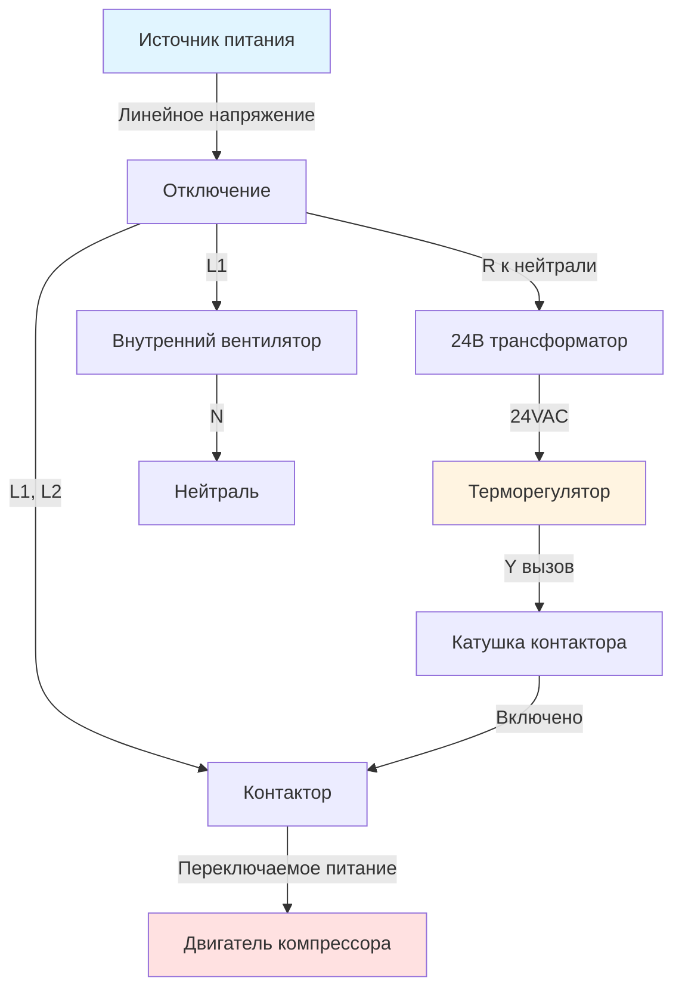
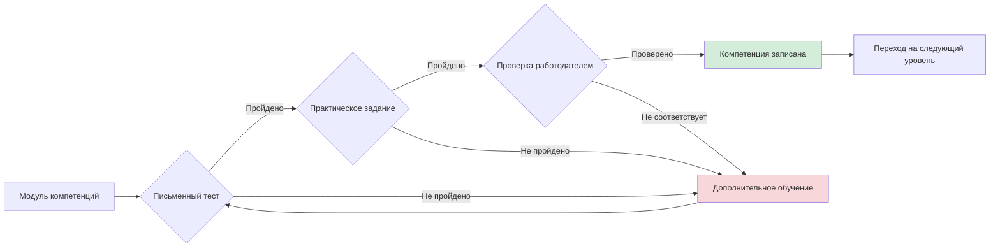

## Обзор

Неюнионные ученичества в HVAC предоставляют структурированные, основанные на компетенциях учебные траектории, которые объединяют аудиторное обучение с контролируемой профессиональной подготовкой. Эти программы, администрируемые в основном через Associated Builders and Contractors (ABC), National Center for Construction Education and Research (NCCER) и HVAC Excellence, предлагают гибкие, портативные учетные данные, признанные во всей отрасли. Модель, основанная на компетенциях, позволяет ученикам прогрессировать на основе продемонстрированного мастерства технических навыков, а не фиксированных периодов времени.

Неюнионные программы подчеркивают проверку производительности посредством стандартизированных оценок, модульного дизайна учебной программы и накапливаемых учетных данных, которые облегчают мобильность карьеры. Обучение интегрирует фундаментальные принципы физики с практическим применением, обеспечивая, чтобы ученики понимали как теоретические основы, так и практические методы, необходимые для профессиональной работы HVAC.

## Структура программы и продолжительность

### Модели на основе времени и компетенций

Неюнионные ученичества обычно используют гибридные модели, объединяющие минимальные требования ко времени с проверкой производительности:

**Стандартная структура продолжительности**
- Общая продолжительность программы: 3-4 года (6000-8000 часов)
- Профессиональное обучение: 85-90% от общего количества часов
- Аудиторное обучение: 10-15% от общего количества часов (обычно 576-720 часов)
- Контрольные точки компетенций через регулярные промежутки времени
- Ускоренное завершение возможно при продемонстрированном мастерстве

**Вехи компетенций**

| Уровень | Требуемые часы | Процент заработной платы | Ключевые компетенции |
|---------|----------------|--------------------------|-----------------------|
| Первый год | 0-2000 | 50-60% | Основные ручные инструменты, безопасность, основы холодильной техники |
| Второй год | 2000-4000 | 60-70% | Диагностика системы, электрические цепи, измерение воздушного потока |
| Третий год | 4000-6000 | 70-85% | Расчет нагрузок, дизайн воздуховодов, сложное устранение неполадок |
| Четвертый год | 6000-8000 | 85-95% | Оптимизация системы, анализ энергии, передовые элементы управления |

## Основные администраторы программ

### Associated Builders and Contractors (ABC)

ABC управляет крупнейшей сетью неюнионных программ ученичества в Северной Америке. Модель ученичества ABC интегрирует лучшие практики строительной отрасли с техническим обучением HVAC.

**Структура учебной программы**
- Модули ремесленного обучения, выровненные в соответствии с сертификацией отрасли
- Прохождение 4 уровней с определенными компетенциями
- Национальные стандарты обучения с локальной кастомизацией
- Интеграция с учетными данными NCCER
- Акцент на безопасность, производительность и качество работы

**Методы оценки**
- Письменные экзамены по техническим знаниям
- Практические задачи, оцениваемые аттестованными инструкторами
- Оценки на основе проектов, моделирующие сценарии реального мира
- Отзывы работодателя о компетенциях на рабочем месте
- Тестирование сторонних организаций (EPA, NATE и т.д.)

### National Center for Construction Education and Research (NCCER)

NCCER предоставляет стандартизированную модульную учебную программу, используемую ABC и независимыми учебными центрами. Учебная программа NCCER HVAC охватывает жилые, легкие коммерческие и коммерческие системы через прогрессивные уровни.

**Уровень 1 - Основы** (625 часов аудиторного обучения + обучение на работе)
- Введение в системы HVAC и карьеру
- Торговая математика и прикладная физика
- Основная электротехника для техников HVAC
- Введение в системы охлаждения и отопления
- Основные практики медных и пластиковых трубопроводов
- Методы пайки и пайки брами
- Практики стальных трубопроводов

**Уровень 2 - Промежуточные навыки** (625 часов аудиторного обучения + обучение на работе)
- Схемы переменного тока и анализ
- Электродвигатели и управление моторами
- Системы качества воздуха и распределения
- Обнаружение утечек, эвакуация, восстановление и зарядка
- Эксплуатация и техническое обслуживание компрессоров
- Анализ теплопередачи конденсаторов и испарителей
- Устройства дозирования и управление потоком холодильного агента

**Уровень 3 - Продвинутые приложения** (625 часов аудиторного обучения + обучение на работе)
- Тепловые насосы, включая термодинамику цикла реверсирования
- Печи газового отопления и анализ горения
- Гидравлические системы отопления и механика жидкостей
- Системы зонального управления и автоматизация зданий
- Балансировка и измерение воздуха в системе
- Устранение неполадок сложного оборудования
- Основы коммерческого оборудования HVAC

**Уровень 4 - Коммерческие системы** (625 часов аудиторного обучения + обучение на работе)
- Коммерческие системы кондиционирования воздуха
- Коммерческое оборудование отопления
- Системы и дизайн распределения воздуха
- Системы управления энергией и элементы управления
- Программы профилактического обслуживания
- Процедуры наладки системы
- Интеграция системы управления зданиями

### Ученичество HVAC Excellence

HVAC Excellence предлагает программы ученичества, основанные на трудоустройстве, зарегистрированные в Министерстве труда США. Эти программы интегрируют техническое обучение с прогрессивными сертификатами.

**Компоненты программы**
- Связанное техническое обучение (RTI), предоставляемое через аккредитованные школы
- Структурированное обучение на работе с задокументированными компетенциями
- Интеграция с экзаменами по сертификации HVAC Excellence
- Обучение навыкам, ориентированное на занятость
- Кастомизация обучения, направленная работодателем

## Основы термодинамики в ученическом обучении

### Анализ холодильного цикла

Ученики должны продемонстрировать понимание физики цикла парокомпрессии посредством навыков расчета и измерения.

**Баланс энергии основного холодильного цикла**

Коэффициент производительности (COP) для систем охлаждения представляет отношение удаленного тепла к входу работы:

$$COP_{охлаждение} = \frac{Q_c}{W_{комп}} = \frac{h_1 - h_4}{h_2 - h_1}$$

Где:
- $Q_c$ = мощность охлаждения (кДж/ч или кВт)
- $W_{комп}$ = входная работа компрессора (кДж/ч или кВт)
- $h_1$ = энтальпия на входе компрессора (кДж/кг)
- $h_2$ = энтальпия на выходе компрессора (кДж/кг)
- $h_4$ = энтальпия на входе испарителя (кДж/кг)

**Сравнение эффективности Карно**

Теоретический максимум COP на основе рабочих температур:

$$COP_{Carnot} = \frac{T_c}{T_h - T_c}$$

Где:
- $T_c$ = абсолютная температура испарителя (K)
- $T_h$ = абсолютная температура конденсатора (K)

Ученики узнают, что реальный COP системы обычно составляет 40-60% от эффективности Карно из-за необратимостей в реальном мире, включая:
- Неэффективность компрессора (механические и объемные потери)
- Перепады давления в трубопроводах и теплообменниках
- Теплопередача через конечные разности температур
- Требования к перегреву и переохлаждению холодильного агента

### Расчеты теплопередачи

**Явная нагрузка охлаждения**

Фундаментальное уравнение для удаления явного тепла:

$$Q_s = 0.335 \times CFM \times \Delta T$$

Где:
- $Q_s$ = явная мощность охлаждения (кВт)
- $CFM$ = объемный расход воздуха (м³/ч)
- $\Delta T$ = разница температур через катушку (°C)
- 0.335 = константа, включающая плотность воздуха и удельную теплоемкость

**Скрытая нагрузка охлаждения**

Расчет мощности удаления влаги:

$$Q_l = 0.216 \times CFM \times \Delta W$$

Где:
- $Q_l$ = скрытая мощность охлаждения (кВт)
- $\Delta W$ = разница коэффициента влажности (г H₂O/кг сухого воздуха)
- 0.216 = константа, включающая плотность воздуха и скрытую теплоту

**Общее охлаждение**

$$Q_t = Q_s + Q_l$$

Коэффициент явного тепла (SHR) определяет выбор оборудования:

$$SHR = \frac{Q_s}{Q_t}$$

Типичные жилые приложения требуют SHR = 0,70-0,80, в то время как центры обработки данных требуют SHR, близкий к 1,0.

## Электрические основы для HVAC

### Обучение анализу цепей

**Приложения закона Ома**

$$V = I \times R$$

$$P = V \times I = I^2 \times R = \frac{V^2}{R}$$

Ученики применяют эти соотношения для:
- Проверки сопротивления компонента
- Расчета тока цепи
- Анализа потребления мощности
- Определения падения напряжения при выборе размера провода

**Расчеты трехфазной мощности**

Для коммерческого оборудования:

$$P_{3\phi} = \sqrt{3} \times V_{L-L} \times I_L \times PF$$

Где:
- $P_{3\phi}$ = трехфазная мощность (ватты)
- $V_{L-L}$ = линейное напряжение (вольты)
- $I_L$ = линейный ток (амперы)
- $PF$ = коэффициент мощности (обычно 0,85-0,95 для моторов)

## Воздушный поток и проектирование системы воздуховодов

### Отношения статического давления

Ученики узнают, как измерять и интерпретировать статическое давление, давление скорости и полное давление:

$$P_t = P_s + P_v$$

Где:
- $P_t$ = полное давление (Па)
- $P_s$ = статическое давление (Па)
- $P_v$ = давление скорости (Па)

**Конверсия давления скорости в воздушный поток**

$$V = 1267 \times \sqrt{P_v}$$

Где:
- $V$ = скорость воздуха (м/ч)
- $P_v$ = давление скорости (Па)
- 1267 = константа для стандартного воздуха (при 21°C)

### Применение законов вентилятора

Понимание того, как производительность вентилятора изменяется при изменении скорости или модификации системы:

**Первый закон вентилятора (Воздушный поток пропорционален скорости)**

$$\frac{CFM_2}{CFM_1} = \frac{RPM_2}{RPM_1}$$

**Второй закон вентилятора (Давление пропорционально квадрату скорости)**

$$\frac{SP_2}{SP_1} = \left(\frac{RPM_2}{RPM_1}\right)^2$$

**Третий закон вентилятора (Мощность пропорциональна кубу скорости)**

$$\frac{HP_2}{HP_1} = \left(\frac{RPM_2}{RPM_1}\right)^3$$

Эти соотношения демонстрируют, почему частотные преобразователи (VFD) обеспечивают значительную экономию энергии: снижение скорости вентилятора на 20% снижает потребление мощности примерно на 49%.

## Процесс проверки компетенций

### Платформа оценки производительности

**Категории оценки**

| Тип оценки | Метод | Вес | Частота |
|-----------|--------|------|---------|
| Технические знания | Письменный экзамен | 30% | Конец каждого модуля |
| Практические навыки | Практическое выполнение | 50% | Постоянно с формальными контрольными точками |
| Компетенция на работе | Оценка работодателя | 20% | Ежеквартальные проверки |
| Соответствие безопасности | Наблюдение и тестирование | Пройдено/Не пройдено | Непрерывно |

### Требования к документации

Ученики ведут портфолио, документирующие:
- Завершенные модули обучения с временными метками
- Сертификаты завершения практических задач
- Учетные данные сертификации третьих сторон
- Журналы знакомства с оборудованием (обучение, специфичное для производителя)
- Записи по подготовке безопасности
- Проверка рабочих часов супервизорами

## Накапливаемые учетные данные и портативные сертификаты

Неюнионные ученичества подчеркивают признанные на национальном уровне учетные данные, которые передаются между работодателями и географическими местоположениями:

**Учетные данные начального уровня**
- Сертификация EPA Section 608 (обращение с холодильным агентом)
- Подготовка по безопасности строительства OSHA на 10 часов
- Сертификация первой помощи/СЛР
- Основная безопасность электричества

**Промежуточные учетные данные**
- Сертификаты NATE Core и специальности
- Сертификаты NCCER уровней 1 и 2
- Технические сертификаты производителя
- Основы систем автоматизации зданий

**Продвинутые учетные данные**
- Множественные специализированные сертификаты NATE
- Сертификаты NCCER уровней 3 и 4
- Программы сертифицированного техника ASHRAE
- Сертификаты управления энергией

**Достижение уровня путешествия**

По завершении ученики получают:
- Сертификат завершения Министерства труда (зарегистрированные программы)
- Сертификация на уровне путешествия NCCER
- Ремесленный сертификат от спонсирующей организации
- Признанные в отрасли технические сертификаты

## Сравнение: неюнионные и юнионные ученичества

| Особенность | Неюнионные программы | Юнионные программы |
|----------|----------------------|-------------------|
| Продолжительность | 3-4 года, на основе компетенций | Обычно 5 лет, на основе времени |
| Аудиторные часы | 576-720 часов | 900-1000 часов |
| Гибкость | Высокая - модульная, ускоренные варианты | Структурированная - фиксированное прохождение |
| Портативность | Национальные учетные данные, передаваемые | Может требоваться повторный вход в новый местный профсоюз |
| Стоимость для ученика | Низкая или ноль - спонсировано работодателем | Ноль - финансируется профсоюзом |
| Прогрессия заработной платы | Определяется работодателем, основано на заслугах | Коллективно согласовано, стандартизировано |
| Доступность по географии | Широко распространено - городское и сельское | Сосредоточено в городских районах |
| Варианты специализации | Широкая - от жилого до коммерческого | Часто специализированного по подразделению торговли |

## Требования учебного центра

Эффективные неюнионные программы ученичества требуют специализированных учебных помещений:

**Инвентарь оборудования**
- Работающие системы HVAC (сплит-системы, блочные устройства, тепловые насосы)
- Вырезанные компоненты для внутреннего осмотра
- Электрические учебные панели с управляющими цепями
- Оборудование для восстановления и зарядки холодильного агента
- Приборы анализа горения
- Устройства измерения воздушного потока (манометры, анемометры, капюшоны)
- Инструменты и материалы для изготовления воздуховодов
- Диагностическое оборудование (мультиметры, мегомметры, токоизмерительные клещи)

**Инфраструктура безопасности**
- Надлежащая вентиляция для обращения с холодильным агентом
- Системы обучения блокировке/маркировке электроэнергии
- Средства индивидуальной защиты для всех студентов
- Станции для промывания глаз и душа в чрезвычайных ситуациях
- Системы пожаротушения
- Имитация входа в замкнутое пространство

## Участие и выгоды работодателя

Работодатели, спонсирующие учеников, получают структурированное развитие рабочей силы:

**Ответственность работодателя**
- Обеспечить контролируемое профессиональное обучение по требуемым компетенциям
- Отпустить учеников для требуемого аудиторного обучения
- Документировать рабочие часы и достижение компетенций
- Выплачивать прогрессивную заработную плату на основе развития навыков
- Обеспечить безопасные условия работы и надлежший надзор
- Поддержать тестирование сертификации и дополнительное обучение

**Деловые преимущества**
- Развивать квалифицированную рабочую силу, выровненную со стандартами компании
- Снизить затраты на рекрутинг благодаря внутреннему развитию талантов
- Улучшить удержание сотрудников посредством развития карьеры
- Соответствовать требованиям налоговых кредитов и программ стимулирования
- Улучшить конкурентную позицию с сертифицированной рабочей силой
- Удовлетворить контрактные требования для сертифицированных техников

## Дополнительное образование и продвижение по карьере

Завершение неюнионного ученичества служит основой для постоянного профессионального развития:

**Пути после ученичества**
- Специализированные технические сертификаты (автоматизация зданий, управление энергией)
- Курсы управления бизнесом и смет
- Программы получения степени в области инженерной технологии (с упором на HVAC)
- Сертификация инструктора для программ обучения
- Учетные данные должностного лица кодекса и инспектора
- Подготовка к лицензированию профессионального инженера

**Продвинутые технические специализации**
- Критические помещения и системы центров обработки данных
- Промышленные процессные HVAC и чистые комнаты
- Энергетический аудит и наладка
- Интеграция возобновляемой энергии (геотермальная, солнечная тепловая)
- Передовая автоматизация зданий и системы IoT

## Нормативно-правовое соответствие и стандарты

Неюнионные программы соответствуют федеральным и государственным требованиям:

**Регистрация в Министерстве труда**
- Программы могут быть зарегистрированы как зарегистрированные ученичества
- Соответствие 29 CFR Part 29 и Part 30
- Требования равных возможностей трудоустройства
- Положения о найме ветеранов и разнообразии
- Стандарты качества для связанного технического обучения

**Интеграция стандартов отрасли**
- ASHRAE Standard 62.1 (вентиляция для приемлемого качества воздуха в помещениях)
- ASHRAE Standard 90.1 (энергетический стандарт для зданий)
- Национальный электротехнический кодекс (NFPA 70)
- Международный механический кодекс (IMC)
- Единый механический кодекс (UMC)
- Поправки к местным кодексам и требования

## Финансовые соображения

**Инвестиции ученика**
- Обычно минимальные или нулевые расходы на обучение
- Покупка инструментов (требуются основные ручные инструменты)
- Оборудование безопасности и надлежащая рабочая одежда
- Сборы за экзамены сертификации
- Транспорт в учебный центр

**Источники финансирования**
- Программы, спонсируемые работодателем (наиболее распространенная модель)
- Гранты на развитие рабочей силы
- Государственные налоговые кредиты на ученичество
- Стипендии ассоциаций отрасли
- Спонсорство производителей оборудования

## Заключение

Неюнионные ученичества в HVAC обеспечивают гибкие, основанные на компетенциях пути к статусу квалифицированного мастера. Благодаря модульной учебной программе, проверке производительности и накапливаемым учетным данным эти программы готовят учеников к разнообразным карьерным возможностям в жилых, коммерческих и промышленных секторах HVAC. Сочетание фундаментального обучения физике, развития практических навыков и портативных сертификатов позиционирует выпускников для немедленной производительности и долгосрочного продвижения по карьере в динамичной отрасли HVAC.

## Компоненты

- [ABC Associated Builders Contractors](./abc-associated-builders-contractors/)
- [NCCER National Center Construction Education](./nccer-national-center-construction-education/)
- [Craft Training Curriculum](./craft-training-curriculum/)
- [Performance Verification Competencies](./performance-verification-competencies/)
- [Stackable Credentials](./stackable-credentials/)
- [Portable Certifications](./portable-certifications/)
