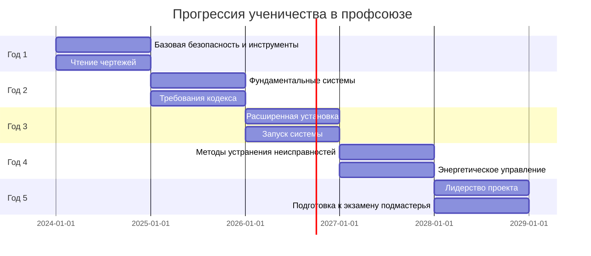
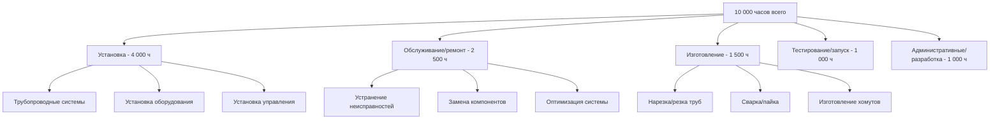

## Обзор

Программы ученичества в профсоюзах обеспечивают наиболее структурированный и комплексный путь обучения специалистов HVAC. Эти зарегистрированные программы объединяют обширное аудиторное обучение с контролируемым практическим обучением, следуя учебным планам, одобренным Министерством труда США. Программы ученичества в профсоюзах обычно длятся 4-5 лет и подготавливают работников к компетентности на уровне подмастерья в специализированных профессиях, включая монтаж трубопроводов, работу с листовым металлом и установку систем управления.

Профсоюзное ученичество предлагает стандартизированное обучение, предсказуемую прогрессию заработной платы и портативные удостоверения, признаваемые в разных юрисдикциях. Выпускники получают сертификацию подмастерья, одновременно развивая знания в области термодинамики, механики жидкостей, электрических систем и методов изготовления, необходимые для качественной установки и обслуживания HVAC.

## Основные программы ученичества в профсоюзах

### United Association (UA) Монтажники трубопроводов

United Association of Journeymen and Apprentices of the Plumbing and Pipe Fitting Industry представляет монтажников трубопроводов, паромонтажников и техников HVAC. Программы ученичества UA сосредоточены на трубопроводных системах для приложений отопления, охлаждения и охлаждения.

**Продолжительность программы**: 5 лет (10 000 часов практического обучения + 1 020 часов аудиторного обучения)

**Основные компетенции**
- Проектирование и установка гидравлических систем
- Техники пайки холодильных трубопроводов
- Паровые и конденсатные системы
- Работа сосудов под давлением
- Методы сварки и соединения
- Чтение чертежей и разработка компоновки систем

**Принципы термодинамики**

Монтажники трубопроводов должны понимать теплопередачу в трубопроводных системах. Потеря тепла из изолированной трубы следует:

$$Q = \frac{2\pi L(T_i - T_\infty)}{\frac{1}{h_i r_i} + \frac{\ln(r_o/r_i)}{k_{pipe}} + \frac{\ln(r_{ins}/r_o)}{k_{ins}} + \frac{1}{h_o r_{ins}}}$$

Где:
- $Q$ = тепловой поток (Вт)
- $L$ = длина трубы (м)
- $T_i$ = температура жидкости внутри (К)
- $T_\infty$ = температура окружающей среды (К)
- $h_i$, $h_o$ = коэффициенты конвекции внутри/снаружи (Вт/м²·К)
- $r_i$, $r_o$, $r_{ins}$ = внутренний, внешний радиусы трубы и радиус изоляции (м)
- $k_{pipe}$, $k_{ins}$ = теплопроводность трубы и изоляции (Вт/м·К)

Этот расчет определяет требования толщины изоляции согласно мандатам энергоэффективности ASHRAE Standard 90.1.

### Sheet Metal Workers' International Association (SMWIA)

Рабочие листового металла изготавливают, устанавливают и обслуживают воздуховоды и системы распределения воздуха. Программы ученичества SMWIA подчеркивают точное изготовление, балансировку систем и оптимизацию расхода воздуха.

**Продолжительность программы**: 4-5 лет (8 000-10 000 часов практического обучения + 800-1 020 часов аудиторного обучения)

**Основные компетенции**
- Техники изготовления и разработки воздуховодов
- Проектирование систем распределения воздуха
- Геометрия листового металла и разработка шаблонов
- Сварка и пайка
- Автоматизированное проектирование (CAD) для воздуховодов
- Тестирование, регулировка и балансировка (TAB)

**Расчеты расхода воздуха**

Правильный размер воздуховода требует понимания соотношений потерь на трение. Уравнение Дарси-Вейсбаха для перепада давления:

$$\Delta P = f \frac{L}{D} \frac{\rho V^2}{2}$$

Где:
- $\Delta P$ = перепад давления (Па)
- $f$ = коэффициент трения Дарси (безразмерный)
- $L$ = длина воздуховода (м)
- $D$ = диаметр воздуховода или гидравлический диаметр (м)
- $\rho$ = плотность воздуха (кг/м³)
- $V$ = скорость воздуха (м/с)

Для прямоугольных воздуховодов гидравлический диаметр:

$$D_h = \frac{2ab}{a+b}$$

Где $a$ и $b$ представляют размеры воздуховода (м).

Ученики-рабочие листового металла учатся проектировать системы, соответствующие максимальным скоростям трения ASHRAE Standard 90.1, поддерживая приемлемые пределы скорости.

### International Brotherhood of Electrical Workers (IBEW) - Системы управления HVAC

Электрики IBEW, специализирующиеся на системах управления HVAC, устанавливают, программируют и обслуживают системы автоматизации зданий, кабели управления и системы энергетического управления.

**Продолжительность программы**: 5 лет (8 000-10 000 часов практического обучения + 900-1 000 часов аудиторного обучения)

**Основные компетенции**
- Программирование и диагностика систем управления
- Системы автоматизации зданий (BACnet, LonWorks, Modbus)
- Установка приводов с переменной частотой (VFD)
- Калибровка и размещение датчиков
- Стратегии энергетического управления
- Соответствие электрическим кодам (NEC Article 725)

**Логика управления и характеристика отклика**

Пропорционально-интегрально-производное (PID) управление поддерживает точное регулирование температуры. Выход контроллера:

$$u(t) = K_p e(t) + K_i \int_0^t e(\tau)d\tau + K_d \frac{de(t)}{dt}$$

Где:
- $u(t)$ = выход контроллера
- $e(t)$ = сигнал ошибки (уставка - измеренное значение)
- $K_p$ = коэффициент пропорциональности
- $K_i$ = коэффициент интегрирования
- $K_d$ = коэффициент производной

Понимание подстройки PID предотвращает нестабильность и оптимизирует отклик системы согласно ASHRAE Guideline 36 для высокопроизводительных последовательностей.

## Структура программы и временная шкала

## График прогрессии заработной платы

Профсоюзное ученичество предусматривает предсказуемое увеличение заработной платы на основе отработанных часов и вех компетентности. Зарплата рассчитывается как процент от шкалы подмастерья.

| Период | Завершено часов | Процент заработной платы | Пример заработной платы (50 у.е./ч подмастерья) |
|--------|-----------------|-----------------|----------------------------------|
| 1-й период | 0-1 000 | 40% | 20,00 у.е./ч |
| 2-й период | 1 001-2 000 | 45% | 22,50 у.е./ч |
| 3-й период | 2 001-3 000 | 50% | 25,00 у.е./ч |
| 4-й период | 3 001-4 000 | 55% | 27,50 у.е./ч |
| 5-й период | 4 001-5 000 | 60% | 30,00 у.е./ч |
| 6-й период | 5 001-6 000 | 65% | 32,50 у.е./ч |
| 7-й период | 6 001-7 000 | 70% | 35,00 у.е./ч |
| 8-й период | 7 001-8 000 | 75% | 37,50 у.е./ч |
| 9-й период | 8 001-9 000 | 80% | 40,00 у.е./ч |
| 10-й период | 9 001-10 000 | 85% | 42,50 у.е./ч |
| Подмастерье | 10 000+ | 100% | 50,00 у.е./ч |

Заработная плата включает дополнительные льготы, охватывающие медицинское страхование, пенсионные взносы и взносы в фонд обучения, обычно добавляющие 30-50% к базовым почасовым ставкам.

## Требования аудиторного обучения

Профсоюзное ученичество требует определенного минимума аудиторных часов, распределенных по техническим предметам:

**Типичное распределение учебного плана** (программа на 1 000 часов)

| Область подготовки | Часы | Процент |
|-------------|-------|-----------|
| Математика профессии | 120 | 12% |
| Чтение чертежей | 100 | 10% |
| Основы HVAC | 180 | 18% |
| Электрические системы | 140 | 14% |
| Безопасность и соответствие кодексам | 100 | 10% |
| Установка трубопроводов/воздуховодов | 160 | 16% |
| Системы управления и автоматизация | 100 | 10% |
| Проектирование систем | 80 | 8% |
| Методы устранения неисправностей | 80 | 8% |
| Практики экологичного строительства | 40 | 4% |

Занятия обычно проводятся два вечера в неделю в течение учебного года, позволяя ученикам работать полный рабочий день, завершая требования образования.

## Стандарты практического обучения

Практическое обучение следует документированным рабочим процессам, обеспечивающим знакомство с требуемыми компетенциями. Ученики ведут журналы, записывая часы по категориям задач.

**Требуемые категории опыта** (пример UA Pipefitters)

Подмастерья наблюдают за учениками, поддерживая максимальные коэффициенты (обычно 1:1 до 1:3 в зависимости от сложности задачи и юрисдикции).

## Процесс сертификации подмастерья

Завершение требований ученичества квалифицирует работников для сертификации подмастерья через письменные и практические экзамены.

**Требования для сертификации**
1. Завершить минимум часов практического обучения (8 000-10 000 часов)
2. Завершить минимум часов аудиторного обучения (800-1 020 часов)
3. Сдать письменный экзамен по теории профессии и знаниям кодекса
4. Сдать практический экзамен, демонстрирующий практическую компетентность
5. Соответствовать требованиям лицензирования конкретной юрисдикции

**Согласование тем экзамена со стандартами ASHRAE**
- Процедуры расчета нагрузок (ASHRAE Handbook - Fundamentals)
- Требования вентиляции (ASHRAE Standard 62.1/62.2)
- Мандаты энергоэффективности (ASHRAE Standard 90.1)
- Обращение с хладагентом (ASHRAE Standard 15)
- Последовательности управления (ASHRAE Guideline 36)

## Преимущества профсоюзного ученичества

**Стандартизированное обучение**
- Национально признаваемые учебные планы, одобренные Министерством труда
- Последовательное качество между учебными заведениями
- Портативные удостоверения, признаваемые в нескольких юрисдикциях
- Регулярные обновления учебного плана, отражающие технологические достижения

**Экономические преимущества**
- Зарабатывайте во время обучения с предсказуемым увеличением заработной платы
- Медицинское страхование и пенсионные льготы во время обучения
- Отсутствие затрат на обучение (финансируется благодаря коллективным договорам)
- Более высокие пожизненные доходы по сравнению с не профсоюзными коллегами

**Поддержка карьеры**
- Профсоюзные биржи труда связывают рабочих с возможностями трудоустройства
- Программы повышения квалификации для развития навыков
- Обучение безопасности и предоставление оборудования
- Отстаивание условий труда и заработной платы

**Стандарты качества**
- Строгий надзор обеспечивает качество обучения
- Подчеркивание соответствия кодексам и лучших практик
- Доступ к современным учебным заведениям и оборудованию
- Крепкое партнерство работодателей обеспечивает разнообразный опыт

## Требования к приему и процесс

**Минимальные квалификации**
- Аттестат о среднем образовании или эквивалент GED
- Минимальный возраст 18 лет (некоторые программы принимают 16-17 лет с ограничениями)
- Действующие водительские права
- Физическая способность выполнять задачи профессии
- Прохождение проверки на наркотики и проверки истории

**Процесс подачи заявки**
1. Подать заявку в местный учебный центр профсоюза
2. Пройти тест способностей, измеряющий механическое мышление и математику
3. Пройти собеседование с комитетом по ученичеству
4. Предоставить выписки и документацию
5. Ожидать выбора из пула квалифицированных кандидатов

**Критерии отбора**
- Баллы теста способностей (обычно 40% оценки)
- Производительность на собеседовании (30%)
- Образование и историю работы (20%)
- Военную службу или другой соответствующий опыт (10%)

Конкуренция за места остается высокой, и некоторые местные отделения ведут списки ожидания на несколько лет.

## Сравнение с не профсоюзными альтернативами

| Особенность | Профсоюзное ученичество | Не профсоюзное ученичество | Торговая школа |
|---------|---------------------|-------------------------|--------------|
| Продолжительность | 4-5 лет | 2-4 года | 6-24 месяца |
| Общее количество часов обучения | 8 000-10 000 практических + 800-1 020 аудиторных | Переменное, обычно 4 000-6 000 практических | 1 200-2 400 аудиторных |
| Стоимость для ученика | 0 у.е. (финансируется профсоюзом) | 0-5 000 у.е. | 5 000-30 000 у.е. обучение |
| Заработная плата во время обучения | 40-85% шкалы подмастерья | 30-70% шкалы подмастерья | Без заработной платы (статус студента) |
| Льготы | Полное здравоохранение/пенсия с начала | Переменное, часто отсроченное | Нет |
| Удостоверение | Сертификат, зарегистрированный DOL | Варьируется по программе | Диплом/сертификат |
| Размещение на работу | Профсоюзная биржа труда | Независимый поиск | Услуги карьеры |

## Повышение квалификации и продвижение по карьере

Сертификация подмастерья отмечает начало непрерывного профессионального развития, а не конца карьеры.

**Возможности расширенного обучения**
- Курсы сертификации мастера и суперинтенданта
- Сертификация сварки (ASME Section IX, AWS D1.1)
- OSHA 30-часовое обучение безопасности в строительстве
- Учетные данные специалиста по автоматизации зданий
- Сертификация инструктора для обучения учеников
- Обучение управлению проектами

**Пути специализации**
- Системы медицинского газа (сертификация ASSE 6010)
- Установка HVAC в чистых помещениях (стандарты ISO 14644)
- Системы промышленного охлаждения (сертификаты RETA)
- Установка геотермальных тепловых насосов
- Интеграция солнечных тепловых систем
- Полномочия по комиссионированию зданий (учетные данные CxA)

## Заключение

Профсоюзное ученичество представляет золотой стандарт подготовки в профессии HVAC, объединяя строгое техническое образование с обширным практическим опытом. Структурированный подход обеспечивает, что выпускники обладают как теоретическим пониманием принципов термодинамики, так и практической компетентностью, необходимой для сложной установки и обслуживания систем. Для людей, ищущих комплексное обучение, экономическую безопасность во время образования и признанные удостоверения, профсоюзное ученичество предоставляет оптимальный путь в профессию HVAC.

## Категории ученичества в профсоюзах

- [UA United Association Монтажники трубопроводов](./ua-united-association-pipefitters/)
- [Ученичество рабочих листового металла](./sheet-metal-workers-apprenticeship/)
- [Ученичество электриков Системы управления HVAC](./electricians-apprenticeship-hvac-controls/)
- [Пятилетняя программа ученичества](./five-year-apprenticeship-program/)
- [Часы аудиторного обучения](./classroom-instruction-hours/)
- [Часы практического обучения](./on-the-job-training-hours/)
- [Сертификация подмастерья](./journeyman-certification/)
- [Прогрессия заработной платы ученика](./apprenticeship-wage-progression/)
