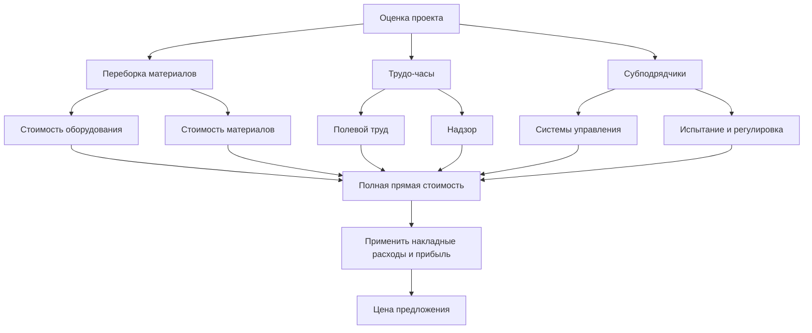
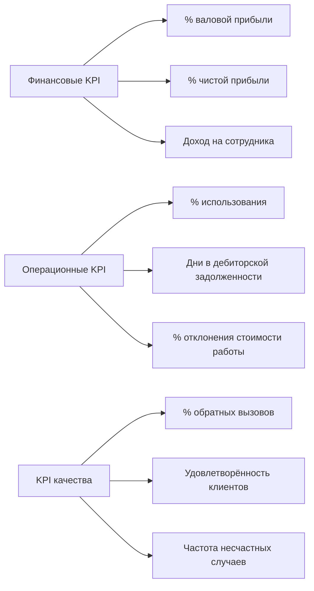
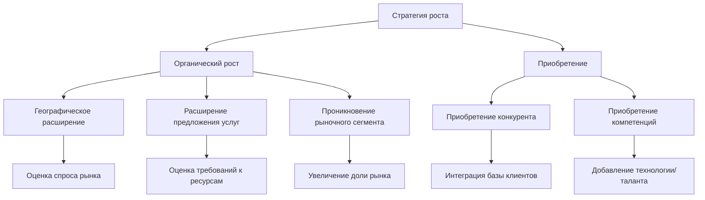

Обучение управлению бизнесом оснащает подрядчиков HVAC необходимыми навыками для управления прибыльными, устойчивыми предприятиями при сохранении технического совершенства. Эффективное управление бизнесом интегрирует финансовый анализ, стратегическое планирование, точность оценки, управление взаимоотношениями с клиентами и операционную эффективность для создания конкурентного преимущества на рынке инженерных работ.

## Финансовые основы для подрядчиков HVAC

Звуковое финансовое управление формирует основу успешных операций подряда. Понимание структуры затрат, стратегий ценообразования и метрик прибыльности позволяет принимать решения, основанные на данных.

**Структура классификации затрат:**

Затраты подрядов HVAC делятся на прямые затраты проекта, косвенные затраты и накладные расходы. Точная классификация определяет точность ценообразования и анализ прибыльности.

| Категория затрат | Компоненты | Типичный % доходов |
|------------------|-----------|-------------------|
| Прямой труд | Заработная плата техников, налоги на заработную плату, льготы | 20-30% |
| Прямые материалы | Оборудование, детали, материалы, расходники | 25-35% |
| Косвенные затраты | Управление проектом, надзор, инструменты, автомобили | 10-15% |
| Накладные расходы | Офисный персонал, помещение, страховка, коммунальные услуги, маркетинг | 15-25% |
| Прибыль | Чистый операционный доход до налогов | 8-15% |

**Расчет трудовой нагрузки:**

Трудовая нагрузка представляет полную стоимость занятости сверх базовой заработной платы, включая налоги на заработную плату, страховку, льготы и неоплачиваемое время.

$$\text{Коэффициент трудовой нагрузки} = \frac{\text{Полная стоимость труда} - \text{Базовая заработная плата}}{\text{Базовая заработная плата}} \times 100\%$$

$$\text{Загруженная ставка труда} = \text{Базовая заработная плата} \times (1 + \text{Коэффициент нагрузки})$$

Пример расчёта:

- Базовая зарплата техника: 1 300 руб./ч
- Налоги на заработную плату (FICA, FUTA, SUTA): 10,5% = 137 руб./ч
- Страховка компенсации работников: 8,0% = 104 руб./ч
- Медицинская страховка: 304 руб./ч
- Оплачиваемое время отпуска (отпуск, болезнь, праздники): 12% = 156 руб./ч
- Неоплачиваемое время (обучение, встречи, командировки): 8% = 104 руб./ч
- Полная нагрузка: 805 руб./ч (61,7% базовой зарплаты)
- Загруженная ставка труда: 1 300 + 805 = 2 105 руб./ч

**Анализ восстановления накладных расходов:**

Распределение накладных расходов распределяет фиксированные затраты по видам деятельности, генерирующим доход. Подрядчики обычно используют методы по трудо-часам или проценту доходов.

$$\text{Коэффициент накладных расходов (метод трудо-часов)} = \frac{\text{Годовые накладные расходы}}{\text{Годовые оплачиваемые часы}}$$

$$\text{Коэффициент накладных расходов (метод доходов)} = \frac{\text{Годовые накладные расходы}}{\text{Годовой доход}} \times 100\%$$

Для фирмы подряда с годовыми накладными расходами в размере 39 660 000 руб. и 12 000 оплачиваемых часов на шести техников:

$$\text{Коэффициент накладных расходов} = \frac{39 660 000}{12 000 \text{ ч}} = 3 305 \text{ руб./ч}$$

Эта накладная нагрузка добавляется к загруженной стоимости труда при расчёте ставок выставления счётов.

**Анализ наценки и маржи:**

Понимание математической связи между наценкой и маржей предотвращает ошибки ценообразования, которые снижают прибыльность.

$$\text{Наценка} = \frac{\text{Цена продажи} - \text{Стоимость}}{\text{Стоимость}} \times 100\%$$

$$\text{Маржа} = \frac{\text{Цена продажи} - \text{Стоимость}}{\text{Цена продажи}} \times 100\%$$

$$\text{Наценка} = \frac{\text{Маржа}}{1 - \text{Маржа}}$$

$$\text{Маржа} = \frac{\text{Наценка}}{1 + \text{Наценка}}$$

| Целевая маржа | Требуемая наценка | Множитель цены продажи |
|---------------|-----------------|----------------------|
| 20% | 25% | 1,25 |
| 25% | 33% | 1,33 |
| 30% | 43% | 1,43 |
| 35% | 54% | 1,54 |
| 40% | 67% | 1,67 |

Применение 25% наценки к стоимости 467 000 руб. даёт цену продажи 583 750 руб. с маржей 20%, а не 25% — распространённая ошибка, которая снижает прибыльность на 20%.

## Оценка проектов и стратегии предложений

Точная оценка определяет прибыльность проекта и конкурентное позиционирование. Систематические процессы оценки снижают риск при сохранении согласованности.

**Коэффициенты производительности труда:**

Требования к трудозатратам при установке HVAC варьируются в зависимости от сложности системы, условий на месте и опыта бригады. Стандартные единицы труда обеспечивают согласованность оценки.

**Стандартные единицы труда (часы на единицу):**

| Задача установки | Трудо-часы | Единица | Условия |
|------------------|-----------|--------|--------|
| Воздуховоды (прямоугольные) | 0,10-0,15 | кг | Новое строительство |
| Воздуховоды (гибкие) | 0,08-0,12 | м | Жилые помещения |
| Медные трубопроводы (пайка) | 0,15-0,25 | м | Варьируется по диаметру |
| Установка чиллера | 40-80 | кВт | Такелаж, электричество отдельно |
| Установка крышного блока | 8-16 | кВт | Кран включён |
| Установка VAV-блока | 3-5 | блок | Системы управления отдельно |
| Решётки/диффузоры | 0,25-0,40 | блок | Стандартная сетка потолка |
| Гидравлические трубопроводы (сварка) | 0,30-0,50 | м | Сталь по ГОСТ |

**Коэффициенты корректировки сложности:**

Базовые трудо-часы требуют корректировки для специфических условий на месте, которые влияют на производительность.

- Работы по переоборудованию: 1,15-1,35× (координация, защита, ограничения доступа)
- Занятое помещение: 1,10-1,25× (ограниченный график, ограничения по шуму)
- Высокие места (>3,7 м): 1,08-1,15× (строительные леса, перемещение материалов)
- Тесные технические помещения: 1,15-1,30× (ограниченное рабочее пространство, сложность такелажа)
- Ускоренные графики: 1,10-1,20× (переработки, сжатые сроки)
- Зимние условия: 1,05-1,15× (отопление, задержки из-за погоды)

**Матрица оценки рисков предложения:**

Систематическая оценка рисков определяет соответствующие уровни резерва и решения о предложении/отказе.

| Фактор риска | Низкий риск (2-3%) | Средний риск (4-6%) | Высокий риск (7-10%) |
|-------------|------------------|-------------------|-------------------|
| Полнота проекта | 100% рабочих чертежей, нет запросов | Незначительные пробелы, <10 запросов | Неполный, разработка-строительство |
| График | Нормальная продолжительность | Ускоренный на 15-25% | Сжатый график |
| Доступ к месту | Необслуживаемое, площадка | Ограниченная площадка | Поэтапный, занятое |
| История заказчика | Постоянный клиент, быстрые платежи | Новый клиент, проверенный | Сомнения в платежах |
| Доступность субподрядчиков | Квалифицированные субподрядчики доступны | Ограниченные варианты | Дефицит ресурсов |
| Ценообразование материалов | Стабильные, указанные цены | Умеренная волатильность | Быстрая эскалация |

Полный резерв проекта равен сумме отдельных факторов риска. Проекты, превышающие 15% полного резерва, требуют дополнительного анализа или отказа от предложения.

## Анализ точки безубыточности и стратегии ценообразования

Понимание соотношений точки безубыточности позволяет принимать стратегические решения по ценообразованию, которые балансируют конкурентоспособность рынка с требованиями прибыльности.

**Расчёт доходов точки безубыточности:**

Фиксированные затраты должны быть восстановлены через маржу вклада перед генерированием прибыли.

$$\text{Доход безубыточности} = \frac{\text{Фиксированные затраты}}{\text{Коэффициент маржи вклада}}$$

$$\text{Коэффициент маржи вклада} = \frac{\text{Доход} - \text{Переменные затраты}}{\text{Доход}}$$

Для подрядчика HVAC с годовыми фиксированными затратами в размере 33 640 000 руб. (накладные расходы) и коэффициентом маржи вклада 45%:

$$\text{Доход безубыточности} = \frac{33 640 000}{0,45} = 74 756 000 \text{ руб.}$$

Доход ниже этого порога создаёт операционные убытки; доход выше создаёт прибыль на 45% прироста дополнительных продаж.

**Планирование прибыли:**

Целевые показатели прибыли определяют необходимые уровни доходов и операционную эффективность.

$$\text{Требуемый доход} = \frac{\text{Фиксированные затраты} + \text{Целевая прибыль}}{\text{Коэффициент маржи вклада}}$$

Для достижения целевой прибыли в 14 000 000 руб. в год с предыдущими параметрами:

$$\text{Требуемый доход} = \frac{33 640 000 + 14 000 000}{0,45} = 105 645 000 \text{ руб.}$$

Это представляет увеличение доходов на 41,7% выше точки безубыточности, требующее стратегического планирования развития рынка, повышения производительности или оптимизации ценообразования.

**Анализ использования мощности:**

Трудовая мощность представляет ограничение в большинстве операций подрядов HVAC. Максимизация использования оплачиваемого времени улучшает прибыльность без пропорционального увеличения накладных расходов.

$$\text{Коэффициент использования} = \frac{\text{Оплачиваемые часы}}{\text{Доступные часы}} \times 100\%$$

$$\text{Доход на техника} = \text{Оплачиваемые часы} \times \text{Ставка выставления счёта}$$

Для шести техников, работающих 2 080 часов в год:
- Полные доступные часы: 6 × 2 080 = 12 480 часов
- Неоплачиваемое время (15%): 1 872 часа
- Доступные оплачиваемые часы: 10 608 часов
- Фактические оплачиваемые часы (целевой показатель 80%): 8 486 часов
- Коэффициент использования: 8 486 / 10 608 = 80,0%

Улучшение использования с 75% до 85% увеличивает оплачиваемые часы на 1 061 час в год. При ставке выставления счёта 5 850 руб./ч это генерирует дополнительный доход в 6 207 000 руб. с минимальным увеличением накладных расходов — эквивалент роста доходов на 5,9%.

## Управление денежными потоками

Подряды HVAC требуют тщательного управления денежными потоками из-за циклов платежей проектов, требований закупок материалов и потребностей в финансировании труда.

**Требования оборотного капитала:**

Оборотный капитал финансирует разрыв между расходами проекта и платежами клиентов.

$$\text{Потребность в оборотном капитале} = \text{Дни в дебиторской задолженности} + \text{Дни в запасах} - \text{Дни в кредиторской задолженности}$$

Выраженные как потребность в наличности:

$$\text{Потребность в наличности} = \frac{\text{Годовой доход} \times \text{Дни оборотного капитала}}{365}$$

Пример расчёта оборотного капитала:
- Средние дни в дебиторской задолженности: 45 дней
- Средние дни в запасах: 20 дней
- Средние дни в кредиторской задолженности: 30 дней
- Цикл оборотного капитала: 45 + 20 - 30 = 35 дней
- Годовой доход: 93 300 000 руб.
- Потребность в наличности: (93 300 000 × 35) / 365 = 8 950 000 руб.

Подрядчики должны поддерживать достаточные кредитные линии или резервы наличности для финансирования этой потребности оборотного капитала во время периодов роста или сезонных колебаний.

**Оптимизация выставления счётов по прогрессу:**

Структуры платежей проектов напрямую влияют на денежный поток и прибыльность проекта.

| Структура выставления счётов | Влияние на денежный поток | Уровень риска | Типичное применение |
|------------------------------|-------------------------|-------------|-------------------|
| Авансовый платёж | Положительный денежный поток | Низкий | Сервисные контракты |
| 50% авансово, 50% по завершении | Нейтральный к положительному | Низкий | Жилые замены |
| Выставление счётов по прогрессу (месячно) | Нейтральный | Средний | Коммерческое строительство |
| Удержание (10%) | Отрицательный денежный поток | Средний | Крупные проекты |
| Условия Net 30-60 | Отрицательный денежный поток | Высокий | Государственные, коммерческие |

**Заявка на материалы и мобилизацию (AMM):**

Строительные проекты часто включают авансовый платёж для мобилизации и закупки материалов, улучшая денежный поток подрядчика.

Стандартная структура AMM:
- 10% заявки/мобилизации при получении контракта
- Платёж материалов при доставке на место
- Платежи по прогрессу на основе завершения установки
- Финальный платёж за вычетом удержания при существенном завершении
- Освобождение удержания после периода гарантии

## Метрики производительности управления проектами

Количественные метрики обеспечивают объективную оценку производительности и инициативы непрерывного совершенствования.

**Ключевые показатели производительности (KPI):**

**Эталоны финансовой производительности:**

| Метрика | Среднее по отрасли | Верхний квартиль | Расчёт |
|--------|------------------|-----------------|--------|
| Валовая маржа прибыли | 28-35% | >38% | (Доход - Прямые затраты) / Доход |
| Чистая маржа прибыли | 5-8% | >10% | Чистый доход / Доход |
| Доход на сотрудника | 8,4М-10,3М руб. | >11,7М руб. | Годовой доход / Всего сотрудников |
| Текущее отношение | 1,2-1,5 | >1,8 | Текущие активы / Текущие обязательства |
| Отношение долга к собственному капиталу | 0,8-1,5 | <0,6 | Полный долг / Собственный капитал владельца |
| Возврат на активы | 8-12% | >15% | Чистый доход / Полные активы |

**Контроль стоимости работы:**

Учёт затрат в реальном времени выявляет отклонения до завершения проекта, обеспечивая корректирующие меры.

$$\text{Отклонение стоимости работы} = \frac{\text{Фактическая стоимость} - \text{Сметная стоимость}}{\text{Сметная стоимость}} \times 100\%$$

$$\text{Индекс производительности затрат} = \frac{\text{Сметная стоимость выполненной работы}}{\text{Фактическая стоимость выполненной работы}}$$

Значения индекса производительности затрат указывают на финансовое здоровье проекта:
- Индекс > 1,0: В пределах бюджета
- Индекс = 1,0: В соответствии с бюджетом
- Индекс < 1,0: Превышение бюджета

Менеджеры проектов должны проверять стоимость работы еженедельно, выявляя отклонения, превышающие ±5%, для немедленного расследования и корректирующих мер.

## Управление взаимоотношениями с клиентами

Стоимость привлечения клиентов значительно превышает стоимость удержания клиентов, что делает управление взаимоотношениями экономически критичным для устойчивой прибыльности.

**Пожизненная стоимость клиента (CLV):**

CLV определяет полный потенциал доходов от взаимоотношений с клиентами, информируя решения по инвестициям в маркетинг.

$$\text{CLV} = \text{Среднее значение операции} \times \text{Операции в год} \times \text{Период удержания} \times \text{Маржа прибыли}$$

Для коммерческого клиента:
- Среднее значение проекта: 1 635 000 руб.
- Проектов в год: 2,5
- Среднее удержание: 8 лет
- Маржа прибыли: 22%
- CLV = 1 635 000 × 2,5 × 8 × 0,22 = 7 195 000 руб.

Этот анализ оправдывает маркетинговые расходы в 1 400 000–1 870 000 руб. на привлечение клиентов, когда стратегии удержания поддерживают долгосрочные взаимоотношения.

**Экономика сервисных соглашений:**

Соглашения о профилактическом обслуживании обеспечивают повторяющийся доход, стабильность денежного потока и возможности замены оборудования.

Модель ценообразования сервисного контракта:

$$\text{Годовая цена контракта} = \frac{\text{Прямая стоимость} + \text{Распределение накладных расходов}}{1 - \text{Целевая маржа}}$$

Для ежеквартального коммерческого обслуживания HVAC:
- Труд: 8 ч/визит × 4 визита × 3 040 руб./ч = 97 280 руб.
- Материалы (фильтры, ремни): 14 950 руб.
- Распределение накладных расходов (35%): 39 286 руб.
- Полная стоимость: 151 516 руб.
- Целевая маржа: 30%
- Годовая цена: 151 516 / 0,70 = 216 451 руб.

Сервисные соглашения увеличивают срок службы оборудования на 40-60% благодаря профилактическому обслуживанию, предоставляя подрядчикам предсказуемые потоки доходов и механизмы удержания клиентов.

## Оптимизация операционной эффективности

Улучшение процессов и внедрение технологий снижают затраты, улучшают качество и повышают конкурентное позиционирование.

**Экономика управления автопарком:**

Затраты на автотранспорт составляют 8-12% доходов подрядчика. Оптимальные циклы замены уравновешивают надёжность с амортизацией.

$$\text{Полная стоимость владения} = \text{Амортизация} + \text{Топливо} + \text{Обслуживание} + \text{Страховка} + \text{Финансирование}$$

$$\text{Годовая стоимость на км} = \frac{\text{Полная годовая стоимость}}{\text{Годовые км}}$$

Критерии решения замены:
- Совокупное обслуживание превышает 50% стоимости замены
- Годовой простой превышает 5% доступного времени
- Деградация топливной экономичности >15% от базовой
- Возраст/пробег: 7-10 лет или 240 000–320 000 км

GPS-отслеживание автопарка снижает затраты на 12-18% благодаря оптимизации маршрутов, устранению несанкционированного использования и мониторингу производительности.

**Анализ ROI технологии:**

Программное обеспечение управления бизнесом, инструменты оценки и автоматизация полевого обслуживания требуют обоснования инвестиций через прибыль производительности.

Пример ROI программного обеспечения управления полевым обслуживанием:
- Годовая стоимость программного обеспечения: 561 000 руб. (6 лицензий)
- Время внедрения: 40 часов
- Улучшение производительности:
  - Эффективность планирования: прибыль использования 5% = 356 оплачиваемых часов
  - Сокращение административного времени: 300 часов в год
  - Более быстрое выставление счётов: сокращение дебиторской задолженности на 8 дней
- Влияние на доход: 356 ч × 5 850 руб./ч = 2 082 000 руб.
- Влияние на денежный поток: (93 300 000 × 8) / 365 = 2 047 000 руб.
- ROI: (2 082 000 + 2 047 000 - 561 000) / 561 000 = 729%

Инвестиции в технологию, демонстрирующие ROI >200% в течение 12 месяцев, гарантируют немедленное внедрение.

## Стратегическое деловое планирование

Долгосрочный успех бизнеса требует стратегического планирования, которое согласовывает ресурсы, рыночные возможности и цели роста.

**Анализ сегментации рынка:**

Подрядчики HVAC должны определить целевые рынки на основе прибыльности, конкурентного преимущества и требований к ресурсам.

| Рыночный сегмент | Типичная маржа | Конкуренция | Потребность в капитале | Уровень навыков |
|-----------------|----------------|-----------|----------------------|-----------------|
| Жилое обслуживание | 35-45% | Высокая | Низкая | Средний |
| Жилая замена | 25-35% | Высокая | Средняя | Средний |
| Лёгкое коммерческое | 18-25% | Средняя | Средняя | Высокий |
| Коммерческое строительство | 12-18% | Высокая | Высокая | Высокий |
| Промышленный процесс | 15-22% | Низкая | Высокая | Очень высокий |
| Энергетические услуги | 20-30% | Средняя | Низкая | Очень высокий |

Выбор рынка должен приоритизировать сегменты, где возможности подрядчика создают конкурентное преимущество и маржи поддерживают инвестиции роста.

**Модели стратегии роста:**

Органический рост благодаря расширению услуг требует меньше капитала, но требует более длительных сроков (3-5 лет). Приобретение ускоряет рост, но требует значительного капитала и опыта интеграции. Наиболее успешные подрядчики применяют гибридные стратегии, сочетающие органическое развитие с избирательными приобретениями.

Компетенции в управлении бизнесом, развитые благодаря комплексным программам обучения, позволяют подрядчикам HVAC создавать прибыльные, устойчивые предприятия, которые обеспечивают постоянную ценность для клиентов при предоставлении финансовых доходов, поддерживающих долгосрочную жизнеспособность и цели роста бизнеса.

## Компоненты

- Деловое планирование подрядчиков HVAC
- Финансовое управление подрядчиков
- Стратегии оценки и предложений
- Основы управления проектами
- Совершенство в обслуживании клиентов
- Обучение продажам HVAC
- Маркетинг цифровое присутствие
- Управление сотрудниками кадровые ресурсы
- Соответствие нормативно-правовым требованиям подрядчиков
- Требования по страховке и облигациям
- Внедрение технологии инструменты программного обеспечения
