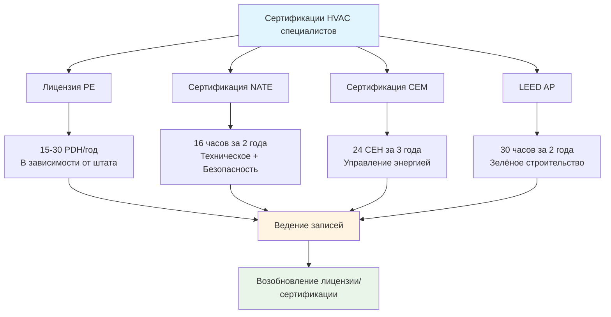
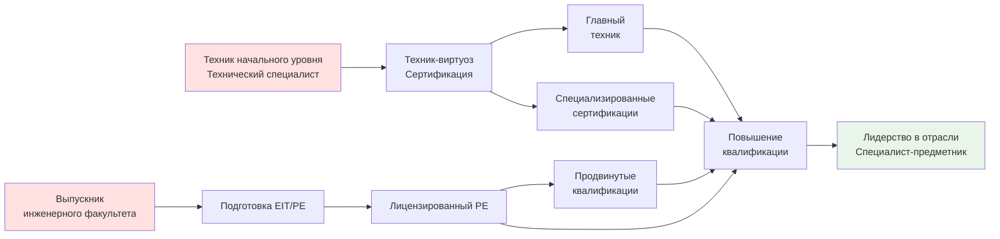

# Повышение квалификации в области HVAC

Повышение квалификации поддерживает профессиональную компетентность, соответствует требованиям лицензирования и способствует карьерному росту в индустрии HVAC. Инженеры-специалисты, сертифицированные технические специалисты и операторы зданий должны накопить определённое количество образовательных кредитов для поддержания квалификации и соответствия развивающимся технологиям, кодам и методологиям проектирования.

## Системы образовательных кредитов

### Часы профессионального развития (PDHs)

PDHs квантифицируют повышение квалификации для лицензированных инженеров-специалистов, причём требования различаются по государственным лицензионным советам:

**Требования государств:**
- Большинство штатов требуют 15-30 PDH ежегодно
- 1 PDH = 1 час контактного обучения
- Положения о переносе обычно разрешают переносить 50% избыточных кредитов
- Некоторые штаты требуют изучения определённых тем (этика, обновления кодов)

**Приемлемые виды деятельности:**
- Технические курсы и семинары
- Веб-семинары и онлайн-обучение
- Участие в конференциях
- Опубликованные технические статьи (авторские кредиты)
- Преподавание технических курсов (кредиты инструктора)
- Участие в комитетах профессиональных организаций

### Образовательные единицы (CEU)

CEU обеспечивают стандартизированное измерение образовательных программ, не требующих соответствующей подготовки:

**Расчёт:**
- 1 CEU = 10 часов контактного обучения
- Должны соответствовать стандартам качества IACET
- Требует документирования результатов обучения
- Проверка знаний или компетентности

**Применение в области HVAC:**
- Возобновление сертификации техника NATE (16 часов за 2 года)
- Сертификаты операторов зданий
- Обучение продукции производителей
- Программы обучения безопасности

## Требования по поддержанию сертификации

### Требования для инженеров-специалистов

**Типичные требования совета штата:**
- 15-30 PDH за период возобновления (1-2 года)
- Курс этики: 1-2 PDH за период
- Рекомендуется изучение тем здоровья, безопасности и социального обеспечения
- Хранение документации: 4-6 лет
- Проверка соответствия требованиям аудита

### Возобновление сертификации технического специалиста

**Требования NATE:**
- Пересертификация каждые 2 года
- Минимум 16 часов повышения квалификации
- Должно включать обучение безопасности с хладагентами
- Можно комбинировать онлайн и очные форматы

**EPA раздел 608:**
- Повышение квалификации не требуется
- Сертификация не истекает
- Добровольное обновляющее обучение рекомендуется
- Требуется осведомлённость об обновлениях нормативных актов

## Форматы доставки образовательных материалов

### Сравнение форматов

| Формат | Стоимость | Гибкость | Взаимодействие | Одобрение PDH/CEU | Лучше всего для |
|--------|----------|----------|---|---|---|
| **Очное занятие** | $$$ | Низкая | Высокое | Да | Практические навыки, сложные темы |
| **Веб-семинары** | $ | Высокая | Среднее | Да | Удобство, общие темы |
| **Самостоятельное онлайн-обучение** | $$ | Очень высокая | Низкое | Варьируется | Самостоятельные учащиеся |
| **Конференции** | $$$$ | Низкая | Очень высокое | Да | Сетевые контакты, множество тем |
| **Обучение производителя** | Бесплатно-$$ | Среднее | Высокое | Иногда | Знание специфики продукта |
| **Профессиональная организация** | $$-$$$ | Среднее | Высокое | Да | Стандарты, передовые практики |

### Развитие учебной траектории

## Предложения профессиональных организаций

### Институт обучения ASHRAE

**Структура программы:**
- Технические семинары на заседаниях отделений
- Образовательные треки на ежегодной конференции
- Портал онлайн-обучения с 100+ курсами
- Сертификаты PDH выдаются автоматически
- Скидки для членов по всем предложениям

**Охват тем:**
- Моделирование энергии здания
- Продвинутая психрометрия
- Оптимизация проектирования систем
- Обновления соответствия кодам
- Развивающиеся технологии

### Образовательные программы SMACNA

**Области сосредоточения:**
- Методы изготовления из листового металла
- Проектирование и установка систем воздуховодов
- Управление безопасностью
- Производительность труда
- Стандарты обеспечения качества

**Методы доставки:**
- Региональные учебные центры
- Семинары членов подрядчиков
- Онлайн-библиотеки технической информации
- Курсы по стандартам установки

### Программы обучения производителей

**Преимущества:**
- Специальные знания о продукции
- Практическое обучение оборудованию
- Отношения технической поддержки
- Часто бесплатно или низкая стоимость
- Может включать сертификацию установки

**Рассмотрение:**
- Может не соответствовать требованиям PDH/CEU
- Ориентировано на продукт, а не на теорию
- Дополняет более широкое образование
- Ценно для навыков устранения неисправностей

## Преимущества развития карьеры

### Развитие компетентности

**Технические знания:**
- Соответствие переходу на хладагенты A2L и безопасность
- Понимание продвинутых стратегий управления
- Обучение интеграции автоматизации зданий
- Освоение инструментов анализа энергии

**Профессиональные навыки:**
- Методологии управления проектами
- Методы коммуникации с клиентами
- Развитие лидерства команды
- Повышение деловой компетентности

### Экономическое воздействие

**Дифференциал зарплаты:**
- Лицензия PE дает 10-20% премию
- Специализированные сертификаты добавляют 5-15%
- Продвинутое обучение увеличивает подлежащие счёту ставки
- Руководящие должности требуют постоянного образования

**Прогрессия карьеры:**
- Обеспечивает переход на руководящие должности
- Квалифицирует для специализированных должностей
- Демонстрирует приверженность работодателям
- Открывает консультационные возможности

### Расширение профессиональной сети

События обучения предоставляют критические возможности для сетевых контактов:
- Подключение с коллегами по отрасли
- Установление отношений с наставниками
- Открытие возможностей трудоустройства
- Строительство контактов для развития бизнеса
- Информированность об тенденциях в отрасли

## Документация по соответствию требованиям

### Требования по ведению записей

**Существенные элементы:**
- Название курса/семинара и поставщик
- Дата и длительность участия
- Полученные кредиты PDH/CEU
- Сертификат об окончании
- Квалификация инструктора (если требуется)

**Период хранения:**
- Советы PE штатов: обычно 4-6 лет
- Органы сертификации: различаются в зависимости от организации
- Рекомендуются цифровые копии
- Организовать по периоду возобновления

### Подготовка к аудиту

**Типичные триггеры аудита:**
- Случайный выбор (1-5% возобновлений)
- Первое возобновление
- Расследование жалобы
- Восстановление истекшей лицензии

**Проверка документации:**
- Реестры присутствия на курсе
- Статус одобрения PDH поставщика
- Точность расчёта кредита
- Соответствие требованиям темы

## Рекомендуемые годовые инвестиции

**Минимальная стратегия соответствия:**
- 20 PDH/год для поддержания лицензии PE
- 2-3 веб-семинара или онлайн-курса
- 1 профессиональная конференция или семинар
- Годовой бюджет: 500-1000 USD

**Стратегия продвижения карьеры:**
- 40-60 PDH/год сверх требований
- Несколько специализированных сертификаций
- Участие в конференциях с установлением контактов
- Взносы в технические публикации
- Годовой бюджет: 2000-5000 USD

**Программы, поддерживаемые работодателем:**
- Многие фирмы предоставляют образовательные пособия
- Членство в профессиональных организациях покрыто
- Участие в конференциях одобрено
- Вести переговоры о преимуществах повышения квалификации

## Развивающиеся тенденции в образовании

**Интеграция технологии:**
- Обучение оборудованию в виртуальной реальности
- Платформы адаптивного обучения на основе ИИ
- Модули микрообучения (10-15 минут)
- Доставка обучения через мобильные приложения

**Эволюция содержания:**
- Стратегии декарбонизации
- Электрификация систем отопления
- Энергоэффективные здания, взаимодействующие с сетью
- Устойчивость и адаптация к климату
- Качество воздуха в помещениях в постпандемический период

**Улучшение доступности:**
- Повышение доступности онлайн-курсов
- Многоязычные учебные материалы
- Варианты в вечерние и выходные дни
- Программы самостоятельных сертификаций

Непрерывное профессиональное развитие преобразует обязательное соответствие в стратегическую инвестицию в карьеру, позиционируя специалистов HVAC в авангарде инноваций отрасли, одновременно поддерживая наивысшие стандарты технической компетентности и этической практики.
