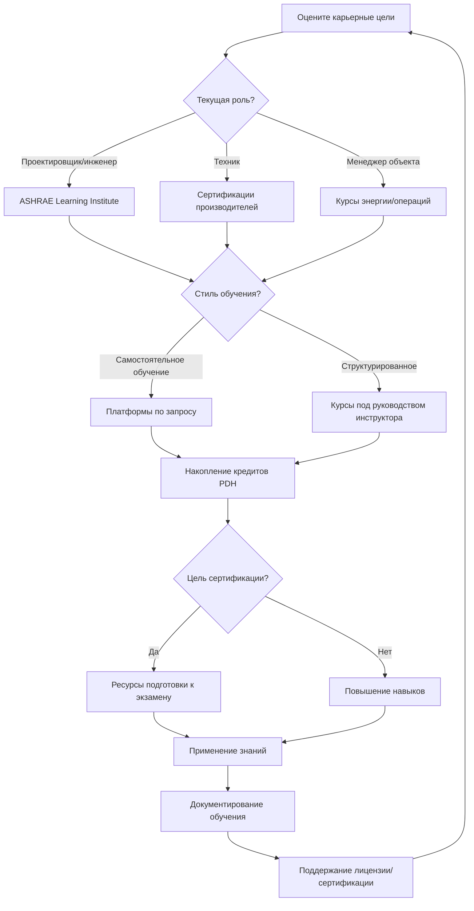

Платформы онлайн-обучения трансформировали профессиональное развитие в индустрии HVAC, обеспечивая гибкий доступ к техническому обучению, подготовке к сертификации и непрерывному образованию. Эти платформы служат инженерам, проектировщикам, техникам и менеджерам объектов, стремящимся поддерживать компетентность и развивать свою карьеру.

## Основные платформы обучения HVAC

### Институт обучения ASHRAE

Институт обучения ASHRAE предоставляет наиболее авторитетное техническое обучение в отрасли, разработанное экспертами на основе стандартов и исследований ASHRAE. Платформа предлагает:

- **Живые онлайн-курсы**: Занятия под руководством инструктора с общением в реальном времени и сеансы вопросов и ответов
- **Обучение по запросу**: Курсы в собственном темпе, доступные 24/7
- **Программы сертификации**: Структурированная учебная программа по моделированию энергии зданий, HVAC в здравоохранении и проектированию центров обработки данных
- **Кредиты PDH**: Часы профессионального развития, принимаемые большинством лицензионных органов
- **Подготовка к экзаменам**: Целевые курсы для экзаменов PE, CEM и BEMP

Содержание охватывает психрометрику, расчёты нагрузок, проектирование систем, анализ энергии, пусконаладку и эксплуатацию/техническое обслуживание. Материалы курсов включают расчётные инструменты, справочные электронные таблицы и тематические исследования реальных проектов.

### Портали обучения производителей

Производители оборудования предоставляют специализированное обучение по своим продуктам, требованиям установки и процедурам диагностики неисправностей:

- **Информационный бюллетень инженеров Trane**: Технические статьи и расчётные инструменты
- **Carrier University**: Сертификация продукции и курсы проектирования систем
- **Daikin Learning**: Обучение системам VRF, управлению и применённому оборудованию
- **Johnson Controls Institute**: Образование в области автоматизации зданий и систем управления
- **Danfoss Learning**: Управление холодильными установками, приводы и теплообменники

Эти платформы часто предлагают программы сертификации, подтверждающие знание конкретных линий продуктов, повышающие квалификацию техников и поддерживающие требования гарантии.

### Поставщики технического обучения

Специализированные компании по обучению HVAC предлагают комплексные учебные программы:

**HVAC Learning Solutions**: Сосредоточена на коммерческих системах, управлении DDC и автоматизации зданий. Курсы подчёркивают практическую диагностику неисправностей и оптимизацию систем.

**Skillsoft Technical Training**: Корпоративная платформа обучения с модулями HVAC, интегрированными в более широкие учебные программы управления объектами и инженерии.

**TPC Training**: Охватывает фундаментальные и продвинутые темы с интерактивным моделированием и инструментами оценки.

### Платформы общего образования

Основные платформы онлайн-обучения теперь предлагают контент HVAC:

**Udemy**: Отдельные курсы от независимых инструкторов, охватывающие системы для жилых помещений, расчёты нагрузок и приложения специального программного обеспечения (Revit MEP, HAP, TRACE).

**Coursera**: Партнёрства с университетами обеспечивают курсы строительной науки и энергоэффективности от учреждений, таких как Стэнфорд и MIT.

**LinkedIn Learning**: Контент профессионального развития, включая AutoCAD MEP, управление проектами для инженеров MEP и фундаментальные курсы.

## Сравнение платформ

| Платформа | Тип контента | Метод доставки | Кредиты PDH | Структура стоимости | Лучше всего подходит для |
|-----------|--------------|----------------|-------------|----------------------|---------------------------|
| ASHRAE Learning Institute | Техническое содержание на основе стандартов | Живое и по запросу | Да | 7500-30000 р./курс | Подготовка к экзамену PE, продвинутое проектирование |
| Портали производителей | Специфичный для продукта | В собственном темпе | Варьируется | Бесплатно до 11300 р. | Сертификация оборудования |
| HVAC Learning Solutions | Сосредоточены на коммерческих системах | В собственном темпе | Да | 11300-22600 р./курс | Специалисты по управлению |
| Skillsoft | Широкие темы объектов | В собственном темпе | Ограничено | Подписка | Корпоративное обучение |
| Udemy | Переменное качество | В собственном темпе | Нет | 500-7500 р./курс | Конкретные навыки, программное обеспечение |
| Coursera | Академический уровень | Курсы под руководством инструктора | Нет | 1850-3000 р./месяц | Теоретические основы |

## Обучение в собственном темпе и под руководством инструктора

### Преимущества самопроизвольного обучения

- Завершение курсов по вашему расписанию без путешествий
- Паузирование и повторное изучение сложного материала несколько раз
- Более низкая стоимость курса по сравнению с живым обучением
- Немедленный доступ к зарегистрированному контенту
- Подходит для независимых учащихся с сильной самодисциплиной

Курсы в собственном темпе лучше всего работают для повторения знакомых тем, изучения приложений программного обеспечения через демонстрации и эффективного накопления кредитов PDH.

### Преимущества обучения под руководством инструктора

- Общение в реальном времени позволяет уточнять вопросы
- Возможности сетевого взаимодействия с коллегами, столкнувшимися с аналогичными проблемами
- Структурированное расписание поддерживает импульс в сложных темах
- Инструктор адаптирует содержание на основе вопросов участников
- Групповые обсуждения раскрывают практические идеи с различных точек зрения

Живое обучение ценно для продвинутых теоретических тем, подготовки к экзаменам, требующей практики решения проблем, и новых предметных областей, где руководство предотвращает неправильные представления.

Многие учащиеся комбинируют оба подхода: курсы в собственном темпе для широты и конкретных навыков, обучение под руководством инструктора для критических сертификаций и продвинутых компетенций.

## Подготовка к экзамену на сертификацию

### Ресурсы для экзамена PE Mechanical

- **Курс подготовки к экзамену ASHRAE PE**: Охватывает все темы экзамена с практическими задачами
- **PPI Learning Hub**: Комплексный обзор с 600+ практическими задачами
- **School of PE**: Живое обучение с вариантами вечернего/выходного расписания
- **Testmasters**: Мастерские по решению проблем, сосредоточенные на стратегии экзамена

Подготовка требует 100-200 часов в течение 3-6 месяцев. Онлайн-платформы предоставляют базы данных задач, тестовые экзамены с ограничением по времени и стратегии организации справочного материала.

### CEM (Certified Energy Manager)

AEE предлагает онлайн-курсы обзора, охватывающие процедуры энергоаудита, экономический анализ, эффективность систем HVAC, освещение, тепловой конверт здания и возобновляемые источники энергии. Формат в собственном темпе включает практику расчётов и тематические исследования.

### Сертификация NATE

Ресурсы подготовки техников включают:

- **ESCO Group**: Учебные пособия и практические тесты для всех специальностей NATE
- **HVAC Excellence**: Онлайн-экзамены имитируют фактический формат теста
- **TruTech Tools**: Видеообучение по холодильным установкам, электрике и потокам воздуха

Онлайн-ресурсы дополняют практический опыт работы с оборудованием, который остаётся необходимым для сертификации техников.

## Стратегия непрерывного образования

## Выбор подходящих платформ

Сопоставьте характеристики платформы с вашими целями:

**Для поддержания лицензии PE**: ASHRAE Learning Institute предоставляет принятые кредиты PDH с контентом, непосредственно относящимся к инженерной практике.

**Для экспертизы оборудования**: Портали производителей доставляют знания о продуктах, необходимые для установки, запуска и обслуживания.

**Для смены карьеры**: Комплексные платформы, такие как Skillsoft или университетские программы через Coursera, обеспечивают фундаментальные знания в новых специальностях.

**Для овладения программным обеспечением**: Udemy и LinkedIn Learning предлагают целевое обучение конкретным приложениям по более низкой стоимости, чем обучение поставщика программного обеспечения.

**Для подготовки к экзамену**: Специализированные компании подготовки к тестам предоставляют практику решения проблем и рекомендации по стратегии экзамена, которые платформы общего образования не могут предоставить.

Проверьте принятие кредитов PDH в своём лицензионном органе перед зачислением. Большинство штатов без вопросов принимают курсы ASHRAE, но некоторые ограничивают кредиты из неуниверситетских источников или требуют предварительного одобрения для контента в собственном темпе.

## Показатели качества

Оцените платформы на основе:

- **Квалификация инструктора**: Ищите лицензии PE, продвинутые степени или признанный опыт в отрасли
- **Актуальность контента**: Материал должен ссылаться на действующие кодексы и стандарты
- **Качество производства**: Чистый звук, четкая графика и функциональные интерактивные элементы
- **Отзывы студентов**: Последовательные положительные отзывы от профессионалов в вашей специальности
- **Ресурсы поддержки**: Доступ к инструкторам, форумам обсуждения или технической поддержке
- **Сертификаты об окончании**: Документация, подходящая для аудитов PDH

Распространение онлайн-платформ расширяет доступ к профессиональному развитию, но требует дискреции. Отдавайте приоритет платформам с установленной репутацией в индустрии HVAC перед сайтами общего образования с ограниченными процессами технического рецензирования.
