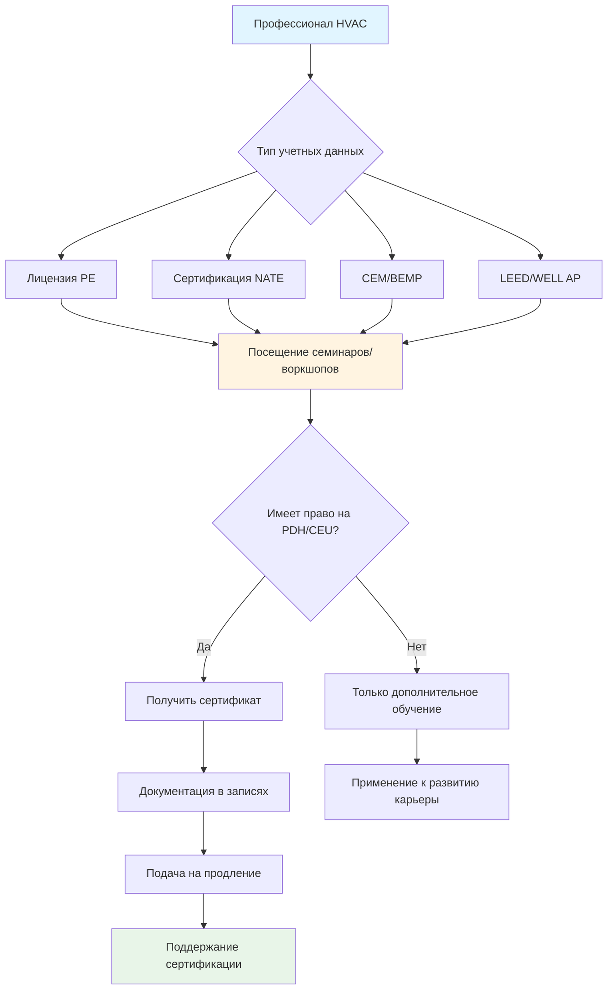
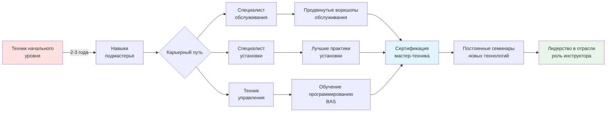

# Семинары и воркшопы HVAC

Семинары и воркшопы обеспечивают целевое техническое обучение посредством структурированного классного обучения и практического взаимодействия с оборудованием. Эти образовательные форматы обеспечивают часы профессионального развития (PDH) и единицы повышения квалификации (CEU), необходимые для поддержания сертификации, при одновременном развитии практических компетенций в проектировании систем, установке, диагностике и новых технологиях.

## Сравнение формата семинара и воркшопа

| Характеристика формата | Технический семинар | Практический воркшоп |
|----------------------|-------------------|-------------------|
| **Продолжительность** | 2-8 часов | 1-5 дней |
| **Основной фокус** | Теория и концепции | Практическое применение |
| **Уровень взаимодействия** | Лекция с вопросами и ответами | Работа с оборудованием |
| **Размер класса** | 20-100 участников | 8-20 участников |
| **Доступ к оборудованию** | Только демонстрация | Индивидуальные/групповые рабочие места |
| **Стоимость PDH/CEU** | 0.1 за контактный час | 0.1 за контактный час |
| **Диапазон стоимости** | $50-$300 | $200-$2,000 |
| **Оптимально для** | Обновления кодов, теория | Установка, диагностика |

Оба формата обеспечивают эквивалентный кредит непрерывного образования на основе контактных часов, но воркшопы обеспечивают превосходное развитие навыков благодаря практическому опыту работы с реальным оборудованием и системами.

## Категории технических семинаров

### Обновления кодов и стандартов

**Охват содержания:**
- Пересмотры требований вентиляции ASHRAE Standard 62.1
- Обновления минимальной эффективности энергетического кода ASHRAE 90.1
- Изменения цикла Международного механического кода (IMC)
- Поправки и толкования местных органов юрисдикции
- Требования документации по соответствию

**Результаты обучения:**
- Определение изменений кодов, влияющих на текущие проекты
- Расчет минимальных скоростей вентиляции согласно обновленным стандартам
- Выбор оборудования, отвечающего новым пороговым значениям эффективности
- Подготовка материалов соответствия для проверки разрешений

Эти семинары обычно проводятся после трехлетних циклов публикации кодов и обеспечивают критически важные обновления для проектировщиков и подрядчиков, работающих с соответствием нормативным требованиям.

### Основы проектирования систем

**Основные темы:**
- Методология расчета нагрузок согласно справочнику ASHRAE
- Анализ и применение психрометрических процессов
- Расчет размеров воздуховодов и труб с использованием методов потерь на трение
- Выбор оборудования и кривые производительности
- Стратегии интеграции систем управления

**Физическая основа:**

Расчеты нагрузок определяют количество передачи тепла через строительные конверты:

$$Q = U \cdot A \cdot \Delta T + Q_{solar} + Q_{internal}$$

Где:
- $Q$ = общая нагрузка охлаждения/отопления (кДж/ч или кВт)
- $U$ = общий коэффициент теплопередачи (Вт/м²·К)
- $A$ = площадь конверта (м²)
- $\Delta T$ = разница температур внутри и снаружи (°C или K)
- $Q_{solar}$ = прирост солнечного тепла (кДж/ч или кВт)
- $Q_{internal}$ = внутренние нагрузки от занятости, освещения, оборудования (кДж/ч или кВт)

### Проектирование продвинутых систем

**Специализированные применения:**
- Проектирование систем переменного хладагента (VRF)
- Реализация охлажденных балок и радиационных систем
- Конфигурация систем выделенного наружного воздуха (DOAS)
- Оптимизация накопления тепловой энергии
- Расчет размеров систем геотермальных тепловых насосов

**Техническая глубина:**
- Расчеты эффективности теплообменников
- Применение законов подобия насосов и вентиляторов
- Анализ падения давления холодильного трубопровода
- Разработка последовательностей управления для сложных систем

### Энергетическое моделирование и анализ

**Обучение программному обеспечению:**
- Платформы моделирования EnergyPlus и eQuest
- Carrier HAP и Trane TRACE 3D Plus
- Рабочий процесс моделирования энергии зданий
- Калибровка по данным коммунальных счетов
- Базовое моделирование приложения G ASHRAE 90.1

**Выходные данные:**
- Прогнозы годового потребления энергии
- Сравнения анализа затрат в течение жизненного цикла
- Документация по соответствию энергетическому кодексу
- Поддержка подачи заявок на программы стимулирования

## Типы практических воркшопов

### Воркшопы по установке оборудования

**Практические упражнения:**
- Пайка медных труб холодильной системы и проверка давления
- Обнаружение утечек с использованием электронных датчиков и мыльных растворов
- Процедуры вакуумирования с проверкой микронного манометра
- Заправка холодильного агента методами переохлаждения и перегрева
- Расчет размеров сифонов конденсата и их установка

**Методология заправки холодильным агентом:**

Надлежащий перегрев для систем с фиксированным отверстием:

$$SH_{target} = f(T_{outdoor}, T_{indoor}, RH)$$

Переохлаждение для систем с термостатическим расширительным клапаном (TXV) обычно поддерживает 5,6-8,3 °C при условиях конструирования, указывая на надлежащую заправку холодильным агентом и производительность системы.

### Клиники диагностики

**Диагностические сценарии:**
- Низкий воздушный поток: ограничение фильтра, утечка воздуховода, скорость вентилятора
- Недостаточное охлаждение: заряд холодильного агента, воздушный поток, загрязнение теплообменника
- Отказы отопления: система зажигания, газовый клапан, концевые выключатели
- Неисправности управления: калибровка датчика, проводка, логика последовательности
- Проблемы компрессора: электрические испытания, анализ масла, механический износ

**Методы измерения:**
- Разница температур на катушках
- Проверка соотношения давления и температуры
- Испытания электрического тока и напряжения
- Анализ сгорания газового оборудования
- Измерение воздушного потока с использованием горячих проволочных анемометров

### Обучение управлению и автоматизации

**Практические навыки:**
- Программирование систем управления зданиями (BAS)
- Калибровка датчиков прямого цифрового управления (DDC)
- Конфигурация параметров привода переменной частоты (VFD)
- Проверка последовательности управления экономайзером
- Установка вентиляции с управлением по спросу

**Стратегии управления:**
- Настройка цикла пропорционально-интегрально-дифференциального (PID)
- Расписания сброса для температур подаваемого воздуха и воды
- График работы на основе занятости и стратегии снижения нагрузки
- Тренирование и анализ данных для оптимизации

### Воркшопы по процессу наладки

**Процедуры полевых испытаний:**
- Измерение воздушного потока с использованием поперечных траверс трубки Пито
- Измерение и балансировка гидравлического потока
- Калибровка концевых устройств (блоки VAV)
- Функциональное тестирование производительности последовательности управления
- Требования к документации и отчетности

**Расчет воздушного потока из поперечной траверсы трубки Пито:**

$$V = 335.3 \cdot \sqrt{\frac{\Delta P}{d}}$$

Где:
- $V$ = скорость воздуха (м/мин)
- $\Delta P$ = динамическое давление (Па)
- $d$ = коэффициент коррекции плотности воздуха (безразмерный)

Общий воздушный поток равен средней скорости, умноженной на площадь поперечного сечения воздуховода, проверенной в соответствии со спецификациями конструирования согласно ASHRAE Standard 111.

## Учебные центры производителей

### Программы на базе заводов

**Основные учреждения производителя:**
- Carrier University (несколько местоположений, США)
- Trane Commercial Systems Training (La Crosse, WI)
- Lennox Corporate Training Center (Richardson, TX)
- Johnson Controls Training Institute (Milwaukee, WI)
- Daikin University (Houston, TX)

**Предложения обучения:**
- Процедуры установки, специфичные для продукта
- Протоколы обслуживания и технического обслуживания
- Требования гарантии и документация
- Приложение и выбор системы инженерной подготовки
- Введение новых технологий (холодильные агенты A2L, технология переменной скорости)

### Обучение у дистрибьюторов и представителей

**Варианты локального обучения:**
- Региональные технические центры дистрибьютора
- Обеденные сессионные семинары представителей производителя
- Мобильные учебные установки с демонстрационным оборудованием
- Виртуальное обучение с дистанционным мониторингом оборудования

**Преимущества:**
- Удобный локальный доступ, снижающий затраты на путешествие
- Построение отношений с партнерами в цепи поставок
- Практический опыт работы с линиями стоящего на складе оборудования
- Установление связей технической поддержки

### Сертификаты, специфичные для оборудования

**Учетные данные производителя:**
- Сертификации авторизованного установщика на заводе
- Квалификация расширения гарантии
- Учетные данные специалиста по продвинутой диагностике
- Назначения инженера приложения

**Предложение стоимости:**
- Расширенное покрытие гарантии для клиентов
- Статус предпочтительного подрядчика у производителей
- Приоритетный доступ к технической поддержке
- Возможности совместного маркетинга и рекомендаций

## Получение кредитов профессионального развития

### Критерии одобрения PDH/CEU

**Требования для квалификации:**
- Представлено квалифицированным техническим инструктором
- Образовательное содержание, а не рекламная информация
- Минимальные пороги контактных часов (обычно 1 час)
- Сертификат завершения с указанной стоимостью PDH/CEU
- Предварительно одобрено советом штата или органом сертификации (варьируется в зависимости от юрисдикции)

**Элементы документации:**
- Название и описание программы
- Дата, продолжительность и место проведения
- Организация поставщика и учетные данные инструктора
- Присуждаемые кредиты PDH/CEU
- Подпись или электронная проверка

### Применение для поддержания сертификации

**Типичные требования продления:**

| Учетные данные | Период продления | Требуемые кредиты | Приемлемость семинара/воркшопа |
|-----------|----------------|------------------|------------------------------|
| Лицензия PE (большинство штатов) | 1-2 года | 15-30 PDH | Все технические темы подходят |
| Сертификация NATE | 2 года | 16 часов | Технические и темы безопасности |
| CEM (Сертифицированный менеджер энергии) | 3 года | 24 CEH | Энергетический контент |
| BCxP (Сертификат наладки зданий) | 3 года | 24 CEH | Наладка и тестирование |
| LEED AP BD+C | 2 года | 30 часов | Зеленое строительство и устойчивость |

Семинары и воркшопы обеспечивают эффективное накопление кредитов, особенно когда многодневные события предлагают 8-16 кредитов PDH/CEU в сконцентрированные периоды времени.

## Дорожки обучения в рамках отрасли

### Зимние и годовые конференции ASHRAE

**Образовательное программирование:**
- 30-50 технических сессий на конференцию
- Семинары полного дня и на полдня
- Практические воркшопы (ограниченная вместимость)
- Курсы подготовки к экзамену по сертификации
- Участие в комитете по стандартам

**Широта охватываемых тем:**
- Проектирование жилых и коммерческих систем
- Приложения промышленного охлаждения
- Анализ энергии и моделирование
- Качество воздуха в помещениях и вентиляция
- Холодильные агенты и устойчивость
- Управление и автоматизация зданий
- Наладка и тестирование

**Потенциал кредита PDH:**
- Полное участие в конференции: 12-20 кредитов PDH
- Стратегический выбор сессии максимизирует результаты обучения
- Возможности взаимодействия с экспертами отрасли

### События ACCA (Air Conditioning Contractors of America)

**Обучение, сосредоточенное на подрядчике:**
- Расчет нагрузок жилья (Manual J)
- Процедуры проектирования воздуховода (Manual D)
- Методология выбора оборудования (Manual S)
- Управление бизнесом и рентабельность
- Стандарты качественной установки (сертификация QI)

**Региональные сессии обучения:**
- Ежемесячные встречи местного отделения
- Ежегодная конференция и выставка качества воздуха в помещениях
- Доступ к платформе онлайн-обучения

### Образовательные сессии AHR Expo

**Крупнейшая выставка отрасли:**
- Технические сессии, спонсируемые производителем
- Дорожки образования ассоциаций отрасли
- Демонстрация оборудования в прямом эфире
- Возможности сравнения продуктов

**Стратегическое посещение:**
- Исследование возникающих технологий до посещения
- Планирование сессий в соответствии с требованиями сертификации
- Взаимодействие с производителями для доступа к будущему обучению

### Обучение RSES (Refrigeration Service Engineers Society)

**Развитие техника сервиса:**
- Продвинутая диагностика холодильной цепи
- Приложения коммерческого охлаждения
- Диагностика электрических систем
- Процедуры обслуживания теплового насоса

**Подготовка к сертификации:**
- Курсы подготовки к экзамену на сертификацию RSES
- Подготовка к экзамену EPA Section 608
- Валидация практических навыков

## Специализированные темы воркшопа

### Обучение переходу на холодильный агент

**Требования безопасности A2L:**
- Классификация ASHRAE Standard 15 и обозначение группы безопасности
- Характеристики воспламеняемости и источники зажигания
- Требования вентиляции помещений оборудования
- Интеграция системы обнаружения и сигнализации
- Процедуры обслуживания холодильных агентов A2L (R-32, R-454B, R-1234yf)

**Практические упражнения:**
- Установка и работа оборудования восстановления
- Размещение датчика обнаружения утечек
- Использование средств индивидуальной защиты (СИЗ)
- Процедуры реагирования на чрезвычайные ситуации

### Интеграция системы управления зданиями

**Протокол и коммуникация:**
- Основы протокола BACnet
- Конфигурация сети LonWorks
- Реализация Modbus RTU и TCP/IP
- Интеграция устройств интернета вещей (IoT)
- Соображения кибербезопасности для подключенных систем

**Практическая конфигурация:**
- Программирование контроллера с использованием программного обеспечения поставщика
- Разработка графики для интерфейса оператора
- Конфигурация сигнализации и установка уведомлений
- Создание журнала тенденций для диагностики

### Аудит энергии и ретро-наладка

**Рабочий процесс и методология:**
- Процедуры аудита ASHRAE уровней I, II, III
- Анализ и сравнительный анализ коммунальных данных
- Применение термографии в инфракрасном диапазоне
- Тестирование нагнетательной двери для количественной оценки инфильтрации
- Протоколы измерения и проверки (M&V)

**Экономический анализ:**
- Расчет простого окупаемости
- Анализ затрат в течение жизненного цикла (LCCA)
- Определение внутренней нормы доходности (IRR)
- Навигация программ стимулирования коммунальных услуг

## Разработка дорожки обучения

Стратегический выбор семинаров и воркшопов ускоряет развитие компетенций вдоль выбранных траекторий карьеры, независимо от того, ориентированы ли они на услуги, специализацию установки или управление.

## Критерии выбора воркшопа

### Оценка качества и актуальности

**Ключевые факторы оценки:**
- Учетные данные инструктора и опыт в отрасли
- Наличие и качество оборудования для практических упражнений
- Соотношение студентов и инструкторов (оптимально: 4-6:1 для воркшопов)
- Возможности объектов и учебные ресурсы
- Доступ к технической поддержке после обучения

**Красные флажки:**
- Содержание, в основном сосредоточенное на продажах, выдаваемое за образование
- Отсутствие документации по одобрению PDH/CEU
- Устаревшее оборудование или демонстрационные блоки
- Неквалифицированные или неопытные инструкторы
- Отсутствие практического компонента в формате "воркшоп"

### Соответствие целям карьеры

**Стратегические вопросы:**
- Способствует ли содержание текущим должностным обязанностям?
- Создадут ли полученные навыки новые предложения услуг?
- Поддерживает ли обучение поддержание или получение сертификации?
- Является ли оборудование или технология актуальными для требований рынка?
- Обеспечит ли обучение конкурентное преимущество?

### Расчет рентабельности инвестиций

**Анализ затрат и выгод:**

Общие инвестиции включают:
- Регистрационные взносы
- Расходы на путешествие и проживание
- Потери за счет неиспользованного оплачиваемого времени или упущенных возможностей
- Материалы и справочные ресурсы

Ожидаемые результаты:
- Увеличение норм выставления счетов благодаря повышенной квалификации
- Снижение обратных вызовов обслуживания благодаря улучшенной диагностике
- Новые возможности обслуживания, расширяющие потоки доходов
- Избежание переэкзаменования при поддержании сертификации
- Расширение профессиональной сети, ведущее к развитию бизнеса

## Лучшие практики для максимального обучения

**Предварительная подготовка к воркшопу:**
- Ознакомьтесь с предварительными материалами и содержанием обновления
- Подготовьте вопросы по конкретным столкнувшимся вызовам
- Приносите техническую документацию из текущих проектов
- Свяжитесь с инструкторами для определения целей обучения

**Во время участия в воркшопе:**
- Ведите подробные записи, включая номера моделей оборудования
- Сфотографируйте электросхемы и конфигурации систем
- Задавайте уточняющие вопросы во время демонстраций
- Взаимодействуйте с другими участниками для взаимного обучения
- Запросите контактную информацию инструктора для дальнейших вопросов

**Применение после воркшопа:**
- Применяйте полученные методики в следующем релевантном проекте
- Делитесь знаниями с членами команды через обучение
- Создавайте справочные руководства из материалов воркшопа
- Поддерживайте связь с инструктором для технической поддержки
- Документируйте кредиты PDH/CEU в системе отслеживания продления

## Возникающие методы доставки обучения

**Гибридные модели обучения:**
- Модули онлайн теории с практическими лабораториями в очной форме
- Виртуальное обучение под руководством инструктора с программным обеспечением симуляции оборудования
- Наложения дополненной реальности (AR) для направления процедур
- Удаленное обучение диагностике с использованием подключенного оборудования

**Форматы микрообучения:**
- Модули сосредоточенных на тему 15-30 минут
- Доставка мобильного приложения для обучения в нужный момент времени
- Видеодемонстрации с интерактивными викторинами
- Сложные учетные данные, ведущие к сертификации

**Платформы адаптивного обучения:**
- Персонализация содержания на основе AI в зависимости от пробелов в знаниях
- Прогресс на основе компетентности, а не на основе времени
- Интегрированная оценка, подтверждающая приобретение навыков
- Персонализированные дорожки обучения для индивидуальных целей карьеры

Семинары и воркшопы остаются важными компонентами профессионального развития HVAC, переводя теоретические знания в практические компетенции при одновременном выполнении требований по поддержанию сертификации. Стратегическое участие в программах качественного образования ускоряет развитие карьеры и сохраняет техническую актуальность в этой быстро развивающейся отрасли.
