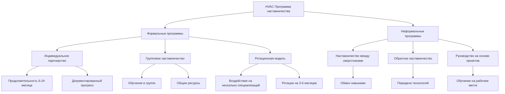
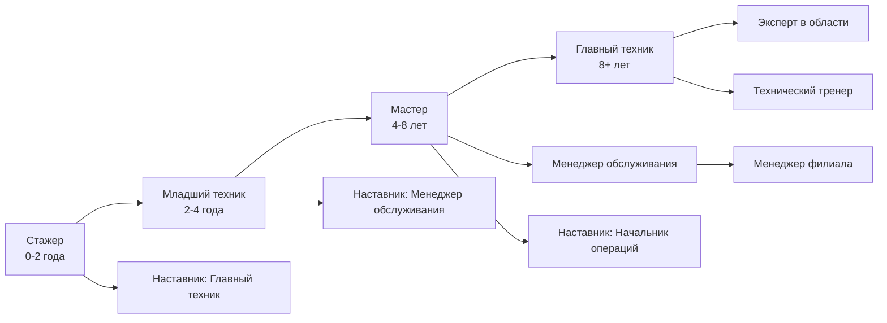

## Обзор

Программы наставничества в промышленности HVAC служат критическими механизмами передачи знаний, развития навыков и профессионального развития. Эти структурированные отношения связывают опытных профессионалов с начинающимися техниками и инженерами, преодолевая растущий дефицит навыков в отрасли, одновременно сохраняя институциональные знания при выходе на пенсию опытных практиков.

Эффективное наставничество ускоряет развитие компетентности, снижает частоту ошибок на этапе обучения и повышает удержание технического персонала. Организации, внедряющие формальные программы наставничества, сообщают об ускорении достижения этапов производительности на 20-30% и значительно более высоких баллах удовлетворенности сотрудников.

## Структуры программ наставничества

### Формальные модели наставничества

Формальные программы наставничества устанавливают определенные структуры, ожидания и временные рамки для передачи знаний:

**Индивидуальное наставничество**
- Один наставник работает с одним учеником для сосредоточенного развития
- Продолжительность обычно 6-24 месяца с определенными целями
- Структурированные встречи (еженедельно или раз в две недели) с документированием прогресса
- Четкие цели компетентности, согласованные с путями сертификации
- Выбор наставника на основе технического опыта и способности к обучению

**Групповое наставничество**
- Один опытный профессионал руководит группой из 3-6 учеников
- Эффективная передача знаний по общим основополагающим темам
- Возможности взаимного обучения между учениками
- Сниженные временные затраты наставника на одного ученика
- Применимо к программам ученичества и адаптации новых сотрудников

**Ротационное наставничество**
- Ученик работает с несколькими наставниками в различных специализациях
- Воздействие на коммерческие, промышленные и жилые приложения
- Типичные периоды ротации: 3-6 месяцев по каждой специализации
- Развивает широкую базу технической компетентности
- Распространено в программах развития инженеров

### Неформальные подходы к наставничеству

Неформальное наставничество дополняет структурированные программы органическим обменом знаниями:

**Наставничество между сверстниками**
- Техники на сходных уровнях опыта обмениваются специализированными знаниями
- Особенно эффективно для управления, систем автоматизации зданий и программного обеспечения
- Самостоятельное обучение без иерархической структуры
- Облегчает боковую передачу знаний между отделами

**Обратное наставничество**
- Младший персонал обучает старших профессионалов новым технологиям
- Критично для цифровых инструментов, интеграции IoT и продвинутой диагностики
- Устраняет поколенческие технологические разрывы
- Поощряет культуру двусторонней передачи знаний

**Наблюдение и руководство на рабочем месте**
- Неструктурированное наблюдение во время вызовов обслуживания и установок
- Демонстрация решения проблем в реальном времени
- Обучение, привязанное к фактическим полевым условиям
- Никаких требований к формальной документации или временной шкале

## Программы наставничества ASHRAE

ASHRAE предоставляет структурированные рамки наставничества через несколько каналов:

**Связь студент-профессионал (SPC)**
- Связывает студентов с практикующими инженерами в местных отделениях
- Фокус на переходе от академической практики к профессиональной
- Руководство по карьере и знакомство с отраслью
- Участие в технических встречах и комитетах отделений

**Молодые инженеры в ASHRAE (YEA)**
- Наставничество между сверстниками для профессионалов в возрасте до 35 лет
- Развитие лидерства и вовлечение в общество
- Возможности для технических презентаций
- Сетевое взаимодействие с коллегами среднего и старшего уровня

**Инициативы наставничества на уровне отделений**
- Локальные программы, адаптированные к региональным потребностям отрасли
- Возможности для очного взаимодействия
- Наблюдение за работой и экскурсии по объектам
- Интеграция с программами ученичества

## Пути карьерного развития

Программы наставничества согласуются с определенными путями карьерной прогрессии:

### Карьерный путь техника

**От стажера к младшему технику (0-4 года)**
- Понимание основного цикла холодоснабжения
- Базовое устранение неполадок в электрооборудовании и управлении
- Знакомство с жилыми и легкими коммерческими системами
- Достижение сертификата EPA Section 608
- Фокус наставника: протоколы безопасности, методология диагностики

**От младшего техника к мастеру (4-8 лет)**
- Диагностика сложных коммерческих систем
- Навигация по системам управления зданиями
- Оптимизация энергоэффективности
- Специализированные сертификаты NATE
- Фокус наставника: продвинутое устранение неполадок, взаимодействие с клиентами

**От мастера к главному технику (8+ лет)**
- Проверка проектирования системы и модификация
- Экспертиза специализированного оборудования (чиллеры, VRF, промышленность)
- Наставничество младшего персонала
- Проведение технического обучения
- Переход наставника: становится наставником для других

### Карьерный путь инженера

**От выпускника-инженера к инженеру-проектировщику (0-3 года)**
- Компетентность в расчете нагрузок (методы справочника ASHRAE)
- Выбор и спецификация оборудования
- Подготовка конструкторской документации
- Проверка соответствия кодексам (ASHRAE 90.1, IMC)
- Фокус наставника: основы проектирования, координация проектов

**От инженера-проектировщика к главному инженеру (3-7 лет)**
- Лидерство в проектировании систем для сложных проектов
- Моделирование энергии (DOE-2, EnergyPlus, Trace 700)
- Внедрение устойчивого проектирования (LEED, Passive House)
- Лицензирование профессиональных инженеров
- Фокус наставника: оптимизация проектирования, взаимодействие с клиентами

**От главного инженера к руководителю/начальнику отдела (7-15 лет)**
- Техническое руководство по многопроектным работам
- Ответственность за развитие персонала и наставничество
- Разработка предложений и привлечение клиентов
- Техническое опубликование и участие в отрасли
- Роль наставника: развитие следующего поколения технических лидеров

## Методологии передачи знаний

Эффективное наставничество использует структурированные методы передачи знаний:

**Оценка на основе компетентности**
- Первоначальная оценка навыков выявляет пробелы в знаниях
- Индивидуальные планы обучения решают конкретные дефициты
- Регулярные оценки прогресса относительно определенных стандартов
- Документирование достигнутых компетенций

**Демонстрация и контролируемая практика**
- Наставник демонстрирует процедуру, объясняя обоснование решений
- Ученик выполняет задачу под наблюдением с обратной связью в реальном времени
- Постепенная самостоятельность по мере повышения компетентности
- Анализ ошибок и корректирующее обучение

**Обзор примеров из практики**
- Анализ прошлых проектов или сценариев обслуживания
- Обсуждение альтернативных подходов и результатов
- Анализ основных причин сбоев
- Определение передовых методов

**Разработка технической документации**
- Ученик создает документы процедур или повествования проектирования
- Наставник проверяет техническую точность и полноту
- Развивает навыки общения и документирования
- Создает базу знаний для организации

## Лучшие практики внедрения программ

Успешные программы наставничества содержат эти элементы:

**Структурированная адаптация**
- Четкие ожидания в отношении ролей наставника и ученика
- Определенные графики встреч и протоколы связи
- Сеанс постановки целей в течение первых двух недель
- Выделение ресурсов (время, материалы, доступ)

**Отслеживание прогресса**
- Ежемесячные встречи с координатором программы
- Контрольные списки компетенций, согласованные с требованиями сертификации
- Обратная связь на 360 градусов от ученика, наставника и руководителей
- Корректировка планов обучения на основе прогресса

**Обучение и поддержка наставников**
- Обучение методологии преподавания для технических наставников
- Стратегии управления временем для баланса наставничества с должностными обязанностями
- Программы признания для эффективных наставников
- Сообщества практикующих между наставниками

**Измерение результатов**
- Показатели достижения сертификации
- Время достижения этапов компетентности
- Показатели удержания обученных сотрудников и контрольной группы
- Метрики качества (частота повторных вызовов, удовлетворенность клиентов)
- Отслеживание карьерного роста

## Модели промышленного партнерства

Совместное наставничество выходит за пределы отдельных организаций:

**Партнерства с профильными школами**
- Практикующие техники проводят лекции и демонстрируют работу в лабораториях
- Стажировки студентов с контролируемым полевым опытом
- Пожертвование оборудования для практического обучения
- Обзор учебных программ для согласования с потребностями отрасли

**Программы обучения у производителей**
- Развитие сертифицированного производителем техника
- Наставничество, специфичное для продукта, по продвинутым системам
- Доступ к ресурсам технической поддержки
- Совместные программы сертификации

**Интеграция союзного ученичества**
- Структурированные часы обучения на рабочем месте с назначенными наставниками
- Координация с аудиторным обучением
- Подготовка к экзамену мастера
- Соответствие стандартам ученичества Министерства труда

Программы наставничества представляют стратегические инвестиции в развитие рабочей силы, обеспечивая непрерывную доступность квалифицированных специалистов HVAC, способных проектировать, устанавливать и обслуживать все более сложные системы зданий. Организации, приоритизирующие структурированную передачу знаний, позиционируют себя конкурентоспособно и способствуют общему развитию отрасли.
