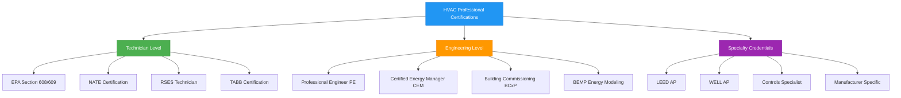
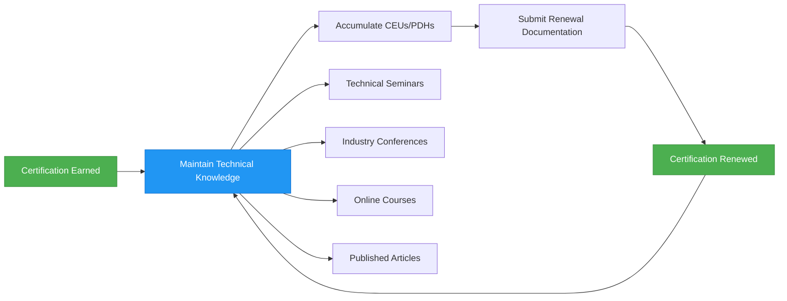

# Профессиональные сертификаты и квалификации в области HVAC

Профессиональная сертификация в области HVAC подтверждает техническую компетентность, валидирует специализированные знания и демонстрирует приверженность отраслевым стандартам. Требования к сертификации отражают физические принципы, управляющие системами климатического контроля, от анализа термодинамического цикла до проектирования психрометрических процессов.

## Структура и框架 сертификации

Сертификаты HVAC охватывают несколько технических уровней, каждый из которых обращается к различным компетенциям в экосистеме построенной среды.

## Требования к знаниям термодинамики

Экзамены на сертификацию оценивают понимание фундаментальных принципов передачи энергии:

**Передача явного тепла:**

$$Q_s = \dot{m} \cdot c_p \cdot \Delta T$$

Где:
- $Q_s$ = скорость передачи явного тепла (кДж/ч или кВт)
- $\dot{m}$ = массовый расход (кг/ч или кг/с)
- $c_p$ = удельная теплоемкость (кДж/кг·К)
- $\Delta T$ = разница температур (K)

**Передача скрытого тепла:**

$$Q_l = \dot{m} \cdot h_{fg} = \dot{m} \cdot \Delta W \cdot h_{fg}$$

Где:
- $Q_l$ = скорость передачи скрытого тепла (кДж/ч или кВт)
- $h_{fg}$ = теплота испарения (кДж/кг)
- $\Delta W$ = изменение влажностного отношения (кг_воды/кг_воздуха)

**Коэффициент производительности холодильного цикла:**

$$COP_{cooling} = \frac{Q_{evap}}{W_{comp}} = \frac{h_1 - h_4}{h_2 - h_1}$$

Где значения энтальпии соответствуют точкам состояния хладагента в цикле парокомпрессионного охлаждения.

## Матрица сравнения сертификаций

| Сертификация | Уровень | Продолжительность | Предварительные условия | Область фокуса | Период возобновления |
|--------------|---------|------------------|----------------------|----------------|---------------------|
| EPA 608 Universal | Начальный | 3 часа | Отсутствуют | Обращение с хладагентом | Пожизненно |
| NATE Installation | Техник | 2-4 часа | 2 года опыта | Установка системы | 5 лет |
| NATE Service | Техник | 2-4 часа | 2 года опыта | Устранение неисправностей | 5 лет |
| PE Mechanical | Профессиональный | 8 часов | 4 года опыта | Проектирование систем | Годовые CEU |
| CEM | Профессиональный | 4 часа | 3 года опыта | Управление энергией | 3 года |
| BCxP | Специалист | 4 часа | 3 года опыта | Сдача в эксплуатацию | 3 года |
| LEED AP BD+C | Специалист | 2 часа | Отсутствуют | Проектирование экологичного здания | 3 года |
| BEMP | Продвинутый | 3 часа | 3 года опыта | Моделирование энергии | 3 года |

## Знание психрометрических процессов

Инженерные сертификаты требуют умения анализировать процессы кондиционирования воздуха на психрометрической диаграмме, включая:

- **Чувствительное охлаждение/нагревание:** Горизонтальный процесс при постоянном влажностном отношении
- **Охлаждение и осушение:** Процесс следует линии точки росы аппарата в направлении кривой насыщения
- **Увлажнение:** Вертикальный или близкий к вертикальному процесс, увеличивающий влажностное отношение
- **Испарительное охлаждение:** Процесс при постоянной температуре мокрого термометра, приближающийся к насыщению

**Расчет коэффициента обхода:**

$$BF = \frac{t_{leaving} - t_{ADP}}{t_{entering} - t_{ADP}}$$

Где:
- $BF$ = коэффициент обхода катушки (безразмерный)
- $t_{ADP}$ = температура точки росы аппарата (°C)
- Температуры представляют условия по температуре сухого термометра

## Выравнивание со стандартами ASHRAE

Профессиональные сертификаты соответствуют стандартам ASHRAE, управляющим проектированием и эксплуатацией:

- **ASHRAE 62.1:** Вентиляция для приемлемого качества внутреннего воздуха — требования к наружному воздуху
- **ASHRAE 90.1:** Энергетический стандарт для зданий — требования к эффективности оборудования
- **ASHRAE 55:** Условия теплового окружения для проживания человека — критерии комфорта
- **ASHRAE 15:** Стандарт безопасности для холодильных систем — классификация хладагентов
- **ASHRAE 180:** Стандартная практика проверки и технического обслуживания коммерческих систем HVAC в зданиях

Инженерные сертификаты проверяют применение этих стандартов к проектированию систем, включая расчеты эффективности вентиляции:

$$E_v = \frac{C_{exhaust} - C_{supply}}{C_{breathing\,zone} - C_{supply}}$$

Где эффективность вентиляции количественно определяет эффективность удаления загрязняющих веществ.

## Требования к непрерывному образованию

Непрерывное образование поддерживает актуальность с развивающимися технологиями, хладагентами, системами управления и энергетическими кодексами. Профессиональные инженеры требуют от 15 до 30 часов профессионального развития в год в зависимости от юрисдикции.

## Расчеты передачи тепла на экзаменах по сертификации

Экзамены на сертификацию оценивают способность рассчитывать передачу тепла через ограждающие конструкции зданий:

$$Q = U \cdot A \cdot \Delta T$$

Где:
- $Q$ = скорость передачи тепла (Вт)
- $U$ = общий коэффициент теплопередачи (Вт/м²·K)
- $A$ = площадь поверхности (м²)
- $\Delta T$ = разница температур между внутренним и наружным воздухом (K)

**Общий коэффициент теплопередачи:**

$$U = \frac{1}{R_{total}} = \frac{1}{\frac{1}{h_i} + R_{wall} + \frac{1}{h_o}}$$

Где $h_i$ и $h_o$ представляют внутренние и наружные коэффициенты пленки поверхности соответственно.

## Пути профессионального роста

Сертификаты устанавливают прогрессивную техническую компетентность:

1. **Начальный уровень:** Сертификация EPA по хладагентам позволяет законно обращаться с хладагентом
2. **Квалифицированный техник:** Сертификация NATE демонстрирует умение устанавливать и обслуживать системы
3. **Инженер-профессионал:** Лицензия PE разрешает проектирование и подписание строительных документов
4. **Специалист по энергии:** Учетные данные CEM и BEMP валидируют возможности анализа энергии
5. **Орган по сдаче в эксплуатацию:** Сертификация BCxP квалифицирует специалистов для проверки производительности системы

Каждый уровень требует овладения физическими принципами, управляющими передачей энергии, механикой жидкости и термодинамическими процессами в приложениях климатического контроля.

## Компетенции по проектированию воздухопровода и воздушного потока

Сертификаты TABB и сдачи в эксплуатацию требуют умения измерять и регулировать воздушный поток с помощью траверс трубки Пито:

$$V = 1096.7 \cdot \sqrt{\frac{\Delta P}{d}}$$

Где:
- $V$ = скорость воздуха (м/мин)
- $\Delta P$ = скоростное давление (Па)
- $d$ = плотность воздуха относительно стандартных условий (безразмерный)

Специалисты по тестированию рассчитывают объемные расходы, проверяют доставку расчетного CFM и документируют производительность системы в соответствии со спецификациями проекта согласно стандарту ASHRAE 111.

## Возврат инвестиций в сертификацию

Профессиональные учетные данные увеличивают потенциал заработка на 15-30% по сравнению с некертифицированными коллегами, одновременно устанавливая техническую достоверность с клиентами, работодателями и органами власти. Сертификаты снижают риск ответственности, демонстрируя соответствие лучшим практикам отрасли и протоколам безопасности.
