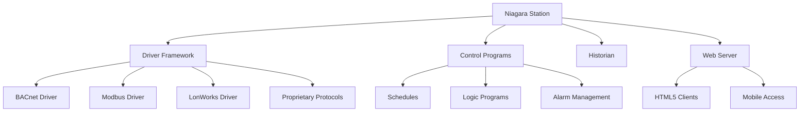
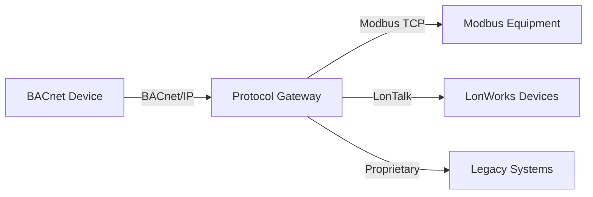

## Обзор

Сертификации в области автоматики и систем управления зданиями подтверждают техническую компетентность в проектировании, программировании, наладке и устранении неполадок современных сетей управления HVAC. Эти учетные данные демонстрируют профессионализм в цифровых протоколах управления, интеграции систем, стратегиях управления энергией и передовых последовательностях управления, которые оптимизируют производительность зданий.

Эволюция от пневматических систем управления к системам прямого цифрового управления (DDC) создала спрос на специализированные знания в области сетевых протоколов, алгоритмов управления и стандартов взаимодействия. Специалисты с сертификациями в области управления получают повышенную компенсацию благодаря технической сложности и критической роли, которую эти системы играют в энергоэффективности и комфорте пользователей.

## Сертификация BACnet (BTL)

### Программа BACnet Testing Laboratory

Сертификация BACnet Testing Laboratory (BTL) подтверждает, что продукты и системы соответствуют стандарту ASHRAE 135, протоколу BACnet для автоматики и систем управления зданиями. Хотя BTL в первую очередь сертифицирует продукты, связанные программы обучения готовят специалистов к работе с системами BACnet.

**Основы протокола**

BACnet работает на модели клиент-сервер с использованием объектно-ориентированного представления данных. Каждое устройство предоставляет свойства через стандартизованные объекты:

- Объекты Analog Input/Output/Value для непрерывных измерений
- Объекты Binary Input/Output/Value для дискретных состояний
- Мультиступенчатые объекты для перечисленных условий
- Объекты Device, содержащие параметры идентификации сети

**Архитектура сети**

BACnet поддерживает несколько физических уровней и уровней связи, организованных согласно ASHRAE 135:

| Тип сети | Физический уровень | Типовое применение |
|----------|-------------------|-------------------|
| BACnet/IP | Ethernet (TCP/IP) | Магистраль здания, интеграция предприятия |
| BACnet MS/TP | EIA-485 (RS-485) | Контроллеры полевого уровня, оборудование зон |
| BACnet/SC | Ethernet с TLS | Защищенное облачное подключение, удаленный доступ |
| BACnet ARCNET | ARCNET маркерная передача | Старые инсталляции |

**Требования взаимодействия**

BACnet Interoperability Building Blocks (BIBBs) определяют стандартизованные возможности обслуживания:

- Обмен данными: услуги Read Property, Write Property
- Управление аварийными сигналами и событиями: подписка на уведомления о событиях
- Планирование: расписания на основе календаря
- Тренирование: автоматическое логирование и восстановление данных

Услуга change of value (COV) оптимизирует трафик сети путем передачи данных только при превышении значениями определенных пороговых значений:

$$
\Delta_{COV} = |V_{current} - V_{last}| \geq \epsilon_{threshold}
$$

Где $\epsilon_{threshold}$ представляет минимальное подлежащее отчету изменение, настроенное для каждой точки.

## Сертификация Niagara Framework

### Платформа Tridium Niagara

Niagara Framework предоставляет универсальную платформу интеграции, поддерживающую несколько протоколов и типов устройств. Tridium предлагает прогрессивные уровни сертификации, демонстрирующие компетентность в работе и настройке платформы.

**Уровни сертификации**

1. **Niagara 4 Essentials**: базовая навигация, построение базы данных, создание графики
2. **Niagara 4 Advanced**: логика программирования, пользовательские приложения, конфигурация аварий
3. **Niagara 4 Professional**: администрирование платформы, реализация безопасности, интеграция драйверов
4. **Niagara 4 Master**: расширенная настройка, разработка модулей, архитектура предприятия

**Архитектура платформы**

**Конструкции программирования**

Логика управления в Niagara использует графическое программирование с листами схем, соединяющими функциональные блоки:

**Реализация управления PID**

Алгоритм пропорционально-интегрально-дифференциального управления рассчитывает положение исполнительного механизма на основе сигнала ошибки:

$$
u(t) = K_p e(t) + K_i \int_0^t e(\tau) d\tau + K_d \frac{de(t)}{dt}
$$

Где:
- $u(t)$ = выход контроллера (0-100%)
- $e(t)$ = уставка - измеренное значение
- $K_p$ = коэффициент пропорционального усиления
- $K_i$ = коэффициент интегрального усиления (действие сброса)
- $K_d$ = коэффициент дифференциального усиления (действие скорости)

Параметры настройки следуют методам Зиглера-Николса или автоматической настройке для достижения критически затухающей характеристики без перерегулирования.

**Алгоритмы управления энергией**

Расчеты оптимального запуска/остановки минимизируют время работы при достижении уставок для занятой зоны:

$$
t_{start} = t_{occupied} - \frac{T_{unoccupied} - T_{occupied}}{R_{heating}}
$$

Где $R_{heating}$ представляет измеренную скорость нагрева (°C/час) из предыдущих циклов.

## Сертификации, специфичные для производителя

### Сертификация Johnson Controls Metasys

**Дорожки сертификации**
- Полевой техник: ввод устройства в эксплуатацию, устранение неполадок, базовая графика
- Системный техник: продвинутое программирование, интеграция, диагностика сети
- Системный специалист: архитектура предприятия, сложные приложения, оптимизация производительности

**Базовые компетенции**
- Программирование Extended Application Specific Controller Toolset (SCT)
- Интеграция сети N2 и BACnet
- Конфигурация контроллера прикладных устройств (ASC) для управления VAV, AHU, чиллером
- Установка и калибровка FEC (Field Equipment Controller)

### Сертификация Siemens Building Technologies

**Обучение платформе Desigo**
- Desigo CC Building Management: интерфейс оператора, управление аварийными сигналами, отслеживание тренда
- Desigo PX Automation: программирование контроллера PX, логика функциональных блоков, интеграция
- Desigo Insight: мониторинг энергии, отчетность, аналитика

**Стандарты программирования**

Диаграммы функциональных блоков следуют структурированному тексту IEC 61131-3 и соглашениям логики лестницы. Время сканирования контроллера определяет максимальную частоту выполнения цикла:

$$
f_{max} = \frac{1}{t_{scan}}
$$

При типичных временах сканирования 100 мс циклы управления выполняются с максимальной частотой 10 Гц.

### Honeywell Enterprise Buildings Integrator (EBI)

**Компоненты сертификации**
- EBI System Administration: управление пользователями, резервное копирование базы данных, конфигурация системы
- Integration Specialist: шлюзы протоколов, интеграция устройств третьих сторон
- Advanced Programming: пользовательская логика, последовательности оптимизации энергии

**Программирование инструмента Spyder**

Графическое окружение программирования Honeywell использует функциональные блоки для:
- Управления экономайзером с сравнением энтальпии
- Управления вентиляцией по требованию с использованием датчиков CO2
- Оптимизации установки охладителя с логикой последовательности

### Сертификация Schneider Electric EcoStruxure

**Компетенции платформы**
- StruxureWare Building Operation: проектирование системы BACnet, разработка графики
- SmartX Controller Programming: разработка кода приложения, проверка логики
- Enterprise Server Architecture: управление несколькими объектами, агрегирование данных

## Основы программирования систем управления

### Разработка последовательности операций

Эффективные последовательности управления преобразуют замысел проектирования в исполняемую логику. Стандартные последовательности ASHRAE предоставляют шаблоны:

**Управление терминальным блоком VAV**

1. **Режим отопления** ($T_{zone} < T_{setpoint} - 1°C$):
   - Демпфер модулирует на минимальную позицию
   - Клапан переподогрева открывается пропорционально ошибке

2. **Режим охлаждения** ($T_{zone} > T_{setpoint}$):
   - Демпфер модулирует от минимума к максимуму
   - Клапан переподогрева остается закрытым

3. **Мертвая зона** ($T_{setpoint} - 1°C \leq T_{zone} \leq T_{setpoint}$):
   - Демпфер на минимальной позиции
   - Клапан переподогрева закрыт

**Логика экономайзера обработки воздуха**

Сравнение экономайзера на основе энтальпии:

$$
h = 0.24T + W(1061 + 0.444T)
$$

Где:
- $h$ = энтальпия (кДж/кг сухого воздуха)
- $T$ = температура (°C)
- $W$ = коэффициент влажности (кг влаги/кг сухого воздуха)

Экономайзер включается, когда $h_{outdoor} < h_{return} - \Delta h_{differential}$

### Стандарты интеграции сети

**Трансляция протокола**

Устройства шлюза обеспечивают связь между различными протоколами через отображение объектов:

**Отображение точек данных**

Каждая интегрированная точка требует трансляции адреса:

| Исходный протокол | Исходный адрес | Протокол назначения | Адрес назначения |
|------------------|----------------|-------------------|-----------------|
| BACnet | Устройство 100, AI-1 | Modbus | Регистр 40001 |
| Modbus | Slave 5, Coil 0 | BACnet | Устройство 200, BO-1 |
| LonWorks | Node 12, nviTemp | BACnet | Устройство 300, AV-5 |

### Стандарты разработки графики

**Иерархия экрана**

1. **Enterprise Overview**: представление портфеля многозданий, резюме аварий
2. **Building Dashboard**: статус системы, метрики энергии, основные аварии
3. **System Graphics**: подробности, специфичные для оборудования, параметры управления
4. **Point Detail**: тренирование, исторические данные, возможности переопределения

**Оптимизация производительности**

Минимизируйте частоту обновления экрана, чтобы снизить сетевой трафик:

$$
\text{Bandwidth} = N_{points} \times S_{bytes} \times f_{refresh}
$$

Стандартная практика ограничивает частоту обновления 5-секундными интервалами для экранов оператора, 1-минутными интервалами для исторических данных.

## Прогрессия карьеры и компенсация

**Путь развития навыков**

1. **Controls Technician** (0-2 года): ввод точек в эксплуатацию, базовое устранение неполадок, модификация графики
2. **Controls Programmer** (2-5 лет): разработка последовательностей, интеграционные проекты, проектирование сетей
3. **Controls Engineer** (5-10 лет): архитектура системы, сложные приложения, управление проектами
4. **Senior Controls Specialist** (10+ лет): решения предприятия, пользовательская разработка, техническое лидерство

**Спрос на рынке**

Специалисты по управлению получают премиальную компенсацию благодаря требованиям специализированных знаний:

- Техники начального уровня: 10-15% премия над полевыми техниками HVAC
- Опытные программисты: 25-35% премия над механиками
- Старшие специалисты: 40-50% премия, отражающая межотраслевую экспертизу

**Непрерывное образование**

Эволюция технологий требует постоянного обучения:
- Ежегодные обновления протокола (пересмотры BACnet, улучшения безопасности)
- Сертификации кибербезопасности (укрепление сети, защищенный удаленный доступ)
- Платформы аналитики энергии (диагностика неисправностей, приложения машинного обучения)
- Облачные системы (платформы SaaS, интеграция API)

## Ресурсы подготовки к экзамену

**Технические ссылки**
- ASHRAE Standard 135: спецификация протокола BACnet
- ASHRAE Guideline 13: спецификация систем автоматики зданий
- ASHRAE Guideline 36: высокопроизводительные последовательности операций для систем HVAC
- Руководства по программированию производителя и руководства приложений

**Требования практического обучения**

Сертификации требуют практического опыта с:
- Окружением программирования контроллера
- Инструментами диагностики сети (анализаторы протокола, анализаторы пакетов)
- Платформами интеграции и шлюзами
- Процедурами ввода в эксплуатацию и функционального тестирования

**Временная шкала обучения**

Типичная подготовка требует 6-12 месяцев, сочетающих:
- Формальные учебные курсы (спонсируемые производителем или третьей стороной)
- Лабораторные упражнения с реальным оборудованием
- Наставляемую работу над проектами опытными программистами
- Независимое изучение спецификаций протокола и стандартов

## Соответствие промышленным стандартам

**ASHRAE Guideline 36**

Современные последовательности управления должны соответствовать стратегиям высокопроизводительной эксплуатации:
- Управление вентиляцией по требованию с использованием датчиков CO2
- Оптимизация установки охладителя с помощью отделки и реагирования
- Интегрированная диагностика неисправностей экономайзера
- Управление терминальным блоком VAV, независимое от давления

**Требования кибербезопасности**

ASHRAE Standard 231P устанавливает практические вопросы безопасности:
- Сегментация сети, разделяющая системы управления и предприятия
- Зашифрованные коммуникации для удаленного доступа
- Многофакторная аутентификация для административных привилегий
- Регулярные исправления безопасности и обновления микропрограмм

## Заключение

Сертификации в области управления и автоматики подтверждают экспертизу в быстро развивающейся области систем автоматики зданий. По мере того как здания принимают передовые стратегии управления для энергоэффективности, отзывчивости сети и прогнозного обслуживания, специалисты с сертификованной компетентностью в протоколах, программировании и интеграции остаются в высоком спросе. Эти учетные данные предоставляют измеримую валидацию технических навыков, которые напрямую влияют на производительность здания и операционные расходы.

## Категории сертификации

- [Сертификация Niagara Framework](./niagara-framework-certification/)
- [Сертификация BACnet BTL](./bacnet-certification-btl/)
- [Сертифицированный техник Johnson Controls](./johnson-controls-certified-technician/)
- [Сертификация Siemens Building Technologies](./siemens-building-technologies-certification/)
- [Авторизованный дилер Honeywell](./honeywell-authorized-dealer/)
- [Сертификация Schneider Electric](./schneider-electric-certification/)
- [Программирование систем управления](./control-system-programming/)
- [Обучение разработке графики](./graphics-development-training/)
- [Сертификация интеграции сети](./network-integration-certification/)
