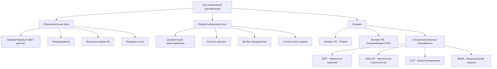

## Основы профессиональных учетных данных

Инженерные сертификаты устанавливают пороги компетентности для проектирования систем HVAC, анализа и оптимизации. Эти учетные данные существенно отличаются от сертификатов техников своим акцентом на термодинамические принципы, методологии расчета нагрузок и соответствие нормам, а не на обслуживание оборудования и ремонт.

Иерархия сертификации прогрессирует от начального уровня инженерных основ через специализированные применения в управлении энергией, устойчивом проектировании и комиссионировании зданий. Каждое учетное данные требует демонстрации мастерства в методах расчета, интерпретации стандартов и профессиональной этике.

## Различие между лицензированием и сертификацией

Лицензирование профессионального инженера (PE) представляет юридическое разрешение на утверждение инженерных документов и принятие общественной ответственности за техническую работу. Государственные лицензионные советы предоставляют статус PE после проверки образования (диплом, аккредитованный ABET), опыта (обычно четыре года под наблюдением PE) и результатов экзаменов (экзамены Fundamentals of Engineering и Principles and Practice NCEES).

Добровольные сертификаты демонстрируют специализированные знания без предоставления юридических полномочий. Организации, такие как Ассоциация инженеров энергетики (AEE), Совет по экологическому строительству США (USGBC) и Ассоциация комиссионирования зданий (BCA), проводят оценки компетентности в узкоспециализированных областях, таких как энергоаудит, устойчивое проектирование или протоколы комиссионирования.

## Основные компетенции инженера

Сертификаты инженера HVAC оценивают способности во множестве технических областей:

**Анализ термодинамики**

Расчеты передачи тепла образуют основу оценки нагрузки и выбора оборудования. Фундаментальное уравнение теплового баланса управляет всем проектированием HVAC:

$$Q_{total} = Q_{sensible} + Q_{latent} = \dot{m}c_p\Delta T + \dot{m}h_{fg}\Delta\omega$$

Где явная нагрузка зависит от скорости массового потока, удельной теплоемкости и температурного перепада, а скрытая нагрузка включает энтальпию испарения и изменение коэффициента влажности. Инженеры должны количественно определить проводимость через ограждающие конструкции здания, используя:

$$Q_{cond} = UA\Delta T = \frac{A}{R_{total}}(T_{inside} - T_{outside})$$

Это требует сборки сетей тепловых сопротивлений, учитывающих слои материалов, воздушные пленки и эффекты тепловых мостиков согласно требованиям стандарта ASHRAE 90.1.

**Психрометрические процессы**

Манипулирование точками состояния на психрометрических диаграммах представляет графические методы решения процессов кондиционирования воздуха. Смешивание потоков воздуха следует закону сохранения массы и энергии:

$$\dot{m}_3 = \dot{m}_1 + \dot{m}_2$$

$$\dot{m}_3h_3 = \dot{m}_1h_1 + \dot{m}_2h_2$$

Инженеры определяют условия подаваемого воздуха через последовательные процессы: смешивание наружного воздуха, осушение охлаждающей катушки, дополнительное нагревание и добавление тепла вентилятором. Каждое преобразование следует конкретной физике, управляющей скоростями удаления влаги, факторами байпаса катушек и температурами точки росы аппарата.

## Сравнение путей сертификации

| Учетные данные | Органы администрирования | Предпосылки | Длительность экзамена | Период продления | Основной фокус |
|------------|-------------------|---------------|---------------|----------------|---------------|
| Professional Engineer (PE) | Государственные советы через NCEES | Диплом ABET + экзамен FE + 4 года опыта | 8 часов | Зависит от штата | Юридическое полномочие проектирования |
| Certified Energy Manager (CEM) | Ассоциация инженеров энергетики | 3-10 лет опыта (зависит) | 4 часа | 3 года | Энергоаудит и экономика |
| LEED AP BD+C | Совет по экологическому строительству США | LEED Green Associate | 2 часа | 3 года | Устойчивое проектирование зданий |
| Certified Commissioning Professional (CCP) | Ассоциация комиссионирования зданий | 5 лет опыта комиссионирования | 4 часа | 5 лет | Проверка систем |
| Building Energy Modeling Professional (BEMP) | ASHRAE | Опыт BEM | 4 часа | 3 года | Моделирование и имитация |

## Области технических знаний

**Расчеты проектирования системы**

Подбор оборудования требует интеграции психрометрического анализа с гидравликой воздуховодов и трубопроводов. Общее падение давления в системе следует принципам Дарси-Вейсбаха:

$$\Delta P = f\frac{L}{D}\frac{\rho v^2}{2} + \sum K\frac{\rho v^2}{2}$$

Где коэффициенты трения зависят от числа Рейнольдса и относительной шероховатости, а коэффициенты потерь в фитингах выводятся из геометрических испытаний. Инженеры балансируют первоначальные капитальные вложения в оборудование против расходов энергии на эксплуатацию через анализ стоимости жизненного цикла, включающий временную стоимость денег.

**Соответствие энергетическим кодам**

Стандарт ASHRAE 90.1 устанавливает минимальные требования к эффективности через предписывающую производительность компонентов или моделирование энергии всего здания. Метод оценки производительности сравнивает потребление энергии в предлагаемой конструкции с расчетами базового здания, используя идентичную геометрию, занятость и графики, но минимальную эффективность HVAC согласно кодексу.

## Структура содержания экзамена

Экзамен PE Mechanical HVAC с углубленной специализацией подчеркивает практическое применение инженерных принципов в шести областях: системы и оборудование HVAC (30%), интеграция механических систем здания (15%), коды и стандарты (15%), вспомогательные знания (15%), расчеты нагрузок и психрометрия (15%) и инженерная экономика (10%).

Вопросы требуют многошаговых решений, объединяющих передачу тепла, механику жидкостей и экономический анализ. Типичная задача содержит геометрию здания, климатические данные и параметры занятости, а затем запрашивает охлаждающую нагрузку, мощность оборудования, размеры воздуховодов и оценки потребления энергии.

Содержание сертификации управления энергией (CEM) сосредоточено на протоколах измерения и проверки согласно Руководству ASHRAE 14, структурах тарифов коммунальных услуг, методах экономического анализа (простая окупаемость, чистая приведенная стоимость, внутренняя норма прибыли) и определении мер энергосбережения в ограждающих конструкциях зданий, освещении и системах HVAC.

## Требования непрерывного образования

Поддержание учетных данных требует постоянного профессионального развития через структурированные единицы непрерывного образования (CEU) или часы профессионального развития (PDH). Продление лицензии PE требует 15-30 PDH в год в зависимости от правил штата, тогда как добровольные сертификаты обычно определяют 24-30 часов на трехлетний цикл продления.

Приемлемые мероприятия включают посещение конференций, авторство технических статей, участие в комитетах по стандартам, обучение в университетах и прохождение вебинаров. Содержание должно напрямую относиться к сфере сертификации, делая акцент на новых технологиях, обновленных стандартах и передовых методах анализа.

## Влияние на карьеру и ROI

Инженерные сертификаты коррелируют с расширенными возможностями практики и повышением вознаграждения. Лицензирование PE позволяет независимую практику, полномочия подписания планов и свидетельствование экспертов. Опросы заработной платы указывают на премии в 10-15% для держателей PE по сравнению с лицензированными инженерами без лицензии с эквивалентным опытом.

Специализированные учетные данные демонстрируют приверженность сосредоточенным техническим областям. Назначение LEED AP предоставляет конкурентные преимущества на рынках устойчивого проектирования, тогда как сертификация CEM позиционирует профессионалов для ролей управления энергией и программ коммунальных предприятий. Инвестиция в сборы за экзамены ($200-$800) и время подготовки (100-300 часов) дает отдачу благодаря повышенной конкурентоспособности и возможностям руководства проектами.

## Интеграция стандартов и справочных материалов

Инженерная практика требует свободного владения отраслевыми стандартами, управляющими расчетами проектирования и проверкой производительности:

- Стандарт ASHRAE 62.1: Вентиляция для приемлемого качества внутреннего воздуха
- Стандарт ASHRAE 90.1: Энергетический стандарт для зданий, кроме малоэтажных жилых зданий
- Стандарт ASHRAE 55: Условия теплового окружения для жилищного комфорта
- Справочник ASHRAE Fundamentals: Данные о свойствах и методы расчета
- Международный механический кодекс (IMC): Требования к установке и безопасности

Экзамены на сертификацию широко ссылаются на эти документы, требуя от кандидатов навигации по индексам, интерпретации таблиц и применения процедур расчета в условиях ограничения по времени. Форматы экзаменов с открытой книгой проверяют практическое использование справочных материалов, а не запоминание.

## Стратегический выбор учетных данных

Траектория карьеры определяет оптимальные пути сертификации. Инженеры проектирования приоритизируют лицензирование PE для юридического полномочия практики и ответственности по утверждению расчетов. Энергетические консультанты стремятся к учетным данным CEM или BPI, подчеркивающим протоколы аудита и анализ модернизации. Агенты комиссионирования нацелены на сертификаты CCP или ACG, подтверждающие экспертизу функционального тестирования.

Несколько учетных данных обеспечивают синергетические преимущества. Основание PE устанавливает термодинамическую компетентность, тогда как LEED AP демонстрирует интеграцию устойчивого проектирования, а CEM добавляет возможности экономической оптимизации. Эта комбинация позиционирует профессионалов для комплексных ролей оптимизации систем зданий, охватывающих фазы проектирования, строительства и эксплуатации.
