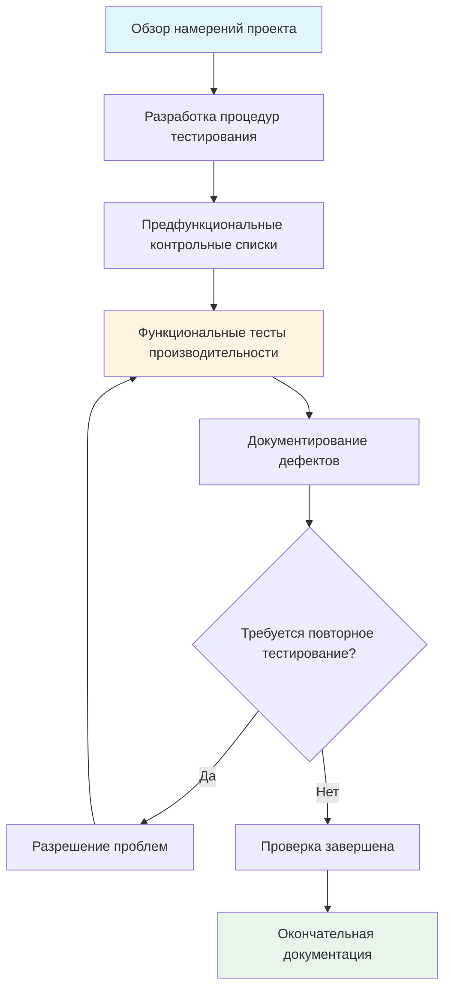

# Программы сертификации для наладки зданий

Сертификация наладки зданий подтверждает компетентность в систематической проверке систем HVAC, органов управления и производительности строительного конверта. Эти учетные данные демонстрируют компетентность в функциональном тестировании, проверке производительности и документировании сложных механических систем.

## Типы сертификации и требования

### Специалист по наладке (CxA)

Свидетельство специалиста по наладке от группы AABC Commissioning Group или ACG представляет отраслевой стандарт для профессионалов в области наладки. Эта сертификация требует:

**Предварительные условия:**
- Пять лет документированного опыта работы в области наладки
- Степень бакалавра в области машиностроения или эквивалентное техническое образование
- Завершение 80 часов обучения, специфичного для наладки
- Документированное портфолио проектов, демонстрирующее руководство наладкой

**Направления экзамена:**
- Управление процессом наладки согласно ASHRAE Guideline 0 и 1.1
- Методология функционального тестирования производительности
- Проверка интеграции систем
- Протоколы документирования и разрешения проблем

### Специалист по наладке зданий (BCP)

Университет Висконсина предлагает учетные данные BCP через свою программу сертификации наладки зданий:

**Структура программы:**
- 120 часов обучения, охватывающих основы наладки
- Акцент на наладку существующих зданий (EBCx)
- Методы проверки энергоэффективности
- Методы проверки систем управления

## Физика процесса наладки

### Проверка расхода воздуха

Наладка требует проверки расчетного расхода воздуха путем измерения и анализа кривой системы. Характеристика кривой системы вентилятора определяет производительность:

$$
\Delta P_{total} = \Delta P_{static} + \Delta P_{velocity} = K_{system} \cdot Q^2
$$

Где:
- $\Delta P_{total}$ = общий перепад давления на вентиляторе (Па)
- $K_{system}$ = коэффициент сопротивления системы
- $Q$ = объемный расход (м³/с)

Проверка включает построение фактической кривой вентилятора против кривой системы для подтверждения совмещения рабочей точки со спецификациями проектирования.

### Тестирование гидравлической системы

Наладка гидравлической системы проверяет расходы, температуры и дифференциальные давления. Фундаментальное уравнение теплопередачи определяет производительность системы:

$$
\dot{Q} = \dot{m} \cdot c_p \cdot \Delta T = \rho \cdot \dot{V} \cdot c_p \cdot (T_{return} - T_{supply})
$$

Где:
- $\dot{Q}$ = скорость теплопередачи (Вт)
- $\dot{m}$ = расход массы (кг/с)
- $c_p$ = удельная теплоемкость (Дж/кг·К)
- $\dot{V}$ = объемный расход (м³/с)
- $\rho$ = плотность жидкости (кг/м³)

Специалисты по наладке проверяют, что измеренный расход и температурный дифференциал обеспечивают расчетную производительность в пределах ±10% допуска согласно ASHRAE Standard 202.

## Функциональное тестирование производительности

### Проверка системы управления

Проверка последовательности управления представляет наиболее критичный результат наладки. Тестирование подтверждает:

**Аналоговые контуры управления:**
- Характеристики отклика пропорционально-интегрально-дифференциального (PID) регулятора
- Точность отслеживания установки (±0,5°C для контуров температуры)
- Стабильность контура при переменных нагрузках
- Проверка калибровки датчика (±0,2°C для температуры, ±25 Па для давления)

**Цифровые последовательности управления:**
- Логика переходов между режимами (занято/не занято/разогрев/снижение)
- Этапирование экономайзера согласно ASHRAE Standard 90.1
- Отклик управления вентиляцией по требованию на уровни CO₂
- Алгоритмы оптимального запуска/остановки

### Методология тестирования производительности

## Сравнение сертификатов

| Учетные данные | Выдающий орган | Требуемый опыт | Продолжительность экзамена | Период возобновления | Диапазон стоимости |
|--|--|--|--|--|--|
| CxA | AABC/ACG | 5 лет | 4 часа | 3 года | 90 000-120 000 ₽ |
| BCP | UW-Madison | 2 года | Программа сертификации | 5 лет | 265 000-340 000 ₽ |
| LEED AP BD+C | USGBC/GBCI | Нет (рекомендуется) | 2 часа | 3 года | 27 000-33 000 ₽ |
| CEM | AEE | 3 года | 4 часа | 3 года | 48 000-72 000 ₽ |
| BEMP | ASHRAE | 5 лет | 4 часа | 3 года | 36 000-48 000 ₽ |

## Структура стандартов ASHRAE

### Guideline 0-2019: Процесс наладки

Устанавливает систематический подход к проверке соответствия систем зданий требованиям проекта владельца (OPR):

**Ключевые требования:**
- Разработка документа "Основа проектирования" (BOD)
- Создание плана наладки на этапе проектирования
- Сбор руководства систем
- Проведение обучения персонала по эксплуатации

### Guideline 1.1-2007: Технические требования HVAC&R

Обеспечивает техническую глубину для наладки механических систем:

**Параметры тестирования:**
- Проверка расхода воздушного терминального устройства (±10% от расчета)
- Измерение расхода холодной воды (±5% при условиях проектирования)
- Температура подхода градирни (в пределах 1°C от проектного значения)
- Коэффициент полезного действия котла (>80% для систем с природным газом)

### Standard 202-2018: Процесс наладки

Определяет результаты наладки и обязанности для нового строительства:

**Требования к документации:**
- План наладки, обновленный на всех этапах проекта
- Журнал проблем, отслеживающий дефекты и их разрешение
- Процедуры и результаты функциональных тестов производительности
- Руководство по системам, включая документацию "как построено"

## Проверка энергетической производительности

Наладка проверяет энергоэффективность через протоколы измерения и проверки (M&V):

### Структура IPMVP

Международный протокол измерения и проверки производительности обеспечивает методологию:

**Вариант B: Изоляция при модернизации**
$$
\text{Энергосбережение} = (E_{baseline} - E_{post}) \pm \text{Корректировки}
$$

Где корректировки учитывают:
- Нормализацию климата с использованием градусо-дней нагрева/охлаждения
- Вариации занятости от предположений проектирования
- Изменения производства или операций

**Анализ неопределенности:**

Общая неопределенность измерения объединяет ошибки приборов и моделирования:

$$
U_{total} = \sqrt{U_{instrumentation}^2 + U_{model}^2 + U_{sampling}^2}
$$

Допустимая неопределенность: ±10% для проверки энергосбережения для всего здания.

## Развитие карьеры

Сертификация наладки зданий открывает пути к:

**Роли специалиста по наладке:**
- Независимый агент по наладке для проектов нового строительства
- Консультант по ретроналадке (RCx) для существующих объектов
- Специалист по наладке на основе мониторинга (MBCx)
- Профессионал по наладке конверта здания

**Типичная компенсация:**
- Начальный уровень CxA: 3 900 000-5 100 000 ₽ в год
- Средний уровень (5-10 лет): 5 400 000-7 200 000 ₽
- Старший менеджер по наладке: 7 200 000-9 600 000 ₽

**Спрос на рынке:**
Растущие требования энергетических кодов (ASHRAE 90.1, IECC) требуют наладку для зданий, превышающих 4 645 м² (50 000 фут²), создавая устойчивый спрос на учетные данные.

## Непрерывное образование

Поддержание сертификации требует постоянного профессионального развития:

**Приемлемые виды деятельности:**
- Курсы ASHRAE Learning Institute по наладке (8-16 CEU)
- Семинары по функциональному тестированию производительности
- Обучение системам автоматизации зданий
- Программы сертификации энергетического моделирования

**Рекомендуемые технические темы:**
- Продвинутые стратегии управления (управление спросом, предсказательная оптимизация)
- Реализация системы обнаружения и диагностики неисправностей (FDD)
- Нормативы хладагентов и наладка систем с низким ПГП
- Технологии декарбонизации и электрификации

Сертификация наладки зданий демонстрирует мастерство в систематических процессах проверки, обеспечивающих достижение системами HVAC расчетной производительности, целевых показателей энергоэффективности и целевых показателей комфорта жителей на протяжении всего жизненного цикла здания.
