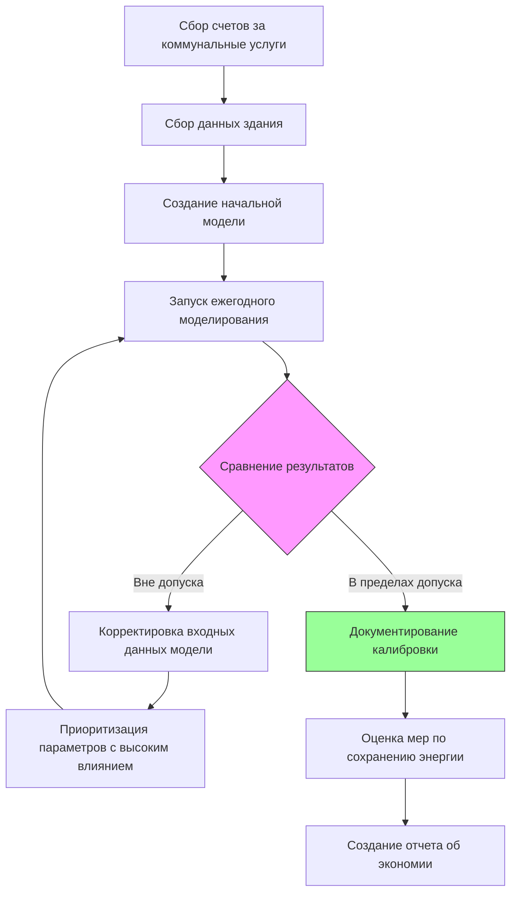

Сертификации по моделированию энергопотребления зданий подтверждают опыт в моделировании тепловых и энергетических характеристик зданий с использованием вычислительных инструментов. Эти учетные данные демонстрируют компетентность в моделировании базовых и предложенных зданий в соответствии с ASHRAE 90.1 Приложение G, техники калиброванного моделирования для существующих зданий и применения энергетических моделей для соответствия кодексам, программ стимулирования и оптимизации проектирования. Сертифицированные специалисты по моделированию энергии играют критическую роль в документировании энергетической производительности для сертификации LEED, программ стимулирования коммунальных предприятий и соответствия строительным кодексам.

## Ландшафт сертификаций

Две основные сертификации решают проблемы компетентности в моделировании энергопотребления зданий: Building Energy Modeling Professional (BEMP) от ASHRAE и специализация Certified Energy Modeler (CEM) от AEE. Обе учетные данные требуют продемонстрированного мастерства в программном обеспечении моделирования, термодинамических принципах и применении стандартов моделирования.

**ASHRAE Building Energy Assessment Professional (BEAP):**
- Администрируется ASHRAE
- Сосредоточен на оценке существующих зданий и калиброванном моделировании
- Предварительные условия: 5 лет опыта или лицензия профессионального инженера
- Экзамен: 3 часа, 100 вопросов
- Переаттестация: 30 часов непрерывного обучения (PDH) каждые 3 года

**Концепция Building Energy Modeling Professional (BEMP):**
Хотя официальная автономная сертификация BEMP обсуждалась организациями отрасли, текущее признание опыта моделирования обычно происходит через:
- Учетные данные ASHRAE BEAP с акцентом на моделирование
- Учетные данные AEE CEM со специализацией в моделировании энергии
- Демонстрация компетентности USGBC по моделированию для проектов LEED
- Сертификация поставщика программного обеспечения (DOE-2, EnergyPlus, eQUEST, TRACE, IES-VE)
- Региональная регистрация специалиста по моделированию энергии (California Title 24, New York)

## Фундаментальные принципы моделирования

Энергетические модели зданий решают одновременные уравнения баланса тепла и массы на каждом временном шаге моделирования для расчета нагрузок HVAC и потребления энергии.

### Уравнения энергетического баланса

Фундаментальный энергетический баланс зоны управляет всеми расчетами моделирования зданий:

$$Q_{cooling} + Q_{heating} + Q_{internal} + Q_{solar} + Q_{infiltration} + Q_{ventilation} + Q_{conduction} = 0$$

**Компоненты передачи тепла:**

Кондукция через оболочку здания:

$$Q_{cond} = U \cdot A \cdot (T_{outdoor} - T_{zone})$$

Где:
- $U$ = Коэффициент общей передачи тепла (Вт/м²·К)
- $A$ = Площадь поверхности (м²)
- $T$ = Температура (°C)

Солнечный теплоприход через остекление:

$$Q_{solar} = A_{window} \cdot SHGC \cdot I_{incident} \cdot FF$$

Где:
- $SHGC$ = Коэффициент солнечного теплоприроста
- $I_{incident}$ = Интенсивность падающего солнечного излучения (Вт/м²)
- $FF$ = Поправочный коэффициент доли рамы

Нагрузка инфильтрации:

$$Q_{infiltration} = 1.2 \cdot \dot{V} \cdot \rho \cdot c_p \cdot \Delta T + \dot{V} \cdot \rho \cdot h_{fg} \cdot \Delta W$$

Где:
- $1.2$ = Плотность воздуха (кг/м³)
- $c_p$ = Удельная теплоемкость воздуха (Дж/кг·К)
- $\Delta W$ = Разность влагосодержания (кг влаги/кг сухого воздуха)

### Моделирование систем HVAC

Энергетические модели рассчитывают потребление энергии оборудованием на основе кривых производительности при частичной нагрузке:

$$Power = Power_{rated} \cdot PLR \cdot f_{PLR} \cdot f_{temp}$$

Где:
- $PLR$ = Отношение частичной нагрузки (фактическая нагрузка / номинальная мощность)
- $f_{PLR}$ = Кривая деградации при частичной нагрузке
- $f_{temp}$ = Поправочный коэффициент температуры

**Кривые производительности чиллера:**

Мощность чиллера как функция нагрузки и температур:

$$\frac{kW}{kW_{rated}} = a + b \cdot PLR + c \cdot PLR^2 + d \cdot T_{chw} + e \cdot T_{cond}$$

Типичные значения коэффициентов центробежного чиллера:
- $a$ = 0,09 (перехват)
- $b$ = -0,30 (линейный член PLR)
- $c$ = 1,21 (квадратичный член PLR)
- $d$ = -0,015 (эффект температуры охлажденной воды)
- $e$ = 0,02 (эффект температуры конденсатора)

**Моделирование энергии вентиляторов:**

Мощность вентилятора переменной скорости следует законам подобия:

$$\frac{Power_2}{Power_1} = \left(\frac{Speed_2}{Speed_1}\right)^3 = \left(\frac{CFM_2}{CFM_1}\right)^3$$

Энергия вентилятора системы VAV при 60% воздушном потоке:

$$Power_{60\%} = Power_{design} \cdot (0.60)^3 = 0.216 \cdot Power_{design}$$

Это представляет экономию энергии 78,4% по сравнению с работой с постоянным объемом при полной мощности.

## Методология ASHRAE Standard 90.1 Приложение G

Приложение G предоставляет Метод оценки производительности для демонстрации экономии затрат на энергию по сравнению с базовым зданием, соответствующим кодексу.

### Требования к базовому зданию

Базовая модель должна отражать минимальные требования кодекса с определенными типами систем, назначенными в зависимости от характеристик здания:

**Выбор системы HVAC:**

| Тип здания | Площадь пола | Тип отопления | Базовая система |
|-----------|--------------|---------------|-----------------|
| Жилое | Любая | Любой | Система 1: PTAC с электрическим сопротивлением |
| Жилое | Любая | Ископаемое топливо/район | Система 2: PTAC с котлом горячей воды на ископаемом топливе |
| Нежилое | <2300 м² | Электрическое | Система 3: PSZ-AC с электрическим сопротивлением |
| Нежилое | <2300 м² | Ископаемое топливо | Система 4: PSZ-AC с газовой печью |
| Нежилое | 2300-14000 м² | Электрическое | Система 5: Пакетный VAV с электрическим доводчиком |
| Нежилое | 2300-14000 м² | Ископаемое топливо | Система 6: Пакетный VAV с доводчиком горячей воды на газе |
| Нежилое | >14000 м² | Электрическое | Система 7: VAV с электрическим доводчиком |
| Нежилое | >14000 м² | Ископаемое топливо | Система 8: VAV с доводчиком горячей воды на газе |

**Требования к базовой производительности:**

U-коэффициенты сборки оболочки из таблиц ASHRAE 90.1 A3.1-A3.8 в зависимости от климатической зоны:

| Сборка | Климатическая зона 3A | Климатическая зона 4A | Климатическая зона 5A |
|-------|----------------------|----------------------|----------------------|
| U-коэффициент кровли | 0,357 | 0,272 | 0,272 |
| U-коэффициент над земей стены | 0,703 | 0,477 | 0,363 |
| U-коэффициент окна | 3,238 | 2,611 | 2,157 |
| SHGC окна | 0,25 | 0,40 | 0,40 |

Эффективность оборудования HVAC из таблиц ASHRAE 90.1 6.8.1A-G:
- Пакетные кондиционеры: 11,2 EER (<18 кВт), 11,0 EER (≥18 кВт)
- Чиллеры: 6,1 COP электрические центробежные (≥1050 кВт)
- Котлы: КПД сгорания 80%
- Насосы: Переменная скорость с регулированием перепада давления
- Вентиляторы: Максимум 0,75 кВт на 1000 CFM (1700 м³/ч) подачи, 0,5 кВт на 1000 CFM возврата

### Моделирование предложенного здания

Модель предложенного здания отражает фактический проект с геометрическими и операционными характеристиками, соответствующими базовой модели.

**Требования к моделированию:**
- Идентичная площадь пола, ориентация и внутренние нагрузки базовой модели
- Фактические сборки оболочки, свойства остекления и устройства затенения
- Спроектированные системы HVAC, включая эффективность оборудования и органы управления
- Системы возобновляемой энергии, учитываемые в направлении экономии
- Расчет должен использовать тот же файл погодных данных, что и базовая модель

**Процент экономии затрат на энергию:**

$$\%\ Savings = 100 \times \frac{Cost_{baseline} - Cost_{proposed}}{Cost_{baseline}}$$

Баллы производительности энергии LEED v4 на основе процента улучшения:
- 6% экономия: 1 балл (предварительное условие + минимум)
- 8-10% экономия: 2-3 балла
- 12-14% экономия: 4-5 баллов
- 16-20% экономия: 6-8 баллов
- Каждые дополнительные 2%: +1 балл (до 50% экономии, максимум 18 баллов)

### Временной шаг моделирования и метеорологические данные

Часовое моделирование представляет минимально приемлемый временной шаг. Субчасовые временные шаги (15 минут) улучшают точность для:
- Систем с тепловым накоплением
- Стратегий естественной вентиляции
- Сложных последовательностей управления
- Расчета пикового спроса

**Требования к файлам метеорологических данных:**
- Данные TMY3 (Типичный метеорологический год) для местоположения
- 8760 часовых значений температуры, влажности, солнечного излучения, ветра
- Климатическая зона определяет требования базового здания
- Ближайшая метеостанция в пределах 80 км приемлема
- Пользовательские файлы метеорологических данных для микроклиматических условий (городской эффект теплового острова, прибрежные условия)

## Калиброванное моделирование для существующих зданий

Калиброванные энергетические модели соответствуют измеренным данным коммунальных предприятий для проверки точности модели перед оценкой мер по сохранению энергии.

### Стандарты толерантности калибровки

ASHRAE Guideline 14 и FEMP устанавливают критерии приемлемости:

**Средняя систематическая ошибка (MBE):**

$$MBE = \frac{\sum_{i=1}^{n} (y_i - \hat{y}_i)}{(n-1) \cdot \bar{y}} \times 100\%$$

**Коэффициент вариации среднеквадратической ошибки (CV-RMSE):**

$$CV(RMSE) = \frac{\sqrt{\frac{\sum_{i=1}^{n} (y_i - \hat{y}_i)^2}{n-1}}}{\bar{y}} \times 100\%$$

Где:
- $y_i$ = Измеренное потребление за период $i$
- $\hat{y}_i$ = Смоделированное потребление за период $i$
- $\bar{y}$ = Среднее измеренное потребление
- $n$ = Количество точек данных

**Критерии приемлемости:**

| Уровень калибровки | Предел MBE | Предел CV-RMSE |
|------------------|-----------|----------------|
| Месячная калибровка | ±5% | ≤15% |
| Часовая калибровка | ±10% | ≤30% |

### Рабочий процесс калибровки

**Приоритет корректировки параметров:**

1. **Расписание эксплуатации:** Часы занятости, оборудования, освещения
2. **Внутренние нагрузки:** Фактическая удельная мощность из измеренных данных
3. **Уставки HVAC:** Фактический контроль температуры и влажности
4. **Эффективность оборудования:** Деградированная производительность от расчетных значений
5. **Скорости инфильтрации:** Измеренные из испытания дверцей вентилятора или газом-индикатором
6. **Свойства оболочки:** Валидация из термографического обследования
7. **Нормализация метеорологических данных:** Корректировка для нетипичного года

### Требования к сбору данных

Комплексная характеристика здания обеспечивает верность модели:

**Данные коммунальных предприятий (минимум 12 месяцев):**
- Спрос на электроэнергию (кВт) и потребление (кВт·ч)
- Потребление природного газа (м³)
- Потребление пара или охлажденной воды (если применимо)
- Нормализация для погодных и занятостных вариаций

**Операционные данные здания:**
- Уставки температуры и влажности по зонам
- Часы работы и расписание
- Подсчеты и закономерности занятости
- Инвентаризация подключаемых нагрузок и использования
- Обследование удельной мощности освещения
- Потребление горячей воды для хозяйственных нужд

**Информация об оборудовании HVAC:**
- Паспортные данные для всего централизованного оборудования растения
- Данные тренда из BAS (температура подачи, расходы, мощность)
- Журналы растения охладителя, показывающие нагрузку и эффективность
- Результаты испытания КПД сгорания котла
- Измерения воздушного потока воздухообработчика

**Обследование оболочки:**
- Конструкция сборок стены, кровли и пола
- Тип окна, площадь и характеристики рамы
- Результаты испытания дверцей вентилятора (CFM50 или ACH50)
- Инфракрасная термография для тепловых мостов
- Затенение от соседних зданий и растительности

## Платформы программного обеспечения для моделирования энергии

Несколько механизмов моделирования предоставляют возможности моделирования энергопотребления зданий с различной сложностью и применением.

### Программы на основе DOE-2

DOE-2 представляет наиболее широко используемый часовой механизм моделирования для моделирования соответствия.

**eQUEST:**
- Бесплатный графический интерфейс для механизма DOE-2.2
- Мастер-управляемый ввод для быстрого создания модели
- Режим концептуального проекта для анализа ранней фазы
- Детальный режим для соответствия Приложению G
- Встроенные отчеты для представления LEED
- Ограниченная возможность пользовательского моделирования системы

**TRACE 3D Plus:**
- Коммерческое программное обеспечение компании Trane (3000-5000 долл. США)
- Интегрировано с выбором и ценообразованием оборудования
- 3D ввод геометрии с плагином SketchUp
- Производительность оборудования из каталога Trane
- Подходит для оптимизации проектирования
- Отчет о соответствии ASHRAE 90.1

### EnergyPlus

EnergyPlus обеспечивает комплексные возможности моделирования для сложных систем и приложений исследований.

**Возможности:**
- Модульная архитектура моделирования системы
- Встроенная сеть воздушного потока для естественной вентиляции
- Системы лучистого отопления/охлаждения
- Пользовательское моделирование оборудования через систему управления энергией
- Субчасовые временные шаги для теплового накопления
- Естественное освещение с расчетом освещенности
- Передача тепла в землю (плита, подвал)

**Графические интерфейсы:**
- OpenStudio: Бесплатная платформа NREL с плагином SketchUp
- DesignBuilder: Коммерческий интерфейс с расширенными функциями (1500-8000 долл. США)
- Integrated Environmental Solutions (IES-VE): Полный набор производительности здания

**Кривая обучения:**
EnergyPlus требует значительных инвестиций в обучение из-за:
- Текстовая структура файла IDF (>10000 строк для сложных зданий)
- Детальные подключения узлов HVAC и изменение размера
- Обширная отладка для ошибок конвергенции
- Ограниченная документация для расширенных функций
- Типичное мастерство: 6-12 месяцев для опытных моделировщиков

### Сравнение платформ моделирования

| Платформа | Механизм | Стоимость | Время обучения | Лучшее применение |
|-----------|---------|---------|----------------|------------------|
| eQUEST | DOE-2.2 | Бесплатно | 1-2 месяца | LEED, Title 24, Приложение G |
| TRACE 3D Plus | DOE-2.2 | 3000-5000 долл. | 2-3 месяца | Оптимизация проекта, выбор оборудования |
| OpenStudio | EnergyPlus | Бесплатно | 3-6 месяцев | Сложные системы, параметрический анализ |
| DesignBuilder | EnergyPlus | 1500-8000 долл. | 2-4 месяца | Интегрированный проект, естественное освещение |
| IES-VE | EnergyPlus | 8000-15000 долл. | 4-6 месяцев | Полная производительность здания, CFD |
| Carrier HAP | Собственное | 1000-2000 долл. | 1-2 месяца | Расчет нагрузки, изменение размера оборудования |

## Обеспечение качества модели

Систематический контроль качества предотвращает ошибки, которые ухудшают точность моделирования.

### Контрольный список проверки входных данных

**Геометрия и оболочка:**
- Общая площадь пола соответствует архитектурным чертежам (±2%)
- Отношение окна к стене по ориентации в пределах 5% проекта
- Значения U-фактора сборки крыши и стены из данных производителя
- Свойства остекления (U-фактор, SHGC, VT) из рейтингов NFRC
- Устройства затенения смоделированы с правильной геометрией и пропускаемостью

**Внутренние нагрузки:**
- Удельная мощность освещения из расписания приспособления (Вт/м²)
- Удельная мощность подключаемых нагрузок из инвентаризации оборудования (Вт/м²)
- Плотность занятости из требований программы (м²/человек)
- Процессные нагрузки отдельно дозированы и задокументированы
- Горячая вода для хозяйственных нужд на основе подсчета приспособления и занятости

**Системы HVAC:**
- Мощность оборудования в пределах 10% от расчетных нагрузок охлаждения/отопления
- Значения эффективности из паспортных листов производителя или справочника AHRI
- Скорости воздушного потока соответствуют отчету TAB или расчетному CFM
- Напор насоса и расход соответствуют гидравлическому проекту
- Скорости наружного воздуха в соответствии с расчетом вентиляции ASHRAE 62.1
- Пределы экономайзера соответствуют требованиям климатической зоны

**Расписания:**
- Часы работы отражают фактические модели использования здания
- Сезонные вариации отражены (лето в. учебный год)
- Праздничная и выходная работа правильно определена
- Коэффициенты разнообразия применены к совпадающим нагрузкам
- Ночной откат и последовательности оптимального запуска смоделированы

### Валидация выходных данных

**Проверки энергетического баланса:**

Проверка замыкания энергетического баланса:

$$\Delta Energy_{storage} = Q_{HVAC} + Q_{internal} + Q_{solar} + Q_{infiltration} + Q_{ventilation} + Q_{envelope}$$

Ошибка месячного энергетического баланса должна оставаться <1% от общих нагрузок.

**Индикаторы нагрузки:**

Сравнение результатов моделирования с эталонными значениями:

| Тип здания | Нагрузка отопления (МДж/м²·год) | Нагрузка охлаждения (МДж/м²·год) | EUI (МДж/м²·год) |
|-----------|--------------------------------|--------------------------------|-----------------|
| Офис | 160-320 | 214-428 | 643-1072 |
| Розница | 107-268 | 321-643 | 857-1607 |
| Школа | 214-428 | 160-375 | 750-1286 |
| Больница | 428-856 | 536-1072 | 2143-3750 |
| Многоквартирное | 268-536 | 107-268 | 857-1393 |

Значительное отклонение (>30%) от эталонов указывает на потенциальные ошибки входных данных, требующие исследования.

**Валидация пиковой нагрузки:**

Рассчитанные расчетные нагрузки должны соответствовать основам расчета нагрузки ASHRAE:

$$\frac{Q_{peak,simulation}}{Q_{peak,manual}} = 0.90\ to\ 1.10$$

Размеры унитарного оборудования должны быть коммерчески доступными мощностями (1,3, 1,75, 2,1, 2,6, 3,5, 5,25, 7, 8,75, 10,5, 14, 17,5 кВт).

## Карьерные пути и компенсация

Опыт в области моделирования энергопотребления зданий обеспечивает компенсацию премиум-класса благодаря специализированным техническим навыкам и нормативным требованиям.

**Требования начального уровня:**
- Степень бакалавра в области машиностроения, архитектурного машиностроения или строительной науки
- Мастерство в по крайней мере одной основной платформе моделирования (eQUEST, EnergyPlus, TRACE)
- Понимание термодинамики, передачи тепла и психрометрики
- Знакомство с требованиями ASHRAE 90.1 и методологией Приложения G
- Навыки CAD или BIM для разработки геометрии

**Прогрессия опыта:**

| Уровень опыта | Ответственность | Диапазон компенсации |
|-------------|-----------------|---------------------|
| Младший моделировщик (0-2 года) | Ввод геометрии, базовые модели, проверки QA | 59000-75000 евро |
| Специалист по моделированию энергии (2-5 лет) | Полные модели Приложения G, калибровка, анализ мер | 75000-102000 евро |
| Старший моделировщик (5-10 лет) | Сложные системы, рецензирование коллег, координация с клиентом | 102000-134000 евро |
| Главный моделировщик (10+ лет) | Техническое лидерство, разработка стандартов, обучение | 134000-171000 евро |

**Сектора занятости:**
- МЭП инженерные фирмы (40%): Моделирование энергии на этапе проекта для новых зданий
- Консалтинговые фирмы по энергетике (30%): Оценка существующих зданий и переналадка
- Архитектурные фирмы (15%): Интегрированное проектирование и консультирование по устойчивости
- Коммунальные предприятия и администраторы программ (10%): Проверка моделирования программ стимулирования
- Поставщики программного обеспечения (5%): Прикладное машиностроение и техническая поддержка

**Рыночный спрос:**
Требования к моделированию энергопотребления зданий продолжают расширяться из-за:
- Все более строгие энергетические кодексы (ASHRAE 90.1, непрерывные обновления IECC)
- Растущее принятие путей соответствия, основанных на производительности
- Требования сертификации LEED и экологичного строительства
- Программы стимулирования коммунальных предприятий, требующие детальных расчетов экономии
- Стандарты производительности зданий в крупных городах (NYC LL97, Закон о чистых зданиях Вашингтона)

Опытные специалисты по моделированию энергии с учетными данными ASHRAE BEAP или эквивалентными требуют премии в размере 15-25% зарплаты по сравнению с некертифицированными коллегами. Специализированный опыт в сложных системах (центральные заводы, тепловое накопление, лучистые системы) или продвинутые методы калибровки дополнительно дифференцируют компенсацию.

Профессия в области моделирования энергопотребления зданий находится на пересечении основ инженерии, вычислительного моделирования и нормативного соответствия. Мастерство требует глубокого понимания термодинамических принципов, мастерства с инструментами моделирования и тщательного знания строительных кодексов и стандартов. Сертифицированные специалисты по моделированию энергии предоставляют важную документацию для демонстрации соответствия, количественной оценки экономии энергии и оптимизации производительности зданий на протяжении всего жизненного цикла проектирования и эксплуатации.

## Компоненты

- Certified Energy Modeler Cem Ashrae
- Building Energy Modeling Professional Bemp
- Energy Simulation Software Expertise
- Ashrae Standard 90 1 Appendix G
- Performance Rating Method
- Baseline Building Modeling
- Proposed Building Modeling
- Calibrated Simulation Techniques
