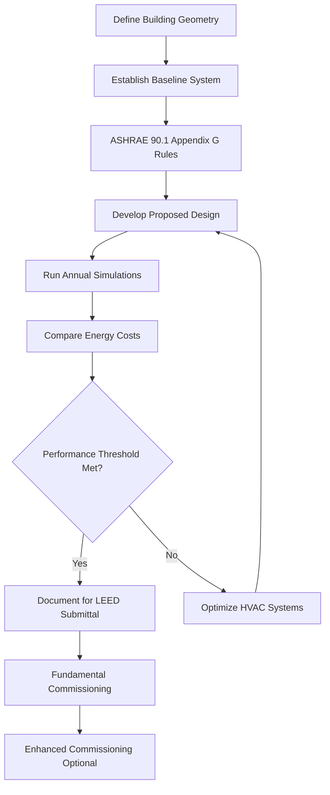
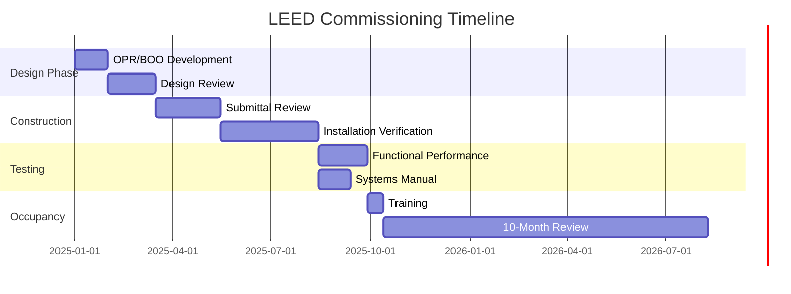

## Обзор

Аккредитованный сертификат специалиста Leadership in Energy and Environmental Design (LEED) подтверждает компетентность в области устойчивого проектирования и эксплуатации зданий. Для специалистов HVAC сертификация LEED AP демонстрирует компетентность в интеграции механических систем со стратегиями экологичного строительства, оптимизации энергетической производительности и достижении целей внутреннего качества окружающей среды в рамках рейтинговой системы USGBC.

Системы HVAC, как правило, составляют 40-60% потребления энергии в зданиях и прямо влияют на несколько категорий кредитов LEED, что делает знания в области механической инженерии критически важными для сертификации высокопроизводительных зданий.

## Рейтинговые системы LEED и влияние на HVAC

LEED v4.1 и LEED v5 охватывают несколько рейтинговых систем, каждая из которых имеет специфические требования к механическим системам:

| Рейтинговая система | Основной фокус HVAC | Ключевые задачи |
|---------------|-------------------|----------------|
| BD+C (Building Design & Construction) | Оптимизация энергии, пусконаладка, управление хладагентом | Достижение пороговых значений энергетической производительности EAc2 |
| O+M (Operations & Maintenance) | Операционная эффективность, профилактическое обслуживание, постоянная пусконаладка | Поддержание производительности в течение жизненного цикла здания |
| ID+C (Interior Design & Construction) | Эффективность вентиляции, тепловой комфорт, акустика | Координация с системами базового здания |
| ND (Neighborhood Development) | Районные системы, снижение эффекта теплового острова | Крупномасштабная тепловая инфраструктура |

## Моделирование энергетической производительности

Категория кредитов Energy and Atmosphere (EA) определяет выбор и оптимизацию проектирования системы HVAC. Энергетическая производительность количественно определяется с помощью моделирования всего здания, сравнивающего предложенный проект с базовым вариантом ASHRAE 90.1 Appendix G.

### Индекс стоимости производительности

Процент улучшения в сравнении с базовым вариантом определяет количество присуждаемых баллов:

$$
\text{PCI} = \frac{C_{\text{baseline}} - C_{\text{proposed}}}{C_{\text{baseline}}} \times 100\%
$$

где $C_{\text{baseline}}$ представляет стоимость энергии базового здания, а $C_{\text{proposed}}$ представляет стоимость энергии предложенного проекта.

Для нового строительства согласно LEED v4.1 BD+C пороговые значения баллов следующие:

| Баллы | Требуемое улучшение производительности |
|--------|----------------------------------|
| 1-2 | На 6-10% лучше, чем базовый вариант |
| 3-5 | На 12-18% лучше, чем базовый вариант |
| 6-10 | На 20-30% лучше, чем базовый вариант |
| 11-18 | На 32-50% лучше, чем базовый вариант |

### Методология энергетического моделирования

ASHRAE 90.1 Appendix G устанавливает типы базовых систем HVAC на основе характеристик здания:

- System 1-2: Жилые системы (печь/кондиционер или тепловой насос)
- System 3-4: Системы PSZ для малого коммерческого назначения (< 92,9 м²)
- System 5-6: Упакованные VAV для зданий среднего размера (92,9-139,4 тыс. м²)
- System 7-8: VAV с центральной установкой для больших зданий (> 139,4 тыс. м²)

## Кредиты внутреннего качества окружающей среды

Предварительные условия и кредиты LEED IEQ устанавливают минимальные скорости вентиляции, стандарты теплового комфорта и меры контроля загрязнения, которые прямо влияют на проектирование механических систем.

### Процедура расчета скорости вентиляции

EQ Prerequisite 1 требует соответствия ASHRAE 62.1 Ventilation for Acceptable Indoor Air Quality. Требуемое поступление наружного воздуха объединяет требования зон:

$$
V_{ot} = \sum_{i=1}^{n} \left( R_p \times P_z + R_a \times A_z \right) \times E_z
$$

где:
- $V_{ot}$ = общее требование наружного воздуха (м³/ч)
- $R_p$ = норма наружного воздуха на человека (м³/ч на человека)
- $P_z$ = численность населения зоны
- $R_a$ = норма наружного воздуха на площадь (м³/ч на м²)
- $A_z$ = площадь пола зоны (м²)
- $E_z$ = эффективность распределения воздуха в зоне

### Улучшенные стратегии качества воздуха в помещении

| Стратегия | Кредиты LEED | Подход к реализации |
|----------|--------------|-------------------------|
| Увеличенная вентиляция | EQc2 | На 30% выше минимума ASHRAE 62.1 |
| Контроль CO₂ | EQc1 | Системы DCV с уставкой 1050 ppm |
| Фильтрация воздуха | EQc3 | Минимум MERV 13, предпочтительно MERV 14 |
| Тепловой комфорт | EQc7 | Проверка соответствия ASHRAE 55 |

## Управление хладагентом

EAc6 налагает штрафы на хладагенты с высоким потенциалом глобального потепления (GWP) и истощением озонового слоя (ODP). Экологическое воздействие рассчитывается:

$$
\text{LCGWP} + \text{LCODP} = \left[ \left( GWP \times L_r \times L \right) + \left( ODP \times L_r \times L \right) \right] \times M
$$

где:
- $GWP$ = потенциал глобального потепления (кг CO₂ эквивалента/кг хладагента)
- $ODP$ = потенциал истощения озонового слоя (кг CFC-11 эквивалента/кг хладагента)
- $L_r$ = скорость утечки хладагента (%/год)
- $L$ = срок эксплуатации оборудования (годы)
- $M$ = заряд хладагента (кг)

Хладагенты с низким GWP (R-32, R-454B, R-1234ze) и технологии без хладагента (испарительное охлаждение, радиационные системы) максимизируют достижение кредитов.

## Требования пусконаладки

Фундаментальная пусконаладка (Cx) является предварительным условием LEED, обеспечивающим работу систем HVAC в соответствии с проектом. Улучшенная пусконаладка расширяет этот процесс.

Улучшенная пусконаладка (EAc1) включает:
- Вовлечение органа пусконаладки на этапе разработки проекта
- Проверка материалов подрядчика
- Разработка руководства по системам
- Проверка обучения оператора
- Обзор после ввода в эксплуатацию в течение 10 месяцев

## Путь сертификации

LEED AP со специализацией требует:
1. Успешного прохождения экзамена LEED Green Associate (предварительное условие)
2. Прохождения экзамена по специализации (BD+C, O+M, ID+C или ND)
3. Профессионального опыта в области экологичного строительства (документируется через заявление)
4. Повышение квалификации: 30 часов каждые 2 года

Для специалистов HVAC специализации BD+C и O+M наиболее прямо соответствуют практике механической инженерии.

## Стратегическая ценность для инженеров HVAC

Сертификация LEED AP позволяет инженерам-механикам:
- Возглавлять интегрированные сеансы проектирования, сосредоточенные на оптимизации энергии
- Проводить анализ компромиссов между начальной стоимостью и достижением баллов LEED
- Использовать программное обеспечение энергетического моделирования (eQUEST, EnergyPlus, IES-VE)
- Выбирать оборудование, соответствующее критериям производительности и окружающей среды
- Координировать деятельность по пусконаладке, обеспечивающей операционную производительность
- Документировать технические материалы для рассмотрения USGBC

Здания, стремящиеся к сертификации LEED, требуют инженеров-механиков, которые понимают структуру кредитов, требования моделирования и процедуры документирования. Эта учетная запись отличает специалистов на рынке устойчивого строительства.

## Интеграция со стандартами ASHRAE

LEED ссылается на несколько стандартов ASHRAE, формирующих техническую основу:

- **ASHRAE 90.1**: Energy Standard for Buildings (базовый вариант для кредитов EA)
- **ASHRAE 62.1**: Ventilation for Acceptable Indoor Air Quality (предварительное условие IEQ)
- **ASHRAE 55**: Thermal Environmental Conditions for Human Occupancy (кредиты IEQ)
- **ASHRAE 189.1**: Standard for Design of High-Performance Green Buildings
- **ASHRAE Guideline 0**: The Commissioning Process (мероприятия по пусконаладке)

Понимание этих стандартов и их применение в рамках LEED составляют основную компетентность для учетных данных LEED AP.
