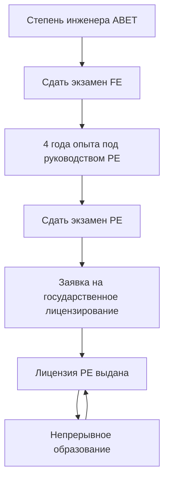
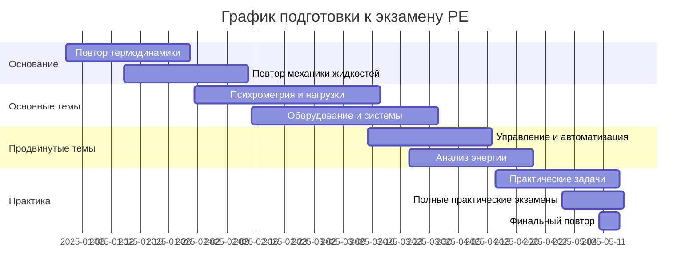

## Обзор лицензирования Professional Engineer

Лицензия Professional Engineer (PE) представляет наивысший стандарт компетентности в инженерной профессии. Для инженеров HVAC механики лицензирование PE подтверждает овладение принципами термодинамики, методологией проектирования систем и юридический авторитет одобрения инженерных документов для использования населением. Лицензия регулируется на уровне штата, но следует национально стандартизированным протоколам экзаменов, администрируемым Национальным советом экспертов по инженерии и геодезии (NCEES).

Лицензирование PE юридически требуется для инженеров, предоставляющих услуги непосредственно населению, подписывающих и заверяющих инженерные планы, или выступающих в качестве ответственного инженера проекта. В практике HVAC это применяется к консультирующим инженерам, проектировщикам систем для разрешений на строительство и специалистам, предоставляющим экспертные заключения.

## Требования к лицензированию

### Требования к образованию

Кандидаты должны иметь степень бакалавра от программы инженерии, аккредитованной ABET. Степени в области механической инженерии обеспечивают наиболее сильную подготовку к практике HVAC, охватывая термодинамику, механику жидкостей, теплопередачу и динамику систем. Альтернативные пути существуют для степеней от неаккредитованных программ, обычно требующие дополнительной документации и проверки опыта.

### Требования к опыту

Большинство штатов требуют четырех лет прогрессивного инженерного опыта под контролем лицензированного PE. Квалифицирующий опыт включает:

- **Проектные работы**: расчеты нагрузок, выбор оборудования, проектирование воздуховодов и трубопроводов
- **Задачи анализа**: энергетическое моделирование, психрометрический анализ, оптимизация систем
- **Управление проектами**: надзор при строительстве, разработка спецификаций, контроль комиссионирования
- **Исследования и разработки**: передовые технологии HVAC, вычислительное моделирование

Опыт должен демонстрировать возрастающую ответственность и техническую сложность, задокументированный подробными записями работ, проверяемыми лицензионной коллегией.

### Путь прохождения экзамена

## Экзамен "Основы инженерии" (FE)

Экзамен FE служит первым шагом на пути к лицензированию PE. Механический экзамен FE содержит 110 вопросов, охватывающих:

| Область знаний | Примерное количество вопросов | Релевантность к HVAC |
|---|---|---|
| Математика | 7-11 | Дифференциальные уравнения для переходного анализа |
| Вероятность и статистика | 4-6 | Анализ неопределенности, надежность |
| Вычислительные инструменты | 4-6 | Основы программного обеспечения моделирования |
| Этика и профессиональная практика | 4-6 | Соответствие кодексам, профессиональная ответственность |
| Инженерная экономика | 4-6 | Анализ стоимости жизненного цикла |
| Электричество и магнетизм | 6-9 | Выбор моторов, электрические нагрузки |
| Статика | 5-8 | Крепление оборудования, конструктивные нагрузки |
| Динамика | 6-9 | Анализ вибраций, вращающееся оборудование |
| Механика материалов | 6-9 | Анализ напряжений, тепловое расширение |
| Свойства материалов | 6-9 | Свойства хладагентов, выбор материалов |
| Механика жидкостей | 6-9 | Падение давления, выбор насосов и вентиляторов |
| Термодинамика | 9-12 | Анализ циклов, психрометрия |
| Теплопередача | 9-12 | Кондукция, конвекция, излучение |
| Измерения | 5-8 | Приборостроение, калибровка датчиков |
| Механическое проектирование | 9-12 | Расчет компонентов, интеграция систем |

Проходной балл обычно требует 50-60% правильных ответов, с адаптивной оценкой в зависимости от сложности вопроса.

## Экзамен PE для механических инженеров HVAC и холодильных систем

Экзамен PE сосредоточен исключительно на системах HVAC и холодильных установках для кандидатов, выбирающих этот модуль глубины. Структура экзамена включает 80 вопросов за 8 часов, разделенных на разделы широты (40 вопросов) и глубины (40 вопросов).

### Темы раздела широты

**Оборудование и системы (20-25%)**

Этот раздел проверяет знания выбора оборудования HVAC, расчета размеров и применения. Основные типы расчетов включают:

Охлаждающая способность систем парокомпрессионного цикла:

$$Q_c = \dot{m}_r (h_1 - h_4)$$

где $\dot{m}_r$ — массовый расход хладагента, $h_1$ — энтальпия на выходе испарителя, и $h_4$ — энтальпия на входе расширительного устройства.

Коэффициент производительности для охлаждающих циклов:

$$COP_c = \frac{Q_c}{W_{comp}} = \frac{h_1 - h_4}{h_2 - h_1}$$

**Анализ энергии (15-20%)**

Расчеты потребления энергии следуют методологиям ASHRAE Standard 90.1. Годовое энергопотребление для систем переменного объема:

$$E_{annual} = \int_0^{8760} \left[ \dot{m}_{sa}(t) c_p \Delta T(t) \right] dt$$

Эффективность при частичной нагрузке требует анализа методом корзины (bin method) или детального моделирования с включением кривых производительности оборудования.

**Коды и стандарты (10-15%)**

Вопросы экзамена PE ссылаются на ASHRAE Standards 15, 34, 62.1, 90.1 и 189.1, а также на требования Международного механического кодекса (IMC). Необходимо понимание установленных кодексом норм вентиляции, требований безопасности и пороговых значений энергоэффективности.

Минимальная вентиляция согласно ASHRAE 62.1:

$$V_{oz} = R_p P_z + R_a A_z$$

где $R_p$ — норма вентиляции на одного человека, $P_z$ — численность в зоне, $R_a$ — норма вентиляции на единицу площади, и $A_z$ — площадь пола зоны.

**Теплопередача и поток жидкости (20-25%)**

Задачи включают метод эффективности-NTU теплообменников, падение давления в системах распределения и переходный тепловой анализ.

Эффективность теплообменника:

$$\epsilon = \frac{Q_{actual}}{Q_{max}} = \frac{C_h(T_{h,in} - T_{h,out})}{C_{min}(T_{h,in} - T_{c,in})}$$

Падение давления в воздуховодах согласно ASHRAE Fundamentals:

$$\Delta P = f \frac{L}{D} \frac{\rho V^2}{2}$$

где $f$ — коэффициент трения из диаграммы Муди, $L$ — длина воздуховода, $D$ — гидравлический диаметр, $\rho$ — плотность воздуха, и $V$ — скорость.

**Психрометрия и расчеты нагрузок (15-20%)**

Расчеты коэффициента чувствительного тепла и анализ производительности охлаждающего змеевика — основные компетенции:

$$SHR = \frac{q_s}{q_s + q_l}$$

Условия смешанного воздуха для работы экономайзера:

$$h_{ma} = \frac{\dot{m}_{oa} h_{oa} + \dot{m}_{ra} h_{ra}}{\dot{m}_{oa} + \dot{m}_{ra}}$$

### Области фокуса раздела глубины

Раздел глубины содержит 40 вопросов специально по проектированию и анализу HVAC и холодильных систем:

**Проектирование и выбор систем**
- Системы с преобладанием воздуха: VAV, CAV, многозонные, двойные воздуховоды
- Гидравлические системы: охлажденная вода, горячая вода, первичный-вторичный насосы
- Холодильные системы: прямое расширение, затопленные испарители, каскадные циклы
- Специальные применения: чистые комнаты, лаборатории, центры обработки данных

**Управление и автоматизация**
- Основы контурного управления: параметры настройки P, PI, PID
- Последовательность операций для сложных систем
- Стратегии управления энергией: оптимальный старт/остановка, переустановка нагрузки, ограничение спроса
- Архитектура системы автоматизации зданий

**Комиссионирование и тестирование**
- Процедуры тестирования и балансировки согласно ASHRAE Standard 111
- Протоколы функционального тестирования производительности
- Критерии приемки и требования к документации

## Стратегии подготовки к экзамену

### Технические справочные материалы

NCEES предоставляет цифровой справочник, содержащий уравнения, таблицы и диаграммы. Успешные кандидаты дополняют это следующим:

- **Справочники ASHRAE**: Fundamentals, HVAC Systems and Equipment, HVAC Applications, Refrigeration
- **Стандарты ASHRAE**: 62.1 (Вентиляция), 90.1 (Энергия), 15 (Безопасность хладагентов)
- **Таблицы пара и психрометрические диаграммы**: Для определения свойств
- **Руководства Carrier HAP или Trane TRACE**: Методологии проектирования систем

### График обучения

Структурированный 6-месячный график подготовки дает оптимальные результаты:

### Методология решения задач

Управление временем на 8-часовом экзамене требует эффективного решения задач:

1. **Полностью прочитайте вопрос**: Определите, что спрашивается, перед изучением предоставленной информации
2. **Извлеките релевантные данные**: Отметьте единицы и преобразуйте в согласованную систему, если необходимо
3. **Выберите подходящие уравнения**: Справочник или вспомненные фундаментальные принципы
4. **Решите систематически**: Покажите промежуточные этапы для сложных расчетов
5. **Проверьте разумность**: Убедитесь, что величина ответа и единицы имеют физический смысл

Среднее время на один вопрос составляет 6 минут. Пропустите сложные задачи первоначально и вернитесь к ним после выполнения прямолинейных вопросов.

## Влияние на карьеру и профессиональное развитие

Лицензирование PE обеспечивает множественные преимущества карьеры:

**Юридический авторитет**
- Подписывать и заверять инженерные документы для подачи разрешений
- Выступать в качестве ответственного инженера проекта для строительных проектов
- Предоставлять экспертные заключения в судебных разбирательствах

**Мобильность карьеры**
- Квалифицируйтесь на старшие должности проектировщиков в консультирующих фирмах
- Выполните требования для ролей инженеров в государственных учреждениях
- Создайте независимую консультационную практику

**Премия к компенсации**
PE-лицензированные инженеры зарабатывают на 10-20% больше, чем нелицензированные коллеги с эквивалентным опытом. Должности главного специалиста и партнера в консультирующих фирмах обычно требуют лицензирование PE.

**Профессиональное признание**
Государственное лицензирование демонстрирует приверженность профессиональным стандартам и технической совершенству. Учетные данные PE повышают доверие клиентов и профессиональную репутацию.

## Непрерывное образование и поддержание лицензии

Большинство штатов требуют профессионального развития (CPD) для поддержания активного лицензирования. Типичные требования варьируются от 15-30 часов профессионального развития (PDH) в год. Квалифицирующая деятельность включает:

- **Техническое обучение**: семинары ASHRAE, университетские курсы, онлайн-обучение
- **Участие в профессиональных обществах**: членство в технических комитетах, посещение конференций
- **Технические публикации**: рецензируемые статьи, инженерные статьи
- **Преподавание**: университетское преподавание, проведение профессионального обучения

Членство в ASHRAE предоставляет обширные возможности CPD через курсы Learning Institute, презентации отделений и работу в технических комитетах. Многие штаты принимают единицы непрерывного образования ASHRAE (CEU) непосредственно в зачет возобновления лицензии.

## Интеграция с другими учетными данными

Лицензирование PE дополняется специализированными сертификациями HVAC:

| Учетные данные | Область фокуса | Отношение к PE |
|---|---|---|
| LEED AP BD+C | Проектирование зеленых зданий | Расширяет знания устойчивых систем |
| BEMP | Моделирование энергии зданий | Поддерживает компетентность в анализе энергии |
| CEM | Управление энергией | Обеспечивает операционную перспективу |
| HFDP | Проектирование медицинских учреждений | Специализирует применение PE |
| CxA | Комиссионирование | Проверяет проверку производительности систем |

Наличие нескольких учетных данных демонстрирует широту компетентности и приверженность профессиональному развитию. Многие фирмы ищут инженеров с PE плюс специализированные сертификации для сложных проектов.

## Заключение

Лицензирование Professional Engineer представляет краеугольное учетное данное для карьеры инженеров HVAC механики. Строгий процесс экзамена проверяет фундаментальные принципы термодинамики, компетентность в проектировании систем и знание соответствия кодексам. Лицензирование PE обеспечивает юридический авторитет, возможности продвижения по карьере и профессиональное признание, которые отличают инженеров на конкурентных рынках. Систематическая подготовка, сосредоточенная на фундаментальных принципах, практических задачах и знакомстве со справочным материалом, обеспечивает успешную сдачу экзамена. Инвестирование в лицензирование PE приносит выгоды на протяжении всей карьеры через повышенную репутацию, расширенные ответственности и увеличенный потенциал компенсации.
