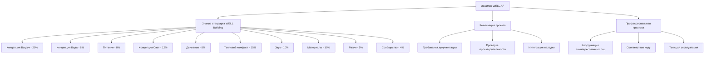

## Обзор

Учётные данные сертифицированного специалиста WELL (WELL AP) демонстрируют опыт в проектировании, строительстве и эксплуатации зданий, повышающих здоровье и благополучие людей. Для специалистов по HVAC эта сертификация закрывает разрыв между традиционным управлением окружающей средой и центрированным на занятости проектированием, требуя глубокого понимания качества воздуха, теплового комфорта, акустической производительности и взаимодействия освещения с механическими системами.

Стандарт WELL Building основывается на десяти основных концепциях, системы HVAC непосредственно влияют на концепции «Воздух», «Тепловой комфорт», «Звук» и косвенно влияют на концепции «Свет», «Вода» и «Разум» через выбор конструкции системы.

## HVAC-релевантные концепции WELL

### Управление качеством воздуха

Концепция «Воздух» в WELL устанавливает строгие требования, выходящие за рамки минимального соответствия коду, сосредоточиваясь на снижении загрязнения и эффективности вентиляции.

**Контроль твёрдых частиц**

Связь между скоростью вентиляции и концентрацией частиц следует затухающему распаду первого порядка, когда наружные концентрации остаются постоянными:

$$\frac{dC_{in}}{dt} = \frac{Q}{V}(C_{out} - C_{in}) + \frac{S}{V} - kC_{in}$$

Где:
- $C_{in}$ = концентрация частиц в помещении (мкг/м³)
- $C_{out}$ = концентрация частиц на улице (мкг/м³)
- $Q$ = скорость вентиляции (м³/ч)
- $V$ = объём помещения (м³)
- $S$ = скорость внутреннего выделения (мкг/ч)
- $k$ = коэффициент осаждения/удаления (ч⁻¹)

WELL требует концентрации PM₂,₅ ниже 15 мкг/м³ и PM₁₀ ниже 50 мкг/м³, что требует фильтрации MERV 13+ в большинстве применений.

**Сравнение стандартов вентиляции**

| Стандарт | Требование наружного воздуха | Предел CO₂ | Требования VOC |
|----------|--------------------------|-----------|------------------|
| ASHRAE 62.1 | 8 л/с на человека (офис) | Не указан | Контроль источника |
| WELL v2 | 19 л/с минимум на человека | 800 ppm выше наружного | Итого VOC < 500 мкг/м³ |
| Passive House | 14 л/с на человека | 1000 ppm макс | Ограничения материалов |
| LEED v4.1 | ASHRAE 62.1 + 30% | Не указан | Материалы с низким выбросом |

### Физика теплового комфорта

WELL требует соответствия тепловому комфорту, используя модель предсказываемого среднего голоса (PMV) из стандарта ASHRAE 55, нацеливаясь на −0,5 < PMV < +0,5 в течение минимум 90% часов занятости.

Уравнение PMV объединяет шесть факторов:

$$PMV = [0.303e^{-0.036M} + 0.028] \times L$$

Где $L$ представляет тепловую нагрузку на тело:

$$L = (M - W) - H - E_{sk} - C_{res} - E_{res}$$

Компоненты включают:
- $M$ = метаболический уровень (Вт/м²)
- $W$ = внешняя работа (Вт/м²)
- $H$ = потеря явного тепла (Вт/м²)
- $E_{sk}$ = испарительные потери с кожи (Вт/м²)
- $C_{res}$ = конвективные потери при дыхании (Вт/м²)
- $E_{res}$ = испарительные потери при дыхании (Вт/м²)

**Индивидуальный контроль теплового комфорта**

WELL подчёркивает личное управление, требуя открываемые окна или индивидуальные регулировки температуры в пределах 3 метров от 30% рабочих мест. Для проектирования HVAC это преобразуется в:

1. Зональные коробки VAV с индивидуальными термостатами
2. Радиационные панели с локальными управлениями
3. Подпольное распределение воздуха с управлением диффузорами
4. Специальные системы наружного воздуха, позволяющие локальную регулировку температуры

### Контроль звука и вибрации

Акустическая производительность напрямую влияет на проектирование механической системы. WELL определяет максимальные уровни фонового шума и времена реверберации.

**Критерии фонового шума**

| Тип помещения | Требование WELL | Рекомендация ASHRAE | Типичный вклад HVAC |
|------------|------------------|------------------|---------------------------|
| Частный офис | NC 35 / 40 дБА | NC 30-35 | 28-32 дБА |
| Открытый офис | NC 40 / 45 дБА | NC 35-40 | 33-37 дБА |
| Конференц-зал | NC 30 / 35 дБА | NC 25-30 | 23-27 дБА |
| Учебный класс | NC 30 / 35 дБА | NC 25-30 | 23-27 дБА |

Достижение этих уровней требует внимания к:
- Ограничениям скорости в воздуховодах (6-9 м/с для низконапорных систем)
- Изоляции вибрации оборудования в соответствии с главой приложений ASHRAE 49
- Глушителям в воздуховодах у выпуска вентилятора и ветвей
- Надлежащему выбору диффузоров во избежание регенерированного шума

## Структура экзамена WELL AP

## Интеграция в процесс проектирования HVAC

### Рассмотрения управляемой вентиляции по спросу

Хотя ASHRAE 62.1 разрешает DCV на основе датчиков занятости, повышенные скорости вентиляции в WELL (минимум 19 л/с на человека) увеличивают базовый расход воздуха, снижая потенциальную экономию энергии DCV.

Эффективная скорость вентиляции с учётом эффективности распределения воздуха:

$$V_{oz} = \frac{R_p \times P_z + R_a \times A_z}{E_v}$$

Где:
- $V_{oz}$ = требование наружного воздуха для зоны (м³/ч)
- $R_p$ = наружный воздух на человека (19 л/с для WELL)
- $P_z$ = численность зоны
- $R_a$ = наружный воздух на площадь (л/с на м²)
- $A_z$ = площадь зоны (м²)
- $E_v$ = эффективность вентиляции (0,8–1,2)

### Интеграция рекуперации энергии

Повышенные нагрузки вентиляции WELL делают экономически привлекательной рекуперацию энергии. Явная эффективность обусловливает снижение нагрузки отопления/охлаждения:

$$\varepsilon_s = \frac{T_{supply} - T_{outdoor}}{T_{return} - T_{outdoor}}$$

Для системы 4700 м³/ч в климате с расчётной разницей температур 22 °C, 75% эффективная рекуперация тепла снижает годовую энергию отопления приблизительно на:

$$Q_{saved} = 1.08 \times 4700 \times 0.75 \times 22 \times HDD \times 24 = \text{~2,9 ГДж/год}$$

## Путь сертификации

**Требования приемлемости:**
- Профессиональное участие в проектировании, строительстве или эксплуатации зданий
- Не требуются предварительные сертификации
- Рекомендуется опыт работы с системами зданий 2+ года

**Формат экзамена:**
- 100 вопросов с выбором ответа
- Лимит времени 2 часа
- Проходной балл: 77/100
- Компьютерное тестирование в центрах Prometric

**Непрерывное образование:**
- 20 часов CE WELL каждые 2 года
- Конференции и семинары ASHRAE применимы
- Опыт документации проекта засчитывается в возобновление

## Стратегическая ценность для специалистов HVAC

Сертификация WELL AP позиционирует инженеров HVAC для руководства проектами, ориентированными на здоровье, путём:

1. **Количественной оценки влияния на здоровье** решений механической системы через метрики, такие как воздухообмены в час, эффективность фильтрации и соответствие тепловому комфорту
2. **Оптимизации первоначальных затрат** интегрированием требований WELL во время разработки проекта, а не при модификации
3. **Отличия услуг** на рынках, где благополучие зданий управляет привлечением и удержанием арендаторов
4. **Объединения дисциплин** между архитектурой, дизайном интерьеров и инженерией MEP через общие цели здоровья

Учётные данные дополняют лицензию PE и учётные данные LEED AP, особенно для проектов, стремящихся к нескольким сертификациям, где оптимизация системы HVAC служит как энергетическим, так и санитарным целям.

## Выравнивание со стандартами ASHRAE

WELL явно ссылается и расширяет множество стандартов ASHRAE:

- **ASHRAE 55**: Базовый тепловой комфорт, расширенный более строгими требованиями PMV
- **ASHRAE 62.1**: Скорости вентиляции увеличены; 19 л/с на человека вместо 8 л/с на человека
- **ASHRAE 90.1**: Требуется соответствие энергии, несмотря на повышенные нагрузки вентиляции
- **ASHRAE 188**: Управление риском легионеллёза для систем водоснабжения
- **ASHRAE 189.1**: Выравнивание стандарта высокопроизводительных зданий

Специалисты HVAC, преследующие WELL AP, должны поддерживать сильные знания ASHRAE Standard 62.1 и 55, поскольку вопросы экзамена часто проверяют различие между минимальным соответствием коду и повышенными требованиями WELL.

## Практическое применение

Знание WELL AP позволяет дизайнерам HVAC определять системы, отвечающие как целям благополучия, так и целям энергии. Ключевые стратегии включают:

- **Специальные системы наружного воздуха (DOAS)** с рекуперацией энергии для эффективного управления повышенными нагрузками вентиляции
- **Вытеснительную вентиляцию** или подпольное распределение воздуха для повышенной эффективности вентиляции (Ev > 1,0)
- **Высокоэффективную фильтрацию** (MERV 13–16) с надлежащим выбором вентилятора, учитывающим повышенное падение давления
- **Индивидуальные тепловые управления** через радиационные системы, терминалы VAV или персональные модули окружающей среды
- **Проектирование воздуховодов с низкой скоростью** (< 7,6 м/с) для достижения целей акустической производительности

Сертификация подтверждает техническую способность преобразовывать минимальные требования строительных кодов в оптимизированные для здоровья среды через основанное на физике проектирование механической системы.
