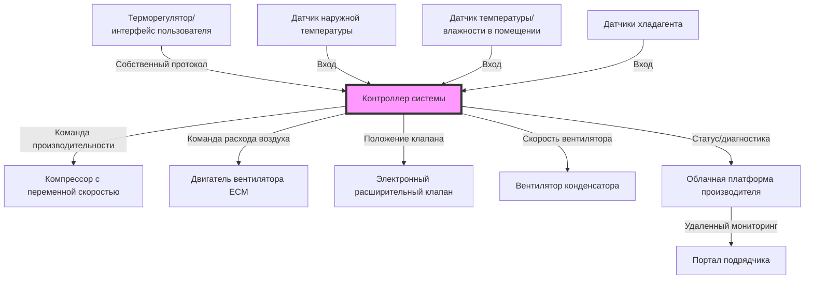

## Обзор

Сертификации производителей представляют учетные данные, специфичные для конкретных продуктов, которые подтверждают компетентность подрядчика в установке, обслуживании и ремонте оборудования конкретных марок. В отличие от отраслевых сертификаций (NATE, EPA), программы производителей сосредоточены на собственных конструкциях систем, процедурах диагностики, последовательности управления и требованиях соответствия гарантии, специфичных для отдельных линеек оборудования.

Эти программы служат двойной цели: обеспечение надлежащей установки и обслуживания оборудования при одновременном создании маркетингового дифференцирования для сертифицированных подрядчиков. Производители значительно инвестируют в инфраструктуру обучения для снижения гарантийных требований, повышения удовлетворенности клиентов и укрепления лояльности подрядчиков на конкурентных рынках.

## Структура сертификации и уровни

### Уровни авторизации дилеров

Большинство производителей используют многоуровневые структуры сертификации, которые вознаграждают более высокие показатели расширенными преимуществами и правами исключительности.

**Дилер начального уровня**
- Завершено базовое обучение знанию продуктов
- Выполнены минимальные требования по объему продаж
- Проверена общая ответственность и страховка компенсации работникам
- Сертификация EPA Раздел 608 для всех техников
- Стандартная обработка гарантийных требований

**Предпочтительный/Премиум дилер**
- Завершено расширенное обучение по нескольким линейкам продуктов
- Достигнуты более высокие пороги годового объема продаж
- Показатели удовлетворенности клиентов, превышающие эталоны производителя
- Выполнены требования по запасам товарно-материальных ценностей
- Доступны расширенные гарантийные предложения

**Элитный/авторизованный заводом дилер**
- Комплексное обучение по полному портфелю продуктов
- Значительное присутствие на рынке и показатели продаж
- На штатных должностях аттестованные техники-специалисты
- Приоритетный доступ к технической поддержке
- Участие в фонде совместного маркетинга
- Эксклюзивный доступ к продуктам (продвинутое оборудование, бета-программы)

### Программы производителей

| Производитель | Название программы | Ключевые требования |
|--------------|--------------|-----------------|
| Carrier | Factory Authorized Dealer | Обучение системе Infinity, минимальная квота продаж, рейтинги удовлетворенности клиентов |
| Trane | Comfort Specialist | Обучение коммуникационным системам управления, сертификация анализа комфорта |
| Lennox | Premier Dealer | Сертификация системы PureComfort, опытность с диагностическими инструментами |
| York | Affinity Dealer | Обучение серии Affinity, онлайн сертификация |
| Mitsubishi Electric | Diamond Contractor | Сертификация установки бесканальной системы, стандарты производительности |
| Daikin | Comfort Pro | Обучение VRV/VRF, сертификация технологии инвертора |
| Bosch | Certified Installer | Обучение проектированию и установке геотермальных систем |
| Rheem | Pro Partner | Сертификация технологии тепловых насосов, стандарты обслуживания клиентов |

## Требования к обучению и техническое содержание

### Применение цикла охлаждения

Производственное обучение подчеркивает специфичные для бренда конструкции контуров хладагента и рабочие характеристики, которые отклоняются от принципов парокомпрессионной системы.

**Технология модуляции производительности**

Работа компрессора с переменной скоростью принципиально изменяет традиционный анализ охлаждения. Для спиральных компрессоров с приводом от инвертора производительность изменяется в зависимости от частоты двигателя:

$$Q_{cooling} = \dot{m}_{ref} \cdot (h_{evap,out} - h_{evap,in}) \cdot \frac{f_{actual}}{f_{rated}}$$

Где:
- $Q_{cooling}$ = мгновенная производительность охлаждения (кДж/ч)
- $\dot{m}_{ref}$ = массовый расход хладагента при номинальных условиях (кг/ч)
- $h_{evap,out}$ = энтальпия на выходе испарителя (кДж/кг)
- $h_{evap,in}$ = энтальпия на входе испарителя (кДж/кг)
- $f_{actual}$ = фактическая частота компрессора (Гц)
- $f_{rated}$ = номинальная частота компрессора (Гц)

Обучение охватывает взаимосвязь между модуляцией частоты, коэффициентом сжатия и коэффициентом производительности в диапазонах работы.

### Архитектура систем управления

Современные коммуникационные системы требуют понимания собственных протоколов связи и логики управления.

Программы обучения учат техников ориентироваться в диагностических интерфейсах производителя, интерпретировать коды ошибок, уникальные для каждой платформы, и понимать алгоритмы управления, управляющие работой системы.

### Оптимизация теплопередачи

Конструкции теплообменников конкретного оборудования влияют на процедуры установки и обслуживания.

**Микроканальные конденсаторы**

Алюминиевые микроканальные теплообменники, используемые несколькими производителями, требуют модифицированных подходов обслуживания по сравнению с традиционными конструкциями с медными трубками и алюминиевыми ребрами:

$$\frac{1}{UA_{overall}} = \frac{1}{h_i A_i} + \frac{t_{wall}}{k_{Al} A_{wall}} + \frac{1}{h_o A_o}$$

Где:
- $UA_{overall}$ = общий коэффициент теплопередачи на единицу площади (кДж/ч·К)
- $h_i$ = коэффициент теплопередачи со стороны хладагента (кДж/ч·м²·К)
- $A_i$ = внутренняя площадь поверхности (м²)
- $t_{wall}$ = толщина стенки (м)
- $k_{Al}$ = коэффициент теплопроводности алюминия (кДж/ч·м·К)
- $h_o$ = коэффициент теплопередачи со стороны воздуха (кДж/ч·м²·К)
- $A_o$ = внешняя площадь поверхности (м²)

Производственное обучение рассматривает ограничения пайки, проблемы обнаружения утечек и процедуры очистки, специфичные для геометрии микроканалов.

## Диагностические инструменты и оборудование

### Собственные диагностические платформы производителя

Каждый крупный производитель предоставляет собственные диагностические инструменты, которые взаимодействуют с его оборудованием.

**Категории инструментов**
- Переносные анализаторы систем (проводное и беспроводное подключение)
- Программное обеспечение для диагностики на основе ноутбука
- Приложения для смартфонов с подключением Bluetooth/WiFi
- Облачные платформы удаленного мониторинга
- Калькуляторы заполнения хладагента и анализаторы перегрева/переохлаждения

**Компетентности при обучении**
- Загрузка и интерпретация данных работы системы
- Доступ к истории ошибок и библиотекам кодов ошибок
- Выполнение тестов принудительной работы для проверки компонентов
- Обновление прошивки платы управления
- Настройка параметров системы и параметров переключателя DIP

### Измерение и проверка расхода воздуха

Программы обучения подчеркивают методы измерения расхода воздуха, совместимые со стандартом ASHRAE 37-2009, адаптированные к конкретным конфигурациям оборудования.

**Метод повышения температуры для отопления**

$$\text{м³/ч} = \frac{Q_{input} \cdot \eta_{AFUE}}{1.2 \cdot \Delta T}$$

Где:
- м³/ч = расход воздуха (м³/ч)
- $Q_{input}$ = номинальный ввод печи (кДж/ч)
- $\eta_{AFUE}$ = годовая эффективность использования топлива (десятичная дробь)
- $\Delta T$ = повышение температуры через печь (°C)
- $1.2$ = константа для свойств воздуха (кДж/м³·К)

Производители определяют приемлемые диапазоны повышения температуры для своего оборудования, и программы сертификации проверяют способность техника измерять и регулировать расход воздуха в соответствии со спецификациями.

## Авторизация гарантии и соответствие требованиям

### Программы трудовых гарантий

Производители все чаще предлагают охрану труда сертифицированным дилерам, перелагая финансовый риск с подрядчиков при обеспечении квалифицированной установки и обслуживания.

**Требования авторизации**
- Документированное завершение обучения установке
- Подтверждение надлежащих процедур запуска (фотографии, отчеты ввода в эксплуатацию)
- Регистрация оборудования в установленный срок
- Использование одобренных производителем материалов установки
- Соответствие спецификациям руководства по установке

### Показатели производительности

Многие программы включают показатели производительности, которые влияют на статус сертификации:

| Показатель | Период измерения | Типичный порог |
|--------|-------------------|-------------------|
| Коэффициент повторного обращения | Скользящие 12 месяцев | < 3% установок |
| Коэффициент гарантийных требований | Годовой | < отраслевой средний показатель |
| Удовлетворенность клиентов | За транзакцию | > 4,5/5,0 в среднем |
| Регистрация оборудования | При установке | > 90% соответствие |
| Эскалации технической поддержки | Ежеквартально | Требуется тренд снижения |

Несоблюдение метрик может привести к понижению сертификации или отзыву.

## Обучение передовым технологиям

### Системы с переменным расходом хладагента

Сертификация VRF/VRV требует понимания распределения хладагента на несколько внутренних блоков от общей наружной системы.

**Проектирование трубопроводов хладагента**

Требования минимальной скорости возврата масла управляют выбором размера трубопровода в установках VRF:

$$v_{min} = \sqrt{\frac{2 \cdot \Delta P}{\rho_{vapor}}}$$

Где:
- $v_{min}$ = минимальная скорость хладагента для увлечения масла (м/ч)
- $\Delta P$ = потеря давления вдоль сегмента трубопровода (кПа)
- $\rho_{vapor}$ = плотность пара хладагента (кг/м³)

Производители определяют минимальные скорости (обычно 2,5-3,0 м/с в вертикальных восходящих потоках) и предоставляют собственное программное обеспечение для проектирования трубопроводов, которым должны овладеть сертифицированные подрядчики.

### Геотермальные системы тепловых насосов

Сертификация по геотермальным тепловым насосам охватывает проектирование замкнутого контура, выбор теплоносителя и ввод системы в эксплуатацию.

**Определение размера теплообменника замкнутого контура**

Требуемая длина контура зависит от тепловых свойств грунта и нагрузок здания:

$$L_{loop} = \frac{Q_{peak}}{q_{effective}}$$

Где:
- $L_{loop}$ = требуемая общая длина контура (м)
- $Q_{peak}$ = пиковая нагрузка здания (кДж/ч)
- $q_{effective}$ = эффективная теплопередача на единицу длины контура (кДж/ч·м)

Производители, такие как Bosch и WaterFurnace, предоставляют требования по испытаниям теплопроводности грунта и программы сертификации проектирования контура, специфичные для спецификаций их оборудования.

## Маркетинговые и деловые преимущества

### Поддержка совместного маркетинга

Сертифицированные дилеры получают маркетинговые ресурсы и финансовую поддержку:

- Права использования логотипа в рекламе и графике на автомобилях
- Средства совместной рекламы (обычно 1-3% закупок оборудования)
- Генерация потенциальных клиентов через локаторы подрядчиков веб-сайта производителя
- Рекламные материалы в месте продажи и экспонаты в выставочных залах
- Цифровые маркетинговые активы (графика в социальных сетях, шаблоны электронной почты)

### Конкурентное дифференцирование

Исследования рынка указывают на предпочтение потребителей сертифицированными подрядчиками производителей:

- На 34% выше коэффициент успеха при продаже систем замены
- Принятие 12-18% премии на цену за сертифицированную установку
- Повышенная credibility при конкурентных торгах
- Доступ к программам финансирования с благоприятными условиями
- Приоритетное расписание для выделения оборудования во время дефицита

## Повышение квалификации и переаттестация

### Требования к годовому обучению

Большинство программ производителей требуют постоянного обучения для поддержания статуса сертификации:

**Онлайн-модули обучения**
- Представление новых продуктов (завершено в течение 90 дней после запуска)
- Семинары по обновлению кодов (NEC, IMC ревизии)
- Переподготовка по безопасности (блокировка/маркировка, обработка хладагента)
- Развитие обслуживания клиентов и техники продаж

**Очные тренировочные события**
- Региональные учебные сессии на объектах производителя
- Ежегодные встречи дилеров с техническими секциями
- Мероприятия запуска оборудования с практическим обучением
- Продвинутые диагностические мастер-классы

### Циклы обновления технологий

Быстрое развитие оборудования требует непрерывного обучения:

- Переходы хладагента (R-410A на R-32, R-454B)
- Функции подключения (интеграция IoT, совместимость со смарт-домом)
- Изменения нормативных требований к эффективности (минимальные стандарты эффективности DOE)
- Обновления алгоритмов управления, требующие управления прошивкой

## Заключение

Сертификации производителей обеспечивают специализированные знания о продуктах, дополняющие отраслевые стандартные учетные данные. Комбинация технического обучения, опытности с диагностическими инструментами и авторизации гарантии создает конкурентные преимущества для подрядчиков при обеспечении того, чтобы клиенты получали квалифицированное обслуживание на сложных системах оборудования. Успех в программах производителей требует приверженности постоянному образованию, достижению показателей производительности и соответствию бизнес-целям производителя.

## Категории сертификации

- [Carrier Factory Authorized Dealer](./carrier-factory-authorized/)
- [Trane Comfort Specialist](./trane-comfort-specialist/)
- [Lennox Premier Dealer](./lennox-premier-dealer/)
- [York Affinity Dealer](./york-affinity-dealer/)
- [Mitsubishi Diamond Contractor](./mitsubishi-diamond-contractor/)
- [Daikin Comfort Pro](./daikin-comfort-pro/)
- [Bosch Certified Installer](./bosch-geothermal-installer/)
- [Manufacturer Product Training](./manufacturer-product-training/)
- [Warranty Service Authorization](./warranty-service-authorization/)
- [Advanced Diagnostics Training](./advanced-diagnostics-training/)
