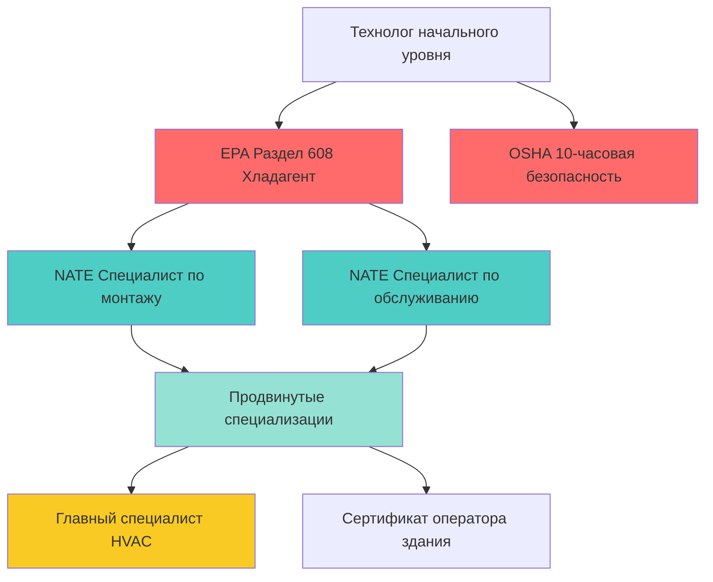
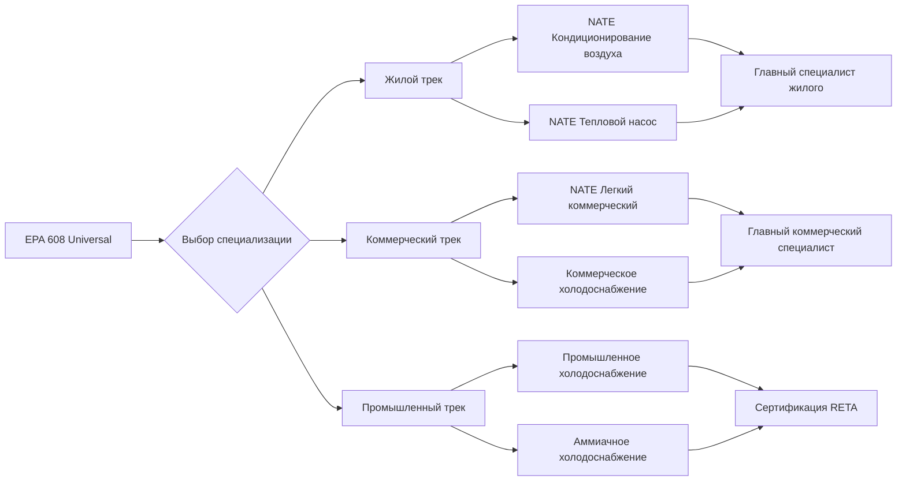

# Сертификация специалистов HVAC

Программы профессиональной сертификации устанавливают стандарты компетентности для специалистов HVAC по монтажу, обслуживанию и диагностике. Эти учетные данные подтверждают технические знания в термодинамике, электрических системах, циклах холодоснабжения и протоколах безопасности, необходимых для полевых операций.

## Структура основы сертификации

Сертификация специалистов HVAC следует иерархическому прогрессированию в зависимости от сложности навыков и нормативных требований. Основа отделяет обязательную сертификацию соответствия от добровольных учетных данных совершенства.

## Нормативные и добровольные сертификации

Ландшафт сертификации разделяется на юридически обязательные учетные данные и программы совершенства на основе производительности:

| Тип сертификации | Нормативный статус | Область | Период обновления |
|-------------------|-------------------|---------|-------------------|
| EPA Раздел 608 | Федерально требуется | Обращение с хладагентом | Пожизненно (без обновления) |
| EPA Раздел 609 | Федерально требуется | Системы кондиционирования мобильных | Пожизненно (без обновления) |
| Сертификация NATE | Добровольная | Техническая компетентность | 2 года |
| HVAC Excellence | Добровольная | Оценка знаний | 2 года |
| Лицензия подрядчика штата | Зависит от штата | Деловые операции | 1–3 года (варьируется) |
| Карточки безопасности OSHA | Отраслевой стандарт | Безопасность на рабочем месте | 5 лет (10-часовая), 3 года (30-часовая) |

## Основные области компетентности

Сертификация технолога оценивает владение фундаментальными дисциплинами HVAC:

### Мастерство цикла холодоснабжения

Понимание холодильного цикла с компрессией пара требует количественного анализа термодинамических точек состояния. Коэффициент производительности (COP) определяет эффективность системы:

$$COP_{охлаждение} = \frac{Q_L}{W_{комп}} = \frac{h_1 - h_4}{h_2 - h_1}$$

Где:
- $Q_L$ = холодопроизводительность (кВт)
- $W_{комп}$ = работа компрессора (кВт)
- $h_1, h_2, h_4$ = энтальпия хладагента на выходе испарителя, на выходе компрессора и на входе расширительного клапана (кДж/кг)

Экзамены технолога проверяют расчеты перегрева и переохлаждения для проверки правильного заряда хладагента. Для прямой системы расширения:

$$Перегрев = T_{всасывание} - T_{насыщение,испаритель}$$

$$Переохлаждение = T_{насыщение,конденсатор} - T_{жидкость}$$

Правильный заряд хладагента поддерживает перегрев между 4,4–6,7 °C для систем с фиксированным отверстием и 2,8–4,4 °C для систем с термостатическим расширительным клапаном (TXV) в соответствии со спецификациями производителя.

### Электрическая диагностика

Сертификация электрического устранения неисправностей проверяет применение закона Ома и расчеты мощности. Для трехфазных двигателей компрессора:

$$P_{3ф} = \sqrt{3} \times V_{Л-Л} \times I_Л \times PF$$

Где:
- $P_{3ф}$ = трехфазная мощность (ватты)
- $V_{Л-Л}$ = напряжение между фазами (вольты)
- $I_Л$ = линейный ток (амперы)
- $PF$ = коэффициент мощности (безразмерный, обычно 0,85–0,95)

Технологи должны интерпретировать данные паспортной таблички двигателя и применять требования NEC статьи 440 для выбора размера защиты от перегрузки по току.

### Поток воздуха и психрометрия

Программы сертификации оценивают измерение статического давления и расчеты расхода воздуха. Полное внешнее статическое давление (TESP) определяет производительность вентилятора:

$$TESP = SP_{подача} + SP_{возврат}$$

Для жилых систем ASHRAE рекомендует максимальное TESP 124,7 Па для стандартной эффективности и 199,5 Па для высокоэффективного оборудования.

Расчеты коэффициента чувствительного тепла (SHR) проверяют производительность осушения:

$$SHR = \frac{Q_{чувствительное}}{Q_{чувствительное} + Q_{скрытое}}$$

Типичные жилые приложения охлаждения требуют SHR между 0,70–0,80 для поддержания 40–60% относительной влажности во влажном климате.

## Пути развития сертификации

Профессиональное развитие следует специализированным трекам в зависимости от области деятельности технолога:

## Тестирование предметных знаний

Экзамены сертификации оценивают теоретическое понимание и практическое применение:

### Компетентность в монтаже
- Методология расчета тепловой нагрузки (ACCA Manual J)
- Принципы проектирования воздуховодов (ACCA Manual D)
- Определение размера линий хладагента в соответствии со стандартом ASHRAE 15
- Анализ горения и требования вентиляции
- Определение размера электроснабжения и размещение отключающих устройств

### Компетентность в обслуживании
- Систематические процедуры устранения неисправностей
- Методики заправки хладагентом (перегрев, переохлаждение, приближение)
- Измерение и регулировка расхода воздуха
- Проверка последовательности управления
- Тестирование производительности и документирование

### Протоколы безопасности
- Обращение с хладагентом в соответствии с нормативами EPA
- Электробезопасность и процедуры блокировки/бирки
- Требования входа в замкнутые пространства
- Выбор средств индивидуальной защиты (СИЗ)
- Идентификация опасных материалов и действия в чрезвычайных ситуациях

## Требования к повышению квалификации

Большинство добровольных сертификаций требуют постоянного технического образования для сохранения действительности учетных данных. NATE требует 12 часов повышения квалификации (CEU) за цикл обновления с основной направленностью на:

- Появляющиеся технологии и нормативы хладагентов
- Продвинутые методики диагностики
- Оптимизация энергоэффективности
- Улучшения качества воздуха в помещении
- Интеграция интеллектуального управления

## Экономическая стоимость сертификации

Данные отрасли демонстрируют измеримую надбавку к заработной плате для сертифицированных специалистов:

| Уровень сертификации | Среднее увеличение зарплаты | Влияние на карьеру |
|----------------------|------------------------------|-------------------|
| Только EPA 608 | Базовый уровень | Позиции начального уровня |
| EPA + NATE (1 специализация) | +12–18% | Роли главного технолога |
| Несколько специализаций NATE | +22–28% | Старший специалист, супервизор |
| Уровень мастерства | +35–45% | Технический специалист, инструктор |

Сертифицированные технологи сообщают о более высоких показателях трудоустройства, сокращении гарантийных отказов и повышении оценок удовлетворенности клиентов по сравнению с некертифицированными коллегами.

## Справочные материалы стандартов

Программы сертификации соответствуют отраслевым стандартам, включая:
- ASHRAE Standard 15: Стандарт безопасности для холодильных систем
- ASHRAE Standard 62.1/62.2: Вентиляция для приемлемого качества воздуха в помещениях
- Стандарты качества установки ACCA
- NEC статья 440: Оборудование для кондиционирования и холодоснабжения
- International Mechanical Code (IMC) Глава 3: Общие нормативы

Профессиональная сертификация устанавливает минимальные базовые уровни компетентности, одновременно поощряя непрерывное техническое развитие на протяжении всей карьеры в HVAC.
