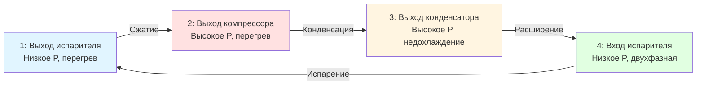
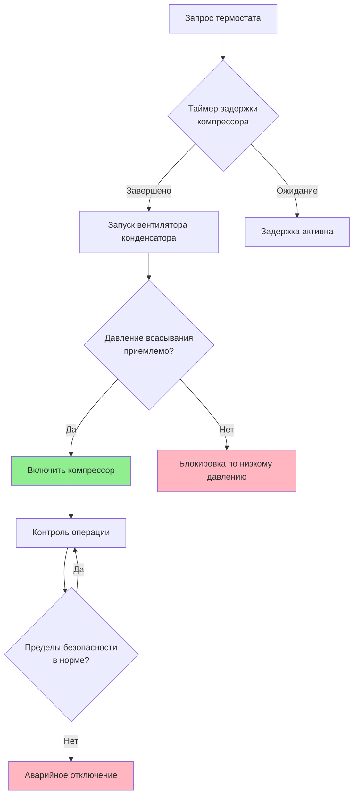

## Обзор сертификации RSES

Общество инженеров холодильных систем (RSES) предоставляет признанные в отрасли сертификации, подтверждающие техническую компетентность в холодильных и HVAC системах. Сертификации RSES охватывают комплексную теорию холодильной техники, анализ систем и практические навыки поиска и устранения неисправностей, необходимые для профессиональных техников.

RSES предлагает несколько уровней сертификации, начиная от начальных квалификаций техников и заканчивая присвоением звания главного специалиста, каждый из которых требует подтвержденного знания принципов термодинамики, электрических систем и механических компонентов.

## Уровни сертификации и требования

### Сертифицированный техник холодильных систем (CRST)

Начальная сертификация, подтверждающая фундаментальные знания холодильной техники:

- Термодинамика холодильного цикла
- Идентификация и функции компонентов
- Базовые электрические цепи и системы управления
- Процедуры безопасности и нормативы EPA
- Процедуры зарядки и вакуумирования систем

### Сертифицированный техник отопления и кондиционирования воздуха (CHACT)

Сосредоточена на компетентности в системах отопления и охлаждения:

- Работа и поиск неисправностей тепловых насосов
- Анализ сгорания топливных нагревателей
- Проектирование систем распределения воздуха
- Психрометрические расчеты
- Оптимизация энергоэффективности

### Сертифицированный проектировщик HVAC (CHD)

Продвинутая сертификация для специалистов по проектированию систем:

- Методологии расчета тепловых нагрузок согласно стандартам ASHRAE
- Выбор и подбор оборудования
- Проектирование воздуховодов и трубопроводных систем
- Энергетическое моделирование и анализ
- Проверка соответствия нормативным требованиям

### Сертифицированный мастер-техник по обслуживанию (CMST)

Наивысший уровень технической сертификации, требующий:

- Комплексную диагностику систем
- Сложные сценарии поиска и устранения неисправностей
- Продвинутые применения холодильной техники
- Компетенции в надзоре и обучении
- 5 и более лет документированного опыта работы в полевых условиях

## Термодинамика холодильного цикла

Программы сертификации RSES подчеркивают фундаментальные принципы термодинамики, которые управляют парокомпрессионными холодильными системами.

### Уравнения энергетического баланса

Холодильный эффект представляет теплоту, поглощаемую в испарителе:

$$Q_e = \dot{m} \cdot (h_1 - h_4)$$

Где:
- $Q_e$ = холодопроизводительность (кВт)
- $\dot{m}$ = массовый расход хладагента (кг/с)
- $h_1$ = энтальпия на выходе испарителя (кДж/кг)
- $h_4$ = энтальпия на входе испарителя (кДж/кг)

Работа компрессора:

$$W_{comp} = \dot{m} \cdot (h_2 - h_1)$$

Коэффициент производительности:

$$COP = \frac{Q_e}{W_{comp}} = \frac{h_1 - h_4}{h_2 - h_1}$$

### Зависимости давления и энтальпии

Анализ холодильного цикла использует диаграммы давление-энтальпия для визуализации переходов точек состояния:

## Анализ компонентов системы

### Производительность компрессора

Производительность компрессора изменяется в зависимости от условий эксплуатации согласно:

$$\dot{Q}_{actual} = \dot{Q}_{rated} \cdot \left(\frac{P_{evap,actual}}{P_{evap,rated}}\right)^{0.75} \cdot \left(\frac{P_{cond,rated}}{P_{cond,actual}}\right)^{0.25}$$

Объемная эффективность снижается с увеличением степени сжатия:

$$\eta_v = 1 - C \cdot \left(\frac{P_{discharge}}{P_{suction}} - 1\right)$$

Где $C$ — процент объема мертвого пространства.

### Подбор устройства расширения

Производительность терморегулирующего вентиля:

$$\dot{m} = C \cdot A \cdot \sqrt{\rho \cdot \Delta P}$$

Где:
- $C$ = коэффициент расхода
- $A$ = площадь проходного отверстия вентиля (м²)
- $\rho$ = плотность хладагента (кг/м³)
- $\Delta P$ = перепад давления (Па)

## Сравнение сертификаций

| Сертификация | Область специализации | Требуемый опыт | Формат экзамена | Период переаттестации |
|--------------|----------------------|-----------------|-----------------|----------------------|
| CRST | Основы холодильной техники | 0-2 года | Письменный | 3 года |
| CHACT | Отопление/охлаждение | 2+ года | Письменный + практический | 3 года |
| CHD | Проектирование систем | 3+ года | Письменный + проект | 3 года |
| CMST | Мастер-техник | 5+ лет | Комплексный | 3 года |

## Электрические системы и управление

### Анализ трехфазной электросети

Общее потребление энергии коммерческого оборудования:

$$P_{total} = \sqrt{3} \cdot V_{line} \cdot I_{line} \cdot PF \cdot \eta$$

Где:
- $V_{line}$ = напряжение сети (В)
- $I_{line}$ = ток сети (А)
- $PF$ = коэффициент мощности
- $\eta$ = КПД двигателя

### Основы логики управления

## Методологии поиска и устранения неисправностей

### Систематический подход к диагностике

Обучение RSES подчеркивает методичные процедуры поиска и устранения неисправностей:

1. **Проверка симптомов** — подтверждение заявленной проблемы путем измерения
2. **Наблюдение системы** — проверка условий эксплуатации и параметров
3. **Изоляция компонентов** — систематическое тестирование отдельных компонентов
4. **Анализ коренной причины** — определение основного механизма отказа
5. **Корректирующее действие** — внедрение ремонта и проверка разрешения

### Анализ перегрева и недохлаждения

Надлежащая проверка зарядки хладагента:

$$\text{Перегрев} = T_{suction} - T_{sat,evap}$$

$$\text{Недохлаждение} = T_{sat,cond} - T_{liquid}$$

Целевые значения варьируются в зависимости от типа системы и условий окружающей среды согласно спецификациям производителя.

## Соответствие стандартам ASHRAE

Содержание сертификации RSES согласуется с ключевыми стандартами ASHRAE:

- **ASHRAE 15** — стандарт безопасности для холодильных систем
- **ASHRAE 34** — обозначение и классификация безопасности хладагентов
- **ASHRAE 62.1** — вентиляция для приемлемого качества внутреннего воздуха
- **ASHRAE 147** — снижение выбросов галогенированных хладагентов

## Преимущества профессионального развития

Сертификация RSES обеспечивает измеримые карьерные преимущества:

- Повышенная валидация технической компетентности
- Увеличение потенциала заработка (премия 15-25%)
- Возможности профессионального сетевого взаимодействия
- Доступ к ресурсам непрерывного образования
- Признание в отрасли и авторитет
- Конкурентное преимущество на рынке труда

Поддержание сертификации требует постоянного образования через программы обучения RSES, курсы производителей и семинары отрасли для поддержания актуального знания развивающихся технологий и требований нормативных документов.

## Стратегия подготовки к экзамену

Эффективная подготовка включает:

- Тщательное изучение учебных материалов RSES
- Практику анализа диаграмм давление-энтальпия
- Повторение процедур устранения неисправностей электрических цепей
- Освоение применения психрометрических диаграмм
- Выполнение пробных экзаменов в условиях ограничения времени
- Участие в практических занятиях
- Присоединение к учебным группам RSES для совместного обучения

Сертификации RSES представляют комплексные технические знания, проверенные путем строгих экзаменов, устанавливая профессиональные квалификации, признаваемые во всей отрасли HVAC.
