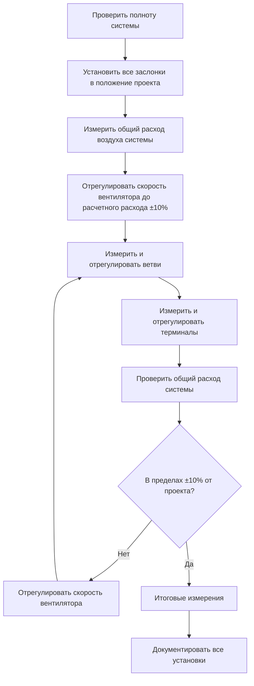

Сертификация Testing, Adjusting, and Balancing Bureau (TABB) представляет профессиональный стандарт для подтверждения компетентности в проверке производительности систем HVAC. Сертифицированные специалисты TABB обеспечивают работу систем в соответствии со спецификациями проекта посредством систематических процедур измерения, регулировки и документирования. Эта сертификация выделяет специалистов, обладающих как теоретическими знаниями, так и практическими навыками работы в балансировке воздушных и гидравлических систем.

## Структура сертификации TABB

TABB предлагает многоуровневую систему сертификации, признающую прогрессивные уровни опыта и ответственности в операциях тестирования и балансировки.

### TABB Certified Technician (TCT)

Начальный уровень сертификации для техников, выполняющих полевые измерения и регулировки под наблюдением. Сертификация TCT подтверждает компетентность в:

- **Эксплуатация приборов**: Надлежащее использование манометров, трубок Пито, анемометров, счетчиков расхода гидравлических систем и звукомеров
- **Процедуры измерения**: Обход воздуховодов, измерение перепадов давления на змеевиках и запись данных производительности системы
- **Регулировка системы**: Позиционирование заслонок, регулировка балансировочных клапанов и изменение скорости вентилятора
- **Запись данных**: Точное документирование полевых измерений и условий системы
- **Протоколы безопасности**: Осведомленность о входе в ограниченное пространство, защите от падения и электробезопасности

Кандидаты TCT должны продемонстрировать профессионализм в методах полевого измерения путем практического экзамена и письменного тестирования, охватывающего фундаментальные принципы.

### TABB Certified Supervisor (TCS)

Продвинутая сертификация для специалистов, которые планируют, контролируют и сертифицируют проекты тестирования и балансировки. Сертификация TCS требует:

- **Управление проектом**: Планирование полевых работ, распределение ресурсов персонала и координация со строительными командами
- **Подготовка отчетов**: Составление подробных отчетов TAB с измеренными данными производительности и сертификационными заявлениями
- **Обеспечение качества**: Проверка работы техников, проверка точности измерений и обеспечение соответствия процедурам
- **Диагностика проблем**: Выявление дефектов системы, рекомендация корректирующих мер и проверка ремонта
- **Коммуникация с клиентом**: Объяснение результатов тестирования, обсуждение проблем производительности системы и представление выводов

Кандидаты TCS должны иметь сертификацию TCT и продемонстрировать минимальный опыт работы (обычно 3-5 лет) в операциях тестирования и балансировки.

## Технические компетенции

### Балансировка воздушных систем

Балансировка воздушных систем обеспечивает, чтобы каждое помещение получало расчетный расход воздуха посредством систематических процедур измерения и регулировки.

**Методы измерения расхода воздуха**

| Метод | Применение | Точность | Оборудование |
|--------|-------------|----------|-----------|
| Траверс трубки Пито | Основные воздуховоды и ветви | ±5% с надлежащей техникой | Трубка Пито, манометр, позиции траверса согласно ASHRAE 111 |
| Колпак для измерения расхода | Диффузоры и решетки | ±10% | Калиброванный колпак для захвата расхода |
| Анемометр с лопастями | Большие решетки, жалюзи | ±5-10% | Вращающийся анемометр или термический анемометр |
| Анемометр с горячей нитью | Приложения с низкой скоростью | ±3% в диапазоне калибровки | Термический анемометр |

**Расчеты траверса воздуховода**

Скоростное давление в каждой точке траверса преобразуется в скорость:

$$V = 1223 \sqrt{\frac{VP}{\rho}}$$

Где:
- $V$ = скорость (м/с)
- $VP$ = скоростное давление (Па)
- $\rho$ = плотность воздуха (кг/м³)

Средняя скорость в поперечном сечении воздуховода, умноженная на площадь, дает объемный расход:

$$Q = V_{avg} \times A$$

Стандартная плотность (1,2 кг/м³ на уровне моря, 21°C) упрощает до:

$$V = 1223 \sqrt{VP}$$

**Последовательность балансировки**

### Балансировка гидравлических систем

Балансировка гидравлических систем обеспечивает надлежащее распределение потока через оборудование водяной стороны с использованием калиброванных балансировочных клапанов и приборов для измерения расхода.

**Методы измерения расхода**

Балансировочные клапаны с калиброванными кривыми перепада давления позволяют проводить неинвазивные измерения расхода. Разность давлений на клапане связана с расходом через графики производителя или формулы:

$$Q = C_v \sqrt{\frac{\Delta P}{SG}}$$

Где:
- $Q$ = расход (л/мин)
- $C_v$ = коэффициент расхода при положении клапана
- $\Delta P$ = перепад давления на клапане (кПа)
- $SG$ = удельный вес (безразмерный, вода = 1,0)

**Проверка методом температуры**

Расчеты баланса энергии проверяют измеренные расходы с использованием дифференциала температуры и скорости передачи тепла:

$$Q = \frac{\dot{Q}}{4186 \times \Delta T}$$

Где:
- $Q$ = расход (л/мин)
- $\dot{Q}$ = скорость передачи тепла (кДж/ч)
- $\Delta T$ = разность температур на входе и выходе (°C)
- 4186 = константа (удельная теплоемкость × плотность × преобразования единиц)

**Метод пропорциональной балансировки**

Системы балансируются с использованием пропорционального распределения потока:

1. Измерить расходы всех цепей при полностью открытых клапанах
2. Вычислить коэффициенты проектного расхода для всех цепей
3. Дросселировать цепь с наибольшим расходом до проектного расхода
4. Отрегулировать остальные цепи пропорционально
5. Проверить, что общий системный расход равен расчетному
6. Точно настроить отдельные цепи до ±10% от проекта

### Тестирование звука и вибрации

Сертифицированные специалисты TABB выполняют акустические измерения для проверки соответствия критериям проекта и выявления источников механического шума.

**Измерения уровня звука**

| Параметр | Стандарт измерения | Целевые критерии |
|-----------|---------------------|-----------------|
| Фоновая NC | ASHRAE 111 Раздел 7 | По справочнику приложений ASHRAE |
| Акустическая мощность оборудования | AHRI 260/AHRI 370 | Рейтинги производителя ±3 дБ |
| Уровни NC в помещении | ASTM E1574 | Кривые проекта NC ±2 NC |
| Разрыв входящий/исходящий | ASTM E477 | Затухание согласно проекту |

**Анализ вибрации**

Измерения вибрации выявляют механические проблемы до отказа компонента:

- **Смещение**: Общее расстояние движения (мкм пик-пик)
- **Скорость**: Скорость вибрации (мм/с RMS)
- **Ускорение**: Скорость изменения скорости (g)

Измерения скорости вибрации обеспечивают оптимальную диагностическую информацию в широком диапазоне скоростей типового оборудования HVAC (600-3600 об/мин). Графики серьезности вибрации (ISO 10816) устанавливают приемлемые пределы на основе типа оборудования и способа крепления.

## Требования к сертификации

### Образование и опыт

**TABB Certified Technician:**
- Аттестат о среднем образовании или эквивалент
- Окончание учебного курса техника TABB (40 часов)
- 6 месяцев опыта полевых работ в операциях тестирования и балансировки
- Проходной балл на письменных и практических экзаменах

**TABB Certified Supervisor:**
- Сертификация TCT в хорошем статусе
- 3 года документированного опыта работы в качестве техника тестирования и балансировки
- Окончание учебного курса супервизора TABB (40 часов)
- Проходной балл на комплексном письменном экзамене
- Представление примера отчета TAB, демонстрирующего профессиональную компетентность

### Содержание экзамена

**Темы письменного экзамена:**
- Основы психрометрики и термодинамики
- Принципы механики жидкостей, применяемые к системам HVAC
- Теория приборизации и требования к калибровке
- ASHRAE Standard 111 (Полевое тестирование систем HVAC)
- Типы систем: VAV, CAV, управление DDC, первичная-вторичная закачка
- Стандарты документирования отчетов
- Профессиональная этика и деловая практика

**Практический экзамен (только TCT):**
- Траверс трубки Пито прямоугольных и круглых воздуховодов
- Измерения колпаком расхода в точках подачи и возврата
- Регулировка балансировочного клапана и измерение расхода
- Измерения температуры и давления
- Проверка калибровки прибора
- Точность записи и расчета данных

## Отраслевые стандарты и ссылки

Процедуры TABB соответствуют установленным отраслевым стандартам:

- **ASHRAE Standard 111**: Методы тестирования для определения характеристик и балансировки систем HVAC
- **ASHRAE Standard 62.1**: Вентиляция для приемлемого качества воздуха в помещении (проверка подачи наружного воздуха)
- **NEBB Procedural Standards**: Тестирование, регулировка и балансировка систем окружающей среды
- **AABC National Standards**: Требования Associated Air Balance Council
- **SMACNA HVAC Systems Testing**: Руководство по регулировке и балансировке

## Продолжение профессионального развития

**Требования переаттестации:**
- Обновление сертификации каждые 5 лет
- 40 часов непрерывного образования в период обновления
- Активная работа в области тестирования и балансировки
- Ведение страховки профессиональной ответственности (TCS)
- Соответствие Кодексу этики TABB

**Темы непрерывного образования:**
- Передовые методы измерения и приборизация
- Интеграция систем автоматизации зданий
- Участие в процессе ввода в эксплуатацию и документирование
- Проверка энергоэффективности и измерение
- Новые технологии HVAC (системы преданного наружного воздуха, радиантные системы, вытесняющая вентиляция)

## Профессиональная практика

### Последовательность выполнения проекта

Успешные проекты TAB следуют систематическим процедурам от мобилизации до сертификации:

1. **Предстартовая конференция**: Изучение документов проекта, выявление особых требований, координация графиков доступа
2. **Проверка системы**: Подтверждение полноты установки оборудования, функциональности управления и безопасной работы
3. **Предварительные измерения**: Документирование исходных условий перед регулировками
4. **Процедуры балансировки**: Выполнение систематической балансировки воздуха и воды согласно ASHRAE 111
5. **Отчет о дефектах**: Документирование дефектов системы, препятствующих достижению проектной производительности
6. **Окончательное тестирование**: Проверка исправленных систем на соответствие спецификациям проекта
7. **Подготовка отчета**: Составление подробной документации с сертификационными заявлениями
8. **Обучение владельца**: Объяснение эксплуатации системы, процедур регулировки и требований обслуживания

### Оборудование и приборизация

Сертифицированные специалисты TABB используют калиброванную приборизацию с прослеживаемостью к стандартам NIST. Ежегодная калибровка обеспечивает точность измерений:

**Требуемые приборы:**
- Трубки Пито (стандартные и усредняющие типы)
- Датчики дифференциального давления (0-1250 Па минимум)
- Анемометры с вращающимися лопастями
- Термические анемометры
- Психрометры (вращающиеся или электронные)
- Звукомеры (тип 2 минимум)
- Тахометры для скорости вращения
- Термометры (цифровые, точность ±0,3°C)
- Манометры (цифровые, точность ±1% от показания)

## Карьерные применения

Сертификация TABB квалифицирует специалистов для специализированных ролей:

- **Подрядчик по тестированию и балансировке**: Независимые фирмы, специализирующиеся на проверке производительности системы
- **Комиссионный агент**: Проверка третьей стороной новых строительных и модернизированных проектов
- **Энергоаудитор**: Измерение производительности системы для программ повышения энергоэффективности
- **Поддержка инженера-проектировщика**: Полевая проверка предположений проекта и расчетной производительности
- **Специалист по эксплуатации зданий**: Постоянная оптимизация системы в организациях управления объектами

Сертифицированные специалисты TABB получают премиальную компенсацию, отражающую специализированные знания и критическую роль в проверке производительности систем зданий. Сертификация обеспечивает объективное подтверждение третьей стороной, необходимое для соответствия контрактным требованиям и активации гарантии на крупные установки HVAC.

## Категории сертификации

- [TABB Certified Supervisor](./tabb-certified-supervisor/)
- [TABB Certified Technician](./tabb-certified-technician/)
- [Air Systems Balancing Certification](./air-systems-balancing-certification/)
- [Hydronic Systems Balancing Certification](./hydronic-systems-balancing-certification/)
- [Sound Vibration Testing Certification](./sound-vibration-testing-certification/)
- [Cleanroom Performance Testing](./cleanroom-performance-testing/)
- [NEBB National Environmental Balancing Bureau](./nebb-national-environmental-balancing-bureau/)
- [NEBB Building Systems Commissioning](./nebb-building-systems-commissioning/)
- [AABC Associated Air Balance Council](./aabc-associated-air-balance-council/)
