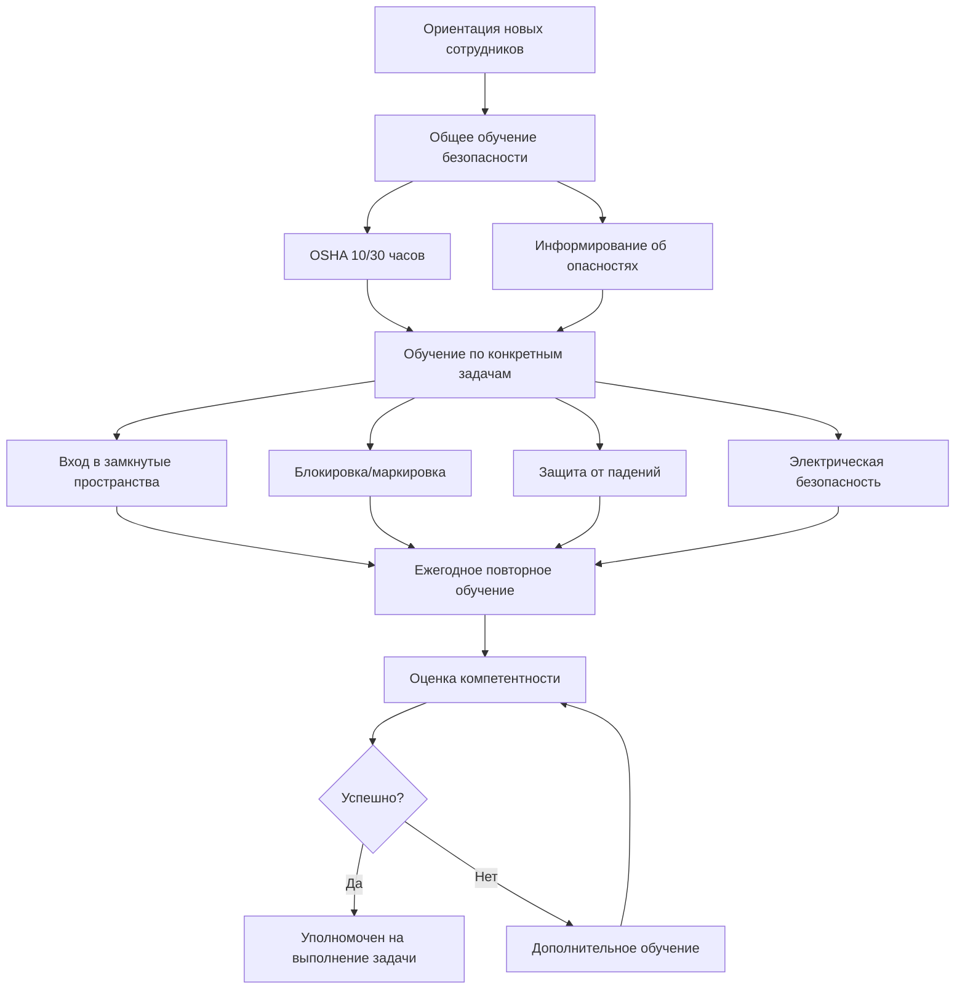

Обучение безопасности представляет фундаментальное профессиональное требование для технических специалистов и инженеров HVAC, защищая персонал от неотъемлемых опасностей, присутствующих при работе с механическими системами. Среда HVAC представляет множество одновременных опасностей, включая высоковольтное электричество, находящиеся под давлением хладагенты, замкнутые пространства, работу на высоте, вращающееся оборудование и опасные атмосферы. Комплексное обучение безопасности снижает уровень травм, обеспечивает соответствие нормативным требованиям и устанавливает систематические протоколы распознавания опасностей и их смягчения, необходимые для устойчивой практики отрасли.

## Нормативная база

Требования обучения безопасности HVAC вытекают из множества нормативных органов и стандартов отрасли, устанавливающих минимальные пороги компетентности для деятельности, связанной с опасностью.

### Основные нормативные источники

**Управление по охране труда и здоровья (OSHA):**

Федеральные нормативы в соответствии с 29 CFR устанавливают обязательные стандарты безопасности на рабочем месте. Требования OSHA, применимые к работам HVAC, включают вход в замкнутые пространства (серия 1926.1200), блокировку/маркировку (1910.147), защиту от падений (серия 1926.500), защиту дыхания (1910.134) и информирование об опасностях (1910.1200). Администрируемые штатами программы OSHA могут устанавливать требования, превышающие федеральные минимумы.

**Агентство по охране окружающей среды (EPA):**

Раздел 608 Закона о чистом воздухе требует сертификации обращения с хладагентами, демонстрирующей компетентность при надлежащем восстановлении, переработке и утилизации хладагентов. Раздел 609 касается мобильных систем кондиционирования воздуха, требующих отдельной сертификации.

**Национальная ассоциация противопожарной защиты (NFPA):**

NFPA 70 (Национальный электротехнический кодекс) и NFPA 70E (Электрическая безопасность на рабочем месте) устанавливают требования электрической безопасности, включая обучение квалифицированного персонала, оценку опасности электрической дуги и разрешения на работы с электроустановками под напряжением. Многие юрисдикции принимают стандарты NFPA как обязательные требования кодекса.

## Категории обучения безопасности

Специалисты HVAC требуют множества специализированных программ обучения безопасности, охватывающих отдельные категории опасностей, встречающихся при установке, обслуживании и текущем ремонте систем.

### Обучение строительной безопасности OSHA

Базовое обучение безопасности, обеспечивающее комплексный обзор опасностей при строительстве и нормативных требований OSHA.

**OSHA 10-часовой курс для строительства:**

Начальная сертификация, охватывающая опасности падений, электрические опасности, опасности защемления/захвата, опасности удара, средства индивидуальной защиты и опасности для здоровья. Требуемое время завершения: 10 часов в течение минимум 2 дней. Предназначен для полевых техников и установщиков.

**OSHA 30-часовой курс для строительства:**

Комплексное обучение для руководителей и менеджеров проектов, включающее все 10-часовые темы плюс расширенные предметы: системы лесов, краны и такелаж, земляные работы, бетон и каменная кладка, сварка и резка, обращение с материалами и планирование безопасности на объекте.

### Требования обучения по конкретным опасностям

| Программа обучения | Стандарт OSHA | Период обновления | Типовая продолжительность | Целевая аудитория |
|-----------------|---------------|----------------|------------------|-----------------|
| Вход в замкнутые пространства | 1926.1200 | Ежегодно | 8 часов | Входящие, помощники, руководители |
| Блокировка/маркировка | 1910.147 | Ежегодно | 4 часа | Уполномоченные, затронутые работники |
| Защита от падений | 1926.500 | Ежегодно | 4 часа | Работающие на высоте более 1,8 м |
| Защита дыхания | 1910.134 | Ежегодно | 4 часа | Пользователи респираторов |
| Электрическая безопасность | NFPA 70E | 3 года | 8 часов | Квалифицированные электромонтеры |
| Разрешения на горячие работы | 1926.352 | Ежегодно | 2 часа | Сварка, резка |
| Информирование об опасностях | 1910.1200 | Ежегодно | 2 часа | Все работники |
| Первая помощь/СЛР | ANSI/ILCOR | 2 года | 8 часов | Назначенные спасатели |

## Обучение безопасности при работе с хладагентами

Обращение с хладагентами представляет уникальные опасности, включая риск удушья, химическую токсичность, продукты термического разложения и отказы систем под высоким давлением. Комплексное обучение безопасности при работе с хладагентами выходит за рамки требований сертификации EPA для решения процедур реагирования на чрезвычайные ситуации и распознавания опасностей для здоровья.

### Соотношение давления и температуры

Понимание поведения хладагента в термодинамике позволяет проводить оценку опасности и безопасное управление системой. Уравнение Клаузиуса-Клапейрона описывает зависимость давления паров от температуры:

$$\frac{dP}{dT} = \frac{L}{T(V_g - V_l)}$$

Где $L$ представляет скрытую теплоту парообразования, $T$ - абсолютная температура, и $V_g$, $V_l$ - удельные объемы газа и жидкости. Это соотношение количественно определяет быстрое увеличение давления при повышении температуры в закрытых системах.

Для практических расчетов хранения баллонов хладагента упрощенное уравнение Антуана обеспечивает оценку давления паров:

$$\log_{10}(P) = A - \frac{B}{C + T}$$

Где $P$ представляет давление паров (мм рт. ст.), $T$ - температура (°C), и $A$, $B$, $C$ - специфические для хладагента константы. Это позволяет определять размер предохранительных устройств и устанавливать пределы температуры хранения.

### Пределы воздействия хладагентов

| Хладагент | Класс ASHRAE 34 | ПДК (ppm) | ПДКВ (ppm) | Основные опасности |
|-------------|-----------------|-----------|------------|-----------------|
| R-410A | A1 | 1000 | Н/А | Асфиксиант, высокое давление |
| R-134a | A1 | 1000 | Н/А | Асфиксиант |
| R-717 (NH₃) | B2 | 25 | 300 | Токсичность, воспламеняемость |
| R-32 | A2L | 1000 | Н/А | Слабо воспламеняемый |
| R-600a | A3 | 1000 | 1600 | Высоко воспламеняемый |

ПДК = Предельно допустимая концентрация (8-часовая); ПДКВ = Опасная для жизни и здоровья концентрация

Стандарт ASHRAE 15-2022 устанавливает пределы концентрации хладагентов (RCL) на основе класса токсичности и типа помещения, требующие проектирования системы вентиляции, предотвращающей накопление хладагентов, превышающее безопасные пороги.

## Обучение электрической безопасности

Системы HVAC работают в диапазоне напряжений от 24 В цепей управления через распределение трёхфазного тока 480 В. Обучение электрической безопасности устанавливает статус квалифицированного персонала согласно определениям NFPA 70E, требуя продемонстрированного знания электрических опасностей, безопасных методов работы и выбора защитного оборудования.

### Анализ опасности электрической дуги

Инциденты электрической дуги высвобождают интенсивную тепловую энергию после условий электрического отказа. Расчеты энергии инцидента определяют требования к средствам индивидуальной защиты (СИЗ):

$$E = \frac{5.271 \times 10^6 \times V \times I_{bf} \times t}{D^2}$$

Где $E$ представляет энергию инцидента (кал/см²), $V$ - напряжение системы (кВ), $I_{bf}$ - ток короткого замыкания (кА), $t$ - длительность дуги (секунды), и $D$ - рабочее расстояние (см). Результаты определяют требования к огнестойкой одежде и защите лица.

Рабочее расстояние для приложений HVAC обычно варьируется от 46 см (пускатели двигателей 480В) до 91 см (распределительные устройства), значительно влияя на подверженность энергии инцидента.

## Структура программы обучения безопасности

Эффективные программы обучения безопасности сочетают соответствие нормативным требованиям с развитием практических навыков распознавания опасностей и их смягчения.

## Методы доставки обучения

Эффективность обучения безопасности зависит от надлежащей методологии доставки, соответствующей целям обучения и требованиям навыков.

**Классное обучение:**

Традиционный формат лекций эффективен для обзора нормативных требований, теории распознавания опасностей и проверки письменных процедур. Типовая продолжительность: 4-8 часов по каждому предмету. Преимущества включают взаимодействие инструктора и студентов и групповое обсуждение. Ограничения включают пассивное обучение и ограниченную практическую подготовку.

**Практическое обучение на основе опыта:**

Необходимо для компетентности при эксплуатации оборудования, включая применение устройств блокировки, оборудование мониторинга замкнутого пространства, системы защиты от падений и приборы для испытания электрооборудования. Требует реального оборудования и имитируемых рабочих окружений. Критично для развития психомоторных навыков.

**Онлайн/компьютерное обучение:**

Гибкая доставка, позволяющая самостоятельное обучение в удобном темпе и стандартизированную доставку содержимого. OSHA принимает онлайн-обучение для программ уровня осведомлённости, но требует практической демонстрации для прикладных навыков. Эффективно для повторного обучения и обновления нормативных требований.

**Обучение, специфичное для объекта:**

Ориентация на опасности, специфичные для объекта, решение уникальных условий в конкретных учреждениях. Требуется перед началом работ в новых местах. Охватывает процедуры в чрезвычайных ситуациях, опасности, специфичные для объекта, и местные политики безопасности.

## Оценка компетентности

Завершение обучения само по себе не устанавливает компетентность на рабочем месте. Формальная оценка проверяет удержание знаний и практическую демонстрацию навыков.

### Методы оценки по типам обучения

**Письменные экзамены:**

Тесты с несколькими вариантами ответов или краткие ответы, измеряющие знание нормативных требований, распознавание опасностей и процедурное понимание. Минимальные проходные баллы обычно 70-80%. Требуется для документирования обучения OSHA.

**Практические демонстрации:**

Наблюдаемое выполнение фактических задач под надзором, включая выполнение процедур блокировки, мониторинг замкнутого пространства, выбор и надевание СИЗ и проверку оборудования. Оценивается с использованием стандартизированных контрольных списков.

**Наблюдения на объекте:**

Периодические аудиты безопасности на объекте, оценивающие реальное применение принципов обучения безопасности. Выявляет пропуски между обучением и фактической практикой, требующие корректирующих действий.

## Требования к документированию

Нормативы OSHA требуют документирования обучения, демонстрирующего соответствие требованиям обучения безопасности.

**Требуемые элементы документации:**

- Имя и идентификация работника
- Дата и продолжительность обучения
- Тема обучения и ссылка на стандарт OSHA
- Имя и квалификация инструктора
- Результаты оценки и проходные баллы
- Выдача удостоверения или сертификата
- График повторного обучения и записи о завершении

Период хранения документации: Во время трудоустройства плюс минимум 3 года согласно требованиям OSHA. Электронные системы ведения записей приемлемы при надлежащих резервных копиях и элементах управления доступом.

## Интеграция культуры безопасности

Эффективность обучения безопасности многократно увеличивается при интеграции в комплексную культуру безопасности, подчеркивающую осведомлённость об опасностях, сообщение об инцидентах и постоянное совершенствование.

**Предварительные брифинги по безопасности:**

Ежедневные или специфичные для задачи обсуждения безопасности, обсуждающие предусмотренные опасности, требуемые СИЗ, процедуры в чрезвычайных ситуациях и стратегии смягчения опасности. Типовая продолжительность: 5-15 минут. Усиливает формальное обучение и решает условия, специфичные для объекта.

**Разговоры из ящика инструментов:**

Еженедельные короткие темы безопасности, поддерживающие осведомлённость между циклами формального обучения. Предметы включают сезонные опасности, последние инциденты, обновления нормативных требований и изменения процедур.

**Расследование инцидентов и извлечённые уроки:**

Анализ коренных причин инцидентов и почти несчастных случаев, выявляющий пропуски в обучении и недостатки процедур. Выводы включены в пересмотренные программы обучения, предотвращающие рецидив.

## Статистика безопасности отрасли

Данные Бюро статистики труда демонстрируют, что показатели травм механиков HVAC значительно превышают среднеотраслевые показатели. Основные причины травм включают падения с высоты, электрические контакты, инциденты защемления/захвата с участием вращающегося оборудования и деформационные травмы при обращении с материалами. Комплексные программы обучения безопасности снижают частоту травм на 40-60% по сравнению с необученным персоналом.

Инвестиции в систематическое обучение безопасности дают измеримые результаты благодаря снижению затрат на компенсацию работникам, улучшенному соответствию нормативным требованиям, улучшенному удержанию рабочей силы и улучшению репутации у клиентов, ориентированных на безопасность. Профессиональные практики HVAC признают компетентность в области безопасности как основу для технического совершенства и долголетия карьеры.

*Версия: 1.0*
