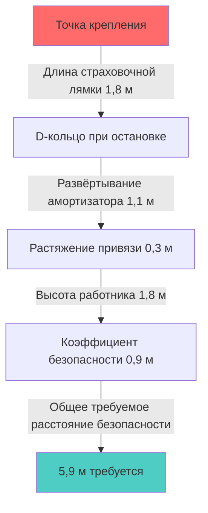

## Опасности падений при работе с HVAC

Техники HVAC сталкиваются с существенными опасностями падений во время регулярных операций. Установка оборудования на крыше, техническое обслуживание на возвышенных платформах и работа с лестниц создают риск падения с высоты, превышающей 1,8 м, что вызывает требования OSHA по защите от падений согласно 29 CFR 1926.501. Основные опасности включают незащищённые края кровли, световые люки, проёмы в крыше для проходов и нестабильные рабочие поверхности на механическом оборудовании.

Обучение защите от падений решает эти специфические опасности посредством систематического распознавания рисков, надлежащего выбора оборудования и правильного использования систем средств индивидуальной защиты от падения (PFAS). Понимание физики остановки падения позволяет техникам оценить адекватность системы и принять обоснованные решения в области безопасности.

## Физика остановки падения и ударные силы

Когда падающий работник останавливается системой средств индивидуальной защиты от падения, замедление создаёт ударные силы, которые должны выдержать человеческое тело и оборудование. Максимальная сила остановки (MAF) зависит от расстояния падения, расстояния замедления и массы работника.

Баланс энергии при остановке падения:

$$E_{kinetic} = E_{absorbed} = \frac{1}{2}mv^2 = mgh$$

где m представляет массу работника (кг), v — скорость при остановке (м/с), g — ускорение свободного падения (9,81 м/с²), а h — расстояние свободного падения (м).

Средняя сила остановки при замедлении:

$$F_{avg} = \frac{mgh}{d}$$

где d представляет расстояние замедления (м), обеспечиваемое амортизатором удара и растяжением привязи.

OSHA ограничивает максимальную силу остановки 8 кН для привязей на теле и 4 кН для поясных привязей. Это ограничение определяет конструкцию амортизатора удара, который должен обеспечить достаточное расстояние замедления для поддержания сил ниже этих пороговых значений.

Для работника массой 100 кг, испытывающего свободное падение на 1,8 м, требуемое расстояние замедления:

$$d = \frac{mgh}{F_{max}} = \frac{100 \times 9,81 \times 1,8}{8000} = 0,22 \text{ м (8,7 дюйма)}$$

Этот расчёт исключает растяжение привязи и лямок, которые обеспечивают дополнительное расстояние замедления и снижают пиковые силы.

## Компоненты системы средств индивидуальной защиты от падения

Полная PFAS состоит из трёх интегрированных компонентов: точки крепления, средства поддержки тела и соединителя. Каждый компонент должен соответствовать определённым требованиям прочности и стандартам совместимости.

### Выбор привязи на теле

Полнотелесные привязи распределяют силы остановки по плечам, бёдрам и тазу, предотвращая концентрацию сил, вызывающую травмы при использовании поясных привязей. Критерии выбора привязи включают:

- **Конфигурация D-колец**: Дорсальные (спинные) D-кольца для систем с вертикальным тросом, плечевые D-кольца для работ на краю
- **Размер**: Правильная посадка предотвращает проскальзывание при остановке; регулируемые лямки подходят для одежды в несколько слоёв
- **Грузоподъёмность**: Минимум 22,2 кН согласно ANSI Z359.11

### Амортизаторы удара и страховочные лямки

Амортизирующие страховочные лямки ограничивают пиковые силы за счёт контролируемого разрывания ткани или расширения компактных блоков. Стандартные страховочные лямки длиной 1,8 м с интегрированными амортизаторами развёртываются примерно на 1,1 м при срабатывании, создавая требования к общему расстоянию безопасности при падении.

### Требования к точкам крепления

Точки крепления должны выдерживать 22,2 кН на одного подключённого работника или демонстрировать коэффициент безопасности 2 при сертификации квалифицированным лицом. Системы крепления на крыше для приложений HVAC включают:

| Тип точки крепления | Грузоподъёмность | Применение | Требование к установке |
|---|---|---|---|
| Постоянные анкеры на крыше | 22,2 кН | Местоположение фиксированного оборудования | Структурное крепление к несущей конструкции крыши |
| Временные анкеры на крыше | 22,2 кН | Мобильные рабочие позиции | Крепление на основе веса или с проникновением |
| Горизонтальные спасательные канаты | 22,2 кН на работника | Доступ нескольких работников | Инженерная система с расчётами провеса |
| Системы ограждения | 0,89 кН верхний край | Пассивная защита | Стойки с максимальным расстоянием 2,4 м |

Системы с горизонтальными спасательными канатами требуют инженерного анализа для учёта повышенных сил, возникающих от провеса под нагрузкой. Натяжение в горизонтальном кабеле, поддерживающем нагрузку остановки падения:

$$T = \frac{F}{2\sin\theta}$$

где T — натяжение кабеля (Н), F — сила остановки (Н), а θ — угол от горизонтали к кабелю в точке остановки.

Для малых углов провеса натяжение кабеля существенно превышает силу остановки. Угол провеса 5° создаёт натяжение кабеля:

$$T = \frac{8000}{2\sin(5°)} = 45 900 \text{ Н (10 300 lbf)}$$

Это усиление требует прочной точки крепления и промежуточных опор для предотвращения отказа системы.

## Расчёты расстояния безопасности при падении

Адекватное расстояние безопасности при падении предотвращает удар работников о нижние уровни или препятствия при остановке падения. Общее расстояние падения состоит из:

$$D_{total} = L_{lanyard} + D_{deployment} + D_{stretch} + H_{worker} + SF$$

где:
- L_lanyard = длина страховочной лямки до срабатывания
- D_deployment = расстояние развёртывания амортизатора удара
- D_stretch = удлинение привязи и каната
- H_worker = расстояние от D-кольца привязи до ступней работника
- SF = коэффициент безопасности (обычно 0,9 м)

Для страховочной лямки длиной 1,8 м с амортизатором удара на работнике ростом 1,8 м:

$$D_{total} = 1,8 + 1,1 + 0,3 + 1,8 + 0,9 = 5,9 \text{ м}$$

Этот расчёт устанавливает минимальную рабочую высоту над нижними уровнями или землёй.

## Безопасность лестниц при приложениях HVAC

Переносные лестницы обеспечивают доступ к оборудованию на крыше и повышенным компонентам. OSHA 1926.1053 определяет требования безопасности лестниц, включая:

- **Угол наклона лестницы**: 75° от горизонтали (соотношение горизонтали к вертикали 4:1)
- **Выступ выше площадки приземления**: 0,9 м минимум
- **Грузоподъёмность**: Тип I (113 кг промышленный) или Тип IA (136 кг повышенной грузоподъёмности)
- **Требования к крепежу**: Закрепляется вверху и внизу для предотвращения смещения

Оптимальный угол наклона лестницы обеспечивает устойчивость против скольжения и опрокидывания. Баланс сил у основания лестницы:

$$\mu N \geq F_{horizontal}$$

где μ — коэффициент трения между ножками лестницы и поверхностью, N — нормальная сила, а F_horizontal — горизонтальная реакционная сила у основания.

Для лестницы под углом 75° с работником на середине высоты основание испытывает большие горизонтальные силы, чем более крутые конфигурации, требующие достаточного трения или физического удержания.

## Планирование спасения и травма от подвешивания

Системы остановки падения создают вторичные опасности, если работники остаются подвешены после падения. Травма от подвешивания (ортостатическая непереносимость) развивается, когда обездвиженные работники не могут активировать мышечные насосы, возвращающие венозную кровь из ног. Кровь скапливается в нижних конечностях, уменьшая преднагрузку на сердце и потенциально вызывая обморок в течение минут.

Планы спасения должны обеспечить восстановление жертвы в течение 15-20 минут для предотвращения прогрессирования травмы от подвешивания. Варианты включают:

1. **Устройства самоспасения**: Системы спуска, позволяющие работникам самостоятельно спускаться
2. **Спасение с помощью**: Вмешательство товарища с использованием спасательного оборудования
3. **Услуги экстренной помощи**: Команды технического спасения пожарной службы

Лямки облегчения подвешивания, встроенные в привязь, позволяют работникам стоять в петлях, активируя мышцы ног и поддерживая кровообращение при длительном подвешивании.

## Документирование обучения и проверка компетентности

OSHA требует обучение защите от падений до того, как работники займутся деятельностью с опасностями падения, с переобучением при изменении условий или когда работники демонстрируют недостаток знаний. Документация обучения должна включать:

- Идентификацию работника и дату обучения
- Краткое описание содержания обучения, охватывающего оборудование, системы и процедуры
- Подпись компетентного лица, подтверждающую успешное завершение
- Практическую демонстрацию надевания и использования оборудования

Компетентные лица, проводящие обучение, должны продемонстрировать способность распознавать опасности падения, выбирать надлежащие методы защиты и контролировать использование оборудования. Это обозначение требует знания стандартов защиты от падений, ограничений оборудования и процедур спасения, выходящих за рамки базового обучения пользователя.

## Протоколы проверки оборудования

Визуальная проверка перед каждым использованием выявляет повреждения, которые компрометируют целостность оборудования защиты от падений. Критерии проверки включают:

- **Ткань и канат**: Порезы, истирание, химические повреждения, деградация от ультрафиолета, ожоги
- **Металлические детали**: Трещины, деформация, коррозия, острые края, надлежащее функционирование
- **Амортизаторы удара**: Индикаторы развёртывания, повреждение корпуса, дата производства
- **Точки крепления**: Структурная целостность, коррозия, надёжное крепление

Оборудование, демонстрирующее любой дефект, должно быть немедленно выведено из эксплуатации. Производители определяют ограничения по сроку службы, обычно 5-10 лет с момента выпуска в зависимости от типа компонента и условий использования.

## Интеграция со специфическими опасностями HVAC

Работа с HVAC создаёт уникальные вызовы защиты от падений, выходящие за рамки общего строительства. Соображения, специфичные для оборудования, включают:

- **Горячие поверхности**: Крышные агрегаты с температурой поверхности, превышающей 65°C, могут повредить синтетическую ткань при контакте
- **Вращающееся оборудование**: Защита вентиляторов и ремённые защиты предотвращают запутывание с оборудованием защиты от падений
- **Электрические опасности**: Неэлектропроводящие страховочные лямки (канат вместо кабеля) для работ рядом с находящимися под напряжением компонентами
- **Воздействие погодных условий**: Образование льда на анкерах и оборудовании требует оценки перед использованием

Интеграция защиты от падений с процедурами блокировки-опломбирования, протоколами работы в замкнутых пространствах и электробезопасностью создаёт комплексную защиту, решающую комбинированные опасности, присутствующие в среде технического обслуживания HVAC.
